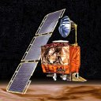

This is a quick article I had for quite a while as a draft. It might not be finished or have other problems, but I still want to share it.

## Mars Climate Oribiter
<figure class="alignright">
            
            <figcaption class="text-center">Mars Climate Oribiter</figcaption>
        </figure>
**Type of Bug**: Bad specification 
**Description**:  The flight system software on the Mars Climate Orbiter was written to calculate thruster performance using the <em>metric unit</em> Newtons (N), while the ground crew was entering course correction and thruster data using the <em>Imperial measure</em> Pound-force (lbf). 
**Outcome**: The cost of the mission was $327.6 million total for both orbiter and lander, $193.1 million for spacecraft development, $91.7 million for launching it, and $42.8 million for mission operations. 
**Source**: <a href="http://en.wikipedia.org/wiki/Mars_Climate_Orbiter">Wikipedia</a>

## Ariane V88
<iframe width="512" height="384" src="//www.youtube.com/embed/kYUrqdUyEpI" frameborder="0" allowfullscreen></iframe>

The <a href="http://de.wikipedia.org/wiki/Ariane_V88">Ariane V88</a> exploded 40 seconds after its start.

**Type of Bug**: The software was written for another type of hardware. 
**Description**: A 64 Bit floating point number was converted into a 16 bit integer in the "inertial reference system" → Overflow → the rocket got into a tilted position and destroyed itself for security reasons. The interesting part is, that this program wasn't even needed for the flight! It had been developed for the Ariane 4. 
**Outcome**: 290 Million Euro destroyed

## Other

* [Whitespace: The Silent Killer](http://www.codinghorror.com/blog/2009/11/whitespace-the-silent-killer.html)
* [History's Most (In)Famous Software Failures](http://bugsniffer.blogspot.de/2007/11/infamous-software-failures.html)
* [Mariner 1](https://en.wikipedia.org/wiki/Mariner_1)
* [Roundoff Error and the Patriot Missile](http://www.ual.es/~plopez/docencia/itis/patriot.htm)

Do you know more?
