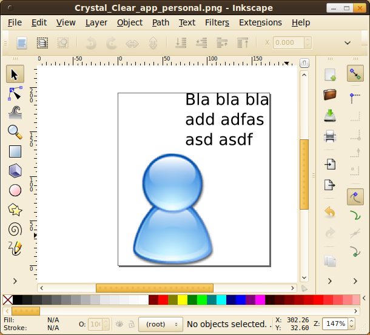
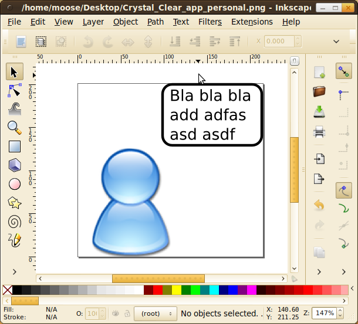
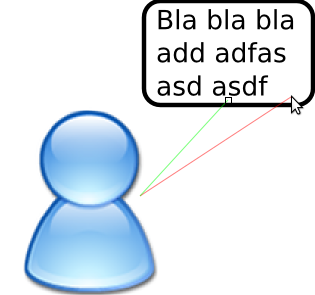
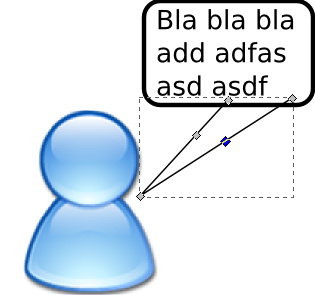
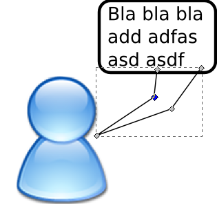

This is a quick article I had for quite a while as a draft. It might not be finished or have other problems, but I still want to share it.

The nice icon is from [Wikipedia Commons](https://commons.wikimedia.org/wiki/File:Crystal_Clear_app_personal.png)
and part of the Crystal Clear project by Everaldo Coelho.

## Preparation ##
1. Install `inkscape`.
2. Get an image where you want to put the speech bubble.
3. Add text with <kbd>F2</kbd>

Now it should looke like this:

<figure class="aligncenter">
            
            <figcaption class="text-center">Preparation</figcaption>
        </figure>

## Rectangle ##
Now you have to put a rectangle (<kbd>F2</kbd>) or an ellipses (<kbd>F5</kbd>)
around your text. The rectangle should be placed below the text
(<kbd>Page down</kbd>).

To make positioning easier, group the text and the surrounding box:

1. Mark box by clicking on it
2. <kbd>Shift</kbd> + Click on the text
3. Group with <kbd>Ctrl</kbd> + <kbd>G</kbd>

Now it should looke like this:
<figure class="aligncenter">
            
            <figcaption class="text-center">Preparation</figcaption>
        </figure>

## Indicator ##
To add the "indicator" that shows who spoke, press <kbd>Shift</kbd>
+ <kbd>F6</kbd> and add a triangle that overlaps with the box:

<figure class="aligncenter">
            
            <figcaption class="text-center">Preparation</figcaption>
        </figure>

Then press <kbd>F2</kbd> to modify the path by nodes. Add some controll
nodes in between by double-clicking on the path in between:

<figure class="aligncenter">
            
            <figcaption class="text-center">Preparation</figcaption>
        </figure>

Then delete them. Now you have those round curves that can be manipulated
with the little circles:

<figure class="aligncenter">
            
            <figcaption class="text-center">Preparation</figcaption>
        </figure>
