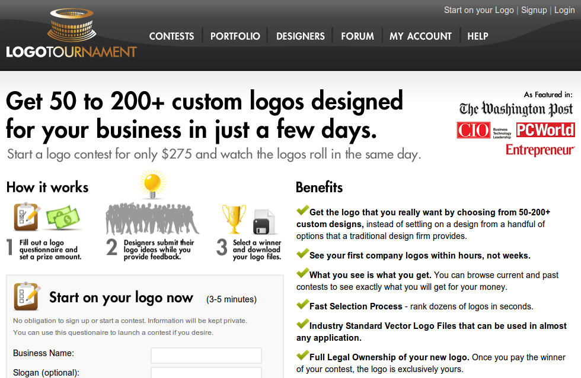
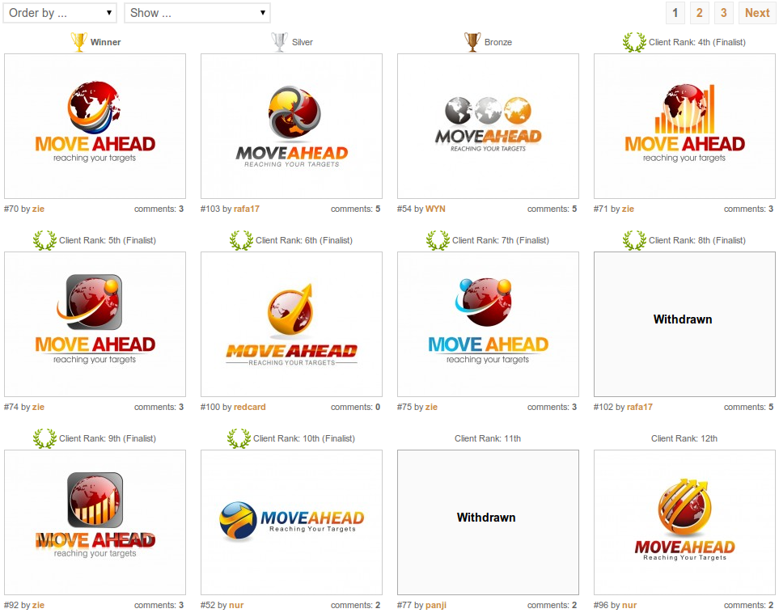

The website logotournament.com offers a service for designers and owners of
companies. You can define how much money you would like to spend for a new
logo-set and how this logo should look like.

<figure class="aligncenter">
            
            <figcaption class="text-center">Logo Tournament Website</figcaption>
        </figure>

Just take a look at the contest brief of Move Ahead. I've made a screenshot of
their Website. They use the typical Joomla-Icon. Their Logo isn't very good.

<figure class="aligncenter">
            
            <figcaption class="text-center">Proposed Logos on Logo Tournament</figcaption>
        </figure>

Now take a look at the best submitted logos. Great, aren't they? At the moment,
105 logos have been submitted for $375. The company can decide which ones they
like and rank them. They pay only for one logo set, but they can choose from
105 logos.

<figure class="aligncenter">
            
            <figcaption class="text-center">Move Ahead Website</figcaption>
        </figure>

*Note*: This is a quick post from one of my old blogs.