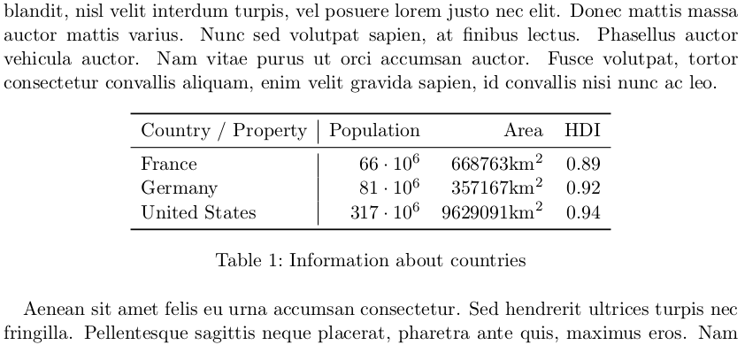

LaTeX is an awesome typesetting language: It is powerful enough to let you
do anything you want, it has a great community and standard solutions for
every common problem as it is quite old. But tables... well, let's say there
is much room for improvement.

## How to make tables

### The simple way
The most basic table I could think of is generated like this:

```latex
\documentclass[a4paper]{scrartcl}
\usepackage{amssymb, amsmath}  % needed for math
\begin{document}

Lorem ipsum dolor sit amet, consectetur adipiscing elit. Duis malesuada
efficitur volutpat. Proin eget dui in lacus fermentum pharetra. Sed ut
facilisis leo, sed consectetur urna. Phasellus eget tempus eros, vitae
sagittis mi. Nullam pharetra, dolor a efficitur blandit, nisl velit interdum
turpis, vel posuere lorem justo nec elit. Donec mattis massa auctor mattis
varius. Nunc sed volutpat sapien, at finibus lectus. Phasellus auctor vehicula
auctor. Nam vitae purus ut orci accumsan auctor. Fusce volutpat, tortor
consectetur convallis aliquam, enim velit gravida sapien, id convallis nisi
nunc ac leo.

    \begin{table}[ht]
        \centering
        \begin{tabular}{l|rrr}
        Country / Property & Population       & Area     & HDI \\\hline
        France             & $66 \cdot 10^6$  & $668763\text{km}^2$  & 0.89 \\
        Germany            & $81 \cdot 10^6$  & $357167\text{km}^2$  & 0.92 \\
        United States      & $317 \cdot 10^6$ & $9629091\text{km}^2$ & 0.94 \\
        \end{tabular}
        \caption{Information about countries}
        \label{table:countries}
    \end{table}

Aenean sit amet felis eu urna accumsan consectetur. Sed hendrerit ultrices
turpis nec fringilla. Pellentesque sagittis neque placerat, pharetra ante
quis, maximus eros. Nam ultrices lacinia magna, eget interdum tortor ornare
ut. Praesent semper tristique consectetur. Sed auctor, orci accumsan imperdiet
vestibulum, nunc augue sagittis purus, sed dapibus neque arcu sit amet enim.
Aliquam fermentum dui eu efficitur condimentum. Maecenas viverra metus ut
bibendum pellentesque. Integer non interdum massa. Vestibulum non enim
vulputate, sodales nunc ac, ultricies tortor. Suspendisse non vehicula ipsum,
quis consequat elit. Quisque rutrum tincidunt lorem id semper. Phasellus
bibendum nulla sit amet purus tempus, vitae tincidunt ligula ornare. Nunc quis
felis non ex consequat elementum nec sit amet magna. In lacinia nulla nec neque
venenatis, vel tristique risus blandit.
\end{document}
```

It will look like this:

<figure class="aligncenter">
            <a href="../images/2014/09/latex-standard-table.png"></a>
            <figcaption class="text-center">Standard LaTeX table</figcaption>
        </figure>

You can see two environments: `table` and `tabular`. Let's focus on `tabular`
first. It is always followed by a list of characters `l`, `c`, `r` which
define if the column is left-aligned, centered or right-aligned. You can add `|`
to tell LaTeX if there should be a line to distinguish columns.
After that you get to the first cells. `&` starts a new cell and `\\` starts
a new line. If you want a drawn line / rule, you can use `\hline`.

Let's check out `table`:
`table` has options after it which are commonly `ht` where `h` means
"here" and `t` means "top". So LaTeX tries to place the table where it is in
the text and if that doesn't work out it places the table on the top of the
page. It can get a caption
`\caption{Description of the contents of the table}` and a
`\label{table:your-label-for-internal-usage}`.

### The standard way

I always use `\usepackage{booktabs}` to get `\toprule`, `\midrule` and `\bottomrule`:

```latex
\documentclass[a4paper]{scrartcl}
\usepackage{amssymb, amsmath}  % needed for math

\usepackage{booktabs}  % for \toprule, \midrule and \bottomrule
\begin{document}

Lorem ipsum dolor sit amet, consectetur adipiscing elit. Duis malesuada
efficitur volutpat. Proin eget dui in lacus fermentum pharetra. Sed ut
facilisis leo, sed consectetur urna. Phasellus eget tempus eros, vitae
sagittis mi. Nullam pharetra, dolor a efficitur blandit, nisl velit interdum
turpis, vel posuere lorem justo nec elit. Donec mattis massa auctor mattis
varius. Nunc sed volutpat sapien, at finibus lectus. Phasellus auctor vehicula
auctor. Nam vitae purus ut orci accumsan auctor. Fusce volutpat, tortor
consectetur convallis aliquam, enim velit gravida sapien, id convallis nisi
nunc ac leo.

    \begin{table}[ht]
        \centering
        \begin{tabular}{l|rrr}
        \toprule
        Country / Property & Population       & Area     & HDI \\\midrule
        France             & $66 \cdot 10^6$  & $668763\text{km}^2$  & 0.89 \\
        Germany            & $81 \cdot 10^6$  & $357167\text{km}^2$  & 0.92 \\
        United States      & $317 \cdot 10^6$ & $9629091\text{km}^2$ & 0.94 \\
        \bottomrule
        \end{tabular}
        \caption{Information about countries}
        \label{table:countries}
    \end{table}

Aenean sit amet felis eu urna accumsan consectetur. Sed hendrerit ultrices
turpis nec fringilla. Pellentesque sagittis neque placerat, pharetra ante
quis, maximus eros. Nam ultrices lacinia magna, eget interdum tortor ornare
ut. Praesent semper tristique consectetur. Sed auctor, orci accumsan imperdiet
vestibulum, nunc augue sagittis purus, sed dapibus neque arcu sit amet enim.
Aliquam fermentum dui eu efficitur condimentum. Maecenas viverra metus ut
bibendum pellentesque. Integer non interdum massa. Vestibulum non enim
vulputate, sodales nunc ac, ultricies tortor. Suspendisse non vehicula ipsum,
quis consequat elit. Quisque rutrum tincidunt lorem id semper. Phasellus
bibendum nulla sit amet purus tempus, vitae tincidunt ligula ornare. Nunc quis
felis non ex consequat elementum nec sit amet magna. In lacinia nulla nec neque
venenatis, vel tristique risus blandit.
\end{document}
```

which looks like this:

<figure class="aligncenter">
            <a href="../images/2014/09/latex-table-booktabs.png"></a>
            <figcaption class="text-center">LaTeX table with booktabs</figcaption>
        </figure>

### Combining cells

It is much nicer when you combine cells. To do so, you can use `\multicolumn`:

```latex
\documentclass[a4paper]{scrartcl}
\usepackage{amssymb, amsmath}  % needed for math

\usepackage{booktabs}  % for \toprule, \midrule and \bottomrule
\begin{document}
Lorem ipsum dolor sit amet, consectetur adipiscing elit. Duis malesuada
efficitur volutpat. Proin eget dui in lacus fermentum pharetra. Sed ut
facilisis leo, sed consectetur urna. Phasellus eget tempus eros, vitae
sagittis mi. Nullam pharetra, dolor a efficitur blandit, nisl velit interdum
turpis, vel posuere lorem justo nec elit. Donec mattis massa auctor mattis
varius. Nunc sed volutpat sapien, at finibus lectus. Phasellus auctor vehicula
auctor. Nam vitae purus ut orci accumsan auctor. Fusce volutpat, tortor
consectetur convallis aliquam, enim velit gravida sapien, id convallis nisi
nunc ac leo.

\begin{table}[ht]
    \centering
    \begin{tabular}{llll}
    \toprule
    Country & \multicolumn{3}{c}{Property}\\
              \cmidrule{2-4}
            & {Population} & {Area} & {HDI} \\
            & {(mio.)} & {(km\textsuperscript{2})}\\
    \midrule
    France             & \multirow{2}{c}{66}  & 668763  & 0.89 \\
    Germany            & 81  & 357167  & 0.92 \\
    United States      & 317 & 9629091 & 0.94 \\
    \bottomrule
    \end{tabular}
    \caption{Information about countries}
    \label{table:countries}
\end{table}
Aenean sit amet felis eu urna accumsan consectetur. Sed hendrerit ultrices
turpis nec fringilla. Pellentesque sagittis neque placerat, pharetra ante
quis, maximus eros. Nam ultrices lacinia magna, eget interdum tortor ornare
ut. Praesent semper tristique consectetur. Sed auctor, orci accumsan imperdiet
vestibulum, nunc augue sagittis purus, sed dapibus neque arcu sit amet enim.
Aliquam fermentum dui eu efficitur condimentum. Maecenas viverra metus ut
bibendum pellentesque. Integer non interdum massa. Vestibulum non enim
vulputate, sodales nunc ac, ultricies tortor. Suspendisse non vehicula ipsum,
quis consequat elit. Quisque rutrum tincidunt lorem id semper. Phasellus
bibendum nulla sit amet purus tempus, vitae tincidunt ligula ornare. Nunc quis
felis non ex consequat elementum nec sit amet magna. In lacinia nulla nec neque
venenatis, vel tristique risus blandit.
\end{document}
```

which looks like this:

<figure class="aligncenter">
            <a href="../images/2014/09/latex-multicols.png"></a>
            <figcaption class="text-center">LaTeX table with multicols</figcaption>
        </figure>

Note the `\cmidrule{2-4}` which draws a rule from cell 2 to 4 (LaTeX starts
to count at 1).

If you want to combine multiple rows you need to use `\usepackage{multirow}`.


### Line Breaks in Cells

```latex
\parbox[t]{1cm}{This is the first \\ cell}
```

See also: [How to add a forced line break inside a table cell](http://tex.stackexchange.com/q/2441/5645)


### Page breaking tables

If you want your tables to be able to break over pages, you have to use
[`\usepackage{longtable}`](ftp://ftp.tex.ac.uk/tex-archive/macros/latex/required/tools/longtable.pdf) which has [an example](http://users.sdsc.edu/~ssmallen/latex/longtable.html).

Another option is [supertabular](http://ctan.org/pkg/supertabular).

When you use them, you should add `\endhead` so that the head can get repeated.

## Tools

[truben.no/table](http://truben.no/table/) is an awesome page to create tables
for different formats.

## What could be better

**Page-breaking**: I understand that you don't want to have page breaking of
tables most of the time. But rather than never allowing page-breaking, I would
expect an optimization with the following thoughts in mind:

* It is best to have the table where it was specified.
* The content should have at least 2 times as many rows as the header. So when
  there is only one header row, there should be at least 2 content rows.
* The farer a table is away from its "original" position, the worse it is.

**Headers**: A semantic way to define the header and a tail would be very good.
`\endhead` is ok.

**Semantics, Styles and Classes**: LaTeX hides some of the formatting for semantic codes.
For example, you write `\section{MySection}` instead of
`{\fontsize{12}{15}\textbf{MySection}}`
or something similar. That should be more often the case. In fact, I think it
would be very nice if LaTeX had some built-in support for pure stylesheets
(like CSS for HTML). It would be very nice if I only had to define that I
want to make a standard table and it inserts `\toprule`, `\midrule` and
`\bottomrule` automatically. But to get an automatic `\midrule` we need
a command to tell LaTeX where the header ends.

Everything of the above should be standard. There should not be the need to
use new packages for that. Also, `\multirow`, `\toprule`, `\midrule`,
`\bottomrule` should not be "hidden" in a package but be there by default.

**Table seperator**: It is unfortunate that the table cell seperator(s) `\\`
and `&` have problems with matrices. I think one environment should get closed
before the other one can continue parsing, so I don't quite understand where the
problem is. But there certainly is a problem (see [this question](http://stackoverflow.com/q/25971178/562769)).

**Tools**: I don't know any tools that can export LaTeX tables and merge cells.
Such tools should be able to import and export LaTeX tables

## See also
* [Typesetting tables with LaTeX](https://www.tug.org/TUGboat/tb28-3/tb90hoeppner.pdf)
* [LaTeX/Tables](https://en.wikibooks.org/wiki/LaTeX/Tables)