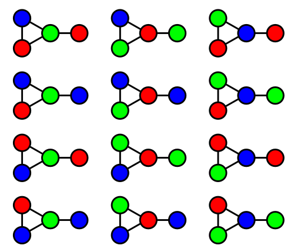
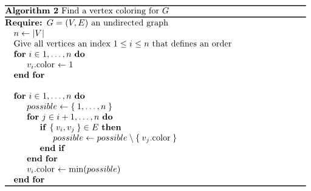

This is a quick article I had for quite a while as a draft.
It might not be finished or have other problems, but I still want to share
it.

<h2>The problem</h2>
The Vertex Coloring problem can be described like this:

Vertex Coloring
Let $G = (V, E)$ be an undirected graph.

Find a function $f: V \rightarrow \{1, \dots, n\}, n \in \mathbb{N}$ such that:

$\forall e=\{v_1, v_2\} \in E: f(v_1) \neq f(v_2)$.

Minimize $n$.

If $n$ is minimal for $G$, it is called the chromatic number $\chi(G)$.

What does that mean?

You have a graph. Then you take pencils and color the vertices such all vertices that are connected are not of the same color.

<h2>Example</h2>
All of the following graphs show valid thee colorings:

[caption id="attachment_69831" align="aligncenter" width="500"] Valid thee colorings of one graph Source: <a href="http://commons.wikimedia.org/wiki/File:Graph_with_all_three-colourings_2.svg">Wikipedia</a>[/caption]

<h2>Interesting facts</h2>
<ul>
  <li>$1 \leq \chi(G) \leq |V|$: You need at least one color and you could color all vertices with a different color</li>
  <li>$\chi(K_n) = n$: All <abbr title="all vertices are connected with all other vertices.">complete graphs</abbr> with $n$ vertices need exactly $n$ colors. One color for each vertex.</li>
  <li>Every planar graph can be colored with 4 colors (see <a href="http://en.wikipedia.org/wiki/Four_color_theorem">four color theorem</a>).</li>
  <li>Determining if a graph can be colored with 2 colors is equivalent to determining whether or not the graph is bipartite. This can be checked in polynomial time. You simply start with one vertex, give it color 1 and all adjacent vertices color 2. Then all adjacent vertices of color 2 have to have color 1, ...</li>
  <li>Vertex Coloring is in $\mathcal{NPC}$.</li>
  <li>All triangle-free planar graphs can be 3-colored. You can get this coloring in linear time (<a href="http://en.wikipedia.org/wiki/Gr%C3%B6tzsch's_theorem#Computational_complexity">source</a>).</li>
</ul>

<h2>Algorithms</h2>
I think learning from errors is important. This is the reason why I share the following algorithm that do not work.

<h3>First WRONG try: Fix adjacent vertices</h3>
[caption id="attachment_69891" align="aligncenter" width="512"] A vertex coloring algorithm that does not work[/caption]

The time complexity of this algorithm is in $\mathcal{O}(|V|^2)$. This should make you suspicious, as Vertex Coloring is in $\mathcal{NPC}$. So if it was correct, it would solve the <a href="http://en.wikipedia.org/wiki/P_versus_NP_problem">P vs. NP problem</a> which is worth a million dollars.

But an example why it doesn't work is better. Just try it for the following graph:

[caption id="attachment_69921" align="aligncenter" width="512"] Example that does not work with the provided algorithm[/caption]

<h3>Second WRONG try: Fix current vertex</h3>
[caption id="attachment_69971" align="aligncenter" width="512"] Another vertex coloring algorithm[/caption]

This algorithm gives a valid coloring, but the coloring is not minimal.

Example:

When you apply the algorithm the the graph below, you will get a coloring with four colors. But obviously, it is possible to color it with three colors.
[caption id="attachment_69951" align="aligncenter" width="512"] Graph that can be vertex-colored with 3 colors[/caption]

<h3>Brute force</h3>
It's always a good idea to think about brute force algorithms. On the one hand, they are simple. So you can intuitively  understand why they are correct and see their time / space complexity. On the other hand, you can use them for sanity checks of better algorithms for small problem instances.

Here is a brute force algorithm for the vertex coloring problem
[caption id="attachment_70001" align="aligncenter" width="512"] Brute force a minimal vertex coloring[/caption]

You need $\sum_{i=2}^n i^n$ steps at maximum. Wow. This is MUCH. Even when you only want to check if $i$ colors are enough, you need $i^n$.

You could use the second algorithm to get a better upper bound and try the next smaller ones. As soon as you don't get valid colorings, you know that the number of colors you've used in the last valid coloring was the minimum number.

<h2>Zero-knowledge protocol</h2>
Vertex coloring is relevant for so called "zero-knowledge protocols". This is a method by which one party (the prover) can prove to another party (the verifier) that a given statement is true, without conveying any additional information apart from the fact that the statement is indeed true.

<blockquote>A zero-knowledge proof must satisfy three properties:
<ul>
<li><strong>Completeness</strong>: if the statement is true, the honest verifier (that is, one following the protocol properly) will be convinced of this fact by an honest prover.</li>
<li><strong>Soundness</strong>: if the statement is false, no cheating prover can convince the honest verifier that it is true, except with some small probability.</li>
<li><strong>Zero-knowledge</strong>: if the statement is true, no cheating verifier learns anything other than this fact.  This is formalized by showing that every cheating verifier has some ''simulator'' that, given only the statement to be proven (and no access to the prover), can produce a transcript that "looks like" an interaction between the honest prover and the cheating verifier.</li>
</ul>
</blockquote>
Source: <a href="http://en.wikipedia.org/wiki/Zero-knowledge_proof#Definition">Wikipedia</a>

Another great example is the following:

<blockquote>Imagine your friend is color-blind. You have two billiard balls; one is red, one is green, but they are otherwise identical. To your friend they seem completely identical, and he is skeptical that they are actually distinguishable. You want to prove to him (I say "him" as most color-blind people are male) that they are in fact differently-colored. On the other hand, you do not want him to learn which is red and which is green.

Here is the proof system. You give the two balls to your friend so that he is holding one in each hand. You can see the balls at this point, but you don't tell him which is which. Your friend then puts both hands behind his back. Next, he either switches the balls between his hands, or leaves them be, with probability 1/2 each. Finally, he brings them out from behind his back. You now have to "guess" whether or not he switched the balls.

By looking at their colors, you can of course say with certainty whether or not he switched them. On the other hand, if they were the same color and hence indistinguishable, there is no way you could guess correctly with probability higher than $\frac{1}{2}$.

If you and your friend repeat this "proof" $t$ times (for large $t$), your friend should become convinced that the balls are indeed differently colored; otherwise, the probability that you would have succeeded at identifying all the switch/non-switches is at most $2^{-t}$. Furthermore, the proof is "zero-knowledge" because your friend never learns which ball is green and which is red; indeed, he gains no knowledge about how to distinguish the balls.</blockquote>
Source: <a href="http://mathoverflow.net/questions/22624/example-of-a-good-zero-knowledge-proof/22628#22628">mathoverflow.net</a>

Lets make this more concrete. Say you want to authenticate somebody. This person is identified as the "only" person who knows a three-coloring of a big graph. This makes him/her special.
If you simply asked him "what's the three coloring for your graph?" he would no longer be the only person who knows the three coloring.

So you want to get sure that he knows a three coloring without getting it.

<h2>See also</h2>
<ul>
  <li><a href="http://web.mit.edu/~ezyang/Public/graph/svg.html">Interactive zero knowledge 3-colorability demonstration</a></li>
</ul>
