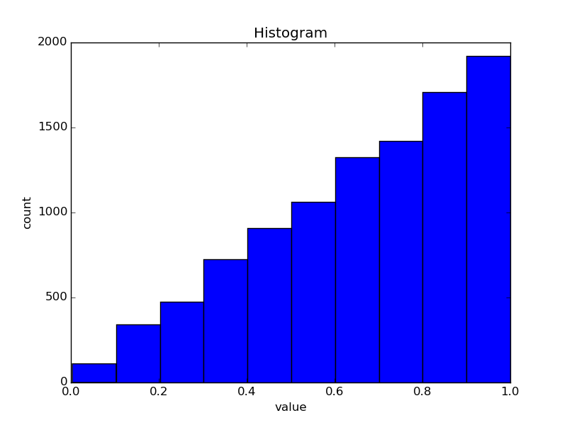

I just wanted to solve an exercise where I had random variables $X_1, \dots, X_n$
which were all $U([0, 1])$ distributed and $Y_n = \max(X_1, \dots, X_n)$.

I wondered what the distribution of $Y_n$ is (for big $n$), so I wanted to plot
it. How do I plot it? With Python, of course ☺

Here is the program:

```python
#!/usr/bin/env python

import matplotlib.pyplot as plt
import numpy.random


def main():
    # Generate Data
    n = 10000
    numbers_a = numpy.random.uniform(size=samples)
    numbers_b = numpy.random.uniform(size=samples)
    numbers_c = numpy.random.uniform(size=samples)
    numbers_max = [max(a, b, c) for a, b, c in zip(numbers_a, numbers_b, numbers_c)]

    # Plot data
    plt.hist(numbers_max)
    plt.title("Histogram")
    plt.xlabel("value")
    plt.ylabel("count")
    plt.show()


if __name__ == "__main__":
    main()
```

and here is the plot for $n = 2$

<figure class="aligncenter">
            <a href="../images/2015/01/random-max-uniform-distribution-n-2.png"></a>
            <figcaption class="text-center">Plot of the maximum of 2 uniformly distributed variables with 10000 samples</figcaption>
        </figure>

If you increase to $n = 3$ you get:

<figure class="aligncenter">
            <a href="../images/2015/01/random-max-uniform-distribution-n-3.png"></a>
            <figcaption class="text-center">Plot of the maximum of 3 uniformly distributed variables with 10000 samples</figcaption>
        </figure>


## Improved version

I've also created an improved version which makes nicer plots, but might be
harder to read:

```python
#!/usr/bin/env python

import matplotlib.pyplot as plt
import numpy.random


def main(samples, n):
    # Generate Data
    numbers_l = []
    n = n + 1
    for _ in range(n):
        numbers_l.append(numpy.random.uniform(size=samples))

    # Plot data
    plots = []
    for i in range(1, n):
        # Build data structure
        sublist = numbers_l[:i]
        max_list = numbers_l[0]
        for numbers_list in sublist:
            for i, el in enumerate(numbers_list):
                max_list[i] = max(max_list[i], el)
        plot_i = plt.hist(max_list, histtype="step", bins=200)
        plots.append(plot_i)
    plt.title("Histogram")
    plt.xlabel("value")
    plt.ylabel("count")
    plt.show()


def get_parser():
    from argparse import ArgumentParser, ArgumentDefaultsHelpFormatter

    parser = ArgumentParser(
        description=__doc__, formatter_class=ArgumentDefaultsHelpFormatter
    )
    parser.add_argument("-n", dest="n", default=3, type=int, help="n")
    parser.add_argument(
        "-s",
        "--samples",
        dest="samples",
        default=1000,
        type=int,
        help="number of samples per Y_n",
    )
    return parser


if __name__ == "__main__":
    args = get_parser().parse_args()
    main(args.samples, args.n)
```

When you call this script with

```shell
$ ./plot-random-variable.py -n 4 --samples 100000
```

it gives

<figure class="aligncenter">
            <a href="../images/2015/01/random-max-uniform-distribution-n-4.png"></a>
            <figcaption class="text-center">Plot of the maximum of 1 - 4 uniformly distributed variables with 10000 samples</figcaption>
        </figure>

## See also

* [List of probability distributions](https://en.wikipedia.org/wiki/List_of_probability_distributions)
* [Basic Data Plotting with Matplotlib Part 3: Histograms](https://bespokeblog.wordpress.com/2011/07/11/basic-data-plotting-with-matplotlib-part-3-histograms/)