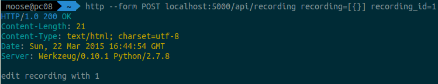

[Johannes](http://schickling.me/) recently showed me [`httpie`](https://github.com/jakubroztocil/httpie). It's a very nice tool for sending HTTP requests.
It is much simpler to use than `curl`.

## Installation

```bash
$ sudo -H pip install httpie
```

## Usage

```bash
$ http --form POST localhost:5000/api/recording recording=[{}] id=1
HTTP/1.0 200 OK
Content-Length: 21
Content-Type: text/html; charset=utf-8
Date: Sun, 22 Mar 2015 15:50:27 GMT
Server: Werkzeug/0.10.1 Python/2.7.8

edit recording with 1
```

The output is colored in a very nice way:

<figure class="aligncenter">
            <a href="../images/2015/03/httpie-request.png"></a>
            <figcaption class="text-center">HTTPie in action</figcaption>
        </figure>


## See also

* [github.com/jakubroztocil/httpie](https://github.com/jakubroztocil/httpie)
* [requestb.in](http://requestb.in/)
