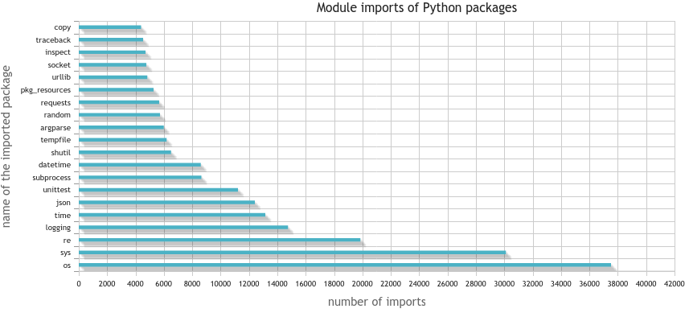
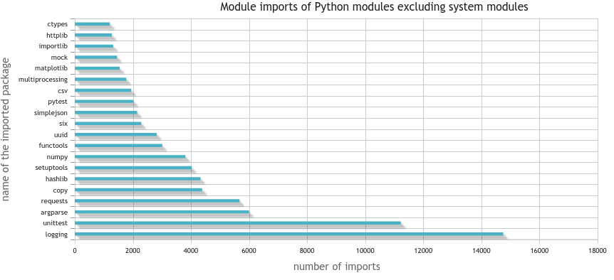
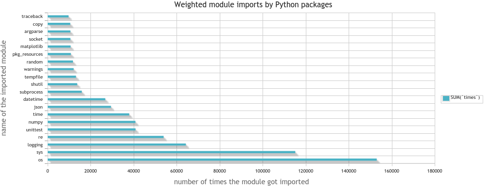
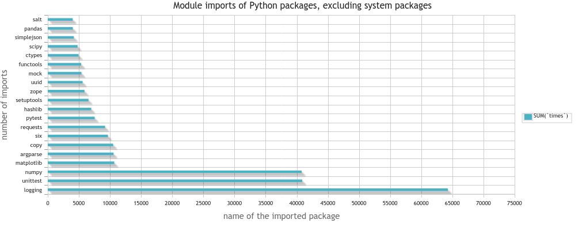
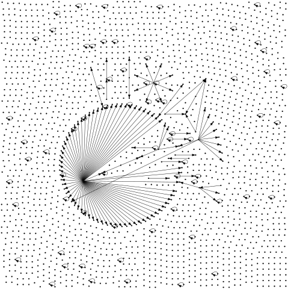
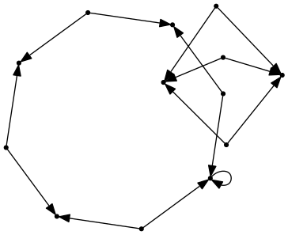
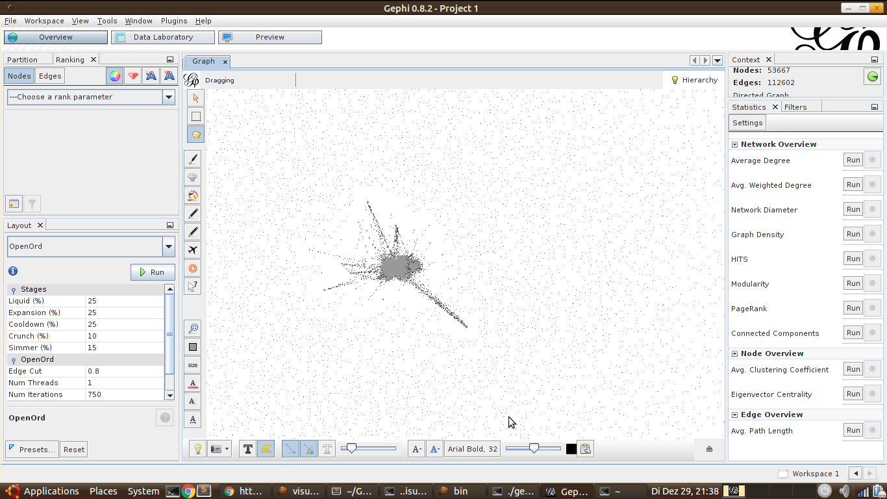
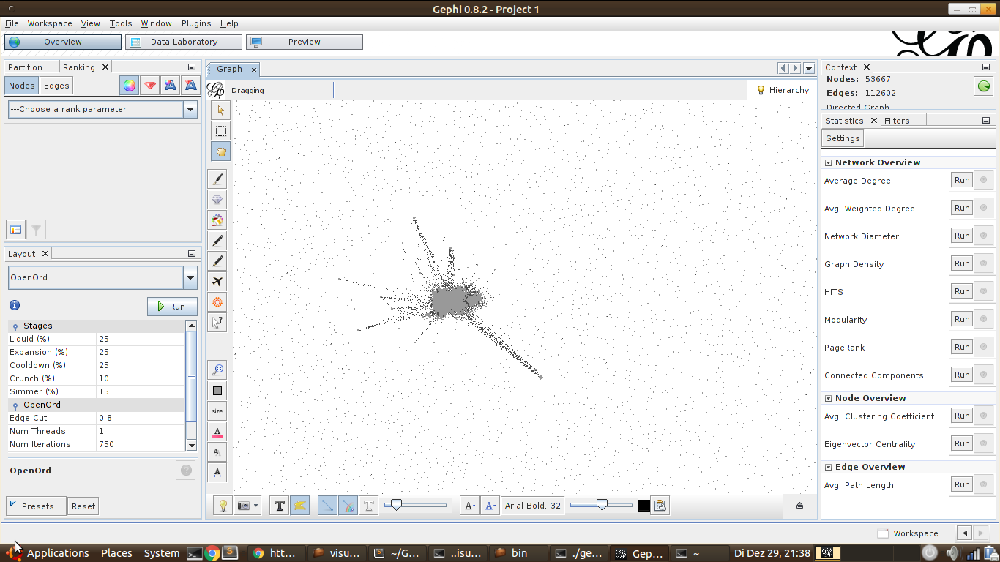

<div class="info">This is part two of a series. See <a href="../analyzing-pypi-metadata/">Analyzing PyPI Data</a> for part one.</div>

I recently got a request to expand my analysis of the Python Package Index
commonly known as PyPI. It is a repository of Python packages where everybody
can upload packages; pretty much without any restriction. In the article
[Analyzing PyPI Metadata](../analyzing-pypi-metadata/)
you can read some general stuff about the repository.

This article goes a bit deeper. This time I don't only analyze the
metadata, but the relationship of the packages themselves. I wanted to build
a dependency graph. However, here is a downside of Python's package structure:
The file which defines the dependencies of a Python package is a Python script
itself. This gives the package developer the highest flexibility, but it also
gives them the power to execute arbitrary code when I only want to get the
dependencies.

I am pretty sure there are some malicious packages in the repository
(although I've never heard of a single one, there has to be one. Over
50&thinsp;000 packages by 2015 - there has to be one!). So I don't want to
execute any code of the repository without having at least a clue what it
should do. This means my analysis is very simple and thus prone to some errors.


## Most common single dependency

One can see dependencies as being weighted by the number of times a package
imports the package.

### Non-weighted

```sql
SELECT
    `packages`.`name`,
    COUNT(`needs_package`)
FROM
    `dependencies`
JOIN
    `packages` ON `needs_package` = `packages`.`id`
GROUP BY
    `needs_package`
ORDER BY
    COUNT(`needs_package`) DESC
LIMIT 20
```

which gives

<figure>
    <a href="../images/2015/12/pypi-imported-packages-count.png"></a>
    <figcaption>This bar chart displays which Python modules get imported by most Python packages</figcaption>
</figure>

and without the system packages:

```sql
SELECT
    `packages`.`name`,
    COUNT(`needs_package`)
FROM
    `dependencies`
JOIN
    `packages` ON `needs_package` = `packages`.`id`
WHERE
    `on_pypi` = 1
GROUP BY
    `needs_package`
ORDER BY
    COUNT(`needs_package`) DESC
LIMIT 20
```

which gives

<figure>
    <a href="../images/2015/12/pypi-imported-packages-excluding-system-count.png"></a>
    <figcaption>This bar chart displays which Python modules (excluding system modules) get imported by most Python packages</figcaption>
</figure>


### Weighted
How often does a single module get included over all packages?

```sql
SELECT
    `packages`.`name`,
    SUM(`times`)
FROM
    `dependencies`
JOIN
    `packages` ON `needs_package` = `packages`.`id`
GROUP BY
    `needs_package`
ORDER BY
    SUM(`times`) DESC
LIMIT 20
```

2&nbsp;seconds later I've got the result:


<figure>
    <a href="../images/2015/12/pypi-imported-packages.png"></a>
    <figcaption>Number of imports of Python packages</figcaption>
</figure>


If I'm only interested in the packages which are on PyPI, hence not system
packages, I execute the following query:

```sql
SELECT
    `packages`.`name`,
    SUM(`times`)
FROM
    `dependencies`
JOIN
    `packages` ON `needs_package` = `packages`.`id`
WHERE
    `on_pypi` = 1
GROUP BY
    `needs_package`
ORDER BY
    SUM(`times`) DESC
LIMIT 20
```

which gives me about 2&nbsp;seconds later the following result:

<figure>
    <a href="../images/2015/12/pypi-imported-packages-excluding-system.png"></a>
    <figcaption>Number of imports of Python packages, excluding system packages</figcaption>
</figure>


## Non-functional packages

Although there are many packages for Python which are very useful, there are
also quite a lot which are not useful at all. One possibility to identify such
packages is to check which packages get neither used by others nor use
other packages

```sql
SELECT
    `packages`.`id`, `name`
FROM `packages`
WHERE
    `id` in (
        SELECT DISTINCT
            `dependencies`.`package`
        FROM
            dependencies)
OR `id` in (
        SELECT DISTINCT
            `dependencies`.`needs_package`
        FROM
            `dependencies`)
```

This leads to the result that 54&thinsp;900 packages of 67&thinsp;582
packages are not obviously crap. Or to write it in another way: 11&nbsp;682
packages are crap. That is 17.5&thinsp;%. Too much, in my opinion.
However, this might also be due to my crappy script not downloading / checking
the downloaded files correctly.


## Names

One thing I was interested in while downloading all those packages was the
question if there are malicious packages (either on purpose or by accident).
One undesirable thing that could happen would be very similar names.


### Prefixes

Let's see how many packages are prefixes of other packages. My thought was that
this might be developers trying to get some accidental installs. However, it
only showed some relationships. I wanted to make a Levenshtein distance
analysis, but I guess this is not worth it.

Here are the top 10 strings which are prefixes of packages and packages
themselves:

1. djan: 6462
2. pyt: 1626
3. pyth: 1278
4. collect: 1155
5. Flask: 561
6. open: 474
7. pyr: 442
8. pyp: 295
9. pyra: 285
10. pym: 256

One interesting thing I've learned is that you can use `pip` like this:

```bash
$ pip search "djan$"
```

... and I found a pip bug ([github.com/pypa/pip/issues/3327](https://github.com/pypa/pip/issues/3327))


## Graph analysis

Analyzing the dependency graph is quite a challenge. Or at least that was what
I initially thought. This graph has about 67&thinsp;582 nodes and
436&thinsp;980 edges. Quite a bit. Definitely much larger than what I have
previously used.

However, my friend Nilan, who knows a lot about graphs, sent me a link to
StackOverflow: [Visualizing Undirected Graph That's Too Large for GraphViz?](http://stackoverflow.com/q/238724/562769)

This led me to [Gephi](http://gephi.org/) and the
[OpenOrd](https://marketplace.gephi.org/plugin/openord-layout/) layout plugin.
It didn't work for the complete graph (see
[issues/1207](https://github.com/gephi/gephi/issues/1207)), but it worked after I
removed the single nodes without edges.

Now we can ask several standard questions about graphs:

* How many connected components are there?
* Are there any cycles? (That would be bad... dependency graphs should not
  have cycles. Similar to family trees.)
* Which are the most central nodes?

I didn't find the time to answer those, but I put the graph data in JSON
format on [github.com/MartinThoma/pypi-dependencies](https://github.com/MartinThoma/pypi-dependencies).
Please let me know if you do something interesting with the data.

I've only got some crappy images with Gephi / GraphViz:

<div class="gallery">
    <figure>
        <a href="../images/2015/12/pypi-rendered.png"></a>
    </figure>
    <figure>
        <a href="../images/2015/12/pypi-rendered-circo-5000-x-small.png"></a>
    </figure>
    <figure>
        <a href="../images/2015/12/pypi-rendered-twopi.png"></a>
    </figure>
    <figure>
        <a href="../images/2015/12/pypi-rendered-x.png"></a>
    </figure>
    <figure>
        <a href="../images/2015/12/gephi-1.png"></a>
    </figure>
    <figure>
        <a href="../images/2015/12/gephi-2.png"></a>
    </figure>
    <figure>
        <a href="../images/2015/12/pypi-graph-small.png"></a>
    </figure>
</div>


## Code

See [github.com/MartinThoma/algorithms](https://github.com/MartinThoma/algorithms/tree/master/PyPI).


## What could come next

I would like to measure the overall code quality on PyPI in another post. I
think of the following measures:

* [pyroma](https://pypi.python.org/pypi/pyroma): A 10-point score for packages
* package goodness with
  [Cheesecake](https://pypi.python.org/pypi/Cheesecake),
* [pylint](https://pypi.python.org/pypi/pylint)
* PEP8 conformance,
* Lines of code (LOC) / documentation / whitespace
* Docstring style (None, NumpyDoc, Sphinx, Google - see [Python Code Documentation](../python-code-documentation/))
* Usage of functions
* Testing coverage
* Look for URLs in the code and which are reachable / which are not
* Look for non-Python files


## See also

* Analysis of PyPI
    * K. Gullikson: [Python Dependency Analysis](http://kgullikson88.github.io/blog/pypi-analysis.html): A well-written article with some very nice images.
    * O. Girardot: [State of the Python/PyPI Dependency Graph](https://ogirardot.wordpress.com/2013/01/05/state-of-the-pythonpypi-dependency-graph/): One very nice, interactive image of the dependency graph.
* Building big graphs
    * [Quick Start with Gephi](https://gephi.org/tutorials/gephi-tutorial-quick_start.pdf)
    * [Features of Gephi](http://gephi.org/features/)
