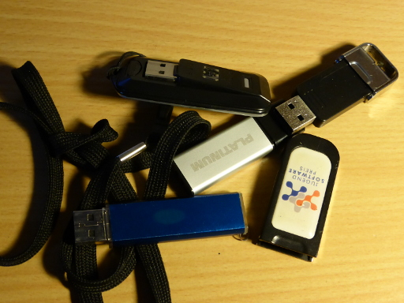

Once in a while I think it is time to reduce the damage being done by the loss
of a USB stick.

<figure class="aligncenter">
            <a href="../images/2016/01/usb-sticks.jpg"></a>
            <figcaption class="text-center">USB sticks</figcaption>
        </figure>


## Remove all data

Find the USB stick on your Linux system with `fdisk -l`. Make super sure that
you really got the stick (e.g. by removing it and executing the command again).
It should be something like `/dev/sdb1`.

The following command will overwrite the data on the stick 5&nbsp;times:

```bash
$ shred -f -n 5 /dev/sdX
```

This may take several minutes even for very small USB sticks.


## Format the stick

Start `gparted` and use the GUI.

See also: [How to format a USB flash drive?](http://askubuntu.com/q/22381/10425)


## Add README

In case I lose the stick, adding a README.txt makes with a way to contact me
makes it most likely that I get the stick back.

```text
Dieser USB-Stick ging verloren.

Mein Name ist Martin Thoma. Sie können mich per E-Mail unter
info@martin-thoma.de erreichen.

---

This USB-Stick was lost.

My name is Martin Thoma. You can contact me via e-mail: info@martin-thoma.de
```