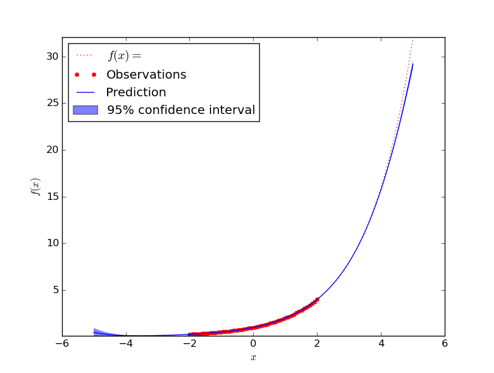
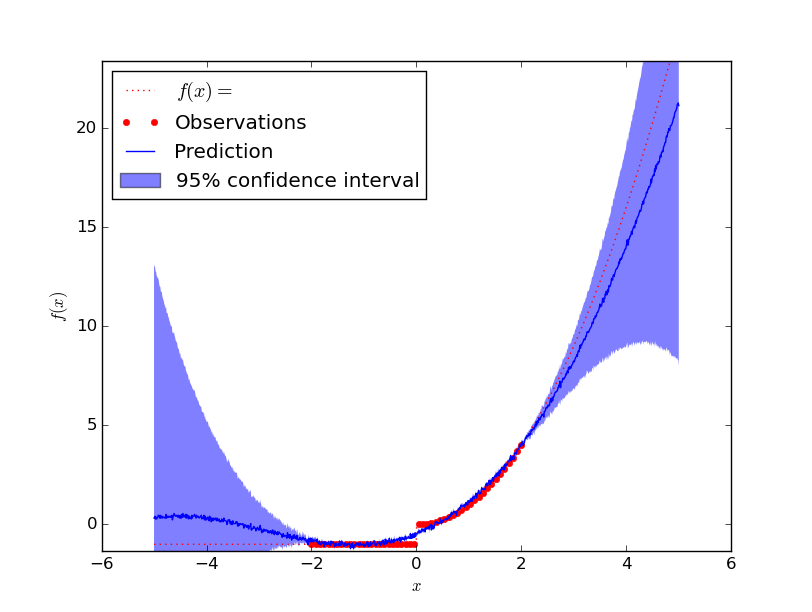

I was recently quite disappointed by how bad neural networks are for function
approximation (see [How should a neural network for unbound function approximation be structured?](http://datascience.stackexchange.com/q/9495/8820)). However, I've just found that
Gaussian processes are great for function approximation!

There are two important types of function approximation:

* **Interpolation**: What values does the function have in between of known
  values?
* **Extrapolation**: What values does the function have outsive of the known
  values?

I did a couple of very quick examples which look promising.


## Examples


### Square

Approximating $f(x) = x^2$ worked very good:

<figure class="aligncenter">
            <a href="../images/2016/01/gauss-x2.png"></a>
            <figcaption class="text-center">f(x) = x^2</figcaption>
        </figure>

I've tried if with higher order polynomials, more complex polynomials. No
problem.


### Sin

Approximating $f(x) = \sin(3x)$ seems to be more complicated:

<figure class="aligncenter">
            <a href="../images/2016/01/gaussian-process-sin-3x.png"></a>
            <figcaption class="text-center">f(x) = sin(3x)</figcaption>
        </figure>

I guess a human would see the wave pattern and do a better job here.


### exp

Approximating $f(x) = e^x$ works similar well as polynomials. One can see
that it does not perfectly fit it, but compared the the range of values seen
before and the distance from the last seen value I think this is absolutely
acceptable:

<figure class="aligncenter">
            <a href="../images/2016/01/gauss-exponential.png"></a>
            <figcaption class="text-center">f(x) = e^x</figcaption>
        </figure>


### noise

It is claimed that Gaussian processes implicitly model noise so that they can
easily deal with noise. However, in my experients this seems not to work so
great. The reason might be that I had points in $[-3, 3]$ of the function

$$f(x) = x^2$$

with point-wise gaussian noise $N \sim \mathcal{N}(0, 1)$. So the noise is
quite domintant on that intervall. One of the examples where it worked better
is:

<figure class="aligncenter">
            <a href="../images/2016/01/gauss-noise.png"></a>
            <figcaption class="text-center">f(x) = x^2 with gaussian noise</figcaption>
        </figure>


### Make it brake

I was a bit suspicious if I had another mistake here. So I wanted it to break.
This was the reason why I created the following function

$$f(x) = \begin{cases}x^2 &\text{if } x \geq 0\\\\-1 &\text{otherwise}\end{cases}$$

<figure class="aligncenter">
            <a href="../images/2016/01/gauss-cases.png"></a>
            <figcaption class="text-center">Function with discontinuity</figcaption>
        </figure>

The predicted value is obviously not correct, but you should note that almost
all function values are within the 95% confidence intervall!


## Code

The following code needs [`numpy`](http://docs.scipy.org/doc/numpy-1.10.1/user/install.html)
and [`sklearn`](http://scikit-learn.org/stable/install.html). For the plots,
you need [`matplotlib`](http://matplotlib.org/users/installing.html).

```python
#!/usr/bin/env python

"""Example how to use gaussion processes for regression."""

import numpy as np
from sklearn import gaussian_process


def main():
    # Create the dataset
    x_train = np.atleast_2d(np.linspace(-3, 3, num=50)).T
    y_train = f(x_train).ravel()
    x_test = np.atleast_2d(np.linspace(-5, 5, 1000)).T

    # Define the Regression Modell and fit it
    gp = gaussian_process.GaussianProcess(theta0=1e-2,
                                          thetaL=1e-4,
                                          thetaU=1e-3)
    gp.fit(x_train, y_train)

    # Evaluate the result
    y_pred, mse = gp.predict(x_test, eval_MSE=True)
    print("MSE: %0.4f" % sum(mse))
    print("max MSE: %0.4f" % max(mse))
    plot_graph(x_test, x_train, y_pred, mse, "x^2")


def f(x):
    """
    Function which gets approximated
    """

    noise = [np.random.normal(loc=0.0, scale=1.0) for _ in range(len(list(x)))]
    noise = np.atleast_2d(noise).T
    return x**2 + noise
    # Totally fails for that one:
    # y = []
    # for el in x:
    #     if el >= 0:
    #         y.append(el**2)
    #     else:
    #         y.append(-1)
    # return np.array(y)


def plot_graph(x, x_train, y_pred, mse, function_tex):
    # Plot the function, the prediction and the 95% confidence interval
    # based on the MSE
    sigma = np.sqrt(mse)
    from matplotlib import pyplot as pl
    pl.figure()
    y = f(x_train).ravel()
    pl.plot(x, f(x), 'r:', label=u'$f(x) = %s$' % function_tex)
    pl.plot(x_train, y, 'r.', markersize=10, label=u'Observations')
    pl.plot(x, y_pred, 'b-', label=u'Prediction')
    pl.fill(np.concatenate([x, x[::-1]]),
            np.concatenate([y_pred - 1.9600 * sigma,
                           (y_pred + 1.9600 * sigma)[::-1]]),
            alpha=.5, fc='b', ec='None', label='95% confidence interval')
    pl.xlabel('$x$')
    pl.ylabel('$f(x)$')
    y_min = min(min(y_pred), min(y)) * 1.1
    y_max = max(max(y_pred), max(y)) * 1.1
    pl.ylim(y_min, y_max)
    pl.legend(loc='upper left')
    pl.show()


if __name__ == '__main__':
    main()

```


## See also

* [www.gaussianprocess.org](http://www.gaussianprocess.org/): The definitive book about gaussian processes. It's freely available online!
* [Wikipedia](https://en.wikipedia.org/wiki/Kriging)
* sklearn: [Gaussian Processes](http://scikit-learn.org/stable/modules/gaussian_process.html)
* sklearn: [Gaussian Processes regression: basic introductory example](http://scikit-learn.org/stable/auto_examples/gaussian_process/plot_gp_regression.html)
