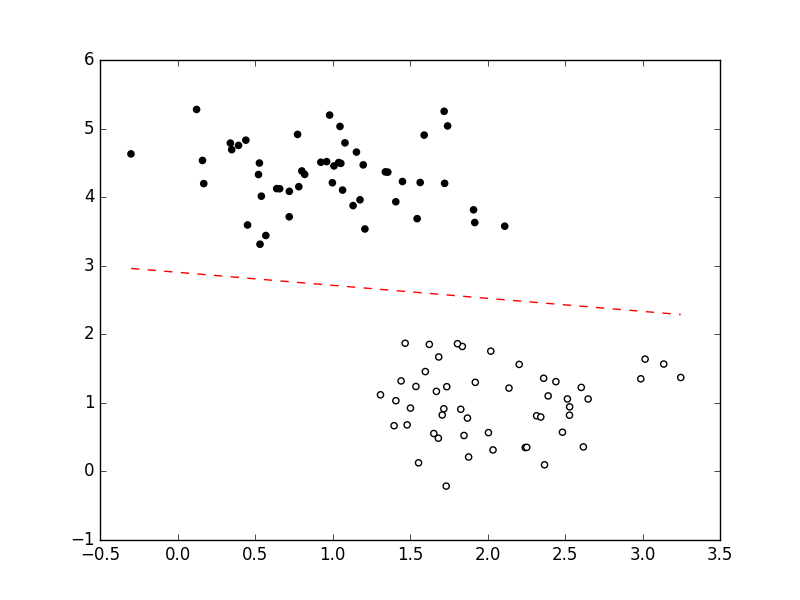

In classification problems you have data points $x \in \mathbb{R}^m$ which you want to classify into one of $k \in \mathbb{N}_{\geq 2}$ classes. This is a supervised task. This means you have $n$ data points for training in a matrix $X \in \mathbb{R}^{n \times m}$ with their labels.[^1]

Initially, the label might be something like "cat" or "dog". But the machine learning algorithms can't deal with those directly, so you need to encode the labels. The simplest way of encoding them is to use integers $0, 1, \dots, k - 1$. However, in many cases it is handy to use a *one-hot encoding*. This means you make a $k$-dimensional vector for each label. $(1, 0)$ might encode "dog" and $(0, 1)$ might encode "cat". `sklearn` supports this encoding in a convenient way
([docs](http://scikit-learn.org/stable/modules/generated/sklearn.preprocessing.OneHotEncoder.html)). Another common encoding is $-1$ and $1$ for binary classification problems.[^2]

A linear model is one which applies only linear operations to the features. So basically the model may only be a matrix. Typically the elements of the matrix are called *weights*, because they weight the importance of each feature.

The objective of such a classifier[^4] is to find a matrix $W^*$ such that the MSE is as small as possible on the test set $D$:

$$W^* = \arg \min_{W} E_{MSE} (f_W, D)$$

## One-hot encoding
If one-hot encoded labels are used,[^3] a linear classifier
$$f: \text{feature space} \rightarrow \text{class space}$$
usually works like this:
$$f(x) = {\arg \max}_{i \in 1, \dots, k} (W \cdot x)^{(i)}$$
with $W \in \mathbb{R}^{k \times m}$ and $^{(i)}$ denoting the $i$-th element of the vector. Given a test set $$D = \{(x_i, y_i) \text{ with } i \in \{1, \dots, n_t\}, x_i \in \mathbb{R}^{m}, y_i \in \mathbb{R}_+^{k}\}$$
you can calculate the *mean squared error* (MSE) of the classifier $f$:

$$E_{MSE}(f, D) = \frac{1}{n_t}\sum_{i=1}^{n_t} (t_i - W \cdot x_i)^T (t_i - W \cdot x_i)$$

Please note that the MSE is always non-negative for every single data point.

### Normalizing the output
The nice thing about the MSE is that it is simple. It can easily be calculated and is used in regression problems very often. What is not so nice is the fact that it punishes several good solutions, too. For example, say we have a data point $x_1$ which has the target $(1, 0)^T$. The classification output

$$c_1 = \begin{pmatrix}101\\0\end{pmatrix}\quad E_{MSE}(f, x_1) = 100^2\tag{1.1}$$

while the classification output of another point $x_2$ is

$$c_2 = \begin{pmatrix}0\\0.1\end{pmatrix}\quad E_{MSE}(f, x_2) = 1 + 0.1^2\tag{1.2}$$

This is problematic, as the actual classification in $(1.1)$ is correct whereas the classification in $(1.2)$ is wrong. However, this can easily be fixed by normalizing the result.

#### Simple Normalization
The simplest way to normalize the result of the classifier would be to divide each entry by the sum of all entries, e.g. for $(1.1)$ we get

$$
\begin{align}
c_1' &= \begin{pmatrix}1\\0\end{pmatrix}\quad &E_{MSE}(f'', x_1) &= 0\tag{2.1}\\
c_2' &= \begin{pmatrix}0\\1\end{pmatrix}\quad &E_{MSE}(f', x_2) &= 1\tag{2.2}
\end{align}
$$

#### Standardization
You might want to interpret the output of your classifier as a probability of the data point belonging to the different classes. Then you may not have negative values and you also want to avoid a probability of 0. A common normalization then is the *softmax function* $\sigma$. It first exponentiates the single values and then normalizes:

$$\begin{align}
c_1'' &= \begin{pmatrix}\frac{e^{101}}{e^{101} + e^0}\\\frac{e^{0}}{e^{101} + e^0}\end{pmatrix} \approx \begin{pmatrix}1\\0\end{pmatrix}\quad &E_{MSE}(f'', x_1) &\approx 0\tag{3.1}\\
c_2'' &= \begin{pmatrix}\frac{e^{0}}{e^{0} + e^{0.1}}\\\frac{e^{0.1}}{e^{0} + e^{0.1}}\end{pmatrix} \approx \begin{pmatrix}0.475\\0.525\end{pmatrix}\quad &E_{MSE}(f'', x_2) &\approx 0.551\tag{3.2}
\end{align}$$

Note that this is the same as a neural network with only an input layer and a softmax output layer.

Now the optimization problem is:

$$
\begin{align}
W^* &= \arg \min_{W \in \mathbb{R}^{k \times m}} E(f'', D)\\
  &= \arg \min_{W \in \mathbb{R}^{k \times m}} \frac{1}{n} \sum_{i=1}^n (t_i - \sigma(W x_i))(t_i - \sigma(W x_i))^T \\
  &= \arg \min_{W \in \mathbb{R}^{k \times m}} \sum_{i=1}^n (t_i - \sigma(W x_i))(t_i - \sigma(W x_i))^T \\
\end{align}
$$

This is a differentiable function. This means to optimize we can calculate the gradient and apply gradient descent:

$$
\begin{align}
&\frac{\partial}{\partial W} \sum_{i=1}^n (t_i - \sigma(W x_i))(t_i - \sigma(W x_i))^T\\
=& \sum_{i=1}^n \frac{\partial}{\partial W} (t_i - \sigma(W x_i))(t_i - \sigma(W x_i))^T\\
=& \sum_{i=1}^n \left (\frac{\partial}{\partial W} (t_i - \sigma(W x_i)) \right ) \left(t_i - \sigma(W x_i) \right)^T + (t_i - \sigma(W x_i)) \left (\frac{\partial}{\partial W} (t_i - \sigma(W x_i))\right )\\
=& \sum_{i=1}^n \left (\frac{\partial}{\partial W} \sigma(W x_i) \right ) \left(t_i - \sigma(W x_i) \right)^T + (t_i - \sigma(W x_i)) \left (\frac{\partial}{\partial W} \sigma(W x_i)\right )^T\\
\end{align}$$

as you can see it gets quite ugly. I don't want to continue this calculation here.  But I hope you can see that this is possible. [stats.stackexchange.com](http://stats.stackexchange.com/q/79454/25741) gives some hints on how to continue.


### Decision boundary
The decision boundary for a two-class problem with 2-dimensional data vectors (and one bias) can be calculated as

$$
\begin{align}
&W^{(0, 0)} \cdot 1 + W^{(0, 1)} \cdot x_1 + W^{(0, 2)} \cdot x_2 = W^{(1, 0)} \cdot 1 + W^{(1, 1)} \cdot x_1 + W^{(1, 2)} \cdot x_2\tag{DB}\\
\Leftrightarrow x_2&= \frac{W^{(0, 0)} \cdot 1 + W^{(0, 1)} \cdot x_1 - (W^{(1, 0)} \cdot 1 + W^{(1, 1)} \cdot x_1)}{W^{(1, 2)} - W^{(0, 2)}}\\
\Leftrightarrow x_2 &= \frac{(W^{(0, 1)} - W^{(1, 1)})}{W^{(1, 2)} - W^{(0, 2)}} \cdot x_1 + \frac{W^{(0, 0)} - W^{(1, 0)}}{W^{(1, 2)} - W^{(0, 2)}}
\end{align}
$$

As you can see, the decision boundary of the non-normalized form is a line:

$$y = a \cdot x + b \qquad a, b \in \mathbb{R}$$

Please also note that $W^{(1, 2)} = W^{(0, 2)}$ is possible, which would mean that the line is parallel to the $x_2$ axis. So **this model basically only has 2&nbsp;parameter combinations which matter, although it has 6&nbsp;values which can be adjusted. But many combinations are equivalent.**

What does normalization change?

For given $W, x$ it only divides both sides of the equation by the same constant. Hence it doesn't change the decision boundary.

What does standardization with softmax change?

Just like with normalization, softmax makes equation $(DB)$ to be divided by a constant. This can be ignored. The exponentiation can also be ignored as we can simply take the logartihm of both sides of $(DB)$. Or in other words: **A neural network with only one input layer and one softmax output layer also has a linear decision boundary!**

## -1/+1 encoding

In the 2-class case one might consider to use -1 for one class and +1 for the other class as targets. Then the classifcation is

$$
\begin{cases}
\text{class with label 1}&\text{if } f(x) \geq 0\\
\text{class with label -1}&\text{if } f(x) < 0
\end{cases}
$$

The matrix $W$ is now in $\mathbb{R}^{1 \times 3}$ and the classifier is

$$f(x) = W x$$

To make sure that this is either $-1$ or $+1$, one can modify it to

$$f'(x) = \frac{W x}{|W x|}$$

Note that this ignores the case $Wx = 0$.

Now we can easily calculate the MSE:

$$E_{MSE}(f, D) = \sum_{i=1}^{n_t} {(t_i - f'(x))}^2$$

## Differences from target encoding

You might wonder if it makes a difference which type of encoding you use for your target. There are some things which come to my mind:

* (+) One-hot encoding can easily be expanded to more than two classes, in contrast to $-1/+1$ encoding.
* (+) With one-hot encoding, you can easily get a probability distribution for the classes you are interested in. This is certainly also possible with $-1/+1$ encoding, but it doesn't strike my eye as clearly.
* (-) One-hot encoding needs more storage space.
* (?) $-1/+1$ encoding is used in SVMs (see [SVM article](https://martin-thoma.com/svm-with-sklearn/)), so it might have advantages in maximum margin classification.

## Implementation

If I had to implement a linear binary classifier, I would use the delta rule
and a perceptron unit:

```python
#!/usr/bin/env python

"""Example for a linear classifier using a perceptron and the delta rule."""

from sklearn.datasets.samples_generator import make_blobs
import matplotlib.pyplot as plt

import numpy as np


class Perceptron(object):
    def __init__(self, eta=0.01, epochs=50):
        """
        Single perceptron unit.

        Credit to Sebastian Raschka:
        http://sebastianraschka.com/Articles/2015_singlelayer_neurons.html
        This was slightly modified.
        """
        self.eta = eta
        self.epochs = epochs

    def fit(self, X, y):
        self.w_ = np.zeros(1 + X.shape[1])
        self.errors_ = []

        for _ in range(self.epochs):
            errors = 0
            for xi, target in zip(X, y):
                update = self.eta * (target - self.predict(xi))
                self.w_[1:] += update * xi
                self.w_[0] += update
                errors += int(update != 0.0)
            self.errors_.append(errors)
        return self

    def net_input(self, X):
        return np.dot(X, self.w_[1:]) + self.w_[0]

    def predict(self, X):
        return np.where(self.net_input(X) >= 0.0, 1, -1)


# Generate data
X, target = make_blobs(random_state=0, centers=2, cluster_std=0.5)

# Fit perceptron
f = Perceptron(epochs=100)
f.fit(X, target)

# Plot decision boundary
xs = np.linspace(start=min(X[:, 0]), stop=max(X[:, 0]))
plt.plot(xs, [-(f.w_[0] + f.w_[1] * xi) / f.w_[2] for xi in xs], "r--")

# Plot data
plt.gray()
_ = plt.scatter(X[:, 0], X[:, 1], c=target)
plt.show()
```

which gives:

<figure class="wp-caption aligncenter img-thumbnail">
    
    <figcaption class="text-center">Classification with a Perceptron.</figcaption>
</figure>


Looks about right. You can also see that this probably minimizes the MSE, but
it does not maximize the margin between the classes. This would be done by
SVMs.


## Footnotes

[^1]: A label and a class are two different things. The class is a set which
      contains all data points which belong to this class. The label is only
      a pointer to this class.

[^2]: Classification problems with only two classes.

[^3]: Also called "targets" sometimes, as we want our classifier to output those values.

[^4]: The objective function defines what is to be done during fitting / training / learning.
