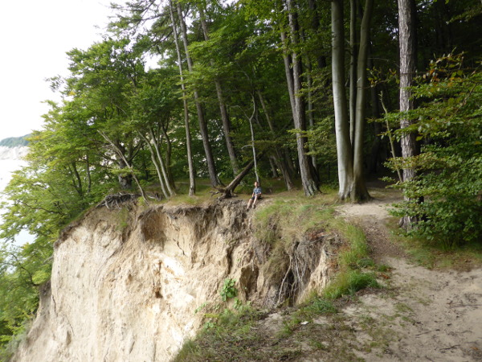

Eine Sommerakademie ist eine Veranstaltung der Studienstiftung des deutschen
Volkes, bei der einige Dutzend Stipendiaten zusammenkommen und knapp zwei
Wochen mit einander verbringen. Es gibt Kurse und Abendvorträge zu welchen man
kommen muss, sowie einiges an Freizeitprogramm das durch die Stipendiaten
organisiert wird. Sommerakademien sind eine wunderbare Möglichkeit neue
Menschen kennen zu lernen und Fähigkeiten in Gebieten aufzubauen welche nicht
die eigene Fachrichtung sind. Oder auch neue Personen kennen zu lernen, die an
der eigenen Fachrichtung interessiert sind.

<figure class="wp-caption aligncenter img-thumbnail">
    
    <figcaption class="text-center">Ryck bei Greifswald</figcaption>
</figure>

Es gibt einige Standorte, an denen immer wieder Sommerakademien statt finden.
Greifswald ist einer davon. Dieser Artikel ist für Stipendiaten welche noch nie
auf einer Sommerakademie waren oder welche sich über Besonderheiten von
Greifswald informieren wollen.

Da die Kurse immer unterschiedlich sind, werde ich dazu nichts schreiben.

## Anfahrt

Die meisten werden mit der Bahn zum Bahnhof Greifswald fahren. Von dort kann man
mit Linie&nbsp;2 zur Haltestelle "Wieck Brücke" fahren. Dann sind es noch ca.
100&thinsp;m an der Ryck (ein Fluss welcher in die Ostsee mündet) entlang zum
MaJuWi. Das MaJuWi ist auf der rechten Seite, auf der Linken hat man den Fluss.

<b>Tipp:</b> Achtet bei Bahn-Tickets darauf, dass dort "Greifswald+City" oder ähnliches steht. Das kostet beim Kauf nicht mehr, aber ihr könnt dann bis zum MaJuWi fahren und müsst nicht noch 2&nbsp;Euro an den lokalen Verkehrsverbund zahlen.

## Ablauf

Werktags (Montag - Freitag) läuft die Akademie wie folgt ab:

<table class='table table-borderless'>
    <tr>
        <td>7:30 - 8:30 Uhr</td>
        <td>Frühstück</td>
    </tr>
    <tr>
        <td>9:00 - 12:30 Uhr</td>
        <td>Kurs in Gebäuden der Uni Greifswald</td>
    </tr>
    <tr>
        <td>12:30 - 14:00 Uhr</td>
        <td>Mittagessen in der Mensa der Uni Greifswald</td>
    </tr>
    <tr>
        <td>19:30 - 20:00 Uhr</td>
        <td>Ankündigungen</td>
    </tr>
    <tr>
        <td>20:00 - 21:00 Uhr</td>
        <td>Abendvortrag der Dozenten</td>
    </tr>
</table>

Dabei ist zu beachten, dass das MaJuWi (wo man schläft) schon ein gutes Stück
von der Uni (wo die Kurse stattfinden) entfernt ist. Daher ist ein Fahrrad sehr
hilfreich. Das kann man sich entweder selbst mitbringen, von Stipendiaten in
Greifswald ausleihen oder kostenpflichtig von einer Firma ausleihen. Das sollte
aber unbedingt vorher geklärt werden.

Bei uns wurde ein Bus in der Früh vom MaJuWi zum Rubenow-Denkmal sowie einer
um 12:45 vom Rubenow-Denkmal über die Mensa (Haltestelle "Am St. Georgsfeld")
zum MaJuWi zurück.

Am letzten Freitag gibt es einen "Bunten Abend". Dieser wird von den
Stipendiaten organisiert und soll die Akademie unterhaltsam ausklingen lassen.
Typischerweise fasst man den eigenen Kurs unterhaltsam zusammen (bzw. nimmt
ihn ordentlich auf die Schippe - man muss ja auch über sich selbst lachen
können).

## Räume

Die Stipendiaten werden im [Maritimen Jugenddorf Wieck](http://www.majuwi.de/)
(MaJuWi) untergebracht. Es sind 6-Bett Zimmer, welche 2016 mit größtenteils
4&nbsp;Personen belegt waren. Leider gibt es nur 2&nbsp;Schlüssel pro Zimmer.
Das Problem haben wir gelöst, indem wir den Schlüssel an der Rezeption
abgegeben haben.

<figure class="wp-caption aligncenter img-thumbnail">
    
    <figcaption class="text-center">Photo-Sphere des MaJuWi</figcaption>
</figure>

Auch an der Uni gibt es wenig Steckdosen. Wenn ihr also mit den Notebooks
arbeiten wollt, solltet ihr unbedingt eine Steckdosenleiste mitbringen. Auch
ein HDMI-VGA-Adapter könnte nötig sein, wenn ihr nur einen VGA-Anschluss habt.

## Freizeit

* [Seilgarten](http://www.greifswaldseil.de/)
* [Boulderhalle](http://greifsbloc.jimdo.com/): Zwar ist die Halle recht klein,
  aber sie hat ein interessantes Flair. Gerade für Anfänger gibt es mehr als
  genug Routen, aber man sollte nichts vergleichbares wie in Karlsruhe / München
  erwarten. Die Halle ist ziemlich versteckt.
* [Segeln und Surfen](http://segelschule-greifswald.com/): Segeln und Surfen
  bietet sich in Greifswald an. Allerdings sollte man die Teilnehmer mindestens
  2&nbsp;Wochen vorher anmelden, damit genug Plätze zur Verfügung stehen. Wir
  haben 4&nbsp;Gruppen (2x Segeln und 2x Surfen) für jeweils Mo-Do von 15:00
  bis 18:00 Uhr angemeldet. Die Segler sollten Kleidung mitnehmen welche nass
  werden darf. Ich hatte eine Badehose, ein Funktionsshirt sowie die
  "Aqua Sphere BEACHWALKER XP" Badeschuhe an (alte Turnschuhe tuns auch). Zum
  Surfen kann man in Badekleidung kommen, da die Neoprenanzüge ausgeliehen werden und
  im Preis inbegriffen sind. Herr Knopp von der Segel- / Surfschule ist hier
  sehr hilfreich bei der Beantwortung der Fragen. Für 25 Euro mehr kann man eine
  Prüfung machen und bekommt den Grundschein. Das sollte man sich recht früh
  überlegen, damit man das Kursmaterial durchgehen kann. 
  Die Segelschule ist auf der gleichen Seite der Ryck wie das MaJuWi. Man muss
  einfach ein paar Meter Richtung Ostsee laufen und hat die Segelschule dann
  auf der rechten Seite. 
  Bezahlt wird am ersten Tag, jeder für sich (obwohl es da wohl auch eine Regelung
  mit der Segelschule und dem MaJuWi gibt), in Bar. 
  Wer die Prüfung macht bekommt die Urkunde vom [VDWS](https://www.vdws.de/).
* Zoo / Botanischer Garten

<figure class="wp-caption aligncenter img-thumbnail">
    
    <figcaption class="text-center">Kreidefelsen auf Rügen</figcaption>
</figure>

* Kreidefelsen und "Wandern" auf [Rügen](https://de.wikipedia.org/wiki/R%C3%BCgen) / [Usedom](https://de.wikipedia.org/wiki/Usedom) / [Hiddensee](https://de.wikipedia.org/wiki/Hiddensee) / [Stralsund](https://de.wikipedia.org/wiki/Stralsund) sind beliebte Ausflugsziele für das Wochenende
* Kajak-Fahren: Für 10 Euro kann man ein 2-er Kajak für 2&nbsp;Stunden
  ausleihen. Wenn man länger unterwegs sein will kostet es halt mehr. Der
  Strand auf der anderen Seite, wenn man aus der Bucht / dem Hafen / der
  Anlegestelle (keine Ahnung wie man das nennt) heraus paddelt ist ganz nett.

<figure class="wp-caption aligncenter img-thumbnail">
    
    <figcaption class="text-center">Lagerfeuer am MaJuWi</figcaption>
</figure>

* Lagerfeuer mit Stockbrot und Gesang: Auf dem Gelände des MaJuWi ist eine
  Stelle wo man ein Lagerfeuer machen kann. Einfach beim MaJuWi nachfragen, dann
  bekommt man das Feuerholz (25 Euro?) sowie Teig für Stockbrot
  (0.50 Euro/person). In der Nähe des Strandbades kann man Stöcke für das
  Stockbrot finden.
* [Wendelstein 7-X](https://de.wikipedia.org/wiki/Wendelstein_7-X): Kann man
  besuchen, muss man aber anmelden.
* Spieleabende: Bei [Werwolf](https://de.wikipedia.org/wiki/Die_Werw%C3%B6lfe_von_D%C3%BCsterwald)
  sind immer einige dabei. Auch Russisch Tabu und [Black Stories](https://de.wikipedia.org/wiki/Black_Stories)
  finden häufig regen Anklang.
* PowerPoint-Karaoke: Sollte auf max. 5&nbsp;Minuten pro Beitrag beschränkt
  werden, die Folien sollten zumindest ein paar Bilder beinhalten und möglichst
  abwechslungsreich sein (also nicht nur z.B. Chemische Formeln / nur Mathe / nur Texte)

## Packliste

* Kleidung und Hygiene-Zeugs (surprise, surprise). Es empfiehlt sich recht viel
  an Kleidung dabei zu haben, da man nicht direkt am MaJuWi waschen kann. Zwar
  kann man in der Pension "Ship In" für 4&nbsp;Euro waschen und für nochmals
  4&nbsp;Euro trocknen, aber das hat - zumindest bei mir - nicht so toll
  geklappt. Eventuell lohnt es sich etwas Handwaschmittel und einen
  Kleiderbügel zum trocknen dabei zu haben.
* Handtücher bekommt man vom MaJuWi, aber ein großes Handtuch für den Strand
  sollte man mitnehmen.
* **Mehrfachsteckdosenleisten**: Es gibt in den 6-Bett Zimmern nur eine
  Steckdose. Wenn nun 4&nbsp;Leute mit Smartphone, Notebook, elektrischer
  Zahnbürste, Digitalkamera und Rasierer kommen sollte man das auf jeden Fall
  mitnehmen. Ich hatte den **Anker PowerCore 20100mAh** dabei und war damit
  recht glücklich.
* Stirnlampe / Taschenlampe: Ist nützlich, wenn man abends nicht mehr das Licht
  anmachen will aber dennoch was sehen muss. Beispielsweise wenn man ins Zimmer
  kommt wenn die anderen schon schlafen. Die Stirnlampe ist zusätzlich zum
  Fahrradfahren praktisch. Von den geliehenen Rädern waren bei vielen die
  Lichter kaputt.
* Mücken-Abwehrmittel (z.B. Autan): Auf dem MaJuWi-Gelände ist ein Teich und
  abends gibt es Unmengen an Mücken.
* Sport
    * Tischtennis-Schläger: Es gibt Tischtennis-Platten und man kann Schläger
      ausleihen. Aber eventuell wollt ihr ja eure eigenen Schläger mitnehmen.
    * Boulder-Schuhe: Man kann glaube ich Boulder-Schuhe ausleihen, aber nicht
      sonderlich viele. Wenn ihr also bouldern wollt und selbst Schuhe habt,
      dann nehmt sie einfach mit.
* Kamera: Es ist schön, wenn man nach der Akademie ein paar Erinnerungen hat.
  Mindestens einer sollte für das Abschlussfoto auch eine gute Kamera dabei
  haben.
* Rucksack: Wenn man Tagesausflüge macht oder einfach nur das Kursmaterial
  (Block, Notebook, whatever) vom MaJuWi zu den Kursräumen bringen will sollte
  man schon einen kleinen Rucksack dabei haben.

## Organisatorisches

Eine Austauschplatform (z.B. eine Facebook-Gruppe) vor Beginn der Akademie
einzurichten ist praktisch. Dann kann man die gemeinsame An- und Abreise
organisieren, Kurs-relevantes klären sowie die Freizeit-Sachen planen. Wenn ihr
- wie wir es gemacht haben - eine Facebook-Gruppe erstellt, solltet ihr darauf
rücksicht nehmen, dass manche Leute Facebook nicht benutzen wollen. Dann kann
man über das Daidalosnet auch die wichtigsten Informationen an alle per E-Mail
schicken.

Es sollten sich Personen für folgende Gruppen finden:

* Bunter Abend: Irgendjemand muss es organisieren und moderieren sowie z.B. die
  Technik-Fragen klären.
* Bar-Team: Einkaufen von Getränken, tragen der Getränke zum MaJuWi, aufräumen
  von eventuell herumstehenden Flaschen. Mindestens einen Autofahrer braucht
  man hier. Vom MaJuWi kann man dann auch eine Kühltruhe bekommen.
* Chor: Ist immer schön für den Bunten Abend
* Segeln / Surfen: z.B. Anmeldung über [Google Docs](https://www.google.com/intl/de/sheets/about/) (Vorname, Nachname, Segeln
  und- / oder Surfen).
* Fahrräder: Vermutlich wollen immer einige Leute ein Fahrrad in Greifswald
  haben, können aber keines mitbringen. Das sollte man vorher klären. Wir haben
  für fahrtaugliche, aber dennoch recht schlechte Räder 4.50 Euro / Tag für
  2&nbsp;Wochen bezahlt. Eventuell kann man da was besser machen.

## Weiteres

* [1Zeit-Ausstellung](http://home.in.tum.de/~hefeleal/1zeit/)
* [Fotos auf Wikipedia](https://commons.wikimedia.org/wiki/Category:Images_by_Martin_Thoma/Sommerakademie-2016)
* [What kind of ship is this?](http://engineering.stackexchange.com/q/11409/3061)
