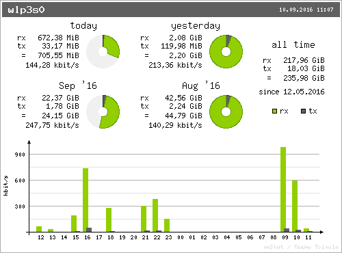

Do you have any idea how much internet traffic (volume) you need? How much do
you download / upload on a usual day?

I didn't have any idea, so I started recording it. In this article I will show
you the results.

For the context: A couple of internet providers moved from flatrates to volume
contracts. For example, 1&amp;1 "DSL Basic" contract is for 100 GB of internet
traffic per month (and they unashamedly still call it an internet flat rate).

Anyway, this made me wonder how much internet traffic I need. So I started
recording it with `vnstat`.


## How to measure

Install `vnstat` and `vnstati`:

```bash
$ sudo apt-get install vnstat vnstati
```

Then execute

```bash
$ ip link
1: lo: <LOOPBACK,UP,LOWER_UP> mtu 65536 qdisc noqueue state UNKNOWN mode DEFAULT group default qlen 1
    link/loopback 00:00:00:00:00:00 brd 00:00:00:00:00:00
2: enp0s31f6: <NO-CARRIER,BROADCAST,MULTICAST,UP> mtu 1500 qdisc pfifo_fast state DOWN mode DEFAULT group default qlen 1000
    link/ether 98:76:54:32:10:45 brd ff:ff:ff:ff:ff:ff
3: wlp3s0: <BROADCAST,MULTICAST,UP,LOWER_UP> mtu 1500 qdisc mq state UP mode DORMANT group default qlen 1000
    link/ether 12:34:56:78:90:ab brd ff:ff:ff:ff:ff:ff
```

to find your network interface. In my case, it is `wlp3s0`. In most cases, it
will be `wlan0` or `eth0` if you use a cable.

I was mainly interested in WLAN. In my case, this is the interface `wlp3s0`.
Now I have to enable monitoring of that interface. You might need super user
(root) for that:

```bash
$ vnstat -u -i wlp3s0
```

To get the nice images, you have to execute the following code (with your
network interface). It will create a `summary.png` image:

```bash
$ vnstati -vs -i wlp3s0 -o ~/summary.png
```

<figure class="wp-caption aligncenter img-thumbnail">
    
    <figcaption class="text-center">Internet traffic of August</figcaption>
</figure>


## Results

To interpret the following, you should know that `rx` is the received traffic
and `tx` is the transferred traffic.


### General

I was not at home most of August, so the results you see in the image above
might be different than usually. So lets get a summary for this year:

```bash
$ vnstati -vs -m -i wlp3s0 -o ~/summary.png
```

<figure class="wp-caption aligncenter img-thumbnail">
    
    <figcaption class="text-center">Internet traffic of May, June, July, August</figcaption>
</figure>

Now you have to realize that I am only recording my notebook. I have a tablet
and a smartphone, too. I also only recorded WLAN, but I use the cable when I
want to download / upload a lot. Also, my connection is not so fast. This means
when I watch videos, I usually don't watch them in HD (although my computer
would be awesome for that). So 50&thinsp;GB to 70&thinsp;GB download and about
5&thinsp;GB to 6&thinsp;GB upload might be a conservative estimate of what I
need.


### Watching News

Watching the German 20 o'clock news (15 minutes on tagesschau.de) is about
200&thinsp;MiB rx and about 3&thinsp;MiB tx.


### Publishing Blog articles

For [ml-ka.de](https://ml-ka.de/) it is less than 10&thinsp;KiB.
