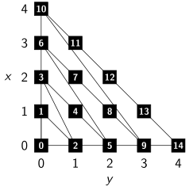

Today I was thinking if one could iterate over all possible feed forward network
architectures possible. A feed forward network is essentially only a directed
acyclic graph.

To make things simpler, lets just think about multilayer perceptrons. This
means we only have connections between neighboring layers (and we have layers).


## Terms

A directed acyclic graph (DAG) is a finite graph $G = (V, E)$ with vertices $V$
and edges $E \subseteq V \times V$ where no cycle can be found. A cycle is a
set of edges $e_1, \dots, e_n$ such that $e_i = (v_i, v_{i+1})$ with $e_n =
(v_n, v_1)$.


### Iteration

Now, what does it mean to iterate over the graphs?

One can iterate over all natural numbers like this:

```python
i = 1
while True:
    print(i)
    i += 1
```

Resulting in the sequence $1, 2, 3, \dots$ which is guaranteed to reach any
natural number $k \in \mathbb{N}$ at some point.

Similar, one can iterate over $\mathbb{Q}_0^+$:

```python
x = 0
y = 0
while True:
    if x > 0:
        y += 1
        x -= 1
    else:
        x = y
        y = 1
    print(x / y)
```

this is the pattern in which the numbers are generated:

<figure class="wp-caption aligncenter img-thumbnail">
    
    <figcaption class="text-center">Iterate over $\mathbb{Q}_0^+$</figcaption>
</figure>


## Graph iteration

There are finitely many directed graphs $G = (V, E)$ with $E \subseteq V \times V$ with $n = |V|$ nodes. So if one wanted to iterate over all of them, one could iterate over all graphs with $n=1$ node (only one graph), then over all graphs with two nodes, ...

At this point, it should be obvious that it is possible. However, how can we
iterate over the structures without unnecessary duplication? How can we take
into account that we also need connected graphs with a fixed size for the
first layer and a fixed size for the last layer?

Similar to the iteration over $\mathbb{Q}_0^+$, you first generate all MLPs
with exactly one neuron. Then all MLPs with exactly two neurons, ...

To generate all MLPs with exactly $n$ neurons in $k$ layers, you first generate
all MLPs with $n-i$ neurons in $k-1$ layers and add $i$ neurons to the $k$-th
layer:

```python
#!/usr/bin/env python
# -*- coding: utf-8 -*-

"""Iterate over all MLPs."""

import numpy
from itertools import count


def gen_vecs(n, k):
    """Generate all integer vectors of length k which sums up to n."""
    assert n > 0
    assert k > 0
    assert n >= k, "n=%i AND k=%i" % (n, k)
    if k == 1:
        yield numpy.array([n])
    else:
        for i in range(1, n - k + 2):
            xs = gen_vecs(n - i, k - 1)
            for y in xs:
                x = numpy.zeros(k)
                for j in range(k - 1):
                    x[j] = y[j]
                x[k - 1] = i
                yield x


def gen_all_mlps_size_n(n):
    """
    Generate all ways to have hidden layers with exactly n nodes.

    Make it by the number of hidden layers. First one hidden layer, then two,
    ... until n hidden layers with each exactly one neuron.

    There are 2^{n-1} of those.
    """
    for k in range(1, n + 1):
        vec_generator = gen_vecs(n, k)
        for vec in vec_generator:
            yield vec


def gen_all_mlps():
    """Generate all MLPs."""
    for neurons in count(1):
        gen = gen_all_mlps_size_n(neurons)
        for graph in gen:
            yield graph


# Just for fun, generate the first 100 graphs:
gen = gen_all_mlps()
for i in range(100):
    print(gen.next())
```
