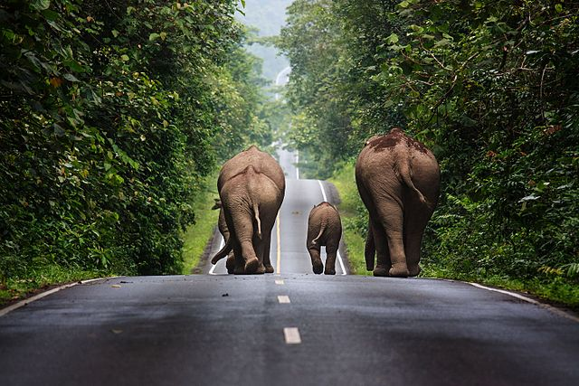
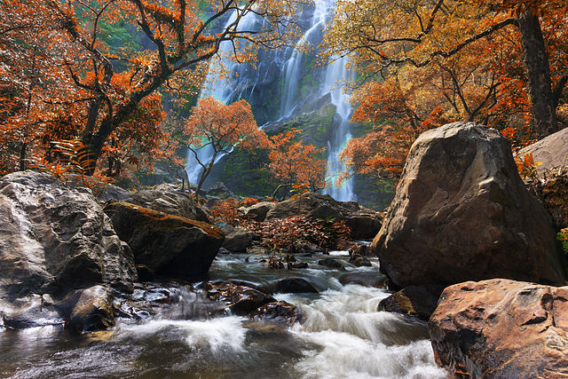
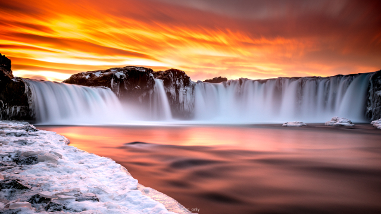
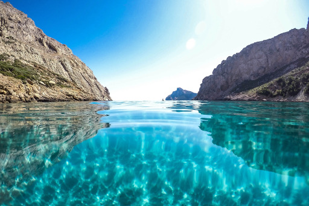
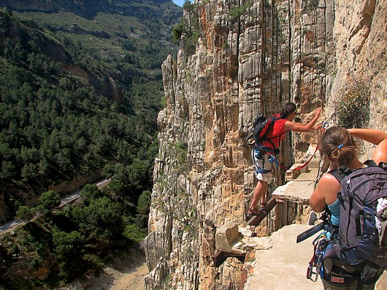
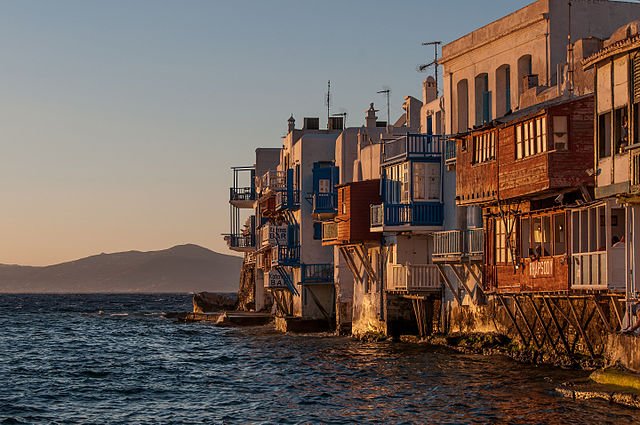
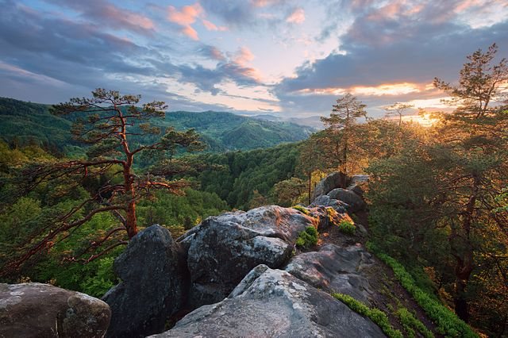
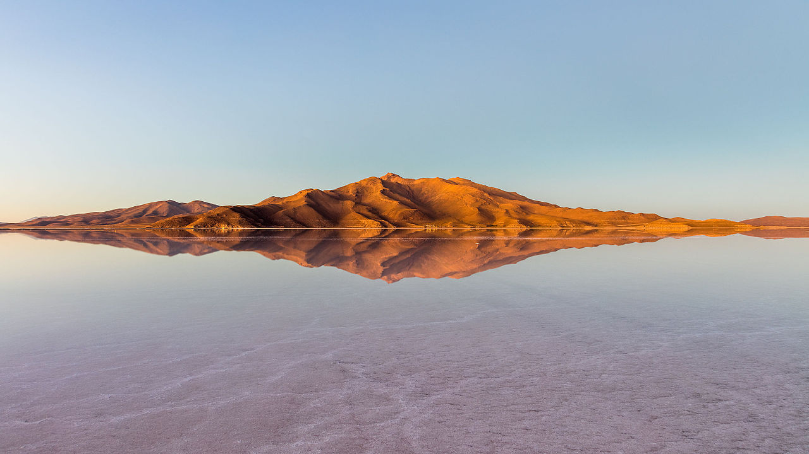

There are some places which look astonishing. I would like to visit them and
to see them with my own eyes.

## Arctic

<figure class="wp-caption aligncenter img-thumbnail">
    
    <figcaption class="text-center"><a href="https://en.wikipedia.org/wiki/Frost_flower">Frost flower</a> (Image source: <a href="https://commons.wikimedia.org/wiki/File:Cristaux_de_givre_au_Hohneck_-_dsdm11646.jpg">Wikimedia</a>)</figcaption>
</figure>

<figure class="wp-caption aligncenter img-thumbnail">
    
    <figcaption class="text-center">Hair Ice (Image source: <a href="https://commons.wikimedia.org/wiki/File:FrostBeardDetail.jpg">Wikimedia</a>)</figcaption>
</figure>

<figure class="wp-caption aligncenter img-thumbnail">
    
    <figcaption class="text-center"><a href="https://en.wikipedia.org/wiki/Polar_stratospheric_cloud">Nacreous Clouds</a> (Image source: <a href="https://en.wikipedia.org/wiki/File:Polar_Stratospheric_Cloud_type_I_above_Cirrus.jpg">Wikimedia</a>)</figcaption>
</figure>

* Snow Chimneys

## Asia

### Turkmenistan

<figure class="wp-caption aligncenter img-thumbnail">
    
    <figcaption class="text-center"><a href="https://en.wikipedia.org/wiki/Door_to_Hell">Door to Hell</a> (Image source: <a href="https://commons.wikimedia.org/wiki/File:Central_Asia_100.jpg">Wikimedia</a>)</figcaption>
</figure>

### Thailand

<figure class="wp-caption aligncenter img-thumbnail">
    
    <figcaption class="text-center"><a href="https://en.wikipedia.org/wiki/Khao_Yai_National_Park">Khao Yai National Park</a> (Image source: <a href="https://commons.wikimedia.org/wiki/File:Khaoyai_06.jpg">Wikimedia</a>)</figcaption>
</figure>

<figure class="wp-caption aligncenter img-thumbnail">
    
    <figcaption class="text-center"><a href="https://en.wikipedia.org/wiki/Khlong_Lan_National_Park">Khlong Lan National Park</a> (Image source: <a href="https://commons.wikimedia.org/wiki/File:Klonglan_waterfall_03.jpg">Wikimedia</a>)</figcaption>
</figure>

## Europe

### Norway

<figure class="wp-caption aligncenter img-thumbnail">
    
    <figcaption class="text-center">Aurora Borealis (Image source: <a href="https://commons.wikimedia.org/wiki/File:Polarlicht_2.jpg">Wikimedia</a>) <a href="https://en.wikipedia.org/wiki/Svalbard">Svalbard</a> or <a href="https://en.wikipedia.org/wiki/Lofoten">Lofoten</a> (<a href="https://www.reddit.com/r/EarthPorn/comments/5y0hqc/went_to_norway_saw_the_northern_lights_it_was/">image</a>) might be a good place to see it.</figcaption>
</figure>

### Denmark

<figure class="wp-caption aligncenter img-thumbnail">
    
    <figcaption class="text-center"><a href="https://en.wikipedia.org/wiki/File:Sort_sol_pdfnet2.jpg">Black Sun</a> (Image Source: <a href="https://en.wikipedia.org/wiki/File:Sort_sol_pdfnet2.jpg">Wikimedia</a>)</figcaption>
</figure>

### Iceland

<figure class="wp-caption aligncenter img-thumbnail">
    
    <figcaption class="text-center">Vulcanic Lightning, for example at Eyjafjallajökull (Image source: <a href="https://commons.wikimedia.org/wiki/File:Rinjani_1994.jpg">Wikimedia</a>)</figcaption>
</figure>

<figure class="wp-caption aligncenter img-thumbnail">
    
    <figcaption class="text-center"><a href="https://en.wikipedia.org/wiki/File:Icemass2.jpg">Ice cave</a> (Image source: <a href="https://en.wikipedia.org/wiki/File:Icemass2.jpg">Wikimedia</a>)</figcaption>
</figure>

<figure class="wp-caption aligncenter img-thumbnail">
    
    <figcaption class="text-center"><a href="https://en.wikipedia.org/wiki/Geyser">Geyser</a> (Image source: <a href="https://en.wikipedia.org/wiki/File:Steam_Phase_eruption_of_Castle_geyser_with_double_rainbow.jpg">Wikimedia</a>)</figcaption>
</figure>

<figure class="wp-caption aligncenter img-thumbnail">
    
    <figcaption class="text-center">Sunset at <a href="https://en.wikipedia.org/wiki/Go%C3%B0afoss">Goðafoss waterfall</a> (Image source: <a href="https://www.reddit.com/r/EarthPorn/comments/5xwydp/i_went_on_a_roadtrip_in_iceland_and_i_captured/">reddit</a>). One can see the aurora there, too (<a href="https://www.reddit.com/r/EarthPorn/comments/62o70v/got_one_clear_night_on_a_recent_trip_to_iceland/">source</a>).</figcaption>
</figure>

* Steam Towers: Hverir
* Auroras (e.g. in Reykjavik from late September to early April)

### Spain

<figure class="wp-caption aligncenter img-thumbnail">
    
    <figcaption class="text-center">Mallorca (Image source: <a href="https://www.reddit.com/r/EarthPorn/comments/5mvhl7/majorca_spain_oc_3878x2586/">reddit: EarthPorn</a>)</figcaption>
</figure>

<figure class="wp-caption aligncenter img-thumbnail">
    
    <figcaption class="text-center"><a href="https://en.wikipedia.org/wiki/Caminito_del_Rey">Caminito del Rey</a> (Image source: <a href="https://commons.wikimedia.org/wiki/File:Caminito_del_Rey_4.jpg">Wikipedia Commons</a>)</figcaption>
</figure>

### Turkey

<figure class="wp-caption aligncenter img-thumbnail">
    
    <figcaption class="text-center"><a href="https://en.wikipedia.org/wiki/Pamukkale">Travertine Pools of Pamukkale</a> (Image source: <a href="https://commons.wikimedia.org/wiki/File:Pamukkale_Hierapolis_Travertine_pools.JPG">Wikimedia</a>)</figcaption>
</figure>

### Greece

<figure class="wp-caption aligncenter img-thumbnail">
    
    <figcaption class="text-center">Mykonos (Image source: <a href="https://commons.wikimedia.org/wiki/File:Sunset_of_Mykonos.jpg">Wikimedia</a>)</figcaption>
</figure>

### Ukraine

<figure class="wp-caption aligncenter img-thumbnail">
    
    <figcaption class="text-center">Protiate Kaminnia Natural Geological Monument (Image source: <a href="https://commons.wikimedia.org/wiki/File:%D0%97%D0%B0%D1%85%D1%96%D0%B4_%D1%81%D0%BE%D0%BD%D1%86%D1%8F_%D0%BD%D0%B0_%D0%B2%D0%B5%D1%80%D1%88%D0%B8%D0%BD%D1%96_%D1%81%D0%BA%D0%B5%D0%BB%D1%96_%D0%A1%D0%BE%D0%BA%D0%BE%D0%BB%D0%B8%D0%BD%D0%B5_%D0%BE%D0%BA%D0%BE.jpg">Wikimedia</a>)</figcaption>
</figure>

## North America

### Belize

<figure class="wp-caption aligncenter img-thumbnail">
    
    <figcaption class="text-center"><a href="https://en.wikipedia.org/wiki/Great_Blue_Hole">Great Blue Hole</a> (Image source: <a href="https://commons.wikimedia.org/wiki/File:Great_Blue_Hole.jpg">Wikimedia</a>)</figcaption>
</figure>

### Canada

<figure class="wp-caption aligncenter img-thumbnail">
    
    <figcaption class="text-center"><a href="https://en.wikipedia.org/wiki/Spotted_Lake">Spotted Lake</a>: Looks interesting
in Summer when the water evaporates (Image source: <a href="https://commons.wikimedia.org/wiki/File:Spotted_Lake_-_panoramio.jpg">Wikimedia Commons</a>)</figcaption>
</figure>

### United States

* Volcanic Lightning (Alaska, [Augustine Volcano](https://en.wikipedia.org/wiki/Augustine_Volcano))

## South America

### Bolivia

<figure class="wp-caption aligncenter img-thumbnail">
    
    <figcaption class="text-center">Salar de Uyuni is one of the most famous <a href="https://en.wikipedia.org/wiki/Salt_pan_(geology)">salt pans</a> (Image source: <a href="https://en.wikipedia.org/wiki/File:Salar_de_Uyuni,_Bolivia,_2016-02-04,_DD_10-12_HDR.JPG">Wikimedia Commons</a>)</figcaption>
</figure>

### Venezuela

<figure class="wp-caption aligncenter img-thumbnail">
    
    <figcaption class="text-center"><a href="https://en.wikipedia.org/wiki/Catatumbo_lightning">Catatumbo lightning</a> (Image source: <a href="https://commons.wikimedia.org/wiki/File:Catatumbo_Lightning_-_Rayo_del_Catatumbo_(22668686290).jpg">Wikimedia Commons</a>)</figcaption>
</figure>

## Oceania

### New Zealand

<figure class="wp-caption aligncenter img-thumbnail">
    
    <figcaption class="text-center"><a href="https://en.wikipedia.org/wiki/Moeraki_Boulders">Moeraki Boulders</a> (Image source: <a href="https://commons.wikimedia.org/wiki/File:Beach_at_Moeraki_Boulders_on_a_foggy_day.jpg">Wikimedia</a>)</figcaption>
</figure>

## See also

* [What are some of the best rare natural phenomena that occur on Earth?](http://www.quora.com/What-are-some-of-the-best-rare-natural-phenomena-that-occur-on-Earth)