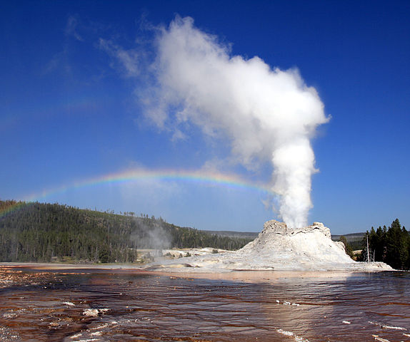

There are some places which look astonishing. I would like to visit them and
to see them with my own eyes.

## Arctic

<figure class="wp-caption aligncenter img-thumbnail">
    
    <figcaption class="text-center"><a href="https://en.wikipedia.org/wiki/Frost_flower">Frost flower</a> (Image source: <a href="https://commons.wikimedia.org/wiki/File:Cristaux_de_givre_au_Hohneck_-_dsdm11646.jpg">Wikimedia</a>)</figcaption>
</figure>

<figure class="wp-caption aligncenter img-thumbnail">
    
    <figcaption class="text-center">Hair Ice (Image source: <a href="https://commons.wikimedia.org/wiki/File:FrostBeardDetail.jpg">Wikimedia</a>)</figcaption>
</figure>

<figure class="wp-caption aligncenter img-thumbnail">
    
    <figcaption class="text-center"><a href="https://en.wikipedia.org/wiki/Polar_stratospheric_cloud">Nacreous Clouds</a> (Image source: <a href="https://en.wikipedia.org/wiki/File:Polar_Stratospheric_Cloud_type_I_above_Cirrus.jpg">Wikimedia</a>)</figcaption>
</figure>

* Snow Chimneys

## Asia

### Turkmenistan

<figure class="wp-caption aligncenter img-thumbnail">
    
    <figcaption class="text-center"><a href="https://en.wikipedia.org/wiki/Door_to_Hell">Door to Hell</a> (Image source: <a href="https://commons.wikimedia.org/wiki/File:Central_Asia_100.jpg">Wikimedia</a>)</figcaption>
</figure>

## Europe

### Norway

<figure class="wp-caption aligncenter img-thumbnail">
    
    <figcaption class="text-center">Aurora Borealis (Image source: <a href="https://commons.wikimedia.org/wiki/File:Polarlicht_2.jpg">Wikimedia</a>) <a href="https://en.wikipedia.org/wiki/Svalbard">Svalbard</a> might be a good place to see it.</figcaption>
</figure>

### Denmark

<figure class="wp-caption aligncenter img-thumbnail">
    
    <figcaption class="text-center"><a href="https://en.wikipedia.org/wiki/File:Sort_sol_pdfnet2.jpg">Black Sun</a> (Image Source: <a href="https://en.wikipedia.org/wiki/File:Sort_sol_pdfnet2.jpg">Wikimedia</a>)</figcaption>
</figure>

### Iceland

<figure class="wp-caption aligncenter img-thumbnail">
    
    <figcaption class="text-center">Vulcanic Lightning, for example at Eyjafjallajökull (Image source: <a href="https://commons.wikimedia.org/wiki/File:Rinjani_1994.jpg">Wikimedia</a>)</figcaption>
</figure>

<figure class="wp-caption aligncenter img-thumbnail">
    
    <figcaption class="text-center"><a href="https://en.wikipedia.org/wiki/File:Icemass2.jpg">Ice cave</a> (Image source: <a href="https://en.wikipedia.org/wiki/File:Icemass2.jpg">Wikimedia</a>)</figcaption>
</figure>

<figure class="wp-caption aligncenter img-thumbnail">
    
    <figcaption class="text-center"><a href="https://en.wikipedia.org/wiki/Geyser">Geyser</a> (Image source: <a href="https://en.wikipedia.org/wiki/File:Steam_Phase_eruption_of_Castle_geyser_with_double_rainbow.jpg">Wikimedia</a>)</figcaption>
</figure>

* Steam Towers: Hverir
* Auroras (e.g. in Reykjavik from late September to early April)

### Turkey

<figure class="wp-caption aligncenter img-thumbnail">
    
    <figcaption class="text-center"><a href="https://en.wikipedia.org/wiki/Pamukkale">Travertine Pools of Pamukkale</a> (Image source: <a href="https://commons.wikimedia.org/wiki/File:Pamukkale_Hierapolis_Travertine_pools.JPG">Wikimedia</a>)</figcaption>
</figure>

## North America

### Belize

<figure class="wp-caption aligncenter img-thumbnail">
    
    <figcaption class="text-center"><a href="https://en.wikipedia.org/wiki/Great_Blue_Hole">Great Blue Hole</a> (Image source: <a href="https://commons.wikimedia.org/wiki/File:Great_Blue_Hole.jpg">Wikimedia</a>)</figcaption>
</figure>

### Canada

<figure class="wp-caption aligncenter img-thumbnail">
    
    <figcaption class="text-center"><a href="https://en.wikipedia.org/wiki/Spotted_Lake">Spotted Lake</a>: Looks interesting
in Summer when the water evaporates (Image source: <a href="https://commons.wikimedia.org/wiki/File:Spotted_Lake_-_panoramio.jpg">Wikimedia</a>)</figcaption>
</figure>

### United States

* Volcanic Lightning (Alaska, [Augustine Volcano](https://en.wikipedia.org/wiki/Augustine_Volcano))

## South America

### Venezuela

<figure class="wp-caption aligncenter img-thumbnail">
    
    <figcaption class="text-center"><a href="https://en.wikipedia.org/wiki/Catatumbo_lightning">Catatumbo lightning</a> (Image source: <a href="https://commons.wikimedia.org/wiki/File:Catatumbo_Lightning_-_Rayo_del_Catatumbo_(22668686290).jpg">Wikimedia Commons</a>)</figcaption>
</figure>

## Oceania

### New Zealand

<figure class="wp-caption aligncenter img-thumbnail">
    
    <figcaption class="text-center"><a href="https://en.wikipedia.org/wiki/Moeraki_Boulders">Moeraki Boulders</a> (Image source: <a href="https://commons.wikimedia.org/wiki/File:Beach_at_Moeraki_Boulders_on_a_foggy_day.jpg">Wikimedia</a>)</figcaption>
</figure>

## See also

* [What are some of the best rare natural phenomena that occur on Earth?](http://www.quora.com/What-are-some-of-the-best-rare-natural-phenomena-that-occur-on-Earth)