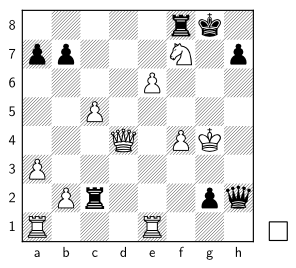
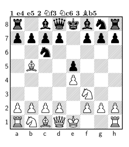

<h2>Chessboard</h2>
<h3>Simple example</h3>

<figure class="wp-caption aligncenter img-thumbnail">
    
    <figcaption class="text-center">Chessboard - simple example</figcaption>
</figure>

```tex
\documentclass{article}
\usepackage[pdftex,active,tightpage]{preview}
\setlength\PreviewBorder{5mm}

\usepackage{chessboard}

\begin{document}
\begin{preview}

\chessboard[setfen=5rk1/pp3N1p/4P3/2P5/3Q1PK1/P7/1Pr3pq/R3R3 w - - 0 0,
            showmover]

\end{preview}
\end{document}
```


From <a href="http://tex.stackexchange.com/a/54192/5645">tex.stackexchange.com</a>.


## Skak

### Simple example

<figure class="wp-caption aligncenter img-thumbnail">
    
    <figcaption class="text-center">Simple example with skak</figcaption>
</figure>

```tex
\documentclass{article}
\usepackage[pdftex,active,tightpage]{preview}
\setlength\PreviewBorder{5mm}

\usepackage{skak}

\begin{document}
\begin{preview}

% sets the internal board or a new game
\newgame
% typesets the moves and updates the board
\mainline{1.e4 e5 2. Nf3 Nc6 3.Bb5}\\
% show the current board position
\showboard

\end{preview}
\end{document}
```

## See also
<ul>
  <li><a href="ftp://ftp.rrzn.uni-hannover.de/pub/mirror/tex-archive/macros/latex/contrib/chessboard/chessboard.pdf">Chessboard documentation</a></li>
  <li><a href="ftp://ftp.tu-chemnitz.de/pub/tex/fonts/chess/skak/doc/skakdoc.pdf">Skak documentation</a> - <a href="ftp://ftp.mpi-sb.mpg.de/pub/tex/mirror/ftp.dante.de/pub/tex/fonts/chess/skak/doc/refman.pdf">short reference</a></li>
</ul>
