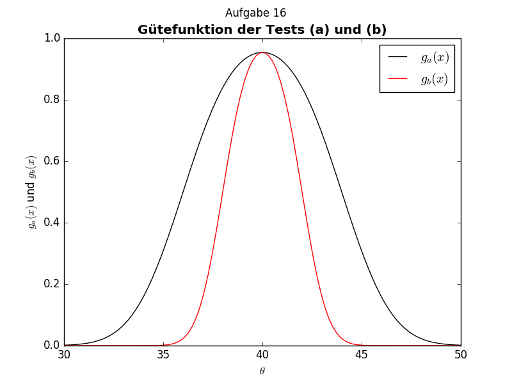

Quite a while ago, I had to use R for a statistics class.


## Nice things about R

R has a neat programming environment called [`rstudio`](https://www.rstudio.com/products/rstudio/):

<figure class="wp-caption aligncenter img-thumbnail">
    <a href="../images/2017/01/rstudio.png"></a>
    <figcaption class="text-center">RStudio</figcaption>
</figure>

As you can see, RStudio conveniently shows:

* The code,
* an interactive console,
* a window with plots,
* loaded variables / functions as well as their values

edit: RStudio also has the possibility to edit keyboard shortcuts. Nice :-)

Simple plots are relatively easy to generate. The one you can see in the
screenshot was generated by

```r
## Aufgabe 16
# In einem Test wird die Nullhypothese, dass für eine bestimmte Altersgruppe
# mit n Personen die durchschnittliche Punktzahl θ bei einem Leistungstest 40
# beträgt, gegen die Alternative, dass diese ungleich 40 ist, getestet. Sie
# können davon ausgehen, dass die erreichten Punktzahlen normalverteilt mit
# Varianz σ^2 = 36 sind.

## Aufgabe c

# Gütefunktion:
# g(\theta) = P_\theta(X \in Kritischem Bereich)
#           = P_\theta(Entscheidung für H_1)

g_a = function(theta) {
    # H_0: θ  = 40
    # H_1: θ != 40
    ifelse(theta == 40,
           pnorm(4, mean=0, sd=2) - pnorm(-4, mean=0, sd=2),
           pnorm(4, mean=abs(theta-40), sd=2) - pnorm(-4, mean=abs(theta-40), sd=2))
}

g_b = function(theta) {
    # H_0: θ  = 40
    # H_1: θ != 40
    ifelse(theta == 40,
           pnorm(2, mean=0, sd=1) - pnorm(-2, mean=0, sd=1),
           pnorm(2, mean=abs(theta-40), sd=1) - pnorm(-2, mean=abs(theta-40), sd=1))
}

curve(g_a, from=30, to=50, xlab="", ylab="", lwd=2)
curve(g_b, from=30, to=50, add=T, col="red", xlab="", lwd=2) # ist besser
title(main="Gütefunktion der Tests (a) und (b)",
      sub="Aufgabe 16",
      xlab=expression(theta),
      ylab="g_a(x) und g_b(x)")
legend("topright",
       legend=c("g_a(x)", "g_b(x)"),
       lty=c(1,1),
       lwd=c(2,2),
       col=c("black","red"))

```


## Expected

R has a few properties which I expect from any programming language today:

* A code repository ([cran.r-project.org](https://cran.r-project.org/)) where
  people can add packages.
* R has its niche: Statistics (although I expect Python to replace R on the long run)
* R has a [tutorial](https://cran.r-project.org/doc/manuals/r-release/R-intro.html).
  In this introduction, one can also see the focus on statistics.


## Bad things about R

* The name. Try searching for "R" ... "rlang" seems to work, though. But it
  is close to "erlang", another language. This makes searching for answers
  harder than necessary.
* <s>There seems to be no possibility to run an R script from console like `python script.py`.</s>: This is simply wrong. If you edit the keyboard shortcuts ("run all code"), you
  can see it. But I have to say that it's pretty well-hidden ;-) (Thanks to Tariq for correcting me!)
* There seems to be no possibility to run an R script completely within rstudio.
  I've seen users who know R for several years pressing <kbd>ctrl</kbd>+<kbd>enter</kbd>
  for every single line to execute the script line by line.
* Indexing starts with `1`, not with `0`.


## Community

<figure class="wp-caption aligncenter img-thumbnail">
    <a href="../images/2017/01/langpop-r-python.png"></a>
    <figcaption class="text-center">R seems to have a pretty active community according to <a href="http://langpop.corger.nl/">langpop.corger.nl</a></figcaption>
</figure>

<figure class="wp-caption aligncenter img-thumbnail">
    <a href="../images/2017/01/githut-r.png"></a>
    <figcaption class="text-center">... however, not comparable with Python (<a href="http://githut.info/">githut.info</a>). And they love forking repos.</figcaption>
</figure>


## Why Python can replace R

One thing mentioned all the time as a reason to use R are nice visualizations
which are easy to create.

Well, in Python there is [`matplotlib`](http://matplotlib.org/) and [`seaborn`](http://seaborn.pydata.org/) (as well as [`ggplot`](http://ggplot.yhathq.com/), [`bokeh`](http://bokeh.pydata.org/en/latest/), [`pygal`](http://pygal.org/en/stable/), [`geoplotlib`](https://github.com/andrea-cuttone/geoplotlib), [`gleam`](https://github.com/dgrtwo/gleam), [`missingo`](https://github.com/ResidentMario/missingno), [`leather`](http://leather.readthedocs.io/en/latest/index.html), ...).

For example, the plot from above can be made with matplotlib like this:

```python
#!/usr/bin/env python
# -*- coding: utf-8 -*-

ur"""
# Aufgabe 16

In einem Test wird die Nullhypothese, dass für eine bestimmte Altersgruppe
mit n Personen die durchschnittliche Punktzahl θ bei einem Leistungstest 40
beträgt, gegen die Alternative, dass diese ungleich 40 ist, getestet. Sie
können davon ausgehen, dass die erreichten Punktzahlen normalverteilt mit
Varianz σ^2 = 36 sind.

## Aufgabe c

Gütefunktion:
g(\theta) = P_\theta(X \in Kritischem Bereich)
          = P_\theta(Entscheidung für H_1)
"""

import numpy as np
import matplotlib.pyplot as plt
from scipy.stats import norm


def g(thetas, sd, x):
    u"""
    Calculate the probability between [-x, x] of a random variable.

    H_0: θ  = 40
    H_1: θ != 40
    """
    values = []
    for theta in thetas:
        if theta == 40:
            mean = 0
        else:
            mean = abs(theta - 40)
        rv = norm(mean, sd)
        values.append(rv.cdf(x) - rv.cdf(-x))
    return values


def main(xmin=30, xmax=50, samples=100):
    """Create plots."""
    x = np.linspace(xmin, xmax, samples)  # sample 100 values between 30 and 50
    plt.plot(x, g(x, sd=2, x=4), color='#000000', label="$g_a(x)$")
    plt.plot(x, g(x, sd=1, x=2), color='#ff0000', label="$g_b(x)$")
    plt.title(u"Gütefunktion der Tests (a) und (b)", fontweight='bold')
    plt.xlabel(r"""$\theta$""")
    plt.ylabel(r"""$g_a(x)$ und $g_b(x)$""")
    plt.legend()
    plt.suptitle("Aufgabe 16")
    plt.show()


if __name__ == '__main__':
    main()

```

which results in

<figure class="wp-caption aligncenter img-thumbnail">
    
    <figcaption class="text-center">Matplotlib plot example</figcaption>
</figure>


To me, the Python code seems much cleaner, easier to understand and to adjust
to other cases. And it can be easily imported from other scripts / executed at
once.


### Python - R dictionary

<table>
    <tr>
        <th>Python</th>
        <th>R</th>
        <th>Explanation</th>
    </tr>
    <tr>
        <td><code>scipy.stats.norm(0, 2).cdf(4)</code></td>
        <td><code>pnorm(4, mean=0, sd=2)</code></td>
        <td>Cumulative Density function at 4 of a normal distributed variable with mean 0 and standard deviation 2.</td>
    </tr>
</table>


## Links

* [stats.stackexchange.com](http://stats.stackexchange.com/)
* [Manuals](https://cran.r-project.org/manuals.html)
* [www.r-tutor.com](http://www.r-tutor.com/)
* [tryr.codeschool.com](http://tryr.codeschool.com/)
* [www.cyclismo.org/tutorial/R](http://www.cyclismo.org/tutorial/R/)