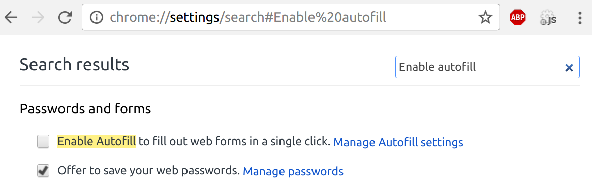

Autofill phishing is a simple technique I wasn't aware of until a few hours
ago. It simply uses the fact that we are so used to filling out forms, that we
usually let our Browser fill out the forms. Maybe we check if there is data
which we don't want to submit and remove that. However, the browser (tested
with Google Chrome 55) also fills out forms which we can't see.

## Check if you are affected

<ol>
    <li>Go to <a href="http://martin-thoma.de/autofill-phishing/?hidden=margin">martin-thoma.de/autofill-phishing/?hidden=margin</a></li>
    <li>Fill out the displayed items with autofill</li>
    <li>Click on submit. It will show which data was submitted by you.</li>
</ol>

I do not store this data.

## Solutions

### As a user

Disable autofill.

For Chrome, go to `chrome://settings/search#Enable%20autofill` and uncheck it:

<figure class="wp-caption aligncenter img-thumbnail">
    
    <figcaption class="text-center">Autofill settings in Google Chrome</figcaption>
</figure>

### As a developer
Show the user a pop-up which displays which information is filled in (with checkboxes so that the user can decide not to fill certain items). I've heard Safari does something like this (Screenshots are welcome, if you have Safari)

## Overview

<table class="table">
    <tr>
        <th>Browser</th>
        <th>margin</th>
        <th>display</th>
        <th>hidden</th>
    </tr>
    <tr>
        <td class="danger">Google Chrome 55</td>
        <td class="danger">Affected</td>
        <td class="success">Ok</td>
        <td class="success">Ok</td>
    </tr>
</table>

If you have another Browser, feel free to <a href="http://martin-thoma.de/autofill-phishing/?hidden=margin">test it</a> and leave a comment what is (not)
affected. Alternatively, you can send an Email to `info@martin-thoma.de`.

## See also

* The Guardian: [Browser autofill used to steal personal details in new phishing attack](https://www.theguardian.com/technology/2017/jan/10/browser-autofill-used-to-steal-personal-details-in-new-phising-attack-chrome-safari), 10.01.2017.
* [Autocomplete Types](http://ryan.mcgeary.org/files/autocomplete-types.pdf)
