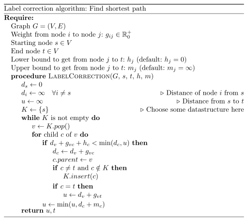

The label-correction algorithm is a generalization which includes very common
graph search algorithms like breadth first search (BFS), depth first search (DFS),
[A*](https://en.wikipedia.org/wiki/A*_search_algorithm), [Dijkstra's algorithm](https://en.wikipedia.org/wiki/Dijkstra%27s_algorithm) and [Branch and bound](https://en.wikipedia.org/wiki/Branch_and_bound) as special cases.


## Pseudocode

<figure class="wp-caption aligncenter img-thumbnail">
    
    <figcaption class="text-center">Pseudocode for the Label correction algorithm</figcaption>
</figure><br/>

Explanation:

First `if`: The left hand side is a lower bound to get from start to
`v`, to `c` and then to `t`. If this lower bound is not lower than
either `u` or the distance to `c` directly, then it will not be part
of the optimal solution.

Special cases:

* [Depth-first search](https://en.wikipedia.org/wiki/Depth-first_search): K is LIFO list / Stack
* [Breadth-first search](https://en.wikipedia.org/wiki/Breadth-first_search): K is FIFO list
* [Dijkstra's algorithm](https://en.wikipedia.org/wiki/Dijkstra%27s_algorithm): K is [priority queue](https://en.wikipedia.org/wiki/Priority_queue)
* [A*](https://en.wikipedia.org/wiki/A*_search_algorithm): K ist priority queue, $h_j$ is non-trivial
* [Branch and bound](https://en.wikipedia.org/wiki/Branch_and_bound): K ist priority queue, $h_j$ and $m_j$ are non-trivial


## Python

```python
#!/usr/bin/env python

"""Label Correction algorithm."""


import logging
import sys

logging.basicConfig(
    format="%(asctime)s %(levelname)s %(message)s",
    level=logging.DEBUG,
    stream=sys.stdout,
)


class LIFO(list):
    """A LIFO storage."""

    def insert(self, el):
        self.append(el)


class Graph(object):
    """An undirected graph."""

    def __init__(self):
        self.nodes = []
        self.edges = []
        self.name2index = {}
        self.index2name = {}
        self.neighbors = []

    def add_node(self, name=None):
        """Add a new node and return its index."""
        node_index = len(self.nodes)
        if name.startswith("index-"):
            logging.warning('Node names beginning with "index-" may cause ' "problems.")
        if name is None:
            name = "index-%i" % node_index
        self.nodes.append(node_index)
        self.name2index[name] = node_index
        self.index2name[node_index] = name

        # Add weight from new node to other nodes and vice-versa
        self.edges.append([])
        for n1 in self.nodes:
            self.edges[node_index].append(float("inf"))
            if n1 != node_index:
                self.edges[n1].append(float("inf"))

        # From the node to itself has distance 0
        self.edges[node_index][node_index] = 0

        self.neighbors.append([])

        return node_index

    def get_node_index(self, name):
        """Get node index by name."""
        return self.name2index[name]

    def set_edge_by_name(self, a, b, weight):
        """
        Set edge weight by node names.

        Parameters
        ----------
        a : str
            First edge name
        b : str
            Second edge name
        weight : number
            New edge weight
        """
        i1 = self.get_node_index(a)
        i2 = self.get_node_index(b)
        self.edges[i1][i2] = weight
        self.edges[i2][i1] = weight
        self.neighbors[i1].append(i2)
        self.neighbors[i2].append(i1)


def label_correction(graph, start_node, t, h=None, m=None, K=None):
    """
    Label correction algorithm for graph searches.

    Parameters
    ----------
    graph :
        Needs 'graph.childs' which returns a list of child indices for each
        node, 'graph.edges[node1][node2]' which always returns an edge weight,
    start_node : int
        Index of start node as given by the graph node iterator
    t : int
        Index of target node as given by the graph node iterator
    h : lower_heuristic, optional
        Takes (graph, node1, node2) and returns a number which underestimates
        the distance from node1 to node2. If this is not given, the trivial
        distance 0 is chosen.
    m : upper_heuristic, optional
    K : list-like data structure, optional
        Needs 'insert', 'pop'
    """
    if h is None:
        h = lambda g, n1, n2: 0.0
    if m is None:
        m = lambda g, n1, n2: float("inf")
    if K is None:
        K = LIFO()
    d = []
    parents = []
    for node in graph.nodes:
        d.append(float("inf"))
        parents.append(None)
    d[start_node] = 0
    u = float("inf")  # shortest distance from start_node to t
    K.append(start_node)
    while len(K) > 0:
        logging.info("K=%s" % str(K))
        v = K.pop()
        for c in graph.neighbors[v]:
            if d[v] + graph.edges[v][c] + h(graph, c, t) < min(d[c], u):
                d[c] = d[v] + graph.edges[v][c]
                parents[c] = v
                if c != t and c not in K:
                    K.insert(c)
                if c == t:
                    u = d[v] + graph.edges[v][t]
            u = min(u, d[c] + m(graph, c, t))
    # Reconstruct the path
    path, named_path = [], []
    current = t
    while current != start_node:
        path.append(current)
        named_path.append(graph.index2name[current])
        current = parents[current]
    path.append(current)
    named_path.append(graph.index2name[current])
    return {"shortest_distance": u, "path": path[::-1], "named_path": named_path[::-1]}


def sample_1():
    """A simple search problem."""
    g = Graph()
    for i in range(13):
        g.add_node(name=chr(ord("A") + i))
    g.set_edge_by_name("A", "B", 1)
    g.set_edge_by_name("A", "C", 1)
    g.set_edge_by_name("B", "D", 1)
    g.set_edge_by_name("B", "E", 1)
    g.set_edge_by_name("C", "F", 1)
    g.set_edge_by_name("C", "G", 1)
    g.set_edge_by_name("D", "H", 1)
    g.set_edge_by_name("D", "I", 1)
    g.set_edge_by_name("E", "J", 1)
    g.set_edge_by_name("G", "K", 1)
    g.set_edge_by_name("H", "L", 1)
    g.set_edge_by_name("J", "M", 1)
    i1 = g.get_node_index("A")
    i2 = g.get_node_index("F")
    ret = label_correction(g, i1, i2)
    print(ret)


if __name__ == "__main__":
    sample_1()
```


## Examples

* [Project Euler 18](https://projecteuler.net/problem=18)
* [hackerrank](https://www.hackerrank.com/challenges/pacman-dfs)


## See also

* [My implementations on GitHub](https://github.com/MartinThoma/algorithms/tree/master/label-korrektur-algorithmus)
* [Python Lists as Fifo, Lifo Queues Using Deque Collections](http://www.idiotinside.com/2015/03/01/python-lists-as-fifo-lifo-queues-using-deque-collections/)
