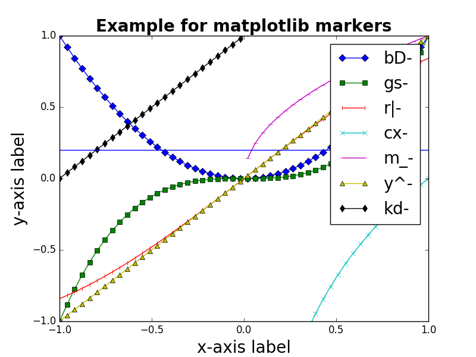
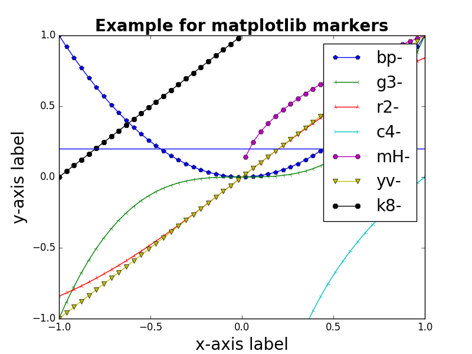
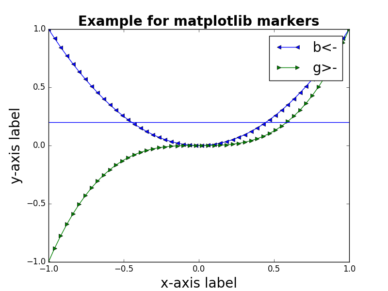

Matplotlib is a simple Python library to create plots like this one:

<figure class="wp-caption aligncenter img-thumbnail">
    
    <figcaption class="text-center">Validation curve of one model with ReLU and one with PReLU</figcaption>
</figure>

As I always have to look up different styles of markers / lines, here is a
little summary.


## Simple plots

Here is some sample code:

```python
#!/usr/bin/env python
# -*- coding: utf-8 -*-

"""Visualize matplotlib marker styles."""

import matplotlib.pyplot as plt
import numpy as np
from matplotlib.lines import Line2D

# Get colors / markers / functions
colors = ("b", "g", "r", "c", "m", "y", "k")
markers = []
for m in Line2D.markers:
    try:
        if len(m) == 1 and m != " ":
            markers.append(m)
    except TypeError:
        pass

f1 = lambda xs: [x ** 2 for x in xs]
f2 = lambda xs: [x ** 3 for x in xs]
f3 = lambda xs: np.sin(xs)
f4 = lambda xs: np.log(xs)
f5 = lambda xs: [x ** 0.5 for x in xs]
f6 = lambda xs: [x for x in xs]
f7 = lambda xs: [x + 1 for x in xs]
functions = [f1, f2, f3, f4, f5, f6, f7]

# Define the plot
plt.ylim(-1.0, 1.0)
plt.title("Example for matplotlib markers", fontweight="bold", fontsize=20)
plt.xlabel(r"""x-axis label""", fontsize=20)
plt.ylabel(r"""y-axis label""", fontsize=20)

# Define at which x positions to evaluate the functions f_i(x)
xmin = -1
xmax = 1
samples = 50
xs = np.linspace(xmin, xmax, samples)

# Plot the functions
for color, marker, f in zip(colors, markers, functions):
    format_str = "{color}{marker}-".format(color=color, marker=marker)
    plt.plot(xs, f(xs), format_str, label=format_str)

plt.axhline(y=0.20)
plt.legend(fontsize=20)

plt.savefig("matplotlib-marker-styles.png")  # or plt.show()
```


## Markers

Basically, the matplotlib tries to have identifiers for the markers which look
similar to the marker:

* Triangle-shaped: `v`, `<`, `>`, `^`
* Cross-like: `*`, `+`, `1`, `2`, `3`, `4`
* Circle-like: `o`, `.`, `h`, `p`, `H`, `8`

<figure class="wp-caption aligncenter img-thumbnail">
    
    <figcaption class="text-center">Markers 1</figcaption>
</figure>

<figure class="wp-caption aligncenter img-thumbnail">
    
    <figcaption class="text-center">Markers 2</figcaption>
</figure>

<figure class="wp-caption aligncenter img-thumbnail">
    
    <figcaption class="text-center">Markers 3</figcaption>
</figure>

<figure class="wp-caption aligncenter img-thumbnail">
    
    <figcaption class="text-center">Markers 4</figcaption>
</figure>


## Line Types

<figure class="wp-caption aligncenter img-thumbnail">
    
    <figcaption class="text-center">Matplotlib line styles</figcaption>
</figure>


## Documentation

* [matplotlib.markers](http://matplotlib.org/api/markers_api.html)
* [filledmarker_demo.py](http://matplotlib.org/1.3.0/examples/pylab_examples/filledmarker_demo.html)
* [matplotlib.lines](http://matplotlib.org/api/lines_api.html)
* [line_styles.py](http://matplotlib.org/1.3.1/examples/pylab_examples/line_styles.html)
