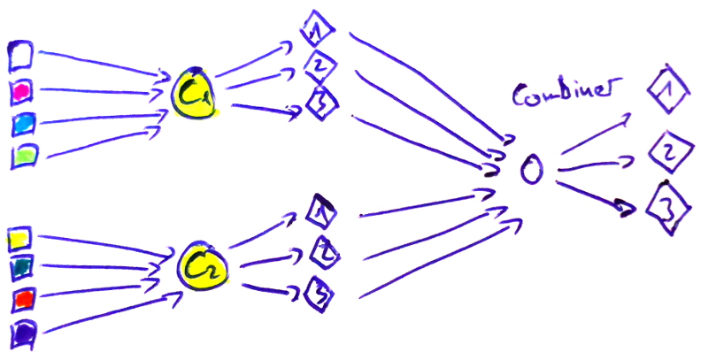
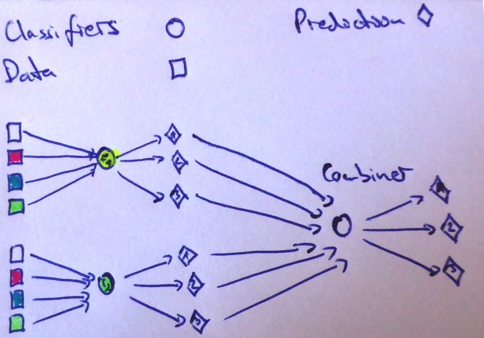

Models which are combinations of other models are called an **ensemble**.
The simplest way to combine several classifiers is by averaging their predictions.

For example, if you have three&nbsp;models and four&nbsp;classes, you might get
predictions like this:

```
model 1(x1) = [0.1, 0.5, 0.3, 0.1],
model 2(x1) = [0.5, 0.3, 0.1, 0.1],
model 3(x1) = [0.4, 0.4, 0.1, 0.1]
```

the ensemble predicts
$$\left [\frac{0.1+0.5+0.4}{3}, \frac{0.5+0.3+0.4}{3}, \frac{0.4+0.2+0.2}{3}, \frac{0.1+0.1+0.1}{3} \right] \approx \left [0.3, 0.4, 0.2, 0.1 \right ]$$ for $x_1$.

Note that this is different from pluarlity voting (PV) where every model gives
only one vote for the most likely class. In the case from above, it would be

```
model 1(x1) = [0, 1, 0, 0],
model 2(x1) = [1, 0, 0, 0],
model 3(x1) = [1, 0, 0, 0]  # tie - lets just take the first
```

So the plurality voting ensemble would predict class&nbsp;1, whereas the
average probability ensemble predicts class&nbsp;2. This comes from the fact
that everybody might have different first choices, but they might agree on the
second choice.

Please note that a tie in the predictions of a classifier with less than
100&nbsp;classes is unlikely due to the higher precision of floating point
numbers. However, a tie in votes can happen.

According to Andrej Karpathy, this gives you about +2 percentage points in
accuracy.


## Tiny Experiment on CIFAR 100

I've just tried this with three (almost identical) models for <a href="https://www.cs.toronto.edu/~kriz/cifar.html">CIFAR&nbsp;100</a>. All of
them were trained with <a href="https://arxiv.org/abs/1412.6980">Adam</a> with
the same training data (the same batches). Model 1 and model 3 only differed in
the second-last layer (one uses ReLU, the other tanh), model 1 and model 2 only
differed in the border mode for one convolutional layer (valid vs same).

The accuracies of the single models were:

```
model 1: 57.02
model 2: 61.85
model 3: 48.59
```

The ensemble accuracy is 62.98%. Hence the ensemble is 1.13 percentage points
better than the best single model!

Although I have read things like this before, it is the first time I actually
tried it myself.


## Ensemble Techniques

There are much more sophisticated ensemble techniques than simple averaging of
the output:

<dl>
    <dt><a href="https://en.wikipedia.org/wiki/Bootstrap_aggregating"><dfn id="bagging">Bagging</dfn></a></dt>
    <dd><i>How does it work?</i> Train models on different data
        (Learnier is fit, results are mean/median aggregated)<br/>
        <i>Why is it used?</i> Reduction of variance<br/>
        <i>Common techniques:</i>

        <ul>
            <li>Random subspaces: Take a part of the features (e.g. Random Forests)</li>
            <li>Pasting: Take a part of the training data without replacement</li>
        </ul>

    </dd>
    <dt><a href="https://en.wikipedia.org/wiki/Boosting_(machine_learning)"><dfn id="boosting">Boosting</dfn></a></dt>
    <dd><i>How does it work?</i> Train one classifier.
        Obtain the results. Weight the training data higher if the classifier got
        it wrong. Train a new classifier on the weighted training data. Iterate.<br/>
        <i>Why is it used?</i> Reduction of bias
        <i>Examples:</i> <a href="https://en.wikipedia.org/wiki/AdaBoost">AdaBoost</a>, <a href="https://en.wikipedia.org/wiki/Gradient_boosting">Gradient boosting</a>
    </dd>
    <dt><a href="https://en.wikipedia.org/wiki/Ensemble_learning#Stacking"><dfn id="stacking">Stacking</dfn></a></dt>
    <dd><i>How does it work?</i> Train $n$ classifiers on the data. Train
        a classifier on the predictions of the $n$ classifiers.<br/>
        <i>Why is it used?</i> Reduction of bias and reduction of variance</dd>
</dl>

I made some images to make this more clear:

<figure class="wp-caption aligncenter img-thumbnail">
    
    <figcaption class="text-center">Bagging trains the classifiers on different data.</figcaption>
</figure>

<figure class="wp-caption aligncenter img-thumbnail">
    
    <figcaption class="text-center">Boosting reweights the training data.</figcaption>
</figure>

<figure class="wp-caption aligncenter img-thumbnail">
    
    <figcaption class="text-center">Stacking trains the combiner.</figcaption>
</figure>


## Combiners

Some choices for combiners are:

* Average of predictions of base classifiers
* Plurality vote (sometimes also called majority vote)
* Learning
    * Naive Bayes
    * Neural Network


## See also

* [sklearn ensemble user guide](http://scikit-learn.org/stable/modules/ensemble.html)
* [Scholarpedia](http://www.scholarpedia.org/article/Ensemble_learning)
* MIT 6.034 Artificial Intelligence: [17. Learning: Boosting](https://www.youtube.com/watch?v=UHBmv7qCey4)
