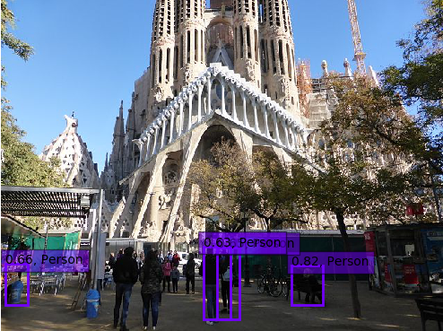
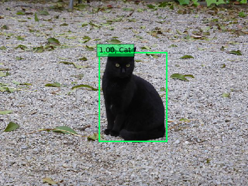
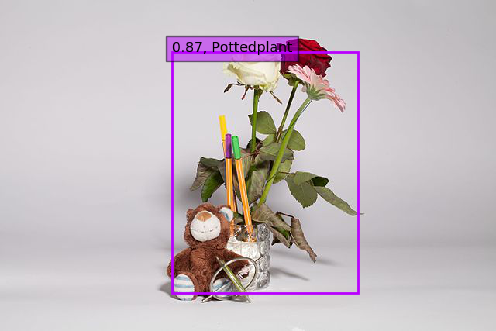
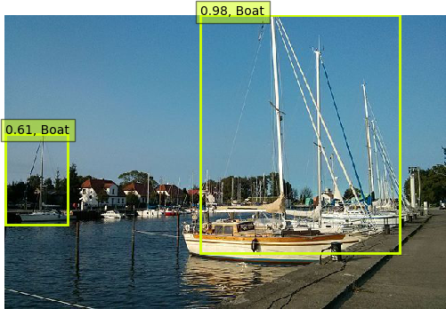
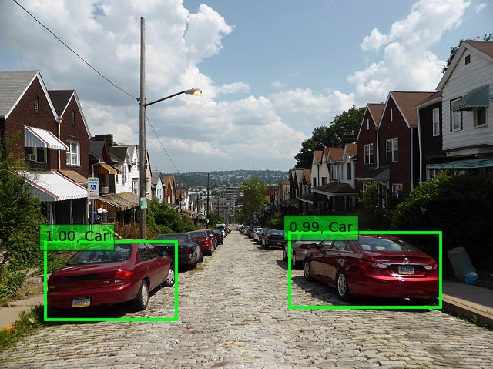

Object detection is the following task: You have an image and you want
axis-aligned bounding boxes around every instance of a pre-defined set of
object classes. The set of object classes is finite and typically not bigger
than 1000.

Here is an easy to use example


## Prerequisites

* [Tensorflow](https://www.tensorflow.org/install/)
    * [CUDA](http://askubuntu.com/q/799184/10425)
    * [CuDNN](http://askubuntu.com/q/767269/10425)
* [Keras](https://keras.io/#installation)
* [`weights_SSD300.hdf5`](https://mega.nz/#F!7RowVLCL!q3cEVRK9jyOSB9el3SssIA) (103.2MB, MD5: `9ae4b93e679ea30134ce37e3096f34fa`)
* `ssd.py` and `ssd_utils.py` from [github.com/rykov8/ssd_keras](https://github.com/rykov8/ssd_keras)


## Code

```
#!/usr/bin/env python

"""
Run object detection with VOC classes.

This is just a minor modification of code from
https://github.com/rykov8/ssd_keras
"""

from keras.applications.imagenet_utils import preprocess_input
from keras.preprocessing import image
import matplotlib.pyplot as plt
import numpy as np
from scipy.misc import imread
import sys

from ssd import SSD300
from ssd_utils import BBoxUtility


def create_overlay(img, results, voc_classes, plt_fname):
    """
    Create a visualization of the found objects in img.

    Paramters
    ---------
    img : numpy array
        Original array
    results : numpy array
        Found objects
    voc_classes : list of strings
        Names of the classes in Pascal VOC.
    plt_fname : string
        Path where the visualization gets stored.
    """
    plt.clf()
    # Parse the outputs.
    det_label = results[:, 0]
    det_conf = results[:, 1]
    det_xmin = results[:, 2]
    det_ymin = results[:, 3]
    det_xmax = results[:, 4]
    det_ymax = results[:, 5]

    # Get detections with confidence higher than 0.6.
    top_indices = [i for i, conf in enumerate(det_conf) if conf >= 0.6]

    top_conf = det_conf[top_indices]
    top_label_indices = det_label[top_indices].tolist()
    top_xmin = det_xmin[top_indices]
    top_ymin = det_ymin[top_indices]
    top_xmax = det_xmax[top_indices]
    top_ymax = det_ymax[top_indices]
    colors = plt.cm.hsv(np.linspace(0, 1, 21)).tolist()

    plt.imshow(img / 255.)
    currentAxis = plt.gca()
    currentAxis.axis('off')

    for i in range(top_conf.shape[0]):
        xmin = int(round(top_xmin[i] * img.shape[1]))
        ymin = int(round(top_ymin[i] * img.shape[0]))
        xmax = int(round(top_xmax[i] * img.shape[1]))
        ymax = int(round(top_ymax[i] * img.shape[0]))
        score = top_conf[i]
        label = int(top_label_indices[i])
        label_name = voc_classes[label - 1]
        display_txt = '{:0.2f}, {}'.format(score, label_name)
        coords = (xmin, ymin), xmax - xmin + 1, ymax - ymin + 1
        color = colors[label]
        currentAxis.add_patch(plt.Rectangle(*coords,
                                            fill=False,
                                            edgecolor=color,
                                            linewidth=2))
        currentAxis.text(xmin, ymin, display_txt,
                         bbox={'facecolor': color, 'alpha': 0.5})
    plt.savefig(plt_fname)


def main(img_paths):
    """
    Detect objects in images.

    Parameters
    ----------
    img_paths : list of strings
    """
    # Load the model
    voc_classes = ['Aeroplane', 'Bicycle', 'Bird', 'Boat', 'Bottle',
                   'Bus', 'Car', 'Cat', 'Chair', 'Cow', 'Diningtable',
                   'Dog', 'Horse', 'Motorbike', 'Person', 'Pottedplant',
                   'Sheep', 'Sofa', 'Train', 'Tvmonitor']
    NUM_CLASSES = len(voc_classes) + 1
    input_shape = (300, 300, 3)
    model = SSD300(input_shape, num_classes=NUM_CLASSES)
    model.load_weights('weights_SSD300.hdf5', by_name=True)
    bbox_util = BBoxUtility(NUM_CLASSES)

    # Load the inputs
    inputs = []
    images = []
    for img_path in img_paths:
        img = image.load_img(img_path, target_size=(300, 300))
        img = image.img_to_array(img)
        images.append(imread(img_path))
        inputs.append(img.copy())
    inputs = preprocess_input(np.array(inputs))

    # Predict
    preds = model.predict(inputs, batch_size=1, verbose=1)
    results = bbox_util.detection_out(preds)

    # Visualize
    for i, img in enumerate(images):
        create_overlay(img, results[i], voc_classes,
                       "{}-det.png".format(img_paths[i]))


def get_parser():
    """Get parser object."""
    from argparse import ArgumentParser, ArgumentDefaultsHelpFormatter
    parser = ArgumentParser(description=__doc__,
                            formatter_class=ArgumentDefaultsHelpFormatter)
    parser.add_argument("-f", "--file",
                        dest="filename",
                        help="Detect objects in image",
                        metavar="IMAGE")
    parser.add_argument("--folder",
                        dest="folder",
                        help="Detect objects in JPG images in folder",
                        metavar="FOLDER")
    return parser


if __name__ == "__main__":
    args = get_parser().parse_args()
    if args.folder is not None:
        import glob
        images = glob.glob("%s/*.jpg" % args.folder)
    elif args.filename is not None:
        images = [args.filename]
    else:
        args.print_help()
        sys.exit(0)
    main(images)

```


## Examples

<figure class="wp-caption aligncenter img-thumbnail">
    
    <figcaption class="text-center">St Josep La Boqueria</figcaption>
</figure>

<figure class="wp-caption aligncenter img-thumbnail">
    
    <figcaption class="text-center">Sagrada Familia</figcaption>
</figure>

<figure class="wp-caption aligncenter img-thumbnail">
    
    <figcaption class="text-center">Cat</figcaption>
</figure>

<figure class="wp-caption aligncenter img-thumbnail">
    
    <figcaption class="text-center">Barcelona</figcaption>
</figure>

<figure class="wp-caption aligncenter img-thumbnail">
    
    <figcaption class="text-center">EmiMa-079</figcaption>
</figure>

<figure class="wp-caption aligncenter img-thumbnail">
    
    <figcaption class="text-center">EmiMa-100</figcaption>
</figure>

<figure class="wp-caption aligncenter img-thumbnail">
    
    <figcaption class="text-center">EmiMa-103</figcaption>
</figure>

<figure class="wp-caption aligncenter img-thumbnail">
    
    <figcaption class="text-center">EmiMa-105</figcaption>
</figure>

<figure class="wp-caption aligncenter img-thumbnail">
    
    <figcaption class="text-center">Ryck</figcaption>
</figure>

<figure class="wp-caption aligncenter img-thumbnail">
    
    <figcaption class="text-center">Pittsburgh</figcaption>
</figure>


## Conclusion

The person detector is somewhat useful out-of-the-box, but for the rest you
will need to adjust the algorithm. Having only the 20&nbsp;classes from Pascal
VOC is not enough.
