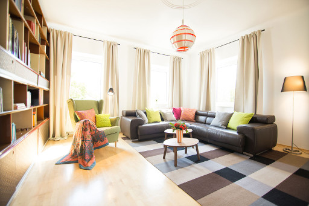
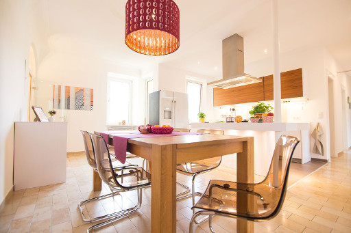
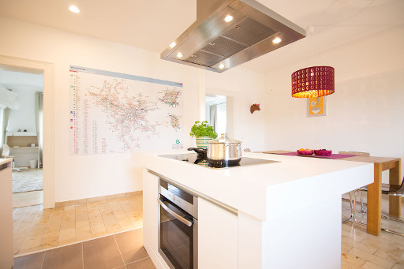
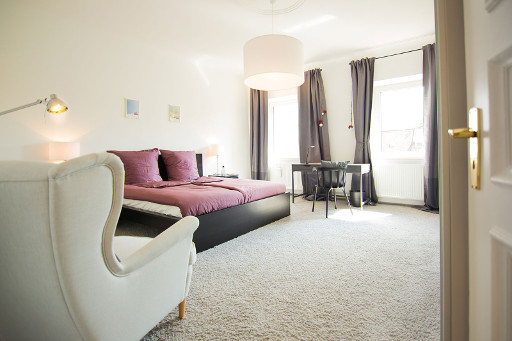
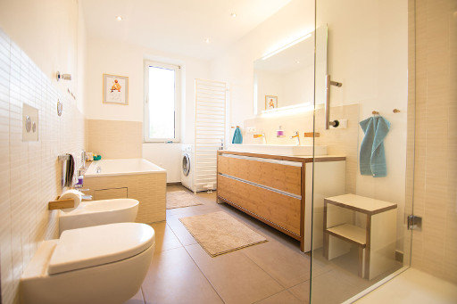
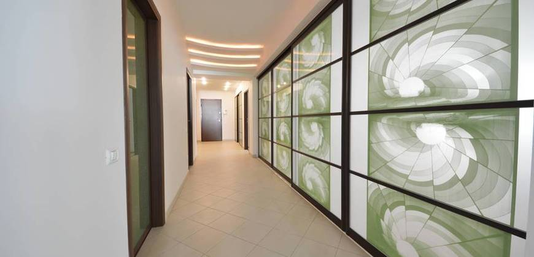
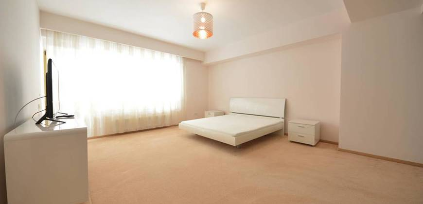
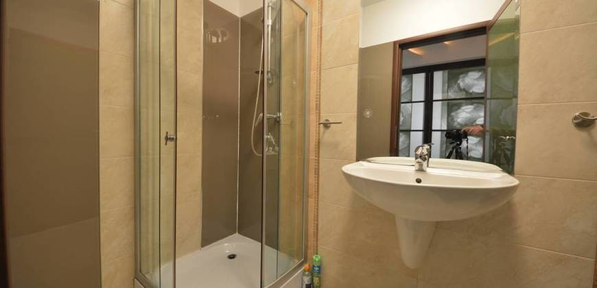

I am currently searching for a flat in Munich. While doing so, I've seen (and
contacted) three scammers. As most of the communication is in German, I will
continue this article in German. You can use <a href="https://translate.google.com/?hl=de">Google Translate</a>.


## Betrügerische Nachrichten

### Wohnung 1

Inserat auf immonet.de:

<pre>
Miete zzgl. NK:    393 €
Wohnfläche:    ca. 55 m²
Objekt-ID:
Immonet-Nr.:    30652500

80538 München , Kanalstrasse 6

www.immonet.de/angebot/30652500
</pre>

Von Dr. S. Ch. Ku <code>s.ch.ka71@gmail.com</code>.

<pre>
Hallo,

Danke für Ihr Interesse meine Wohnung zu mieten. Mein Deutsch ist sehr schlecht, ich würde schätzen, wenn wir in Englisch sprechen können.
Ich möchte mich vorstellen auch. Mein Name ist Sandra Christina Kutson und ich bin ein 46-jährige Arzt aus Manchester / Großbritannien.

Die Wohnung, die ich von meinem Großvater, der vor 2 Jahren gestorben vererbt.
Auch habe ich zwei kinder, aber nach wenigen gesprächen mit ihnen, wird niemand kommen in Deutschland zu bleiben, so möchte ich die wohnung für einen beliebigen zeitraum zu mieten (ab 1 monat bis 20 jahre oder mehr). Doch selbst nehme ich die entscheidung, nach Deutschland nicht zurück, ich möchte nicht, die wohnung zu verkaufen.
Die Wohnung befindet sich auf Kanalstrasse 6, 80538 München, ist komplett möbliert und vor kurzem renoviert, wie man auf den Fotos sah.
Die Wohnung befindet sich im zweiten Stock und das Gebäude ist in sehr gutem Zustand und haben auch Zugang zum Aufzug.

Dies ist ein 2 zimmer wohnung (1 Schlafzimmer, 1 Bad, 1 Küche, 1 Wohnzimmer, 1 Keller) mit einer Gesamtfläche von 55m ². Die Wohnung ist ausgestattet mit: Klimaanlage, Waschmaschine, Staubsauger, Haartrockner, Herd, Flatiron, Mikrowelle, Grill, Toaster, Mixer, Kühlschrank, Kaffeemaschine, LED-TV, DVD-Player, usw.
Die Nebenkosten (Heizkosten, Strom, Gas, Wasserkosten, Müllabfuhr, Grundsteuer, Gebäudeversicherung, Internet, Kabel-TV und Parkplatz) ausgestattet sind, in der "Warmmiete" enthalten von 393 EUR / Monat. Ich will eine "Kaution" von 393 Euro, rückzahlbar, wenn Sie sich bewegen (ich muss zu verlassen innerhalb von 30 Tagen wissen).
In der Zwischenzeit können Sie bestätigen Sie bitte die folgenden Schritte aus:

· Wie viele Menschen auf dem Grundstück leben würden?
· Wann möchten Sie sich zu bewegen? (Check-in Datum)
· Welche Begriff / Länge mieten möchten Sie?
· Haben Sie Haustiere?
· Wann sind Ihre am besten geeigneten Zeiten / Tage, um die Immobilie zu sehen?

Bei Interesse weiter, mir bitte einige Informationen über sich selbst geben (Alter, Beruf, Lebensstil oder was auch immer denken Sie macht einen guten Mieter).
Ich hoffe, dass die E-Mail nicht zu lang war, Ich mag möglichst gründlich.

Freundliche Grüße aus Großbritannien!

PS: Ich akzeptiere keine JobCentre.
</pre>

### Wohnung 2

Inserat:

<pre>
Miete zzgl. NK:    350 €
Wohnfläche:    ca. 105 m²
Objekt-ID:
Immonet-Nr.:    30651870

80336 München - Ludwigsvorstadt-Isarvorstadt, Stielerstrasse 3

www.immonet.de/angebot/30651870
</pre>

E-Mail von <code>Gregory Barnett &lt;gregorybarnett90@hotmail.com&gt;</code>

<pre>
Hallo,

Vielen Dank für Ihr Interesse an meiner 3 zimmer Wohnung.
Sie hat eine Wohnfläche von 105 m², 2 Schlafzimmer, ist vollständig möbliert und wurde vor kurzem renoviert.
Hier finden Sie einige Fotos: http://imgur.com/a/c1Qav
Die Immobilie kann auch unmöbliert gemietet werden, in diesem Fall sorge ich für den Abtransport und die Lagerung der Möbel.
Die Wohnung hat eine Klimaanlage, Geschirrspüler, Herd, Kühlschrank / Gefrierschrank, Waschmaschine, LED-TV, Staubsauger etc.
Die Nebenkosten (Wasser, Strom, Internet, Kabelfernsehen) sind in der Miete von 350 € bereits enthalten und werden monatlich automatisch von meinem Konto beglichen.
Wie Sie sehen können, die Miete ist sehr erschwinglich. Ich bin nicht die Wohnung für einen Gewinn zu mieten. Ich ziehe jemanden zu haben, es verwenden, anstatt es leer zu halten.
Die Kaution in Höhe von 450 € wird Ihnen bei Auszug erstattet (eine Anmeldung 30 Tage im Voraus ist dafür nötig).
Haustiere sind erlaubt, sofern sie keinen ernsten Schaden anrichten.

Nun ein bisschen zu meiner Person: Mein Name ist Gregory Barnett und ich bin Bauingenieur aus Grossbritannien.
Ich habe die Wohnung gekauft und renoviert, als ich 2014 für 10 Monate in Deutschland gelebt und gearbeitet habe.
Nun bin ich dauerhaft wieder in England, suche also einen zuverlässigen Mieter. Am besten wäre ein Vertrag von langer Dauer, muss aber nicht unbedingt so sein.
Leider kann ich in den nächsten Monaten aus beruflichen und gesundheitlichen Gründen nicht mehr ins Ausland reisen, kann Sie daher auch nicht sofort persönlich treffen.
Daher habe ich eine örtliche Immobilienagentur mit großer Erfahrung im Bereich internationaler Vermietungen beauftragt, den ganzen Vorgang abzuwickeln.
Die Kosten dafür werde ich vollständig übernehmen.
Also, wenn Ihnen das zusagt, lassen Sie mich wissen, mit wie vielen Personen Sie beabsichtigen, einzuziehen und für welchen Zeitraum.
Über nähere Informationen zu Ihrer Person würde ich mich außerdem sehr freuen.
Sie können in Englisch oder Deutsch antworten.

Viele Grüße und einen schönen Tag noch!
</pre>

Da die Bilder von ImgUr eventuell verschwinden habe ich sie hier mal in
niedriger Auflösung kopiert:

<figure class="wp-caption aligncenter img-thumbnail">
    
</figure>

<figure class="wp-caption aligncenter img-thumbnail">
    
</figure>

<figure class="wp-caption aligncenter img-thumbnail">
    
</figure>

<figure class="wp-caption aligncenter img-thumbnail">
    
</figure>

<figure class="wp-caption aligncenter img-thumbnail">
    
</figure>

<figure class="wp-caption aligncenter img-thumbnail">
    
</figure>

<figure class="wp-caption aligncenter img-thumbnail">
    
</figure>

<figure class="wp-caption aligncenter img-thumbnail">
    
</figure>

<figure class="wp-caption aligncenter img-thumbnail">
    
</figure>

<figure class="wp-caption aligncenter img-thumbnail">
    
</figure>

<figure class="wp-caption aligncenter img-thumbnail">
    
</figure>

<figure class="wp-caption aligncenter img-thumbnail">
    
</figure>

<figure class="wp-caption aligncenter img-thumbnail">
    
</figure>

Meine Antwort:

<pre>
Dear Mr. Barnett,

I can't find the advertisement for the flat. As I send a couple of requests I'm
not quite sure about which one you're talking. Could you please send me the
link to it? (or at least the address)

I am seeking a flat only for myself. I am a software engineer and I want to
rent the flat from the beginning of June. Right now, I don't know how long I
will stay but likely for several years.

Best regards (and get well soon),
Martin
</pre>

Antwort "Mietverfahren" von <code>Gregory Barnett &lt;gregorybarnett90@gmail.com&gt;</code>

<pre>
Thank you for replying,

The property is managed by Chelsea Homes, a local real estate agency,
specialized in international transactions. Their website is:
www.chelsea-homes.co.uk .
They will arrange a viewing for you, and handle the payments and contract. Also
if you have any questions, feel free to contact them anytime you need, because
I might not always be available. You can find their details on the Contact page
of their website.

Now here's how the rental works:

1. First you need to register with the agency at:
   www.chelsea-homes.co.uk/register.html by entering your details in the form
   and clicking SUBMIT.
2. I'll drop off 2 sets of keys and the necessary paperwork at their office
3. The agency will email you the invoice for the first rent (350€)+ Kaution
   (450€). This is just to reserve the property, and not a final commitment of
   course,. Once you've made the payment, the agency will book the viewing for
   you, and within 1-2 days, one of their agents will meet you in Germany to
   show you the property and help you with all the formalities.
4. After the viewing, if you're satisfied with the place you will sign a
   contract with the agent and receive the keys so you can move in. However if
   you don't like the apartment, for whatever reason, you will have no
   obligations and the full payment will be refunded by the agent immediately.
   The whole procedure shouldn't take more than 3 days in total.

I'm paying for the services of the agency, so there will be no extra costs for
you. Also, in case you're tied up in another contract and cannot move in
immediately, we can arrange the viewing now, and reserve the apartment for you.
Since we're unable to meet in person I've attached a copy of my passport, so
you can have a reference of your potential landlord.

Please consider my offer and let me know if we have a deal, because there are
several others interested in the apartment, and I need to make a decision soon.

Have a great day!

---------------------------------------------------
Gregory Barnett
</pre>

Er hat auch "seinen" Reisepass in den Anhang getan:

<pre>
Passport No: 209742387
Name: Gregory Barnett
P&lt;GBRGREGORY&lt;BARNETT&lt;&lt;&lt;&lt;&lt;
2097423878GBR7912207M1904286&lt;&lt;&lt;&lt;&lt;&lt;&lt;&lt;&lt;02
</pre>

<figure class="wp-caption aligncenter img-thumbnail">
    
    <figcaption class="text-center">Gregory Barnett</figcaption>
</figure>

Mal schauen was / wer sich hinter chelsea-homes.co.uk steckt:

```
whois chelsea-homes.co.uk

    Domain name:
        chelsea-homes.co.uk

    Registrant:
        Chelsea Homes Group Ltd.

    Trading as:
        CHELSEA HOMES GROUP LTD

    Registrant type:
        UK Limited Company, (Company number: 10358460)

    Registrant's address:
        78 Golders Green Road
        London
        02081444194
        NW11 8LN
        United Kingdom

    Data validation:
        Nominet was able to match the registrant's name and address against a
        3rd party data source on 21-Feb-2017

    Registrar:
        eNom LLC [Tag = ENOM]
        URL: http://www.enom.com

    Relevant dates:
        Registered on: 21-Feb-2017
        Expiry date:  21-Feb-2018
        Last updated:  24-Feb-2017

    Registration status:
        Registered until expiry date.

    Name servers:
        dns1.namecheaphosting.com
        dns2.namecheaphosting.com

    WHOIS lookup made at 09:28:03 06-Apr-2017

```

Mit <a href="https://beta.companieshouse.gov.uk">companieshouse.gov.uk</a> kann
man noch mehr Informtionen ermitteln:

<pre>
Registered office address: Office 35 78 Golders Green Road, London, United Kingdom, NW11 8LN
Nature of business (SIC) : 68100 - Buying and selling of own real estate
Company type             : Private limited Company
Incorporated on          : 5 September 2016
Company Director 1       : Mr Hanan Shapira
    Date of Birth        : **/01/1969
    Nationality          : Romanian
Company Director 2       : Mr Oded Loulay
    Date of Birth        : **/06/1980
    Nationality          : British
</pre>

Sucht man nach dieser Firma, findet man <a href="https://wohnungsbetrug.blogspot.de/2017/03/beware-of-scammers-fake-site-chelsea.html">wohnungsbetrug.blogspot.de</a> mit
genau diesen Daten. Naja, egal. Mal schauen wie viel Spaß man mit Betrügern
haben kann.

Meine Antwort:

<pre>
Dear Mr. Barnett,

Your flat looks really gorgeous and I really want it, but I'm also a bit unsure about scams.

Before I register to this site I don't know, could you please help me to trust
you? You could, for example, take a photo of yourself holding up a sign with
your name and the current data (or a recent newspaper). Alternatively, you
could send me 10 Euro to https://www.paypal.me/MartinThoma so that I know it is
actually your passport.

Best regards,
Martin
</pre>


### Wohnung 3

Inserat:

<pre>
Miete zzgl. NK:    350 €
Wohnfläche:    ca. 90 m²
Objekt-ID:
Immonet-Nr.:    30652495

80807 München - Milbertshofen-Am Hart, Leopoldstr. 188 80807 München Schwabing
</pre>

Von <code>claudia Marsik &lt;claudiaosterrich@outlook.com&gt;</code> mit
<code>denisewalter@ymail.com</code> im CC

<pre>
Hallo,

Danke für Ihr Interesse , Ich kaufte diese Wohnung für meinen Sohn während
seines Studiums , aber jetzt ist er wieder zu Hause in Großbritannien
dauerhaft, so dass ich die Vermietung der Ort für unbegrenzte Zeit. Bevor wir
weiter gehen, möchte ich etwas über Sie wissen , wie zB wie viele Personen Sie
beabsichtigen, in der Wohnung leben, was ist Ihre Aufgabe Wie alt bist du und
für wie lange Sie bleiben Die Wohnung ist genau wie auf den Bildern, voll
möbliert ausgestattet und renoviert in diesem Jahr. Auch sehr wichtige, die
Versorgungsunternehmen Wasser, Strom, Heizung, Gas, Internet, TV-Kabel,
Spülmaschine, Müllabfuhr, sind im Preis von 350 Euro pro Monat inklusive und
ich glaube, es bequem für uns beide ist. Alle Rechnungen werden von mir bezahlt
werden und Sie nur das Geld für die Miete im Monat zahlen. Die Kaution ist auch
350 €, und Sie bekommen es zurück wenn Sie sich entscheiden, die Wohnung zu
verlassen ( Sie haben mir mindestens 1 Monat Kündigungsfrist zu geben ). Sie
können meine Möbel verwenden, oder Sie können auch Ihre eigenen verwenden, wenn
Sie bevorzugen. Ich bin ein Neuro-Onkologie Arzt aus Großbritannien. Ich kann
Vorkehrungen, um die Wohnung von hier aus schnell und einfach mieten machen .
Ich freuen, bald von Ihnen zu hören.

Hab einen schönen Tag!
</pre>

Meine Antwort:

<pre>
Dear Mrs. Marsik,

We can also communicate in English if that is more comfortable for you.

I want to live alone in the flat. I am 27 years old, a software engineer and I
hope to stay in Munich for several years.

I can't find the link to the flat. Could you please send it to me again?

Best regards,
Martin

P.S.: Who is Denise Walter?
</pre>

Die Antwort von "claudia Marsik" (diesmal mit <code>Marsik &lt;Marsikclaudia@t-online.de&gt;</code>) waren nur ein paar Bilder:

<figure class="wp-caption aligncenter img-thumbnail">
    
</figure>

<figure class="wp-caption aligncenter img-thumbnail">
    
</figure>

<figure class="wp-caption aligncenter img-thumbnail">
    
</figure>

<figure class="wp-caption aligncenter img-thumbnail">
    
</figure>

<figure class="wp-caption aligncenter img-thumbnail">
    
</figure>

<figure class="wp-caption aligncenter img-thumbnail">
    
</figure>

<figure class="wp-caption aligncenter img-thumbnail">
    
</figure>

<figure class="wp-caption aligncenter img-thumbnail">
    
</figure>

<figure class="wp-caption aligncenter img-thumbnail">
    
</figure>

Meine Antwort:

<pre>
Thank you for the nice images. The flat loos gorgeous! Could you please tell me
the adress of it again? (I want to live quite central in Munich)
</pre>


### Wohnung 4

Via `immonet` from `Анастасия Бондарь <anastasiia.bondar@amls.email>`:

```
Hello,

I am in search of persons to rent my apartment, to use and be a responsible
loyal tenant to stay in there for minimum 2 months and max 5 years, could
either be students or workers. My apartment is still available, it was rented
by some students and now they left. It is already furnished with all basic
stuff, as well as the kitchen is also fully equipped with all you need daily
incl. a dishwasher, washing machine, dryer, tv.

The price for my apartment includes all extra costs (electricity, heating, hot
water, internet), the total monhtly rent is 550,00 EUR. You can use my
furniture, or you can also use your own if you prefer.

Foto's: postimg.org/gallery/xgakskw8/
Address of apartment is: Nordendstrasse 2, 80799 München.

I am looking forward to hearing from you.
Thanks
Anastasiia Bondar.
```

My answer:

```
Hello Anastasiia,

that sounds good! When can I have a look at the apartment? (I'm currently in
Karlsruhe; the soonest I could come is on Sunday. Otherwise, I can come at any
time / day)

Best regards,
Martin
```

Scammer reply:

```
Hello,

My apartment was rented through Uniplaces agency by some students and now they
left. So, my apartment is available for rent. You can rent for more than 5
years , there is no problem because we can renew our contract. Don't matter if
you are student or not, you can book through Uniplaces.

I would like to use Uniplaces again because they are currently managing my
property. Once you will confirm the booking on Uniplaces you will check the
property.

Using Uniplaces system both parties are fully protected, because they will hold
the funds until you will sign the rental contract.

Let me explain you the process step by step for a better understanding:

- I will list the property on Uniplaces for EUR 550 per month with bills
  included . The rental contract can be made for at least 2 months - up to 5
  years.

- You will have to pay 2 months deposit ( EUR 1100) to Uniplaces in order to
  confirm your booking. This 2 months deposit covers ( 1 months of rent + 1
  month security deposit)

- All the taxes and bills are included in the rental price; It includes also 1
  parking places;

- Like mentioned several times a viewing before booking is not possible since
  I'm not there, but Uniplaces is guaranteeing the whole transaction between
  us. In case something gets damaged, you can deduct the amount from the rental
  price, of course with a bill attached.

If everything sounds good to you, I'll be able to send you the Uniplaces
listing so you can book it at your convenience.

Also, in case you have another apartment right now, and you can't move
immediately, we can make the agreement as explained here, and consider it only
an inspection and reservation until you are able to move there.

I am looking forward to hearing from you.

Best Regards ,
Anastasiia Bondar
```


## Scam entlarven

* Bilder über <a href="https://www.tineye.com/">tineye.com</a> oder andere
  Reverse-Image Search Engines suchen. Wenn man dieselben Wohnungsbilder unter
  anderen Adressen sieht, weiß man was Sache ist.
* Preisvergleich: Wenn es zu günstig wird, wäre ich vorsichtig
* Fotos anschauen: Die Fotos die ich bekommen habe sehen zu professionel aus
* Nichts vorher zahlen: Insbesondere wurde mir abgeraten etwas nach
  Großbritannien oder über Western Union zu überweisen.


## Scam melden

* <a href="https://support.google.com/mail/answer/8253?hl=en">Googlemail</a>

Sonst habe ich leider recht wenige Möglichkeiten gesehen. Eigentlich hätte ich
erwartet, dass man die E-Mail Konten ziemlich leicht melden kann, die Accounts
bei den Wohnungsbörsen sofort gesperrt werden und man eine Untersuchung der
Polizei einleiten kann. Bei der Polizei bin ich noch und habe auch schnell den
Rat bekommen mich auf keinen Fall zu registrieren / Geld zu überweisen, aber
sonst scheint mir das Interesse nur gering zu sein. Naja, mal schauen. Ich
werde den Artikel jedenfalls aktuell halten.
