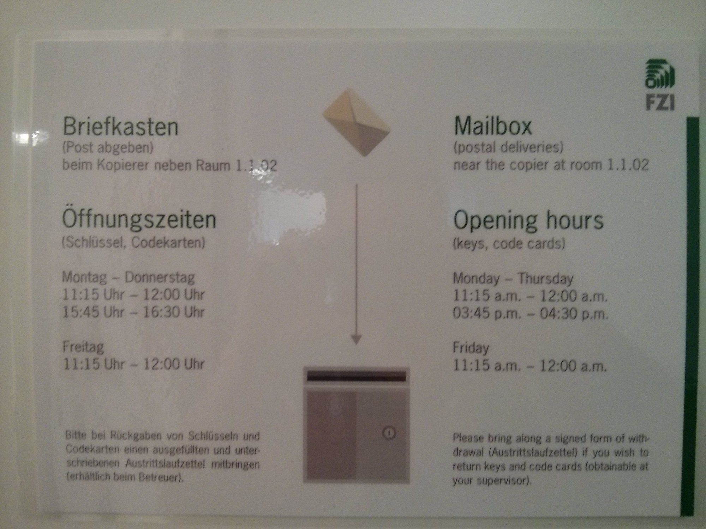

If you are writing your Bachelor's or Master's thesis or if you're a HiWi at [FZI](https://en.wikipedia.org/wiki/Forschungszentrum_Informatik), you might find the following useful.


## OpenVPN

1. Download the `client.ovpn` from the website your advisor gives you. This
   website can only be accessed outside of FZI and needs to be accessed by
   `https://` - `http://` does not work.
2. Run it with `sudo openvpn --config client.ovpn`
3. Verify it with `ifconfig` - there should be `tun0`


## WLAN

* Wi-Fi Security: WPA & WPA2 Enterprise; PEAP; No CA certificate required; MSCHAPv2
* IPv4: Automatic (DHCP)
* IPv6: Ignore


## Python Virtualenv

You don't have root access. However, you can install Python packages via
virtualenv (at `nobackup` - you don't need this to be backed up and you want
to have fewer limitations on your venv size):

```shell
$ mkdir ml-venv
$ cd ~/ml-venv
$ virtualenv ml
$ source ml/bin/activate
```

Add the `source ml/bin/activate` (with the absolute path) to your `~/.bashrc`.
Now you can use `pip install ...` to install whatever you need in which version
you need.


## cuDNN

Add

```bash
export LD_LIBRARY_PATH=/fzi/ids/thoma/nobackup/cuda/lib64/
```

to your `~/.bashrc`. If that doesn't exist anymore, just download cuDNN and
adjust the path to the `lib64` folder.


## Blame users

With `nvidia-smi` you can see which processes currently use the graphics card:

```text
Thu Apr 13 19:14:50 2017
+-----------------------------------------------------------------------------+
| NVIDIA-SMI 361.93.02              Driver Version: 361.93.02                 |
|-------------------------------+----------------------+----------------------+
| GPU  Name        Persistence-M| Bus-Id        Disp.A | Volatile Uncorr. ECC |
| Fan  Temp  Perf  Pwr:Usage/Cap|         Memory-Usage | GPU-Util  Compute M. |
|===============================+======================+======================|
|   0  GeForce GTX 980 Ti  On   | 0000:01:00.0      On |                  N/A |
| 53%   83C    P2   255W / 250W |   5621MiB /  6083MiB |     93%      Default |
+-------------------------------+----------------------+----------------------+

+-----------------------------------------------------------------------------+
| Processes:                                                       GPU Memory |
|  GPU       PID  Type  Process name                               Usage      |
|=============================================================================|
|    0      2473    G   /usr/bin/X                                      24MiB |
|    0     32756    C   ./caffe                                       5591MiB |
+-----------------------------------------------------------------------------+
```

But it doesn't tell you how long the process has already been running and which user
started it. With

```shell
$ ps -p 32756 -o user -o time
```

(replace 32756 by the process ID, of course) you can find the user name and how
long the process has been running.


## Send files

See [Linux Commands for Working from home](../linux-commands-for-working-from-home/)
and [How to copy files from one machine to another using ssh](https://unix.stackexchange.com/a/106482/4784).

Copy `foo.txt` from localhost to a remote host:

```shell
$ scp foo.txt yourusername@remotehost.com:/home/remote/dir
```


## Disk usage

```shell
$ quota -s -u user1
$ df -h .
$ du -h .
```

## SSH / screen

* [How do I force detach Screen from another SSH session?](http://stackoverflow.com/q/20807696/562769)
* [Kill detached screen session](http://stackoverflow.com/a/1509764/562769)

## Misc

* `top` or `htop` for showing processes / who uses much memory / CPU
* [How to use Sublime Text via SSH](../sublime-via-ssh/)
* `users` to see who is currently logged in.


## Personalabteilung

If you want to get your money back from the code card, you have to go to the
"Personalabteilung". They have very limited opening times:

<figure>
    <a href="../images/2017/06/fzi-opening-times.jpg"></a>
    <figcaption>Opening times of FZI</figcaption>
</figure>
