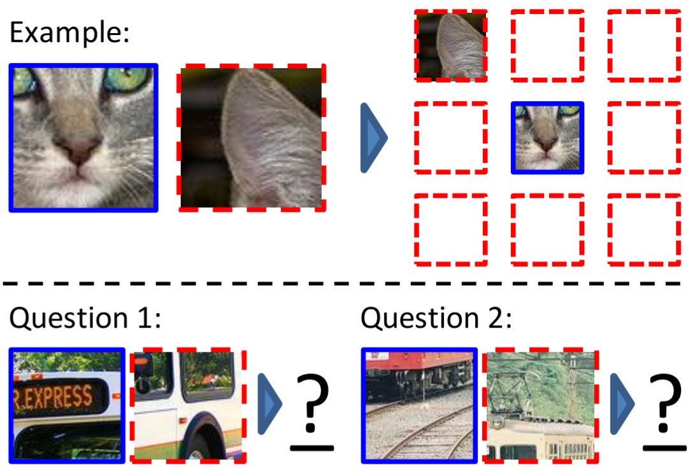
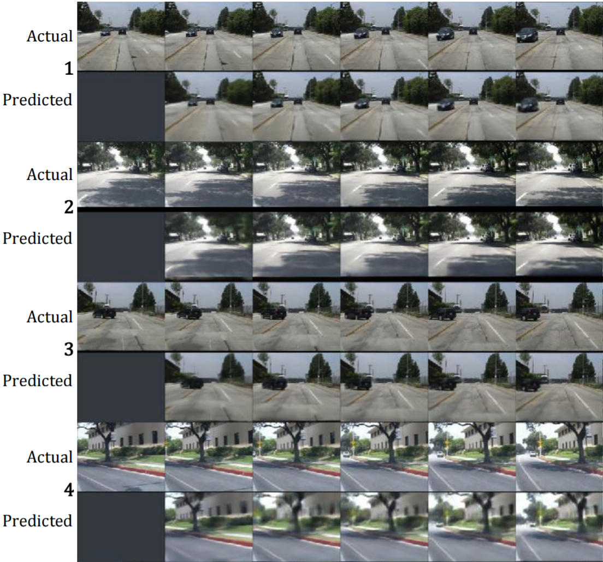

Neural networks have thousands, often millions of parameters. They take
hundrets of features and predict thousands of classes. The features can often
not be seen independantly, but have to be taken as a whole into consideration.
Most parameters are not independant either. And still, we use only on the order
of several ten-thousand to a million data points to optimize the millions of
parameters in a network. We know that more labeled data leads to better
results, but labeling is costly. Obtaining more data, however, is comparatively
cheap. Hence we want to use the unlabeled data to learn good features. The
complete process is semi-supervised and works as follows:

1. **Unsupervised training**: Train a neural network with unlabeled data
2. **Network modification**: Change something in the network. Often, the output
   layer is adjusted.
3. **Supervised training**: Train the neural network with labeled data

In the following, I will introduce all unsupervised training methods I know.

## Auto-Encoders

The idea of an auto-encoder is to restore the input. Hence it has to have an
output layer which is capable of doing so. This means you have to choose your
activation function carefully and probably normalize the range of values of the
input. For example, if your inputs have negative values you cannot use the
logistic function or ReLU. If it doesn't sum to one, you can't use softmax. If
the range of values is outside of [-1, 1], you can't use most of the activation
functions.

Also, you have to make sure the shape of the output is the same as the input.

After that, you have multiple options:

1. Bottleneck features: You can force the auto-encoder to learn a feature
   reduction by introducing a bottleneck. After the training is finished,
   everything after the bottleneck could be removed.
2. Restauration: The input of the network is changed in some way which has to
   be restored by the network. This could be white noise, Gaussian noise, or
   completely removing some parts of the image (as done in [Context Encoders: Feature Learning by Inpainting](http://www.cv-foundation.org/openaccess/content_cvpr_2016/papers/Pathak_Context_Encoders_Feature_CVPR_2016_paper.pdf)). Look for "denoising auto-encoder".

Literature:

* Jonathan Masci, Ueli Meier, Dan Ciresan, and Jürgen Schmidhuber: [Stacked Convolutional Auto-Encoders for Hierarchical Feature Extraction](http://people.idsia.ch/~masci/papers/2011_icann.pdf)

## Crop position prediction

If you have a CNN and images as input, crop it into 9 pieces which are loosely
placed in a grid over the image (with some variable padding). Give the network
the middle crop and randomly one of the 8 others. The network has to predict
which crop it got. Hence the network has 8 output units.

<figure class="wp-caption aligncenter img-thumbnail">
    
    <figcaption class="text-center">Predict the position of an image crop Image source: <a href="https://arxiv.org/pdf/1505.05192.pdf">Unsupervised Visual Representation Learning by Context Prediction</a></figcaption>
</figure>

Literature:

* Carl Doersch, Abhinav Gupta, Alexei A. Efros: [Unsupervised Visual Representation Learning by Context Prediction](https://arxiv.org/abs/1505.05192)

## Order

I could imagine that you could do something similar to the crop position
prediction with time series data. For example, if you have audio data you could
give the network two samples and let it predict which one comes first.

Or if you have a video, you can predict the next frame. See [Deep Predictive Coding Networks for Video Prediction and Unsupervised Learning](https://arxiv.org/abs/1605.08104).

<figure class="wp-caption aligncenter img-thumbnail">
    
    <figcaption class="text-center">Predict the next frame of a video. Image source: <a href="https://arxiv.org/abs/1605.08104">Deep Predictive Coding Networks for Video Prediction and Unsupervised Learning</a></figcaption>
</figure>

## Weakly Supervision

The more detailed / high quality labels are, the more expensive. For example,
it is often simpler to classify one complete image than to assign a class label
to each pixel of the image. But you can build models for semantic segmentation
without having a single image which was semantically labeled.

This is what I call *weak supervision*.

Another example is counting: You have many images of street scenes. Each image
has the number of cars in that image as a label. The idea is that a neural
network should learn a car classifier from this information.

I think I have seen something similar before, but I don't remember where (NIPS 2016?)

## More

I have seen [Discriminative Unsupervised Feature Learning with Convolutional Neural Networks](https://papers.nips.cc/paper/5548-discriminative-unsupervised-feature-learning-with-convolutional-neural-networks.pdf) but I didn't understand what they are doing. They take a random patch of one image, apply random data augmentations
to that image and assign it a (random) class. How is that supposed to help?
