Most people think about really fancy things when they hear "design". Some think
about Apple products, websites or art.

When I say design, I mean it as a very general concept. For this article, I
mean usability. How to structure things. And things could be websites or phones,
but also anything else.

> Usability is the ease of use and learnability of a human-made object.

Source: [Wikipedia](https://en.wikipedia.org/wiki/Usability), 2014

This article is mainly an exercise for me to keep my eyes open and recognize
good and bad designs in the wild.

## Cities

Company buildings / stores should be placed towards streets. So people can
easily see them. Living spaces should be in buildings in the back.

### Traffic Lights

Pedestrians often choose to ignore traffic lights because it just takes too
long. The design company relogik has developed a nice solution to help people
to be patient: Show them how long it will take until it gets green.
(I think the design is for cars, but I don't know any car driver who ignores
a red light. So I think one could adapt it for pedestrians.)

<figure>
    <a href="../images/2014/10/eko-traffic-light-design-relogik.jpg">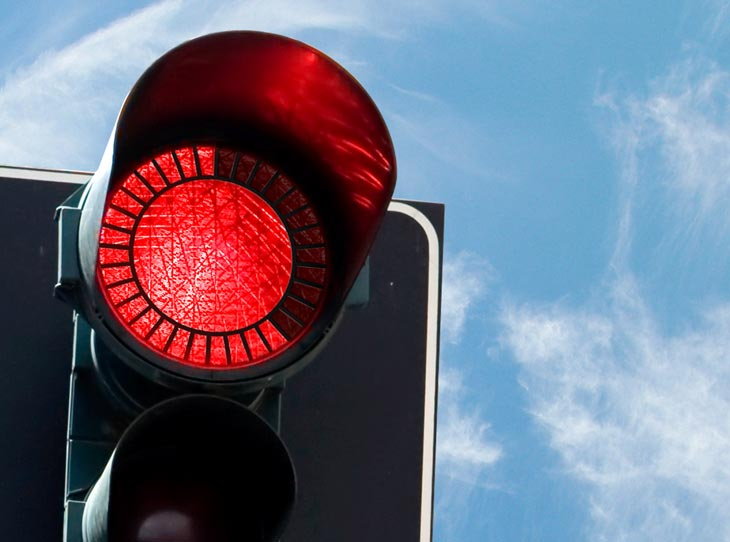</a>
    <figcaption>Traffic light design by relogik (<a href="http://relogik.com/eko">relogik.com/eko</a>)</figcaption>
</figure>

## Public Buildings

### Floor plans

* Having the plan right at the entrance of the building
* A big red dot which indicates the current position. Nothing else should be
  red. Below the dot, there should be a text "you are here".
* If the building has multiple floors, all floorplans should be right at the
  entrance. An alphabetically sorted index of rooms should point to the floor
  in which that room is.
* Rooms should have a common naming scheme. For example, `XYY` where X is the
  floor number and `YY` is an increasing number. `123` should be right below
  `223` and `123` should be followed by `124`. If the building is very big,
  one could try to encode North, East, South and West in the room number.

## House

### Kitchen

Let's take my kitchen as an example:

<figure>
    <a href="../images/2017/07/kitchen-munich.jpg">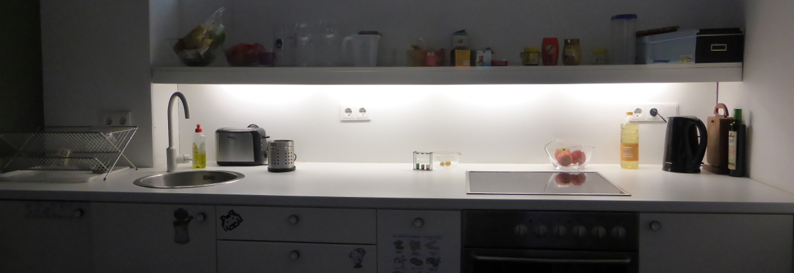</a>
    <figcaption>My kitchen</figcaption>
</figure>

The general placement of the sink is good: You want to be able to have space on
both sides so that you can have the dirty stuff on one side, clean it, and put
it on the clean side. This way you don't have to lift anything dirty over the
clean tableware. And you want to have the stove on the side where the dirty
stuff is, because if you make something in the pan the fat could make the stuff
around dirty.

But thinking a bit more about it, you can see a downside of this kitchen: The
sink has no included rack. This means when I lift something out of the sink and
put it on the table rack to the left, the table gets wet. Modern sinks all have this:

<figure>
    <a href="../images/2017/07/sink.jpg">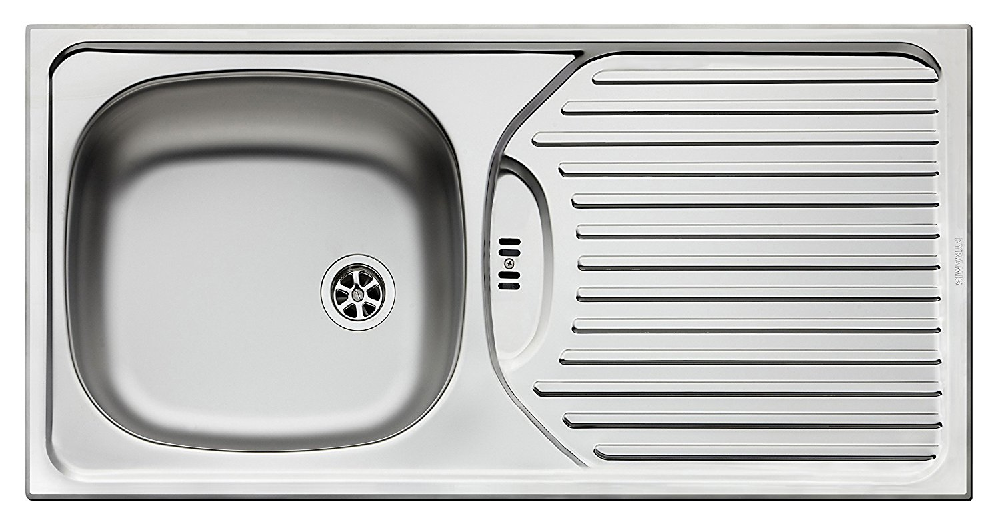</a>
    <figcaption>A modern sink has a place where you can put the wet stuff. It has its own drain.</figcaption>
</figure>

So the layout of a kitchen should be like this:

<figure>
    <a href="../images/2017/07/kitchen-layout.png">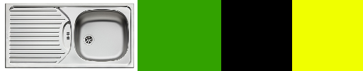</a>
    <figcaption>Layout of a kitchen: Some place on the very right, then the stove, then some place for dirty plates, the sink, and an integrated board where you can put the clean, wet plates.</figcaption>
</figure>

For me, it feels a bit more natural to take things from the right side, but the
mirrored version is fine, too.

#### Dishwasher

* **Count-Down**: A timer which shows how long it takes until the dishwasher is
  finished is necessary if you don't live alone. This should have a big
  display.
* **Sounds**: Feedback is important for every design. One feedback channel is
  the sounds it makes. You need to know when you pressed a button, you need to
  know when the dishwasher starts. But the volume which feels good depends very
  much on the person. And for some actions, like the button presses, you might
  not even need a sound at all.

A negative example is the "EXQUISIT GSP 9112.1".

#### Mugs

Sometimes you get coffee stains because a little drop of the coffee (or tea)
drops down at the side of the mug. The following design by "Yanko Design"
prevents that:

<figure>
    <a href="../images/2014/10/yanko-design-mug-coffee-stains.jpg">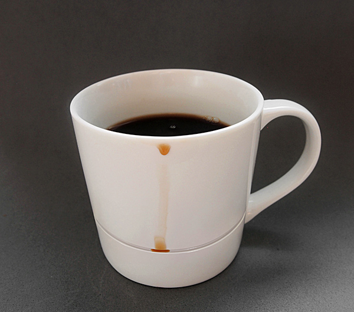</a>
    <figcaption>Yanko design coffee mug  Source: <a href='http://www.yankodesign.com/2013/05/29/a-drip-free-world/'>yankodesign.com</a></figcaption>
</figure>

### Doors

* It should be obvious in which way a door opens, without a sign. For example,
  if you have to push it, it should only have a flat surface.
* Doors should never open to the corridor. People might go fast through
  corridors and opening doors could cause injuries.

Residential buildings:

* It should be possible to open a door a bit more than 90°. If it is opened like this,
  the door should be placed wide enough away from the next wall so that you can
  put a small shelf behind it.

### Bathroom

* Shower curtains: Do not use them. They are cheap, yes. But they get pulled in
  by the temperature difference. They look bad. They get dirty and have to be
  replaced.
* Washing machines: They should always have a display which shows how long they
  need to finish.
* Towel racks: They should not be smooth. A little bit of structure prevents
  the towel from too easily falling off

<figure>
    <a href="../images/2017/08/bad-design-towel-rail.jpg">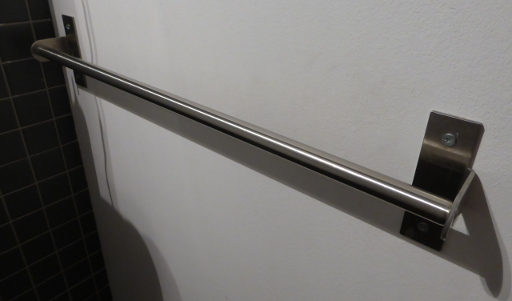</a>
    <figcaption>Bad design of a towel rail</figcaption>
</figure>

#### Shower

* Have a place where people can put the shampoo. It should not fall down and
  this thing should at the same time be easy to clean.
* When there are multiple showers in one room, PLEASE make everybody have their
  own drain. It can be really disgusting to share a drain with a stranger...
  I had a bad experience on a campsite in Scotland...
* The shower should have a place where you can put your clothes and where you
  can put the towel. Preferably placed in a way that you don't have to make the
  whole bathroom wet.
* Make it absolutely clear how to get more water (the pressure) and how to
  change the temperature. I prefer one control element for temperature and one
  for pressure. Also, make it clear where it is increased and where it is
  decreased.

#### Sink

* Place the tap above the basin. When you turn it off with wet hands, the water
  drips into the sink and not on the rest of the bathroom.

#### Hairbrush

<figure>
    <a href="../images/2014/10/brush.jpg">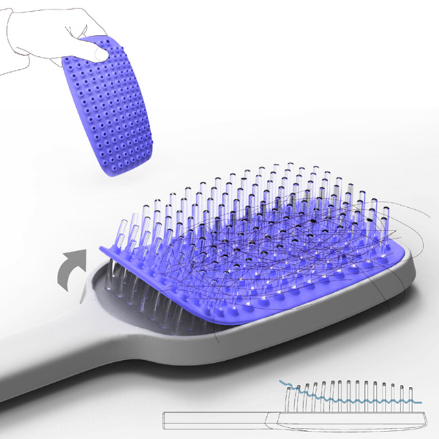</a>
    <figcaption>A brush with which you can easily remove the hair. Source: Brainparking</figcaption>
</figure>

## Receipts

Receipts are designed quite badly. In order to give you a feeling for it, have
a look at the following:

<figure>
    <a href="../images/2017/07/receipts.jpg">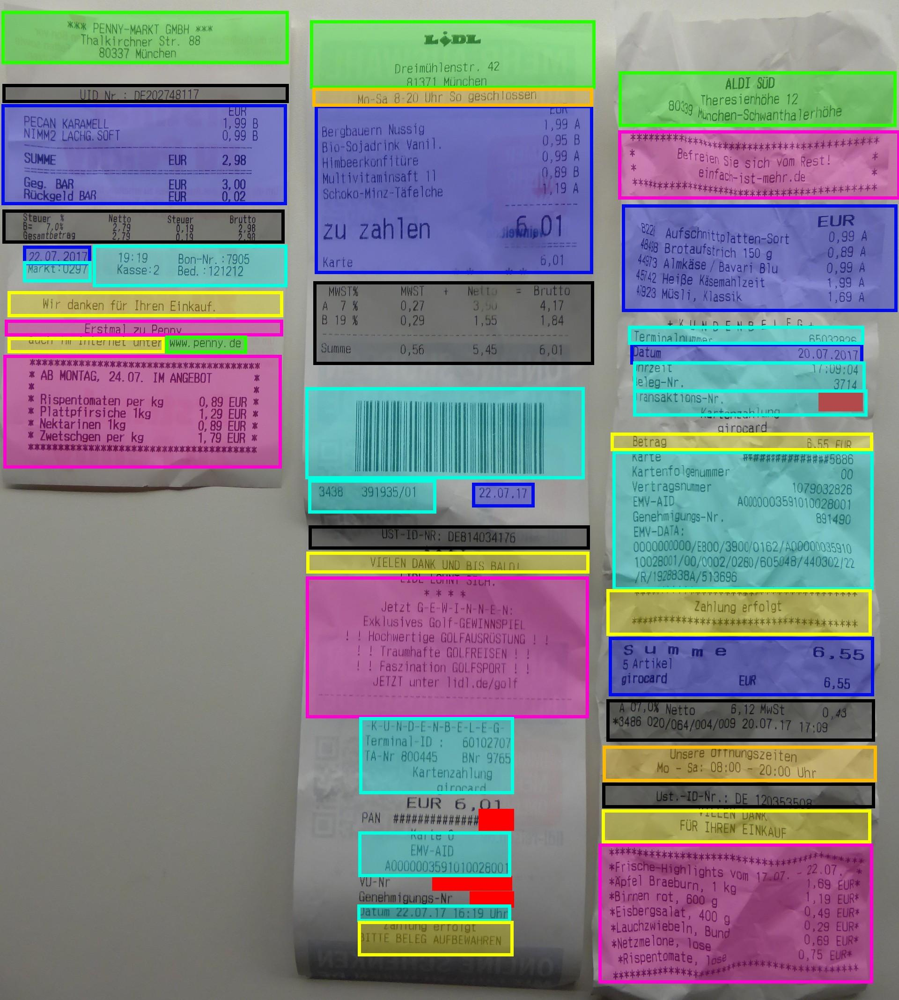</a>
    <figcaption>3 Receipts of Penny, Lidl and Aldi</figcaption>
</figure>

* Useful for the customer
    * Green: Address
    * Orange: Opening times
    * Blue: What was bought and when
* Black: Might be required by law
* Trash for the customer:
    * Pink: Advertisement
    * Turquoise: Might be useful for the company; information about the transaction
    * Yellow: Trash for everybody

How could it be done better?

Just design it like a letter:

* Address and opening times at the top (Lidl has a good format)
* Then the date
* Then what was bought (again, Lidl has a good format there - make the end price significantly larger than the rest)
* Put legal stuff next
* Put stuff you need for your business last

And especially: Reduce everything which might not be necessary for the customer
to a minimum.

## Medicine Package Inserts

<figure>
    <a href="../images/2017/07/package-insert.jpg">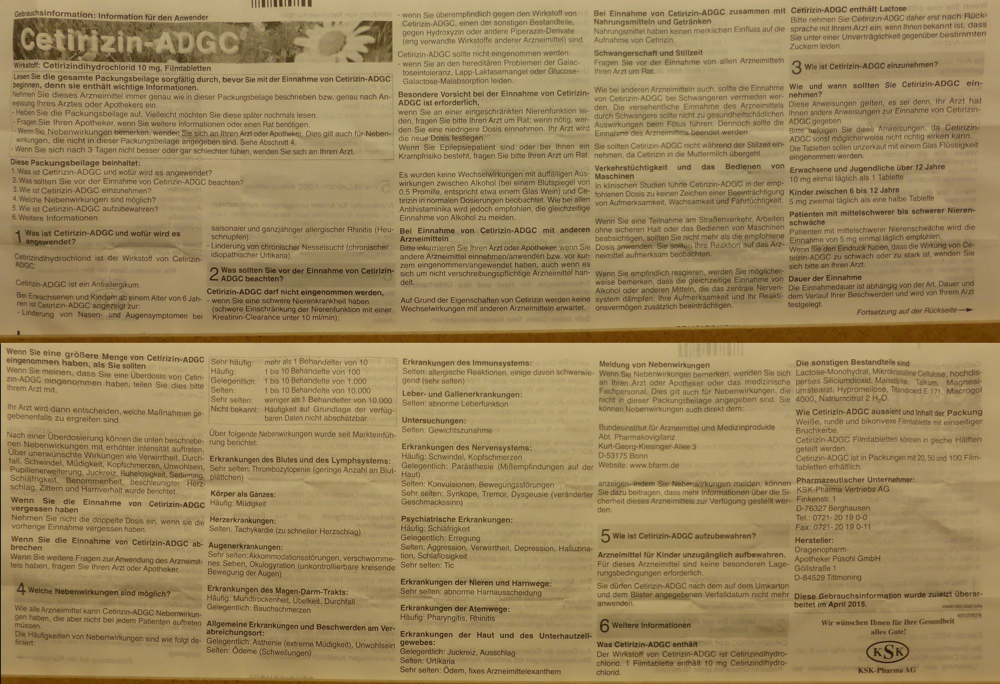</a>
    <figcaption>Package insert of medicine</figcaption>
</figure>

There are a couple of things to notice here:

* A lot of text
* Only in German
* No (obvious) way to find it in another language

I would expect the following:

* Make the name very obvious ✔
* Add a URL where you can download the package insert as a (searchable) PDF ✘
* Make blocks for important sections ✔
* Use standardized icons for some sections:
    * Pregnancy (there is a [Unicode symbol](https://emojipedia.org/pregnant-woman/))
    * Interactions with other medicine (e.g. &#8644;)
    * What it is for (e.g. &#128712;)
    * How / when / how much to take (e.g. ⏰)
    * Interactions with preconditions (e.g. 🤒 or 😷 or 🤕)
    * Driving and heavy machinery (e.g. 🚗)
    * Storage (e.g. &#10052;)
    * Possible side-effects (e.g. 💊 &#8594; 🤒)
* Add a description of what the medicine looks like!

## Laptop

An office laptop (for work / studying) needs to have the following:

* Easy possibility to connect to beamers
* Easy to carry
    * Lightweight enough, including all power supplies / adapters
    * Easy to grab, even if you have multiple other things to carry
* Power supply: For God's sake, make standardized power supplies! I understand
  that we need more than one (e.g. office laptops vs. gaming laptops)... but
  certainly we do not need more than 5! It was possible for smartphones with
  the [common EPS](https://en.wikipedia.org/wiki/Common_external_power_supply)
  (yes, Apple has a bad design here again), so please make something similar
  for laptops too.
* Touchpad: Add a hardware switch for enabling / disabling it.

## Headphones

Over-ear headphones should have a removable cable. If the cable breaks, you
don't have to throw the whole headphones away.

## Software

### Websites

There is way too much about good design (not graphics, but structure) to say
in the context of websites. Some elements to think about:

* Search boxes
* Ordering systems like categories, tags, ...
* Navigation systems like breadcrumbs, index pages, ...

University websites are a good example of how hard this is:

* [webdesigndegreecenter.org/best-designed-college-w…](http://www.webdesigndegreecenter.org/best-designed-college-websites/)
* [nngroup.com/articles/university-sites](https://www.nngroup.com/articles/university-sites/)

### Google+ (2014)

In 2014, it seemed as if Google didn't want me to read long comments on
Google+ (which was shut down in 2019):

<figure>
    <a href="../images/2014/03/google-plus-plus-exits.png">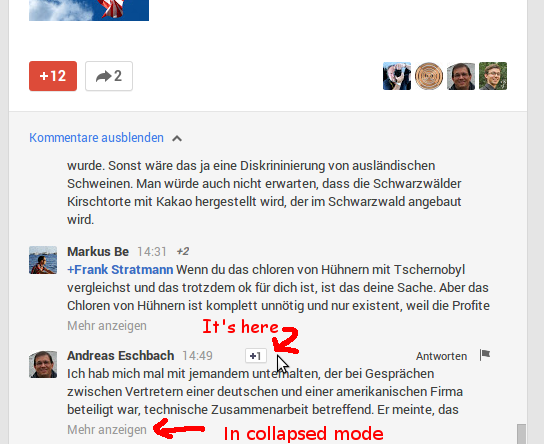</a>
    <figcaption>Google+ allows me to +1 a comment in collapsed mode</figcaption>
</figure>

<figure>
    <a href="../images/2014/03/google-plus-no-plus.png">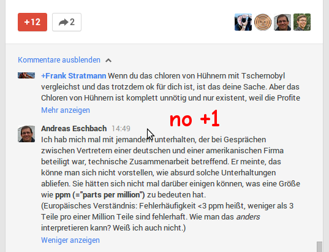</a>
    <figcaption>But I can't +1 when I can read the complete comment.</figcaption>
</figure>

### Recommendations (2014)

In 2014, YouTube offered no way to dismiss recommended videos (today, there is
a "Not interested" option):

<figure>
    <a href="../images/2014/03/youtube-no-dismiss.png">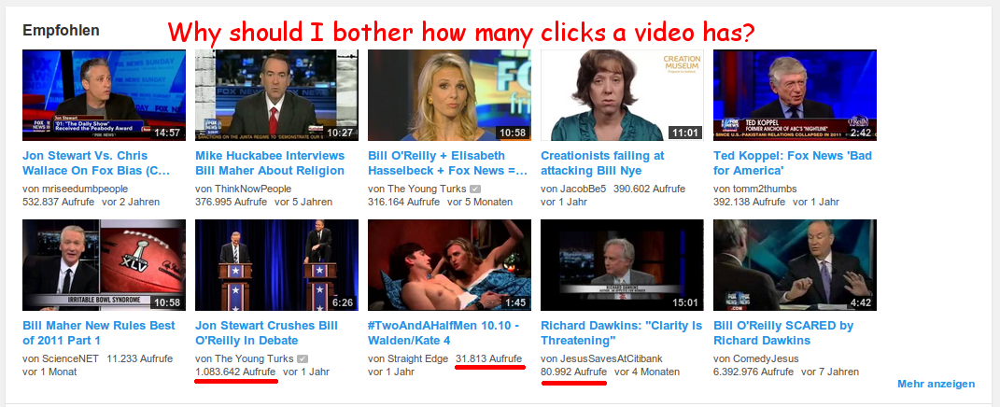</a>
    <figcaption>YouTube recommended videos - a 'dismiss' function is missing</figcaption>
</figure>

Although Amazon did not have a 'block this item' function either, it helped you
to understand (and eventually fix) why you got undesired recommendations:

<figure>
    <a href="../images/2014/03/amazon-recommendation.png">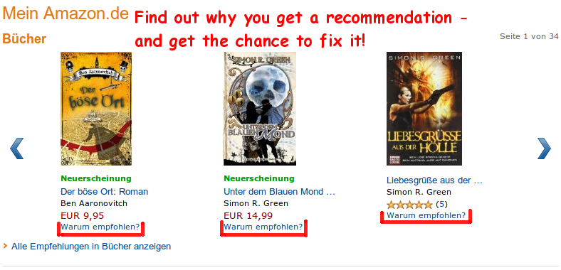</a>
    <figcaption>Amazon recommendations</figcaption>
</figure>

### Interactive Shells

Stolen from [Amjith Ramanujam - Awesome Command Line Tools](https://www.youtube.com/watch?v=hJhZhLg3obk):

* Persistent History
* History Search
* Auto-Completion
* Minimal Config
* Syntax Coloring

For Python, you can use the [prompt toolkit](https://github.com/jonathanslenders/python-prompt-toolkit) for
the prompt options and [Pygments](http://pygments.org/) for syntax highlighting.

## Bicycle

* <a href="https://en.wikipedia.org/wiki/Kickstand">Kickstand</a>: there are side stands and center stands... in German, it is pretty confusingly named. I have a "Seitenständer" and it is mounted in the center. I look at images on Google and in English it seems to be called as I expected. <a href="https://www.amazon.de/gp/product/B01N7RSWM8">Fischer Seitenständer 85995</a> (18.69 EUR) is pretty awesome.
* <a href="https://en.wikipedia.org/wiki/Valve_stem">Valve stem</a>: The <a
  href="https://en.wikipedia.org/wiki/Schrader_valve">Schrader valve</a>
  (German: "Autoventil") is standard for cars around the world. I haven't heard
  a good reason for having any other valves (e.g. Dunlop).
