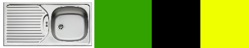

Most people think about really fancy things when they hear "design". Some think
about Apple products, websites or art.

When I say design, I mean it as a very general concept. For this article, I
mean usability. How to structure things. And things could be websites or phones,
but also anything else.

This article is mainly an excercise for me to keep my eyes open and recognize
good and bad designs in the wild.

## Kitchen

Let's take my kitchen as an example:

<figure class="wp-caption aligncenter img-thumbnail">
    
    <figcaption class="text-center">My kitchen</figcaption>
</figure>

### Sink

The general placement of the sink is good: You want to be able to have space on
both sides so that you can have the dirty stuff on one side, clean it, and put
it on the clean side. This way you don't have to lift anything dirty over the
clean tableware. And you want to have the stove on the side where the dirty
stuff is, because if you make something in the pan the fat could make the stuff
around dirty.

But thinking a bit more about it, you can see a downside of this kitchen: The
sink has no included rack. This means when I lift something out of the sink and
put it on the table rack to the left, the table gets wet. Modern sinks all have this:

<figure class="wp-caption aligncenter img-thumbnail">
    
    <figcaption class="text-center">A modern sink has a place where you can put the wet stuff. It has its own drain.</figcaption>
</figure>

So the layout of a kitchen should be like this:

<figure class="wp-caption aligncenter img-thumbnail">
    
    <figcaption class="text-center">Layout of a kitchen: Some place on the very right, then the stove, then some place for dirty plates, the sink, and an integrated board where  you can put the clean, wet plates.</figcaption>
</figure>

For me, it feels a bit more natural to take things from the right side, but the
mirrored version is fine, too.

## Doors

* Doors should never open to the corridor. People might go fast through
  corridors and opening doors could cause injuries.

Residential buildings:

* It should be possible to open a door a bit more than 90°. If it is opened like this,
  the door should be placed wide enough away from the next wall so that you can
  put a small shelf behind it.

## Bathroom

* Shower curtains: Do not use them. They are cheap, yes. But they get pulled in
  by the temperature difference. They look bad. They get dirty and have to be
  replaced.

## Receipts

Receipts are designed quite bad. In order to give you a feeling for it, have
a look at the following:

<figure class="wp-caption aligncenter img-thumbnail">
    
    <figcaption class="text-center">3 Receipts of Penny, Lidl and Aldi</figcaption>
</figure>

* Useful for the customer
    * Green: Adress
    * Orange: Opening times
    * Blue: What was bought and when
* Black: Might be required by law
* Trash for the customer:
    * Pink: Advertisement
    * Turquoise: Might be useful for the company; information about the transaction
    * Yellow: Trash for everybody

How could it be done better?

Just design it like a letter:

* Adress and opening times at the top (Lidl has a good format)
* Then the Date
* Then what was bought (again, Lidl has a good format there - make the end price significantly larger than the rest)
* Put legal stuff next
* Put stuff you need for your busines last

And especially: Reduce everything which might not be necessary for the customer
to a minimum.

## Medicine Package Inserts

<figure class="wp-caption aligncenter img-thumbnail">
    
    <figcaption class="text-center">Package insert of medicine</figcaption>
</figure>

There are a couple of things to notice here:

* A lot of text
* Only in German
* No (obvious) way to find it in another language

I would expect the following:

* Make the name very obvious ✔
* Add an URL where you can download the receipt as a (searchable) PDF ✘
* Make blocks for important sections ✔
* Use standardized icons for some sections:
    * Pregnancy (there is a [Unicode symbol](https://emojipedia.org/pregnant-woman/))
    * Interactions with other medicine (e.g. &#8644;)
    * What it is for (e.g. &#128712;)
    * How / when / how much to take (e.g. ⏰)
    * Interactions with preconditions (e.g. 🤒 or 😷 or 🤕)
    * Driving and heavy machineary (e.g. 🚗)
    * Storage (e.g. &#10052;)
    * Possible side-effects (e.g. 💊 &#8594; 🤒)
* Add a description how the medicine looks like!

## Laptop

An office laptops (for work / studying) needs to have the following:

* Easy possiblity to connect to beamers
* Easy to carry
    * Lightweight enough, including all power supplies / adapaters
    * Easy to grab, even if you have multiple other things to carry
* Power supply: For gods sake, make standardized power supplies! I understand
  that we need more than one (e.g. office laptops vs. gaming laptops)... but
  certainly we do not need more than 5! It was possible for smartphones with
  the [common EPS](https://en.wikipedia.org/wiki/Common_external_power_supply)
  (yes, Apple has a bad design here again), so please make something similar
  for laptops too.
* Touchpad: Add a hardware switch for enabling / disabling it.

## Software

### Interactive Shells

Stolen from [Amjith Ramanujam - Awesome Command Line Tools](https://www.youtube.com/watch?v=hJhZhLg3obk):

* Persistent History
* History Search
* Auto-Completion
* Minimal Config
* Syntax Coloring

For Python, you can use the [prompt toolkit](https://github.com/jonathanslenders/python-prompt-toolkit) for
the prompt options and [Pygments](http://pygments.org/) for syntax highlighting.