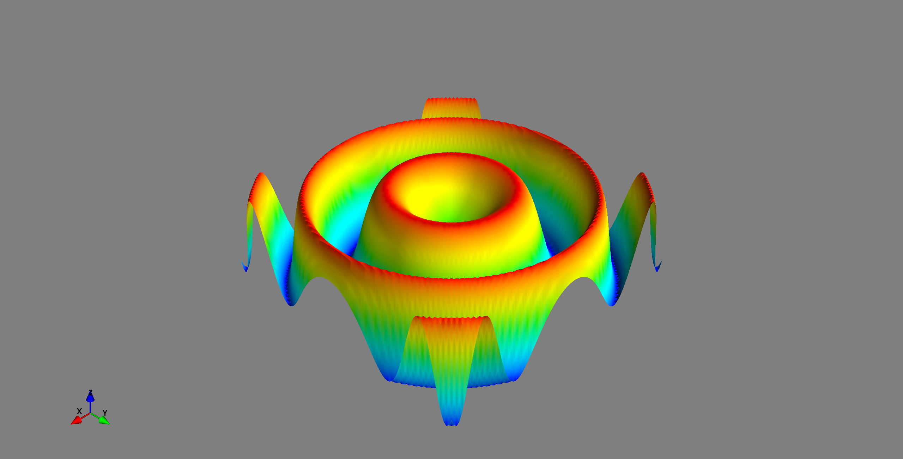

Python has a lot of libraries for data visualization and I recently stumbled
over an awesome talk from PyCon 2017 by Jake VanderPlas titled "The Python
Visualization Landscape" which gives an overview over them:

<iframe width="560" height="315" src="https://www.youtube-nocookie.com/embed/FytuB8nFHPQ" frameborder="0" allow="autoplay; encrypted-media" allowfullscreen></iframe>

* Matplotlib
    * [seaborn](https://seaborn.pydata.org/): statistical data visualization
    * [Pandas](http://pandas.pydata.org/): Dataframes
    * [networkx](https://networkx.github.io/): Graphs
    * [ggpy](https://github.com/yhat/ggpy): Python implementation of the grammar of graphics
    * [`ggplot`](http://ggplot.yhathq.com/): Also based on the Grammar of Graphics
    * [Yellow Brick](https://github.com/DistrictDataLabs/yellowbrick)
    * [scikit-plot](https://github.com/reiinakano/scikit-plot)
* [Datashader](https://github.com/bokeh/datashader): Turns even the largest data into images
* [Vaex](https://github.com/maartenbreddels/vaex): visualize and explore large (~billion rows/objects) tabular datasets interactively
* [Holoviews](http://holoviews.org/)
* Javascript
    * [plotly](https://plot.ly/python/)
    * [bokeh](http://bokeh.pydata.org/en/latest/)
    * [cufflinks](https://github.com/santosjorge/cufflinks)
    * [bqplot](https://github.com/bloomberg/bqplot): Plotting library for IPython/Jupyter Notebooks
    * [pythreejs](https://github.com/jovyan/pythreejs): A Jupyter - ThreeJS bridge
    * [ipyleaflet](https://github.com/ellisonbg/ipyleaflet): IPython Widget for [Leaflet](https://leafletjs.com/) Maps
    * [ipyvolume](https://github.com/maartenbreddels/ipyvolume)
* OpenGL
    * [Vispy](http://vispy.org/): interactive scientific visualization
    * [Glumpy](https://glumpy.github.io/): scientific visualization
* Specification languages:
    * [Vega](https://github.com/vega/vega)
    * [Vincent](https://vincent.readthedocs.io/en/latest/): A Python to Vega Translator
    * [Vega Lite](https://vega.github.io/vega-lite/)
    * [Altair](https://altair-viz.github.io/)
    * [d3po](https://github.com/information-field-theory/d3po): Denoising, Deconvolving, and Decomposing Photon Observations


## Maps

Visualizing maps is super hard, as the tools which exist don't have good
installers.

Here is what I've tried/seen so far:

* [`gmt-python`](https://www.gmtpython.xyz/latest/): [issue 215](https://github.com/GenericMappingTools/gmt-python/issues/215), [video](https://www.youtube.com/watch?v=6wMtfZXfTRM)
* [`geoplotlib`](https://github.com/andrea-cuttone/geoplotlib)


## 3D

### Mayavi
[MayaVi](https://en.wikipedia.org/wiki/MayaVi) is a scientific data visualizer written in Python, which uses VTK and provides a GUI via Tkinter.

<iframe width="560" height="315" src="https://www.youtube-nocookie.com/embed/r6OD07Qq2mw" frameborder="0" allow="autoplay; encrypted-media" allowfullscreen></iframe>

* [Docs](http://docs.enthought.com/mayavi/mayavi/)

Example:

```python
# 3rd party modules
from mayavi import mlab
import numpy

x, y = numpy.mgrid[-3:3:100j, -3:3:100j]
z = numpy.sin(x ** 2 + y ** 2)
mlab.surf(x, y, z)
```

gives

<figure class="wp-caption aligncenter img-thumbnail">
    <a href="../images/2018/07/mayavi-sin-3d-example.png"></a>
    <figcaption class="text-center">3D plot generated with Mayavi</figcaption>
</figure>
