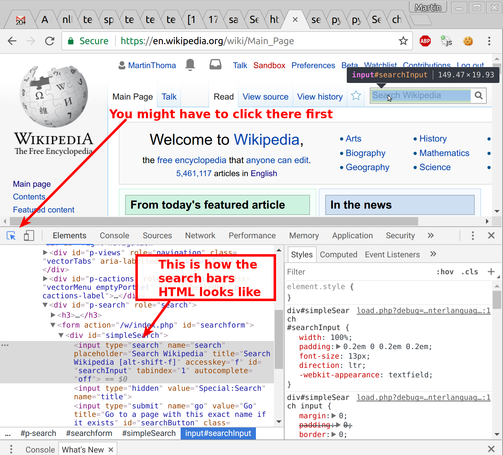

Selenium is a framework for testing web applications. And it is relly good for
scraping JavaScript heavy websites. The idea is that you get a real browser
to execute everything. In contrast to BeautifulSoup where you only fetch the
content of a website.


## Installation

```bash
pip install selenium chromedriver_installer
```

## Basic example

When you execute the follwing example with Python it should open a Chromium
browser window with the Wikipedia main page. Nothing too exciting.

```python
#!/usr/bin/env python
# -*- coding: utf-8 -*-

"""A very basic selenium example."""

from selenium import webdriver
import time


def main():
    """Open Wikipedia - and keep the browser open."""
    browser = get_browser()
    url = "https://en.wikipedia.org"
    browser.get(url)
    time.sleep(60)  # Keep the browser open for 60s


def get_browser():
    """Get the browser (a "driver")."""
    # find the path with 'which chromedriver'
    path_to_chromedriver = (
        "/home/moose/GitHub/algorithms/scraping/venv/bin/chromedriver"
    )
    browser = webdriver.Chrome(executable_path=path_to_chromedriver)
    return browser


if __name__ == "__main__":
    main()
```


## Basic interaction

Ok, now we want to search on Wikipedia by filling out the search bar. So we
need to inspect the website and get an identifier for the search bar. In
Chrome, this is done with the *developer tools*. You can open them with
<kbd>Ctrl</kbd> + <kbd>Shift</kbd> + <kbd>I</kbd> (for *inspect*):

<figure class="wp-caption aligncenter img-thumbnail">
    
    <figcaption class="text-center">Text</figcaption>
</figure>

```python
#!/usr/bin/env python
# -*- coding: utf-8 -*-

"""A very basic selenium example."""

from selenium import webdriver
from selenium.webdriver.common.keys import Keys
import time


def main():
    """Search for Selenium and click on the disambiugation link."""
    browser = get_browser()
    url = "https://en.wikipedia.org"
    browser.get(url)
    el = browser.find_element_by_id("searchInput")
    el.send_keys("Selenium", Keys.RETURN)
    time.sleep(2)  # Give you a chance to see the content
    div = browser.find_element_by_xpath('//div[contains(@class, "hatnote")]')
    link = div.find_element_by_xpath('.//a[starts-with(@href, "/wiki")]')
    link.click()
    time.sleep(60)


def get_browser():
    """Get the browser (a "driver")."""
    # find the path with 'which chromedriver'
    path_to_chromedriver = (
        "/home/moose/GitHub/algorithms/scraping/" "venv/bin/chromedriver"
    )
    browser = webdriver.Chrome(executable_path=path_to_chromedriver)
    return browser


if __name__ == "__main__":
    main()
```

You know now:

* How to get elements by ID (`browser.find_element_by_id`)
* How to get elements by XPath (`browser.find_element_by_xpath(xpath)`)
    * Absolute starts with `//`
    * Relative starts with `.//`
    * `[condition]` syntax
* How to click on elements (`element.click()`)

Also super helpful:

* `.get_attribute("outerHTML")`: Show what you currently have


## Headless Browser

A headless browser is one without a GUI. PhantomJS is one example.

You can install it via apt, but that has problems ([source](https://stackoverflow.com/q/36770303/562769)).
You can install it via

```bash
sudo apt-get install nodejs-legacy
sudo npm install -g phantomjs
```

but that might be a security risk. Your choice.

Run it:

```python
#!/usr/bin/env python
# -*- coding: utf-8 -*-

"""A very basic selenium example."""

from selenium import webdriver


def main():
    """Open Wikipedia - and keep the browser open."""
    browser = get_browser()
    url = "https://en.wikipedia.org"
    browser.get(url)
    print(browser.title)


def get_browser():
    """Get the browser (a "driver")."""
    # find the path with 'which chromedriver'
    browser = webdriver.PhantomJS()
    return browser


if __name__ == "__main__":
    main()
```


## Download webpage

```python
#!/usr/bin/env python
# -*- coding: utf-8 -*-

"""Selenium example for downloading a webpage."""

from selenium import webdriver
import os
import time


def main():
    """Download an opened PDF page."""
    browser = get_browser()
    url = "https://martin-thoma.com/pdf/cv-curriculum-vitae.pdf"
    browser.get(url)  # Open a PDF page
    time.sleep(60)  # Keep the browser open for 60s


def get_browser():
    """Get the browser (a "driver")."""
    # find the path with 'which chromedriver'
    path_to_chromedriver = (
        "/home/moose/GitHub/algorithms/scraping/" "venv/bin/chromedriver"
    )
    download_dir = "/home/moose/selenium-download/"
    print("Is directory: {}".format(os.path.isdir(download_dir)))

    from selenium.webdriver.chrome.options import Options

    chrome_options = Options()
    chrome_options.add_experimental_option(
        "prefs",
        {
            "plugins.plugins_list": [{"enabled": False, "name": "Chrome PDF Viewer"}],
            "download": {
                "prompt_for_download": False,
                "default_directory": download_dir,
            },
        },
    )

    browser = webdriver.Chrome(path_to_chromedriver, chrome_options=chrome_options)
    return browser


if __name__ == "__main__":
    main()
```

Credits: [How can I download something with Selenium and Chrome?](https://stackoverflow.com/q/45743028/562769)

The following alternative (kind of) works:

```python
#!/usr/bin/env python
# -*- coding: utf-8 -*-

"""Selenium example for downloading a webpage."""

from selenium import webdriver
import time
import requests
import os


def main():
    """Download an opened PDF page."""
    browser = get_browser()
    url = "https://martin-thoma.com/pdf/cv-curriculum-vitae.pdf"
    browser.get(url)  # Open a PDF page
    time.sleep(2)
    download_link = url  # browser.current_url might be interesting, too
    print("Download link: {}".format(download_link))
    session = requests.Session()
    cookies = browser.get_cookies()

    for cookie in cookies:
        session.cookies.set(cookie["name"], cookie["value"])
    response = session.get(download_link)
    # write
    path = os.path.abspath("temp.pdf")
    with open(path, "wb") as f:
        f.write(response.content)
    print("Written to {}".format(path))


def get_browser():
    """Get the browser (a "driver")."""
    browser = webdriver.PhantomJS()
    return browser


if __name__ == "__main__":
    main()
```


## Waiting

Sometimes, you need to wait for the page to load. `browser.get` blocks until
the page is loaded, but what about `.click()`? What about JavaScript generated
elements?

See the [official documentation](http://selenium-python.readthedocs.io/waits.html)
for all wait methods.


## See also

* [Official Website](http://www.seleniumhq.org/)
    * [Python documentation](http://selenium-python.readthedocs.io/)
* [Wikipedia](https://en.wikipedia.org/wiki/Selenium_(software))
* [StackOverflow](https://stackoverflow.com/questions/tagged/selenium)
