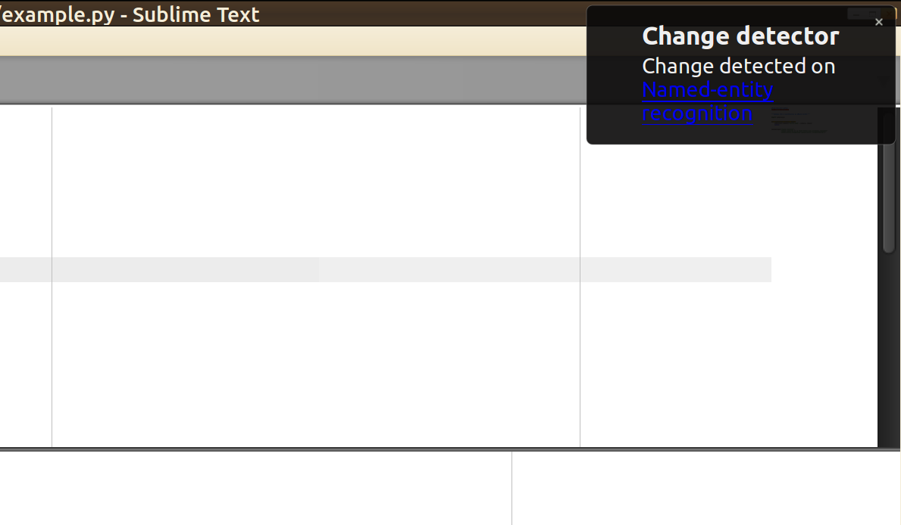

Suppose you wanted to build a tool which informs you whenever there is an
update to a couple of websites you're interested in. And lets say the
`last-modified` header was usable for this (it is not, but I want to focus on
another problem). So you would need to save the `last_known_state` - which
is a time stamp - with the latest `last-modified`. And you need to do this
often. For each website. Lets say we have

```text
Intervall | Name      | Website
------------------------------------------------------------------
60min     | Wikipedia | https://en.wikipedia.org/wiki/Named-entity_recognition
300min    | Fefe      | https://blog.fefe.de/
```


## Prerequisites

We store the jobs in `jobs.csv` in the format

```text
intervall;name;url;last-modified;process
60;Wikipedia;https://en.wikipedia.org/wiki/Named-entity_recognition;-;-
300;Fefe;https://blog.fefe.de/;-;-
```

Interacting with CSV files is simple ([source](https://stackoverflow.com/a/41585079/562769)).

It turns out, that sending notifications is also simple on Ubuntu:

```python
#!/usr/bin/env python
# -*- coding: utf-8 -*-


"""Example for a notification on Ubuntu 16.04."""

import subprocess


def sendmessage(summary, body):
    subprocess.Popen(["notify-send", summary, body])
    return


sendmessage(
    "Change detector",
    "Change detected on <a href='https://en.wikipedia.org/wiki/"
    "Named-entity_recognition'>Named-entity recognition</a>",
)
```

It looks like this:

<figure class="wp-caption aligncenter img-thumbnail">
    
    <figcaption class="text-center">Notifications on Ubuntu</figcaption>
</figure>

Receiving the `last-modified` element from a website is as simple as

```python
#!/usr/bin/env python
# -*- coding: utf-8 -*-


"""How to receive the last-modified header."""

import requests


def get_last_modified(url):
    """Get the Last-Modified header of an URL."""
    header = requests.head(url).headers
    if "Last-Modified" in header:
        return header["Last-Modified"]
    else:
        return None


print(get_last_modified("https://blog.fefe.de/"))
```


## The scheduling

We want to be able to spawn new website watchers any time and we want to be
able to kill them easily. They should not take too much memory / CPU-time and
they should run independently.

So we have one script which creates new processes. Those processes run
independently, but the children get killed when the parent is killed. And if
you replace their process id (pid) in the `jobs.csv` by `commit_suicide` they
kill themselfes. You can also kill them directly by using the process id.

And ... that's it. You should think about race conditions, too. But this was
more a toy project than something serious, so I'll not dig into that. And if
you simply used a database, you would not have a race condition as you could
edit all entries independently.

```python
#!/usr/bin/env python
# -*- coding: utf-8 -*-


"""How to receive the last-modified header."""

import csv
import logging
import os
import requests
import subprocess
import sys
import time
from multiprocessing import Process


logging.basicConfig(
    format="%(asctime)s %(levelname)s %(message)s",
    level=logging.DEBUG,
    stream=sys.stdout,
)


def sendmessage(summary, body):
    subprocess.Popen(["notify-send", summary, body])
    return


def read_jobs(csv_filepath):
    with open(csv_filepath, "r") as fp:
        reader = csv.DictReader(fp, delimiter=";", quotechar='"')
        data_read = [row for row in reader]
    return data_read


def get_last_modified(url):
    """Get the Last-Modified header of an URL."""
    header = requests.head(url).headers
    if "Last-Modified" in header:
        return header["Last-Modified"]
    else:
        return None


def create_new_process(csv_filepath, line_nr):
    assert line_nr >= 0, "line_nr={line_nr}".format(line_nr)
    jobs = read_jobs(csv_filepath)
    logging.info("Start job for '{name}'".format(name=jobs[line_nr]["name"]))
    p = Process(target=job_runner, args=(csv_filepath, line_nr, jobs))
    p.start()
    return p


def job_runner(csv_filepath, line_nr, jobs):
    name = jobs[line_nr]["name"]
    url = jobs[line_nr]["url"]
    intervall = int(jobs[line_nr]["intervall"])
    last_modified_seen = jobs[line_nr]["url"]
    print("Run line_nr={}".format(line_nr))
    while True:
        print("process id:", os.getpid())
        # Get websites last modified
        last_modified_website = get_last_modified(url)
        if last_modified_website != last_modified_seen:
            # Update file
            update_file(csv_filepath, line_nr, last_modified_website, os.getpid())
            last_modified_seen = last_modified_website
            # notify
            sendmessage(
                "Change detector",
                "Change detected on <a href='{url}'>{name}</a>".format(
                    url=url, name=name
                ),
            )
        # wait
        time.sleep(intervall)

        # See if the process should kill itself
        jobs = read_jobs(csv_filepath)
        if jobs[line_nr]["pid"] == "commit_suicide":
            return


def update_file(csv_filepath, line_nr, last_modified_website, pid):
    # Race conditions!
    jobs = read_jobs(csv_filepath)
    print(jobs)
    jobs[line_nr]["last-modified"] = last_modified_website
    jobs[line_nr]["pid"] = pid
    with open(csv_filepath, "w") as fp:
        writer = csv.writer(fp, delimiter=";")
        writer.writerow(["intervall", "name", "url", "last-modified", "pid"])
        for job in jobs:
            writer.writerow(
                [
                    job["intervall"],
                    job["name"],
                    job["url"],
                    job["last-modified"],
                    job["pid"],
                ]
            )


def main():
    csv_filepath = "jobs.csv"
    jobs = read_jobs(csv_filepath)
    for line_nr, job in enumerate(jobs):
        process_runs = os.path.exists("/proc/{}".format(job["pid"]))
        if job["pid"] == "stopped" or not process_runs:
            create_new_process(csv_filepath, line_nr)
            time.sleep(1)
    while True:
        time.sleep(1)


if __name__ == "__main__":
    main()
```


## See also

* [`schedule`](https://docs.python.org/2/library/sched.html#sched.scheduler): defines a class which implements a general purpose event scheduler
* [Pyro4](https://pythonhosted.org/Pyro4/index.html): build applications in which objects can talk to each other over the network
* [``subprocess` vs `multiprocessing`](https://stackoverflow.com/a/13607111/562769)
* [PEP 3143](https://www.python.org/dev/peps/pep-3143/)
