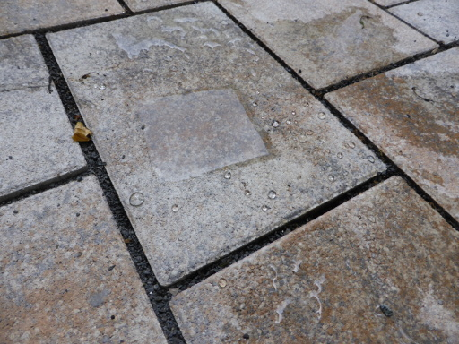

[My last hiking trip](https://martin-thoma.com/triglav-national-park/) was
extremely wet. And my raincoat did not help me.

On the one hand, I will impregnate my rain trousers. On the other hand, I'm
thinking about buying a new rain coat. Or a hardshell.

## Impregnation

For everything except the shoes, I will do the following:

1. Put the inner to the outer to reduce possible damage to the material
   (German: "Auf links drehen")
2. Select "gentle or delicate cycle" (Schonwaschgang)
3. Use "Fibertec Uni Pro Wash Eco Waschmittel"
4. Put it in the dryer.

Then I will use the spray "Deichmann nässe blocker hybrid".

In order to test how effective the spray is, I coated a piece of paper. I
couldn't see a difference in the paper when I put water on it, but you can
easily see where I coated the paper:

<figure class="wp-caption aligncenter img-thumbnail">
    
    <figcaption class="text-center">Impregnation of Tiles</figcaption>
</figure>

## Hardshell Jackets

All hardshells should be water- and windproof as well as breathable. They all
have 2 front pockets.

Water resistance is measured according to DIN EN 20811:1992 by the height of a
water column (JIS L 1092 B). I've read that everything above
10&#8239;000&nbsp;mm does not really make a difference, but it is important
how breathable the material is (e.g. if you stick in your sweat or if the sweat
is transported out of the jacket).

For longer hiking trips, 3&nsp;layer hardshell jackets seem to be recomendable
as they are more breathable than the 2&nbsp;layer constructions.

### What I have

I have a 2 layer rain coat from "Tec Wear" / Rodeo (C &amp; A). It weights
about 700g, has a detachable hood, two front pockets which I use for gloves.
Additionally, it has one side front pocket and two innner pockets which I
likely never used. The volume is hard to estimate ... probably something around
2&nbsp;L.

The seams are not welded (see [article](https://www.bergfreunde.de/basislager/technik-verschweisste-naehte/) how to do it yourself):

TODO: image

### What I looked at

<table class="table">
    <thead>
    <tr>
        <th>Name</th>
        <th>Price</th>
        <th>Layers</th>
        <th>Water Column</th>
        <th>Breathability</th>
        <th>Weight</th>
        <th>Volume</th>
        <th>Detachable Hood</th>
        <th>Inner pocket</th>
        <th>Self-pocketing</th>
    </tr>
    </thead>
    <tbody>
    <tr>
        <td>Montane Air Jacket</td>
        <td>250 EUR</td>
        <td>3</td>
        <td>20&#8239;000&nbsp;mm</td>
        <td>12.000 g/m&sup2;/24h</td>
        <td>350&nbsp;g</td>
        <td>1.5&nbsp;L</td>
        <td>✘</td>
        <td>0</td>
        <td>✘</td>
    </tr>
    <tr>
        <td>Men's Zebru UL 3L Jacket</td>
        <td>250 EUR</td>
        <td>3</td>
        <td>20&#8239;000&nbsp;mm</td>
        <td>?</td>
        <td>198&nbsp;g</td>
        <td>0.8&nbsp;L</td>
        <td>✘</td>
        <td>0</td>
        <td>✘</td>
    </tr>
    <tr>
        <td>Men's Croz 3L Jacket II</td>
        <td>300 EUR</td>
        <td>3</td>
        <td>15&#8239;000&nbsp;mm</td>
        <td>?</td>
        <td>331&nbsp;g</td>
        <td>?</td>
        <td>✘</td>
        <td>0</td>
        <td>✘</td>
    </tr>
    <tr>
        <td>MARMOT - Red Star Jacket</td>
        <td>195&nbsp;EUR</td>
        <td>3</td>
        <td>? mm</td>
        <td>?</td>
        <td>425&nbsp;g</td>
        <td>1.8&nbsp;L</td>
        <td>✘</td>
        <td>1</td>
        <td>✔</td>
    </tr>
    <tr>
        <td>Men's Kofel LW Jacket</td>
        <td>200&nbsp;EUR</td>
        <td>2</td>
        <td>10&#8239;000&nbsp;mm</td>
        <td>?</td>
        <td>384&nbsp;g</td>
        <td>?</td>
        <td>✔</td>
        <td>0</td>
        <td>✘</td>
    </tr>
    <tr>
        <td>Men's Furnas Jacket II</td>
        <td>144&nbsp;EUR</td>
        <td>2</td>
        <td>10&#8239;000&nbsp;mm</td>
        <td>?</td>
        <td>630&nbsp;g</td>
        <td>?</td>
        <td>✔</td>
        <td>0</td>
        <td>✘</td>
    </tr>
    <tr>
        <td>Men's Yaras Jacket II</td>
        <td>160&nbsp;EUR</td>
        <td>2</td>
        <td>10&#8239;000&nbsp;mm</td>
        <td>?</td>
        <td>390&nbsp;g</td>
        <td>?</td>
        <td>✘</td>
        <td>0</td>
        <td>✘</td>
    </tr>
    <tr>
        <td>Men's Escape Pro Jacket</td>
        <td>136&nbsp;EUR</td>
        <td>2</td>
        <td>10&#8239;000&nbsp;mm</td>
        <td>?</td>
        <td>543&nbsp;g</td>
        <td>2&nbsp;L</td>
        <td>✔</td>
        <td>1</td>
        <td>✔</td>
    </tr>
    </tbody>
</table>

## See also

* Stiftung Warentest: [Imprägnier­mittel für Textil und Leder](https://www.test.de/Impraegniermittel-fuer-Textil-und-Leder-Jedes-zweite-ist-gut-4899882-0/)
* [What Does 2, 2.5 And 3 Layer Construction In A Rain Jacket Mean?](https://coolhikinggear.com/what-does-2-2-5-and-3-layer-construction-in-a-rain-jacket-mean)
* [Wetterschutz für unterwegs: Hardshell-Test 2017](http://www.outdoor-magazin.com/test/jacken/preiswerte-hardshelljacken-2017.1684440.3.htm)
* [How to Choose the Best Hardshell Jacket](https://www.outdoorgearlab.com/topics/clothing-mens/best-hardshell-jacket/buying-advice)
* [GORE-TEX Wash Tutorial](https://www.youtube.com/watch?v=I4N6ZuKTZ_c): Wash it often!
