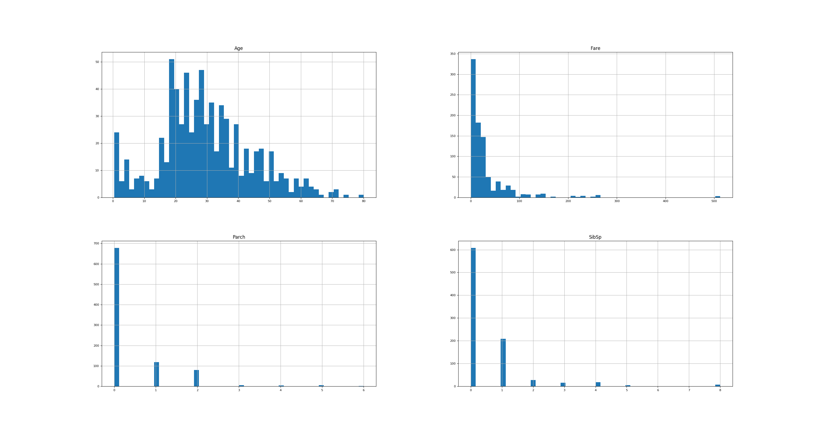

Getting insights from data is exciting. I think I didn't write anything about
it so far, so let's get a live working draft :-)

In this article, I assume you have data in a single CSV file. If you have
multiple CSV files, you can [merge](https://pandas.pydata.org/pandas-docs/stable/generated/pandas.DataFrame.join.html)
them similar to SQL `JOIN` statements.


## Prerequesites

* Python 3
* [Pandas](http://pandas.pydata.org) (`pip install pandas`)
* [Matplotlib](https://matplotlib.org) (`pip install matplotlib`)
* [Seaborn](https://seaborn.pydata.org) (`pip install seaborn`)


## Loading the data

I load the data as a Pandas Dataframe first. I name this dataframe `df`.

If the CSV file is too big for RAM, I use the command line tool `head` to crop
the data. [Dask](http://dask.pydata.org/en/latest/) is another option, but I
never actually used it.

I use the [titanic training data](https://www.kaggle.com/c/titanic/data) as
an example:

```
#!/usr/bin/env python3
# -*- coding: utf-8 -*-

import pandas as pd

df = pd.read_csv('train.csv')
```

## How many datapoints do we have?

```
print("Total number of datapoints: {datapoints}".format(datapoints=len(df)))
```

shows we have 891 data points in total. Not too much.


## Which columns do we have?

```
print(df.describe())
```

reveals


```
       PassengerId    Survived      Pclass         Age       SibSp  \
count   891.000000  891.000000  891.000000  714.000000  891.000000
mean    446.000000    0.383838    2.308642   29.699118    0.523008
std     257.353842    0.486592    0.836071   14.526497    1.102743
min       1.000000    0.000000    1.000000    0.420000    0.000000
25%     223.500000    0.000000    2.000000         NaN    0.000000
50%     446.000000    0.000000    3.000000         NaN    0.000000
75%     668.500000    1.000000    3.000000         NaN    1.000000
max     891.000000    1.000000    3.000000   80.000000    8.000000

            Parch        Fare
count  891.000000  891.000000
mean     0.381594   32.204208
std      0.806057   49.693429
min      0.000000    0.000000
25%      0.000000    7.910400
50%      0.000000   14.454200
75%      0.000000   31.000000
max      6.000000  512.329200
```

Ok, so we have:

* `PassengerId`: 891 non-nan values. Just an identifier.
* `Survived`: 891 non-nan values. I guess only true / false?
* `Pclass`: 891 non-nan values. Min=1 and max=3, I guess of type int and thus
  three classes of passengers?
* `Age`: only 714 non-nan values. 0.42 is a weird value ... something like 5
  months. And a maximum of 80. So likely in years.
* SibSp: According to Kaggle docs: '# of siblings / spouses aboard the Titanic'
* Parch: According to Kaggle docs: '# of parents / children aboard the Titanic'
* Fare: Not sure which unit would make sense here.

Pandas `df.describe()` is not powerfull enough. So I wrote my own:

```
#!/usr/bin/env python3
# -*- coding: utf-8 -*-

"""Exploratory data analysis."""

# core modules
import logging
import sys

# 3rd party module
import pandas as pd


logging.basicConfig(format='%(asctime)s %(levelname)s %(message)s',
                    level=logging.DEBUG,
                    stream=sys.stdout)


def main(csv_filepath):
    """Exploratory data analysis for the Titanic dataset."""
    # Read data
    dtype = {'PassengerId': 'str',
             'Embarked': 'category',
             'Survived': 'category',
             'Pclass': 'category',
             'Sex': 'category',
             'SibSp': 'uint8',
             'Parch': 'uint8'}
    df = pd.read_csv(csv_filepath, dtype=dtype)
    describe_pandas_df(df, dtype=dtype)


def describe_pandas_df(df, dtype=None):
    """
    Show basic information about a pandas dataframe.

    Parameters
    ----------
    df : Pandas Dataframe object
    dtype : dict
        Maps column names to types
    """
    if dtype is None:
        dtype = {}
    print("Number of datapoints: {datapoints}".format(datapoints=len(df)))
    column_info = {'int': [], 'float': [], 'category': [], 'other': []}
    float_types = ['float64']
    integer_types = ['int64', 'uint8']
    other_types = ['object', 'category']
    column_info_meta = {}
    for column_name in df:
        column_info_meta[column_name] = {}
        counter_obj = df[column_name].groupby(df[column_name]).count()
        value_list = list(counter_obj.keys())
        value_count = len(value_list)
        is_suspicious_cat = (value_count <= 50 and
                             str(df[column_name].dtype) != 'category' and
                             column_name not in dtype)
        if is_suspicious_cat:
            logging.warning("Column '{}' has only {} different values ({}). "
                            "You might want to make it a 'category'"
                            .format(column_name,
                                    value_count,
                                    value_list))
        top_count_val = counter_obj[value_list[0]]
        column_info_meta[column_name]['top_count_val'] = top_count_val
        column_info_meta[column_name]['value_list'] = value_list
        column_info_meta[column_name]['value_count'] = value_count
        if df[column_name].dtype in integer_types:
            column_info['int'].append(column_name)
        elif df[column_name].dtype in float_types:
            column_info['float'].append(column_name)
        elif str(df[column_name].dtype) == 'category':
            column_info['category'].append(column_name)
        elif df[column_name].dtype in other_types:
            column_info['other'].append(column_name)
        else:
            print("!!! describe_pandas_df does not know type '{}'"
                  .format(df[column_name].dtype))

    column_name_len = max(len(column_name) for column_name in df)

    print("\n## Integer Columns")
    print("{column_name:<{column_name_len}}: Non-nan  mean   std   min   25%  "
          " 50%   75%   max"
          .format(column_name_len=column_name_len,
                  column_name="Column name"))
    for column_name in column_info['int']:
        print("{column_name:<{column_name_len}}: {non_nan:>7}  "
              "{mean:0.2f}  {std:>4.2f}  "
              "{min:>4.0f}  {q25:>4.0f}  {q50:>4.0f}  {q75:>4.0f}  {max:>4.0f}"
              .format(column_name_len=column_name_len,
                      column_name=column_name,
                      non_nan=sum(df[column_name].notnull()),
                      mean=df[column_name].mean(),
                      std=df[column_name].std(),
                      min=df[column_name].min(),
                      q25=df[column_name].quantile(0.25),
                      q50=df[column_name].quantile(0.50),
                      q75=df[column_name].quantile(0.75),
                      max=max(df[column_name])))

    print("\n## Float Columns")
    print("{column_name:<{column_name_len}}: Non-nan   mean    std    min    "
          "25%    50%    75%    max"
          .format(column_name_len=column_name_len,
                  column_name="Column name"))
    for column_name in column_info['float']:
        print("{column_name:<{column_name_len}}: {non_nan:>7}  "
              "{mean:5.2f}  {std:>4.2f}  "
              "{min:>5.2f}  {q25:>5.2f}  {q50:>5.2f}  {q75:>5.2f}  {max:>5.2f}"
              .format(column_name_len=column_name_len,
                      column_name=column_name,
                      non_nan=sum(df[column_name].notnull()),
                      mean=df[column_name].mean(),
                      std=df[column_name].std(),
                      min=df[column_name].min(),
                      q25=df[column_name].quantile(0.25),
                      q50=df[column_name].quantile(0.50),
                      q75=df[column_name].quantile(0.75),
                      max=max(df[column_name])))
    print("\n## Category Columns")
    print("{column_name:<{column_name_len}}: Non-nan   unique   top (count)  "
          "rest"
          .format(column_name_len=column_name_len,
                  column_name="Column name"))
    for column_name in column_info['category']:
        # print(df[column_name].describe())
        rest_str = str(column_info_meta[column_name]['value_list'][1:])[:40]
        print("{column_name:<{column_name_len}}: {non_nan:>7}   {unique:>6}   "
              "{top} ({count})  {rest}"
              .format(column_name_len=column_name_len,
                      column_name=column_name,
                      non_nan=sum(df[column_name].notnull()),
                      unique=len(df[column_name].unique()),
                      top=column_info_meta[column_name]['value_list'][0],
                      count=column_info_meta[column_name]['top_count_val'],
                      rest=rest_str))

    print("\n## Other Columns")
    print("{column_name:<{column_name_len}}: Non-nan   unique   top (count)"
          .format(column_name_len=column_name_len,
                  column_name="Column name"))
    for column_name in column_info['other']:
        rest_str = str(column_info_meta[column_name]['value_list'][1:])[:40]
        print("{column_name:<{column_name_len}}: {non_nan:>7}   {unique:>6}   "
              "{top} ({count})"
              .format(column_name_len=column_name_len,
                      column_name=column_name,
                      non_nan=sum(df[column_name].notnull()),
                      unique=len(df[column_name].unique()),
                      top=column_info_meta[column_name]['value_list'][0],
                      count=column_info_meta[column_name]['top_count_val']))


def get_parser():
    """Get parser object for exploratory data analysis."""
    from argparse import ArgumentParser, ArgumentDefaultsHelpFormatter
    parser = ArgumentParser(description=__doc__,
                            formatter_class=ArgumentDefaultsHelpFormatter)
    parser.add_argument("-f", "--file",
                        dest="filename",
                        help="read this csv file",
                        metavar="FILE",
                        required=True)
    return parser


if __name__ == "__main__":
    args = get_parser().parse_args()
    main(args.filename)
```

which gives:

```
Number of datapoints: 891

## Integer Columns
Column name: Non-nan  mean   std   min   25%   50%   75%   max
SibSp      :     891  0.52  1.10     0     0     0     1     8
Parch      :     891  0.38  0.81     0     0     0     0     6

## Float Columns
Column name: Non-nan   mean    std    min    25%    50%    75%    max
Age        :     714  29.70  14.53   0.42  20.12  28.00  38.00  80.00
Fare       :     891  32.20  49.69   0.00   7.91  14.45  31.00  512.33

## Category Columns
Column name: Non-nan   unique   top (count)  rest
Survived   :     891        2   0 (549)  ['1']
Pclass     :     891        3   1 (216)  ['2', '3']
Sex        :     891        2   female (314)  ['male']
Embarked   :     889        4   C (168)  ['Q', 'S']

## Other Columns
Column name: Non-nan   unique   top (count)
PassengerId:     891      891   1 (1)
Name       :     891      891   Abbing, Mr. Anthony (1)
Ticket     :     891      681   110152 (3)
Cabin      :     204      148   A10 (1)
```


This is much more useful. In the process, I created a dictionary `dtypes` which
tells pandas as which type it should load the columns.


Also interesting:

```
df.groupby(df['foo']).count()
```


### Show single-feature distribution

```
# Show histograms
numeric_types = ['float64', 'int64', 'uint8']
numerical_features = df.select_dtypes(include=numeric_types)
numerical_features.hist(figsize=(30, 16),
                        bins=50,
                        xlabelsize=8,
                        ylabelsize=8)
plt.savefig("titanic-histograms.png")
plt.show()
```

gives

<figure class="wp-caption aligncenter img-thumbnail">
    
    <figcaption class="text-center">Histograms of titanic data</figcaption>
</figure>

### Find correlations

```
# Show correlations
import seaborn as sns
corr = numerical_features.corr()
sns.heatmap(corr)
plt.savefig("titanic-correlation.png")
plt.show()
```

gives

<figure class="wp-caption aligncenter img-thumbnail">
    
    <figcaption class="text-center">Correlation in Titanic data</figcaption>
</figure>


## Joint plots

See [`seaborn.jointplot`](https://seaborn.pydata.org/generated/seaborn.jointplot.html)

## See also

* Chloe Mawer, Jonathan Whitmore - [Exploratory data analysis in python](https://www.youtube.com/watch?v=W5WE9Db2RLU) - PyCon 2017
