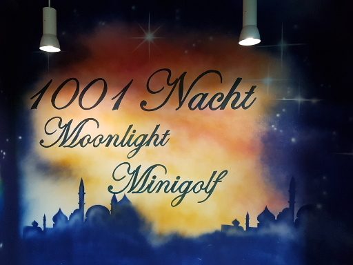
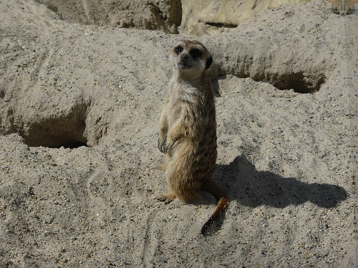

## Swimming

The [Hallenbad Grünwald](https://www.gruenwalder-freizeitpark.de/) ([maps](https://goo.gl/maps/q5PAWoXhdwG2))
has one small pool for babys/children, one pool for swimming and one outdoor
pool. It is open from 9:00 to 21:00 o'clock. Swimming for 2 hours costs only
3.00 EUR ([price list](https://www.gruenwalder-freizeitpark.de/schwimmbad-sauna/schwimmbad/)).

There are [many other swimming halls](http://www.muenchen.de/freizeit/mbaeder/therme-erlebnisbad.html).

## Mini-Golf

The [Dreambowl Palace](https://www.dreambowl.de/standorte/dream-bowl-palace-muenchen-unterfoehring/indoor-minigolf/) ([maps](https://goo.gl/maps/FZthKWVHfcR2), [website](https://www.dreambowl.de/standorte/dream-bowl-palace-muenchen-unterfoehring/indoor-minigolf/)) you can play Bowling, Mini-Golf and Air Hockey. The price for [Mini-Golf is 5.50 EUR](https://www.dreambowl.de/wp-content/uploads/PA-Preisliste_NEU_ab_01.09.2017.pdf).

<figure class="wp-caption aligncenter img-thumbnail">
    
    <figcaption class="text-center">1001 Nacht Moonlight Minigolf</figcaption>
</figure>

## Zoo

The [Tierpark Hellabrunn](https://de.wikipedia.org/wiki/Tierpark_Hellabrunn) ([map](https://goo.gl/maps/DXc6ApHk2Q22))
has about 19000 animals. It is open [from 9:00 to 17:00](http://www.hellabrunn.de/besuch-planen/oeffnungszeiten/) o'clock
and costs [15.00 EUR for adults](http://www.hellabrunn.de/besuch-planen/tickets/).

<figure class="wp-caption aligncenter img-thumbnail">
    
    <figcaption class="text-center">Monkey with its child</figcaption>
</figure>

<figure class="wp-caption aligncenter img-thumbnail">
    
    <figcaption class="text-center">Meerkat</figcaption>
</figure>

<figure class="wp-caption aligncenter img-thumbnail">
    
    <figcaption class="text-center">Elephant</figcaption>
</figure>

There is also [Sea Life](https://www.visitsealife.com/de/de/muenchen/). It
costs 13.50 EUR.

The [Botanical Garden](http://www.botmuc.de/de/) is reachable with Tram 17, Bus 143. It costs 4.50 EUR.

## Bouldering

You can go bouldering in at least three places in Munich:

* [Boulderwelt Ost](https://www.boulderwelt-muenchen-ost.de/) (near Ostbahnhof, 11.80 EUR)
* [Boulderwelt West](https://www.boulderwelt-muenchen-west.de/) (near S8 station Neuaubing, 9.90 EUR, [virtual tour](https://www.boulderwelt-muenchen-west.de/halle/))
* [DAV Kletterzentrum Thalkirchen](http://www.kbthalkirchen.de/einfuehrung-bouldern/) (near U3 station Brudermühlstraße, 10.00 EUR)

<iframe width="560" height="315" src="https://www.youtube-nocookie.com/embed/Lyb6vGkIfyM" frameborder="0" gesture="media" allow="encrypted-media" allowfullscreen></iframe>

Don't be afraid that you might fall. The floor is soft and you don't climb
high. And most people are not that good anyway.

## Airhop

[Airhop](http://www.airhoppark.de/muenchen/) is in the north of Munich ([maps](https://goo.gl/maps/siYRbCjYgSw)), it costs [12.00 EUR for one hour](http://www.airhoppark.de/preise-muenchen/).

## Escape Games

Escape Games, Secret Rooms, Mystery Rooms: They have many names. In essence it
is always about being locked in a room and having to solve a riddle to come
out.

In Munich, there are:

* [Mystery Rooms](http://mystery-rooms.com/muenchen/)
* [Escape Game Munich](http://escapegame-muenchen.de/)
* [Exit the Room](https://www.exittheroom.de/muenchen)
* [Adventure Rooms](http://www.adventurerooms-munich.de)
* [Team Escape](https://teamescape.com/munich/de/escape-room-munich.html)
* [Foxinabox](http://foxinaboxmuenchen.de/)

and likely many more. I haven't tried any of those as you need a team for it...
and coordinating / planning to do this is difficult.

## Cinema

* [Filmpalast Royal](https://royal-muenchen.de/kino/home/city308): [Map](https://goo.gl/maps/HC9sQaTh2QN2) (near U3/U6 Goetheplatz)
* [Cinemaxx Munich](https://www.cinemaxx.de/muenchen): [Map](https://goo.gl/maps/KnjU3PoSFnu) (near Isartor)
* [Many more](https://www.kino.de/kinoprogramm/stadt/muenchen/)

## Museums

* [Deutsches Museum](https://en.wikipedia.org/wiki/Deutsches_Museum): It also contains a [Planetarium](http://www.deutsches-museum.de/ausstellungen/naturwissenschaft/planetarium/)
* [Valentin Museum](http://www.valentin-musaeum.de)
* [Museum of Urban and Contemporary Art](http://www.muca.eu)

## Bayerische Volkssternwarte

* See [Website](http://www.muenchen.de/sehenswuerdigkeiten/orte/120489.html): 6.00 EUR

## Tollwood

See [Tollwood Webiste](https://www.tollwood.de/)

## Food

I would like to try the following:

* [Ja Mai](http://www.ja-mai.com)
* [Trader Vic](http://www.bayerischerhof.de/de/erleben-geniessen/restaurants-bars/restaurants/trader-vics.html)

## Other

* [Theater](http://www.muenchen.de/veranstaltungen/events/theater.html)

## Summer only

* Hiking
* Eisbachwelle
* Beer Garden
* Skyline Park
* [Kletterwald München](https://www.kletterwald-muenchen.de): 23.00 EUR
* Freizeitpark Ruhpolding: 13.50 EUR
