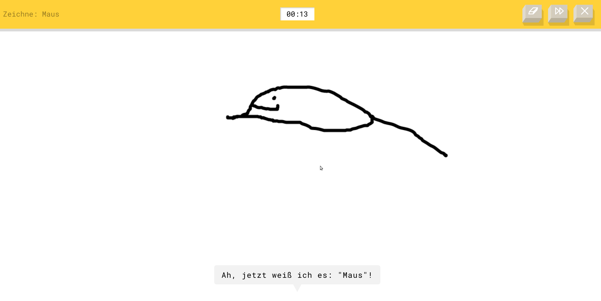
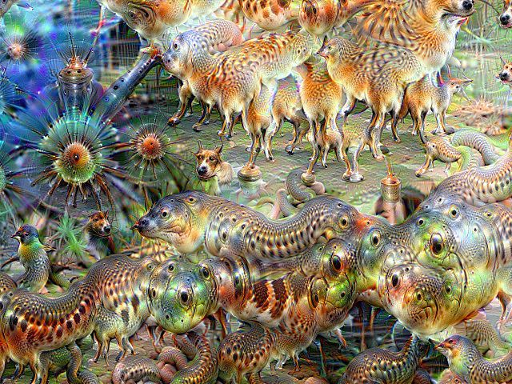
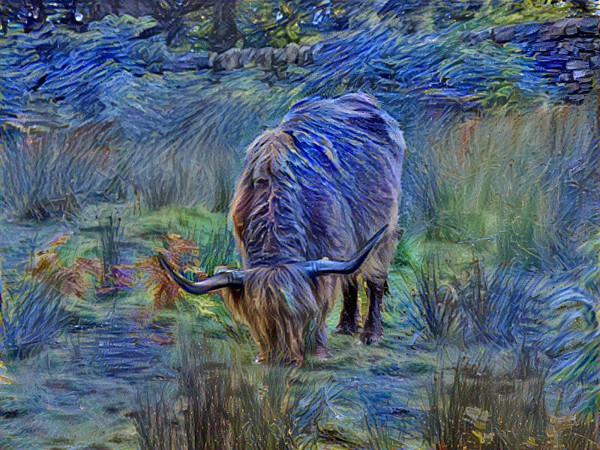
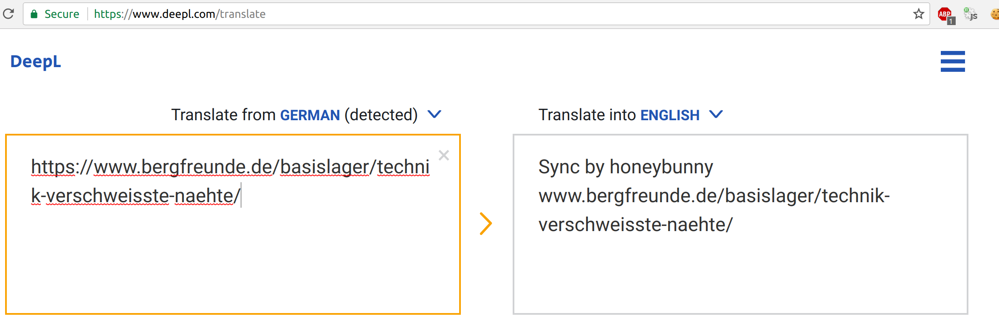
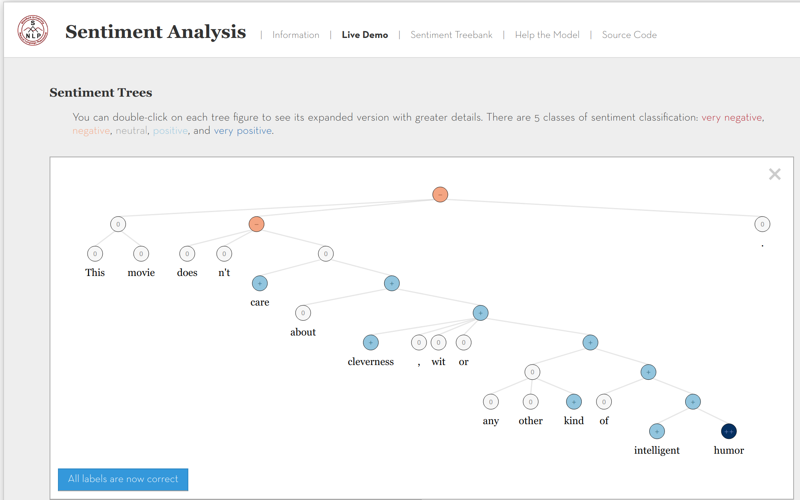
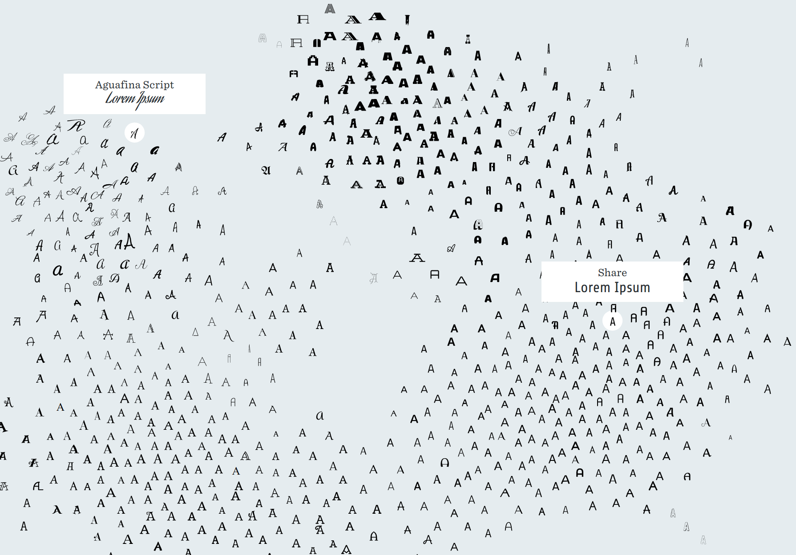
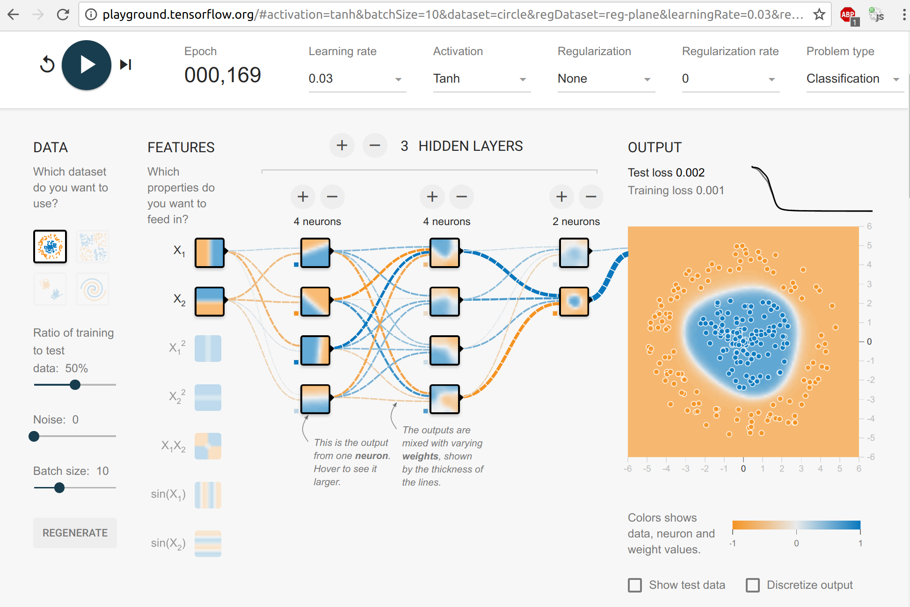

There are many awesome examples out there where you can get a very direct
feeling for what Machine Learning is. I'll collect a couple of them here.

## Image Input Data

### Math Symbol Recognition

The <a href="http://write-math.com/">write-math.com</a>
web service allows you to recognize mathematical symbols automatically. It is
described in <a href="https://arxiv.org/abs/1511.09030">my bachelors thesis</a>.
The <a href="http://www.martin-thoma.de/write-math/data/#thoma2014">HWRT data is available</a>,
also in its rendered form as <a href="https://arxiv.org/abs/1701.08380">HASYv2 dataset</a>.

<figure class="wp-caption aligncenter img-thumbnail">
    
    <figcaption class="text-center">write-math.com</figcaption>
</figure>

### Drawings

<a href="https://quickdraw.withgoogle.com">Quickdraw</a> lets you recognize
drawings. They built a [database of 50 million drawings](https://quickdraw.withgoogle.com/data).

<figure class="wp-caption aligncenter img-thumbnail">
    
    <figcaption class="text-center">Quickdraw</figcaption>
</figure>

Using this kind of data, you can create an application which recognizes what
was drawn and improves the drawing. <a href="https://www.autodraw.com/">autodraw.com</a>
does so:

<figure class="wp-caption aligncenter img-thumbnail">
    
    <figcaption class="text-center">autodraw.com: I wanted to draw a mouse (the animal)</figcaption>
</figure>

### Deep Dream

Deep Dream is a technique which needs a few more words to explain. You can read
my paper [Creativity in Machine Learning](https://arxiv.org/abs/1601.03642) if
you are interested in a very high level overview. If you just want to play with
it, have a look at <a href="https://deepdreamgenerator.com">deepdreamgenerator.com</a>.

<figure class="wp-caption aligncenter img-thumbnail">
    
    <figcaption class="text-center">Deep Dream of a <a href="https://commons.wikimedia.org/wiki/File:Aurelia-aurita-3.jpg">Moon jelly</a></figcaption>
</figure>

### Style Transfer

You have two images: A style image (e.g. by a painter) and a source image. You
want the source image to be in the style of the style image:

Source image:

<figure class="wp-caption aligncenter img-thumbnail">
    
    <figcaption class="text-center">Original image of a highland cattle</figcaption>
</figure>

Style image:

<figure class="wp-caption aligncenter img-thumbnail">
    
    <figcaption class="text-center">Style image: <a href="https://commons.wikimedia.org/wiki/File:Van_Gogh_-_Starry_Night_-_Google_Art_Project.jpg">Van Gogh - Starry Night</a></figcaption>
</figure>

Output image:

<figure class="wp-caption aligncenter img-thumbnail">
    
    <figcaption class="text-center">Applied style transfer</figcaption>
</figure>

<a href="https://deepart.io">https://deepart.io</a> seems to be a web service
for this kind of machine learning. I didn't try it, though.

## Text Input Data

### Translation

<a href="deepl.com/translate">DeepL.com</a> is much better than <a href="translate.google.com">https://translate.google.com</a>,
but also more restricted. As always, you can find some... interesting... translations:

<figure class="wp-caption aligncenter img-thumbnail">
    
    <figcaption class="text-center">DeepL Fail</figcaption>
</figure>

### Sentiment Analysis

<figure class="wp-caption aligncenter img-thumbnail">
    
    <figcaption class="text-center">Stanford NLP: Sentiment analysis</figcaption>
</figure>

### Text To Speech (TTS)

<a href="https://lyrebird.ai/demo/">Lyrebird.ai</a> has the most impressive TTS
system I have seen so far (although Googles <a href="https://google.github.io/tacotron/publications/tacotron2/index.html">Tacotron 2 audio samples</a> are impressive as well).

## Other ML

### Clustering

Besides my small <a href="https://martin-thoma.com/k-nearest-neighbor-classification-interactive-example/">k-means clustering example</a>, there is <a href="http://projector.tensorflow.org/">Tensorflow Projector</a>

### 2D Embeddings

Mapping datapoints in 2D makes it easier to find what you are looking for.
Have a look at <a href="http://fontmap.ideo.com/">fontmap</a>:

<figure class="wp-caption aligncenter img-thumbnail">
    
    <figcaption class="text-center">Fontmap: Organizing fonts in 2D map</figcaption>
</figure>

### Classifiers

Karpathy made a couple of interactive examples which show the decision boundaries
of classifiers:

* [Random Forest](http://cs.stanford.edu/~karpathy/svmjs/demo/demoforest.html)
* [SVM](http://cs.stanford.edu/people/karpathy/svmjs/demo/)
* [CNN](http://cs.stanford.edu/people/karpathy/convnetjs/demo/classify2d.html)
* [Neural Network](http://playground.tensorflow.org/#activation=tanh&batchSize=10&dataset=circle&regDataset=reg-plane&learningRate=0.03&regularizationRate=0&noise=0&networkShape=4,2&seed=0.98949&showTestData=false&discretize=false&percTrainData=50&x=true&y=true&xTimesY=false&xSquared=false&ySquared=false&cosX=false&sinX=false&cosY=false&sinY=false&collectStats=false&problem=classification&initZero=false&hideText=false)

<figure class="wp-caption aligncenter img-thumbnail">
    
    <figcaption class="text-center">Tensorflow Playground: See how neural networks learn</figcaption>
</figure>

## Honorable Mentions

* [howhot.io](http://howhot.io) was a service which lets you upload an image with a face and rate how hot the person is. It is no longer available.
* Microsoft Chatbot Tay went racist ([source](https://www.theguardian.com/technology/2016/mar/30/microsoft-racist-sexist-chatbot-twitter-drugs))
* [A visual introduction to machine learning](http://www.r2d3.us/visual-intro-to-machine-learning-part-1/)
* Martin Thoma, 2016: [Creativity in Machine Learning](https://arxiv.org/abs/1601.03642)
* Alex Rogozhnikov, 2016: [Gradient Boosting explained ](https://arogozhnikov.github.io/2016/06/24/gradient_boosting_explained.html)
* Alex Rogozhnikov, 2016: [Hamiltonian Monte Carlo explained](https://arogozhnikov.github.io/2016/12/19/markov_chain_monte_carlo.html)
* [GridWorld: Dynamic Programming Demo](http://cs.stanford.edu/people/karpathy/reinforcejs/gridworld_dp.html)
* Wattenberg et al, 2016: [How to Use t-SNE Effectively](https://distill.pub/2016/misread-tsne/)
