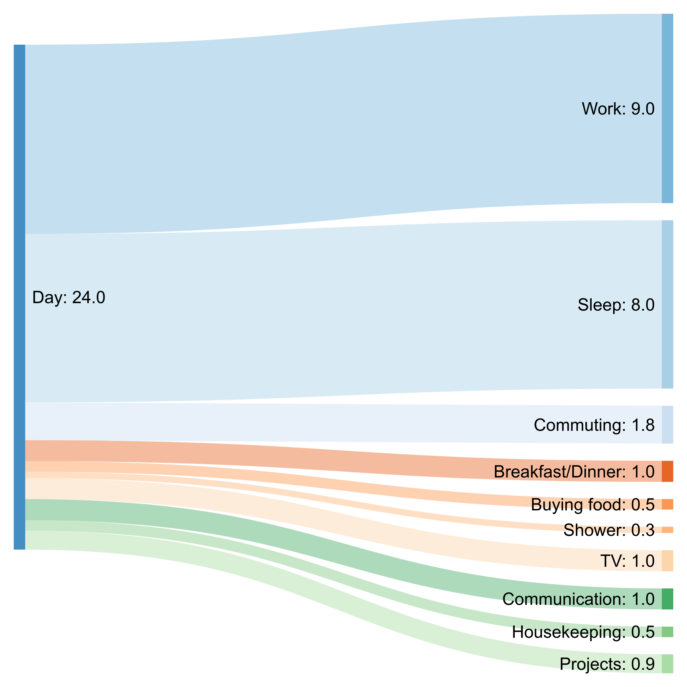

Sankey diagrams can be used to visualize the breakdown of money / electriciy.
You have a big base value like the energy used by an average single German in
December 2017. Then you build big clusters:

* Transportation
* Household
* Other

and you might be able to split household up again:

* Heating
* Refrigerator
* Computer(s)
* Other

The online tool [sankeymatic.comhttp://sankeymatic.com/build/) can build quite
nice Sankey diagrams with a simple interface.


## Example

A typical workday in Munich:

```text
Study [9] Day
Sleep [8] Day
Commuting [0.4] Day
Breakfast/Dinner/Lunch [1.0] Day
Buying food [0.3] Day
Shower [0.3] Day
TV [0.3] Day
Communication [1] Day
Housekeeping [0.5] Day
Projects [2.5] Day
Day [9] Work
Day [8] Sleep
Day [1.8] Commuting
Day [1] Breakfast/Dinner
Day [0.5] Buying food
Day [0.3] Shower
Day [1] TV
Day [1] Communication
Day [0.5] Housekeeping
Day [0.9] Projects
```

gives

<figure class="wp-caption aligncenter img-thumbnail">
    
    <figcaption class="text-center">A typical workday in Munich</figcaption>
</figure>


and

```text
Day [9.5] Study
Study [6] Lectures
Study [1] Self-study
Study [1] Group-study
Study [1] Projects
Study [0.5] Communication
Day [7.5] Sleep
Day [0.4] Commuting
Day [1.0] Breakfast/Dinner/Lunch
Day [0.3] Buying food
Day [0.3] Shower
Day [0.5] TV
Day [1] Sports
Day [0.5] Communication
Day [0.5] Housekeeping
Day [2.5] Projects
```

<figure class="wp-caption aligncenter img-thumbnail">
    
    <figcaption class="text-center">Typical workday in Karlsruhe (while studying)</figcaption>
</figure>
