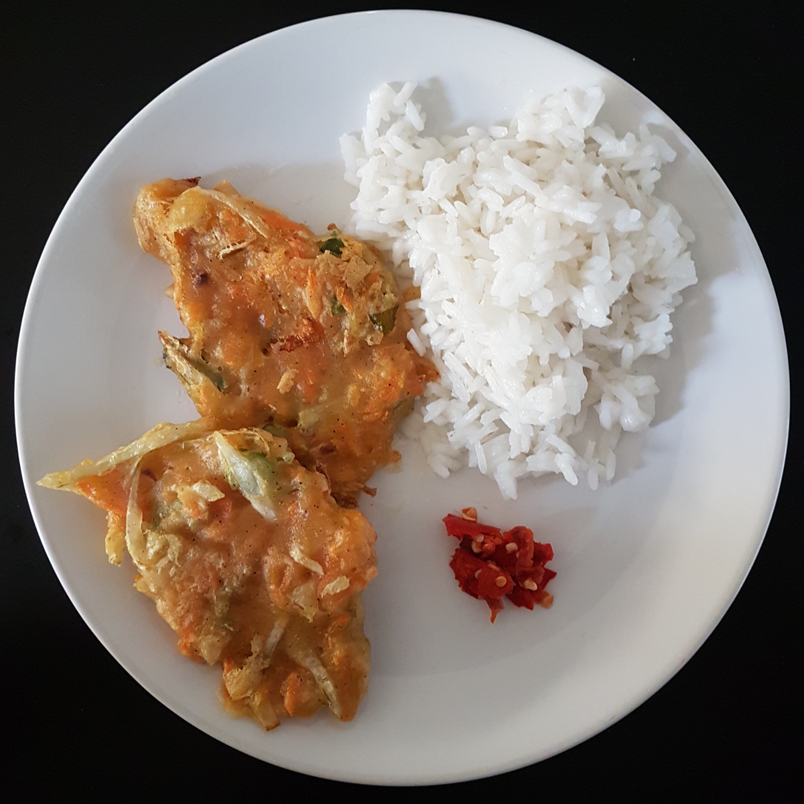

Bala Bala is an Indonesian dish. It can be eaten alone, with rice or with
Sambel goang.

<figure class="wp-caption aligncenter img-thumbnail">
    
    <figcaption class="text-center">Bala bala with rice and Sambel goang</figcaption>
</figure>

This takes approximately 45 minutes.

## Ingredients

For 4 people, you need:

* 400g [Wheat Flour](https://en.wikipedia.org/wiki/Flour) (e.g. Type 405)
* 3 small spoons of Thai Spices (e.g. "Rosdee" Food Seasoning with Chicken Flavour) or chicken broth pouder
* 3 [Carrots](https://en.wikipedia.org/wiki/Carrot)
* 1/4th [White Cabbage](https://en.wikipedia.org/wiki/File:Cabbage_and_cross_section_on_white.jpg)
* 1 [long green onion](https://commons.wikimedia.org/wiki/File:Daepa_(Allium_fistulosum).jpg)
* 300ml of water
* Salt
* Pepper
* Oil of frying (at least 100ml)

Optionally:

* 140g corn

## Tools

* 1 Big bowl
* 1 Sharp knife and [cutting board](https://en.wikipedia.org/wiki/File:Br%C3%B8d_med_V%C3%A4sterbotten-ost_og_r%C3%B8get_gedeost_(5205155586).jpg)
* 1 [Peeler](https://commons.wikimedia.org/wiki/File:Sparschaeler.jpg)
* 1 [Grater](https://commons.wikimedia.org/wiki/File:Orangefarbene_Gem%C3%BCsereibe_(38499439821).jpg)
* 1 frying pan
* 1 [spatula](https://commons.wikimedia.org/wiki/File:Pfannenwender-1.jpg)

## Preparation

Peel the carrots and use the Grater to make small pieces. Cut the green onion
into pieces.

Put the weat and the spices in the bowl and mix it. Add the carrots, the
cabbage and the onions and mix again. Add the water, salt and pepper. Mix until
you get a homogenious dough. Add more water, if you can't mix the stuff. Add more wheat if it is
not sticking together.

Put the oil in the pan. The oil should be at least 0.5cm high. Heat the oil until it
is hot.

Put the dough in it. Fry to the degree you like.
