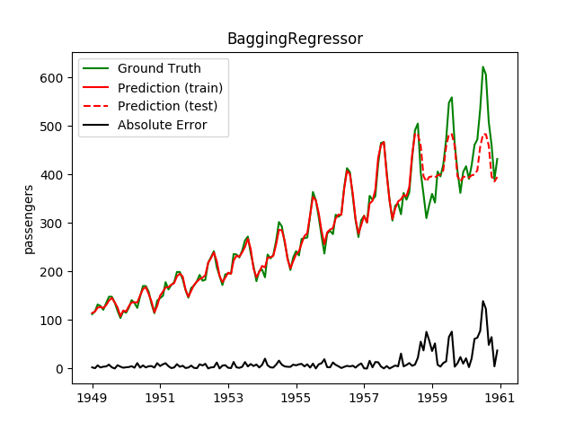
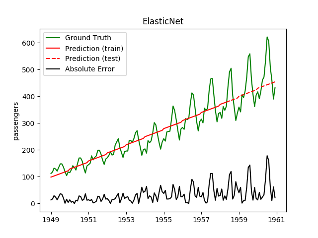
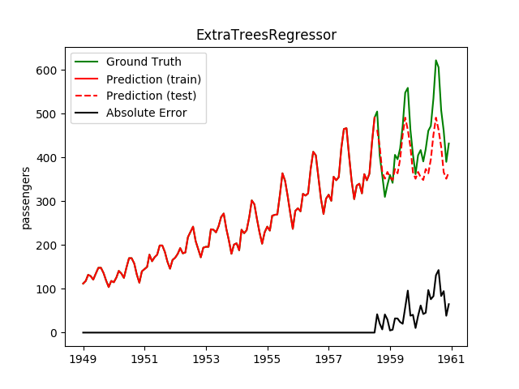
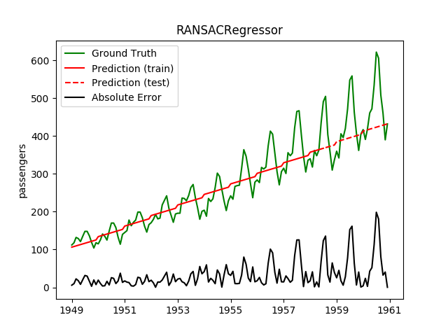
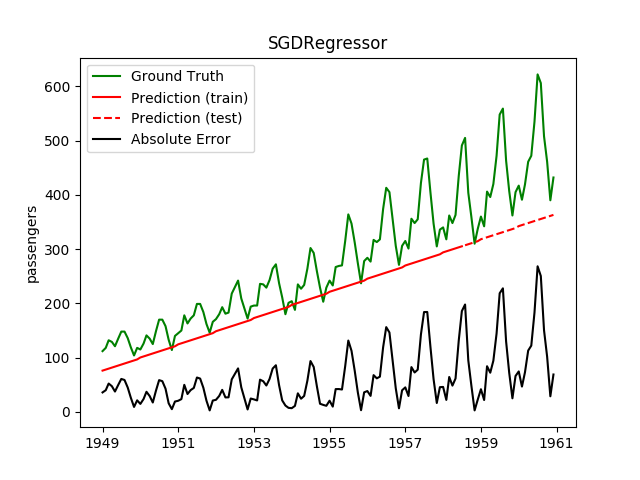
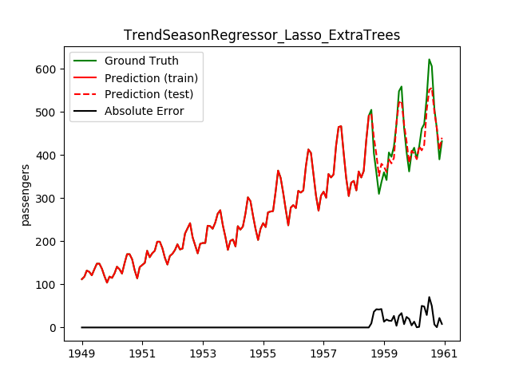
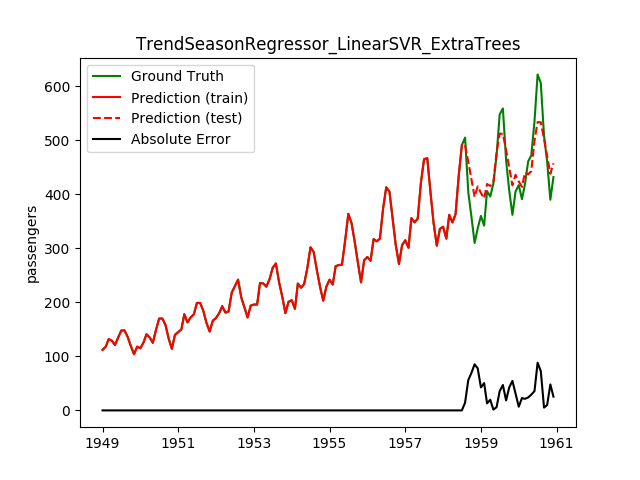
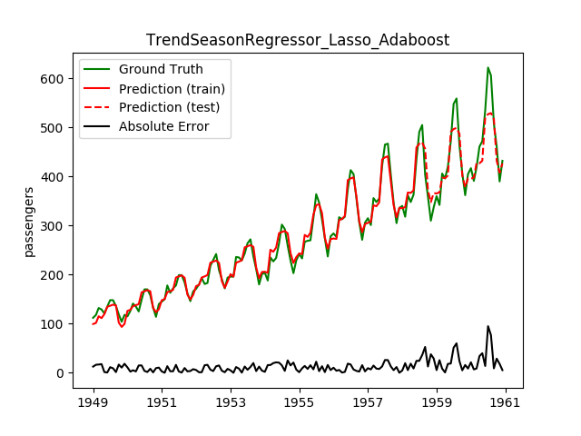

Today, I played a bit with the [International airline passengers dataset](https://datamarket.com/data/set/22u3/international-airline-passengers-monthly-totals-in-thousands-jan-49-dec-60#!ds=22u3&display=line).

It's only feature is a date given by year and month. One should predict the
number of passengers (in thousands).

## Code

See [Github](https://github.com/MartinThoma/algorithms/blob/master/ML/regression/airline-passengers/main.py).

## Scoring functions

In the following, $y$ is the ordered list of target, $y^P$ is the list
of predictions in the same order and \bar{y} is the mean of $y$.

<table class="table">
    <thead>
    <tr>
        <th>Name</th>
        <th>Image</th>
        <th>X is better</th>
        <th>Definition and Usage</th>
    </tr>
</thead>
    <tbody>
    <tr>
        <td>MAE</td>
        <td>$[0, \infty)$</td>
        <td>lower</td>
        <td>$f(y, y^P) = \frac{1}{|y|} \sum_{y_i, y_i^P \in (y, y^P)} |y_i - y_i^P|$</td>
    </tr>
    <tr>
        <td>MSE</td>
        <td>$[0, \infty)$</td>
        <td>lower</td>
        <td>$f(y, y^P) = \frac{1}{|y|} \sum_{y_i, y_i^P \in (y, y^P)} (y_i - y_i^P)^2$</td>
    </tr>
    <tr>
        <td>$R^2$</td>
        <td>$[0, 1]$</td>
        <td>higher</td>
        <td>$f(y, y^P) = 1 - \frac{\sum (y_i - y_i^P)^2}{\sum (y_i - \bar{y})^2}$</td>
    </tr>
    <tr>
        <td>Explained Variance</td>
        <td>$(-\infty, 1]$</td>
        <td>higher</td>
        <td>$f(y, y^P) = 1 - \frac{Var(y - y^P)}{Var(y)}$</td>
    </tr>
</tbody>
</table>

See also:

* [What is the difference between “coefficient of determination” and “mean squared error”?](https://stats.stackexchange.com/q/32596/25741)

## Results

<table class="table">
<tr>
    <th>name</th>
    <th>training time</th>
    <th>testing time</th>
    <th><a href="https://en.wikipedia.org/wiki/Mean_absolute_error" title="Mean absolute error">MAE</a></th>
    <th><a href="https://en.wikipedia.org/wiki/Median_absolute_deviation" title="Median absolute deviation">MAD</a></th>
    <th><a href="https://en.wikipedia.org/wiki/Coefficient_of_determination">$R^2$</a></th>
    <th><a href="http://scikit-learn.org/stable/modules/generated/sklearn.metrics.explained_variance_score.html">explained variance</a></th>
    <th><a href="https://en.wikipedia.org/wiki/Mean_squared_error" title="Mean squared error">MSE</a></th>
<tr>
<tr>
    <td>GradientBoostingRegressor</td>
    <td>11.6ms</td>
    <td> 0.1ms</td>
    <td style="background-color: green;">40.0</td>
    <td style="background-color: green;">31.0</td>
    <td style="background-color: green;">0.5689</td>
    <td style="background-color: green;">0.6246</td>
    <td style="background-color: green;">2631.9</td>
</tr>
<tr>
    <td>GaussianProcessRegressor</td>
    <td> 8.4ms</td>
    <td> 0.2ms</td>
    <td style="background-color: red;">150.9</td>
    <td>85.9</td>
    <td style="background-color: red;">-8.0324</td>
    <td style="background-color: red;">-6.7089</td>
    <td style="background-color: red;">55138.3</td>
</tr>
<tr>
    <td>AdaBoostRegressor</td>
    <td style="background-color: red;">69.3ms</td>
    <td> 1.1ms</td>
    <td>60.1</td>
    <td>53.3</td>
    <td style="background-color: green;">0.1240</td>
    <td>0.5812</td>
    <td style="background-color: red;">5347.3</td>
</tr>
<tr>
    <td>SGDRegressor</td>
    <td> 0.8ms</td>
    <td> 0.1ms</td>
    <td style="background-color: red;">106.5</td>
    <td>84.8</td>
    <td style="background-color: red;">-1.7081</td>
    <td style="background-color: red;">0.1471</td>
    <td>16531.5</td>
</tr>
<tr>
    <td><a href="http://scikit-learn.org/stable/modules/linear_model.html#ransac-random-sample-consensus">RANSACRegressor</a></td>
    <td> 4.1ms</td>
    <td style="background-color: green;"> 0.0ms</td>
    <td>68.5</td>
    <td>39.4</td>
    <td style="background-color: red;">-0.4294</td>
    <td style="background-color: red;">0.1479</td>
    <td>8726.0</td>
</tr>
<tr>
    <td><a href="http://scikit-learn.org/stable/modules/linear_model.html#passive-aggressive">PassiveAggressiveRegressor</a></td>
    <td style="background-color: green;"> 0.2ms</td>
    <td style="background-color: green;"> 0.0ms</td>
    <td style="background-color: red;">115.8</td>
    <td style="background-color: red;">115.5</td>
    <td style="background-color: red;">-1.8841</td>
    <td style="background-color: red;">0.1268</td>
    <td>17606.2</td>
</tr>
<tr>
    <td>BaggingRegressor</td>
    <td>13.4ms</td>
    <td> 0.9ms</td>
    <td>46.7</td>
    <td>37.1</td>
    <td>0.4162</td>
    <td>0.4912</td>
    <td>3564.0</td>
</tr>
<tr>
    <td><a href="http://scikit-learn.org/stable/modules/generated/sklearn.linear_model.HuberRegressor.html">HuberRegressor</a></td>
    <td> 8.0ms</td>
    <td style="background-color: green;"> 0.0ms</td>
    <td>65.4</td>
    <td>59.8</td>
    <td style="background-color: red;">-0.0745</td>
    <td>0.0395</td>
    <td>6559.5</td>
</tr>
<tr>
    <td>RandomForestRegressor</td>
    <td style="background-color: red;">18.6ms</td>
    <td> 5.2ms</td>
    <td>48.3</td>
    <td>38.5</td>
    <td>0.4336</td>
    <td style="background-color: green;">0.6535</td>
    <td>3457.7</td>
</tr>
<tr>
    <td>ExtraTreesRegressor</td>
    <td style="background-color: red;">17.2ms</td>
    <td> 4.7ms</td>
    <td>44.1</td>
    <td>33.2</td>
    <td>0.4744</td>
    <td>0.5036</td>
    <td>3208.6</td>
</tr>
<tr>
    <td><a href="https://martin-thoma.com/svm-with-sklearn/">SVR</a></td>
    <td> 2.1ms</td>
    <td> 0.3ms</td>
    <td style="background-color: red;">202.2</td>
    <td style="background-color: red;">182.0</td>
    <td style="background-color: red;">-6.6885</td>
    <td style="background-color: red;">0.0105</td>
    <td style="background-color: red;">46934.4</td>
</tr>
<tr>
    <td>Linear SVR + Standardscaler</td>
    <td> 1.4ms</td>
    <td> 0.2ms</td>
    <td>84.1</td>
    <td>60.6</td>
    <td style="background-color: red;">-0.9573</td>
    <td style="background-color: red;">0.1338</td>
    <td>11948.3</td>
</tr>
<tr>
    <td><a href="http://scikit-learn.org/stable/modules/generated/sklearn.linear_model.ElasticNet.html">ElasticNet</a></td>
    <td> 0.3ms</td>
    <td style="background-color: green;"> 0.0ms</td>
    <td>56.0</td>
    <td>41.7</td>
    <td>0.1069</td>
    <td style="background-color: red;">0.1698</td>
    <td>5452.0</td>
</tr>
<tr>
    <td><a href="http://scikit-learn.org/stable/modules/generated/sklearn.linear_model.Lasso.html">Lasso</a></td>
    <td> 0.4ms</td>
    <td style="background-color: green;"> 0.0ms</td>
    <td>56.0</td>
    <td>41.5</td>
    <td>0.1069</td>
    <td style="background-color: red;">0.1698</td>
    <td>5451.8</td>
</tr>
</table>

I like the median absolute error best, because it tells me how many passengers
my prediction is typically away from the true prediction.

Please note that bad results here do not mean the regressor is bad. Some might
just use their full potential with more data, some might be better suited to
different regression problems, e.g. interpolation instead of extrapolation or
working with higher dimensional data.

## Graphs

Plotting the prediction is crucial for extrapolation. For example, have a look
at

<figure class="wp-caption aligncenter img-thumbnail">
    
    <figcaption class="text-center">AdaBoostRegressor for extrapolation.</figcaption>
</figure>

<figure class="wp-caption aligncenter img-thumbnail">
    
    <figcaption class="text-center">BaggingRegressor for extrapolation.</figcaption>
</figure>

<figure class="wp-caption aligncenter img-thumbnail">
    
    <figcaption class="text-center">ElasticNet for extrapolation.</figcaption>
</figure>

<figure class="wp-caption aligncenter img-thumbnail">
    
    <figcaption class="text-center">ExtraTreesRegressor for extrapolation.</figcaption>
</figure>

<figure class="wp-caption aligncenter img-thumbnail">
    
    <figcaption class="text-center">GaussianProcessRegressor for extrapolation.</figcaption>
</figure>

<figure class="wp-caption aligncenter img-thumbnail">
    
    <figcaption class="text-center">GradientBoostingRegressor for extrapolation.</figcaption>
</figure>

<figure class="wp-caption aligncenter img-thumbnail">
    
    <figcaption class="text-center">HuberRegressor for extrapolation.</figcaption>
</figure>

<figure class="wp-caption aligncenter img-thumbnail">
    
    <figcaption class="text-center">Lasso for extrapolation.</figcaption>
</figure>

<figure class="wp-caption aligncenter img-thumbnail">
    
    <figcaption class="text-center">SVR for extrapolation.</figcaption>
</figure>

<figure class="wp-caption aligncenter img-thumbnail">
    
    <figcaption class="text-center">PassiveAggressiveRegressor for extrapolation.</figcaption>
</figure>

<figure class="wp-caption aligncenter img-thumbnail">
    
    <figcaption class="text-center">RandomForestRegressor for extrapolation.</figcaption>
</figure>

<figure class="wp-caption aligncenter img-thumbnail">
    
    <figcaption class="text-center">RANSACRegressor for extrapolation.</figcaption>
</figure>

<figure class="wp-caption aligncenter img-thumbnail">
    
    <figcaption class="text-center">SGDRegressor for extrapolation.</figcaption>
</figure>

<figure class="wp-caption aligncenter img-thumbnail">
    
    <figcaption class="text-center">SVR for extrapolation.</figcaption>
</figure>

What we can see in those images is that there are two things to match: A global
trend and local seasonality-effects.

<table class="table">
    <thead>
    <tr>
        <th>Model</th>
        <th>Trend</th>
        <th>Seasonality</th>
        <th>Comment</th>
    </tr>
</thead>
<tbody>
    <tr>
        <td>AdaBoostRegressor</td>
        <td>No</td>
        <td>Yes</td>
        <td></td>
    </tr>
    <tr>
        <td>BaggingRegressor</td>
        <td>No</td>
        <td>Yes</td>
        <td></td>
    </tr>
    <tr>
        <td>ElasticNet</td>
        <td>Yes</td>
        <td>No</td>
        <td></td>
    </tr>
    <tr>
        <td>ExtraTreesRegressor</td>
        <td>No</td>
        <td>Yes</td>
        <td></td>
    </tr>
    <tr>
        <td>GaussianProcessRegressor</td>
        <td>No</td>
        <td>Kind of</td>
        <td></td>
    </tr>
    <tr>
        <td>GradientBoostingRegressor</td>
        <td>No</td>
        <td>Yes</td>
        <td></td>
    </tr>
    <tr>
        <td>HuberRegressor</td>
        <td>Yes</td>
        <td>Yes</td>
        <td>Both are captured pretty bad</td>
    </tr>
    <tr>
        <td>Lasso</td>
        <td>Yes</td>
        <td>No</td>
        <td></td>
    </tr>
    <tr>
        <td>SVR</td>
        <td>Yes</td>
        <td>No</td>
        <td></td>
    </tr>
    <tr>
        <td>PassiveAggressiveRegressor</td>
        <td>Yes</td>
        <td>Yes</td>
        <td>Both are captured pretty bad</td>
    </tr>
    <tr>
        <td>RandomForestRegressor</td>
        <td>No</td>
        <td>Yes</td>
        <td></td>
    </tr>
    <tr>
        <td>RANSACRegressor</td>
        <td>Yes</td>
        <td>No</td>
        <td></td>
    </tr>
    <tr>
        <td>SGDRegressor</td>
        <td>Yes</td>
        <td>No</td>
        <td></td>
    </tr>
    <tr>
        <td>SVR</td>
        <td>No</td>
        <td>No</td>
        <td></td>
    </tr>
</tbody>
</table>

Seeing this result, I decided to have two models: One which predicts the trend
and one which predicts seasonality effects.

## Combining models

The simplest way to combine two regression models is by

$$f(x) = f_1(x) + f_2(x)$$

But I also want to simpify the training. So I decided to have the following
training setup:

1. Fit $f_1$ on the training dataset, where $f_1$ has to predict the global
   trend and thus solve the extrapolation problem. Lasso seems to be a good
   choice.
2. Transform the training data $(X, y)$: $$y' = y - f_1(X)$$
3. Fit $f_2$ on $(X, y')$. So $f_2$ has to solve an interpolation problem.

I call this model `TrendSeasonRegressor`. Let's try a few combinations:

<table class="table" id="combinedModelScores">
    <thead>
    <tr>
        <th>$f_1$</th>
        <th>$f_2$</th>
    <th><a href="https://en.wikipedia.org/wiki/Mean_absolute_error" title="Mean absolute error">MAE</a></th>
    <th><a href="https://en.wikipedia.org/wiki/Median_absolute_deviation" title="Median absolute deviation">MAD</a></th>
    <th><a href="https://en.wikipedia.org/wiki/Coefficient_of_determination">$R^2$</a></th>
    <th><a href="http://scikit-learn.org/stable/modules/generated/sklearn.metrics.explained_variance_score.html">explained variance</a></th>
    <th><a href="https://en.wikipedia.org/wiki/Mean_squared_error" title="Mean squared error">MSE</a></th>
        <th>Image</th>
    </tr>
</thead>
<tbody>
    <tr>
        <td colspan="2">GradientBoostingRegressor</td>
        <td style="background-color: red;">40.0</td>
        <td style="background-color: red;">31.0</td>
        <td style="background-color: red;">0.5689</td>
        <td style="background-color: red;">0.6246</td>
        <td style="background-color: red;">2631.9</td>
        <td><figure class="wp-caption aligncenter img-thumbnail">
            
        </figure></td>
    </tr>
    <tr>
        <td>Lasso</td>
        <td>ExtraTrees</td>
        <td style="background-color: green;">20.8</td>
        <td style="background-color: green;">16.6</td>
        <td style="background-color: green;">0.8803</td>
        <td style="background-color: green;">0.8992</td>
        <td style="background-color: green;">730.9</td>
        <td><figure class="wp-caption aligncenter img-thumbnail">
            
        </figure></td>
    </tr>
    <tr>
        <td>ElasticNet</td>
        <td>ExtraTrees</td>
        <td>25.2</td>
        <td>24.4</td>
        <td>0.8382</td>
        <td>0.8403</td>
        <td>988.0</td>
        <td><figure class="wp-caption aligncenter img-thumbnail">
            
        </figure></td>
    </tr>
    <tr>
        <td>LinearSVR</td>
        <td>ExtraTrees</td>
        <td>36.4</td>
        <td style="background-color: red;">31.1</td>
        <td style="background-color: red;">0.6841</td>
        <td style="background-color: red;">0.7081</td>
        <td style="background-color: red;">1928.2</td>
        <td><figure class="wp-caption aligncenter img-thumbnail">
            
        </figure></td>
    </tr>
    <tr>
        <td>LinearSVR</td>
        <td>Adaboost</td>
        <td>33.7</td>
        <td style="background-color: red;">32.6</td>
        <td style="background-color: red;">0.6918</td>
        <td style="background-color: red;">0.7849</td>
        <td style="background-color: red;">1881.5</td>
        <td><figure class="wp-caption aligncenter img-thumbnail">
            
        </figure></td>
    </tr>
    <tr>
        <td>Lasso</td>
        <td>Adaboost</td>
        <td>26.5</td>
        <td>18.9</td>
        <td>0.8034</td>
        <td>0.8143</td>
        <td style="background-color: red;">1200.4</td>
        <td><figure class="wp-caption aligncenter img-thumbnail">
            
        </figure></td>
    </tr>
    <tr>
        <td>ElasticNet</td>
        <td>Adaboost</td>
        <td>26.5</td>
        <td>19.4</td>
        <td>0.8098</td>
        <td>0.8229</td>
        <td style="background-color: red;">1161.2</td>
        <td><figure class="wp-caption aligncenter img-thumbnail">
            
        </figure></td>
    </tr>
</tbody>
</table>

This looks a lot better! Note how the best model before is now the worst!

However, even with this combination the Gaussian Processes were really bad.
Overshooting like hell.

Next thing to improve: The scaling of the the seasonal trend is not captured so
far.

Another idea I want to dig into is that of residual learning. Where I have only
one model learning the residual of another model, you can chain arbitary many.
Let's see how things change when I chain more than two models.

## Learnings

The following should have become clear from reading this blog post:

* L1: SGDRegressor without scaling is crazy bad.
* L2: Without hyperparameter optimization (e.g. [twiddling](https://martin-thoma.com/twiddle/)),
  SVR is shitty.
* L3: Without scaling, linear SVR runs many hours for training. On a dataset with
  3&nbsp;features and less than 150&nbsp;data points.
* L4: Visualizations are powerful for model evaluation and improvement in
      low-dimensional regression problems.

## See also

* [Comparing Classifiers](https://martin-thoma.com/comparing-classifiers/)
* Sklearn: [Choosing the right estimator](http://scikit-learn.org/stable/tutorial/machine_learning_map/index.html)
