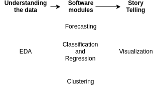
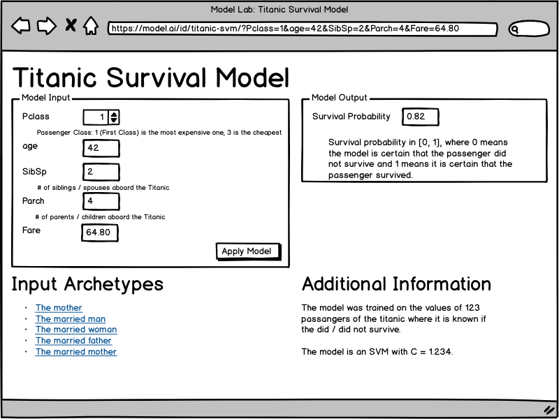

Data Science projects are either pure analytics projects, or Software projects,
or both.

Three typical data science project phases are understanding the data, creating
a software component and then a story telling part:

<figure class="wp-caption aligncenter img-thumbnail">
    
    <figcaption class="text-center">Typical Data Science project phases</figcaption>
</figure>

There are two other steps which I left out as I don't have any rules to follow
or tools that simplify the job: Getting access to the data and data cleaning.

Please also note that waterfall does not work: The project phases are likely
not "pure", but slightly mixed. While you will have an exploratory phase in the
beginning, you will also need to communicate your findings (story telling).

In the following, I will highlight some of the tools to simplify the project
phases and mention what you should do to make the project successful.


## Understanding the Setting

Before there is Data, you have a proces which generates the data. You have a
business with a history. Changes which needed to be done. Not the nice and
clean way, but ASAP. Understanding how the setting helps you to ask reasonable
questions in the next step.


## Understanding the Data

[Exploratory Data Analysis](https://martin-thoma.com/eda/) happens when you
first get a dataset and already have it in a format you can work with. The
linked article already contains quite a bit of software, especially
Pandas, Ipython notebooks and [`edapy`](https://github.com/MartinThoma/edapy)
are useful at this step.

I would create an own repository for this phase. This repository contains code
and some artifacts like images or maybe small parts of the dataset and is
unlike typical software repositories:

* **No tests**: What exactly would you test for? The only thing I could think
  of is boundary and distribution checks, e.g. defining that an "age" has to be
  non-negative and below 200 and should have its median between 20 and 40.
* **No reviews**: It is super hard to review IPython notebooks. Don't get me
  wrong - you should talk about your findings and you should give co-workers
  access to your code, but it does not make sense to expect them to fully go
  through your code. Code for understanding data is likely dirty, because most
  data is dirty.


It's hard to tell when this project phase is over. One artifact that should be
created at the end of this project phase is a **data loading script**. It
should take the data from your typical sources and return it in a format you
can directly work with. This could be CSV to Pandas dataframes. The dataframe
should be cleaned already. The data loading script will be pasted in the
subsequent software project and should get a software review as it is a core
part of the software development.

If you happen to be in a pure exporatory project - meaning somebody told you to
have a look in the data and find interesting things - be aware that this is
hard. Make clear that stakeholders understand that you need regular feedback to
see if you are on the right track. I would say at least once a day. Pure EDA
projects have a high potential to be unsatisfying for everybody.

**Ask Stakeholders for Hypotheses**. Hypothesis checking is a lot more "work as
usual" where you can build up knowledge and finish the task.


## Software Projects

For forecasting, classification and regression you are in a supervised machine
learning tasks. As it is machine learning, you have to have an optimization
metric. In some cases it will be possible to have the same optimization metric
as what your stakeholders use to measure how well this part is doing. If this
is possible, do it: Use the same metric!

Having the same metric to optimize likely leads to better results and gives
your stakeholders an easier time understanding your results. It directly
contributes to the "story telling" aspect.

As with any software project, you should have tests, code reviews, a
[proper project structure](https://martin-thoma.com/python-projects/#project-structure)
and get deployed / used somewhere.

The main difference to typical software projects is the model you create. That
model is perceived as a black box by stakeholders. In the worst case, they
think YOU don't know what the model is doing! I recommend reading
[The Mythos of Model Interpretability](https://arxiv.org/pdf/1606.03490.pdf) to
get some nice conceptual ideas about black boxes. To summarize:

* **Data Scientists understand their models**: We wrote them. There is no way
  to create a complex piece of software that works without understanding it.
* **Black Boxes are common**: If we define a black box as something where we
  don't know 100% instantly and intuitively what happens, then there are a lot
  of black boxes. Humans, for example. But still you trust your doctor.
* **Error types are important**: For a human doctor, you know in which way he
  might do errors. He might be psychologically ill, most likely he will just
  not pay enough attention and thus diagnose something common where you might
  have an issue which is uncommon. For machine learning models, it can be the
  other way around. While overfitting is a problem we are aware of, the
  [model can be fooled](http://www.cleverhans.io/security/privacy/ml/2017/02/15/why-attacking-machine-learning-is-easier-than-defending-it.html) to make a very unusual prediction.

So there are two sides of this problem: On the one hand, it is hard to make
sure that a model is trustworthy. You have to have the right metric(s), you
have to make sure the software works as expected. On the other hand, if you
have a trustworthy model, you have to convince your stakeholders that it is
trustworthy.


### Building Trust

For this part, you have to talk a lot with your stakeholders. They have to get
a basic understanding how your model works. It is especially important to
emphasize that **a model is not a rule-based system**. At least not
necessarily. Decisions can be made in a non-linear way which makes questions
such as "what is the most important feature" problematic.


#### Model Lab

<a href="https://github.com/MartinThoma/model-lab">I've started the development!</a>

You can build trust by giving access to your model. If you can give your
stakeholders an easy to use interface in which they can enter / manipulate
features and see the output of a model, they will either build more trust in
your model or you will get some examples where your model fails. Either way, it
is a win for the project.

<figure class="wp-caption aligncenter img-thumbnail">
    <a href="../images/2018/06/model-playground.png"></a>
    <figcaption class="text-center">Poking a model</figcaption>
</figure>

This wireframe is an idea for a web service which allows data scientists to
share models with stakeholders in a way that they can "poke" it. They see what
the input of the model is, they can manipulate the input and see the output.
Please also note that **the URL contains the models parameters and thus can be
shared**.

How can such a web service look from a software perspective?

Each model consists of a package with a `model.py` which contains an
`infer(input_dict)` function and a `description.json`:

```
{
    "name": "Titanic Survival Model",
    "parameters": [
        {
            "name": "Pclass",
            "label": "Pclass",
            "type": "int",
            "comment": "Passenger Class: 1 (First Class) is the most expensive one, 3 is the cheapest"
        },
        {
            "name": "age",
            "label": "age",
            "type": "float",
            "comment": ""
        },
        {
            "name": "SibSp",
            "label": "SibSp",
            "type": "float",
            "comment": "# of siblings / spouses aboard the Titanic"
        },
        {
            "name": "Parch",
            "label": "Parch",
            "type": "float",
            "comment": "# of parents / children aboard the Titanic"
        },
        {
            "name": "Fare",
            "label": "Fare",
            "type": "float",
            "comment": ""
        }
    ],
    "output": [
        {
            "name": "Survival Probability",
            "comment": "Survival probability in [0, 1], where 0 means the model is certain that the passenger did not survive and 1 means it is certain that the passenger survived."
        }
    ],
    "archetypes": [
        {
            "name": "The mother",
            "parameters": {
                "Pclass": 1,
                "age": 42,
                "SibSp": 12.34,
                "Parch": 3.141,
                "Fare": 2.141
            }
        }
    ],
    "info": {
        "text": "The model was trained on the values of 123 passangers of the titanic where it is known if the did / did not survive.\n\nThe model is an SVM with C = 1.234."
    }
}
```

Types that should be supported:

* `int`
* `float`
* `image`
* `binary` (any file upload)
* `ext:FOO` (files with the extension FOO)


## Story Telling

Story Telling is the part where you, as a data scientist, make your insights
accessible, easy to understand and interpret in the correct way by your
stakeholders. It can be about visualizations, but also about choosing the right
metrics and reasonable numbers to share. I think I'll make another blog post
about this topic as [Python has many visualization packages](https://martin-thoma.com/python-data-visualization/).
