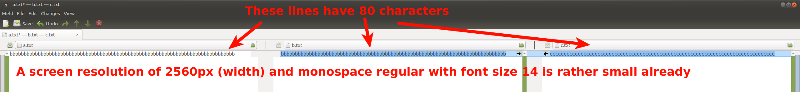
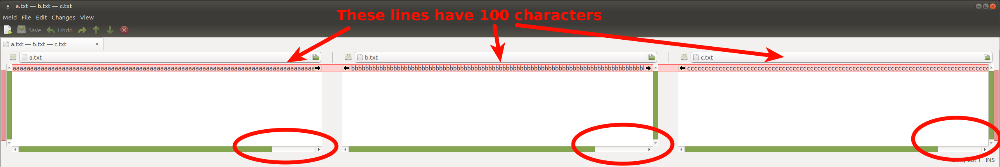

Having a consistent code style for a project is important as it allows
developers to code correctly without thinking too much about it. It makes code
**easier to read, maintain** and after becomming used to the style also
**easier to write**.

Most of the time, it is not too important which standards to follow, but to
decide in the team which ones you want to have and follow those consistently.
To cite from PEP8:

> A style guide is about consistency. Consistency with [PEP8] is important.
> Consistency within a project is more important. Consistency within one module
> or function is the most important.

Python has standards for general coding as well as for docstrings.


## General Coding

### PEP8

The [PEP8](https://www.python.org/dev/peps/pep-0008/) was posted in July 2001
and got an update in 2013.


### PyFlakes

[PyFlakes](https://launchpad.net/pyflakes) is a very common tool to check
Python code for potential errors. I've added the codes to the long table below.


## Docstrings

Python packages are usually documented on a function / class / method / package
level directly in the code. The stuff in `docs/` is often only for building
HTML out of the Python code, organzinging things (e.g. which package to show
first) and a user manual.

There is [PEP257](https://www.python.org/dev/peps/pep-0257/) which defines some
basic stuff. Building on this, there are two docstring style guides which
cannot be combined: NumpyDoc an Google.

Tools like [napoleon](http://sphinxcontrib-napoleon.readthedocs.io/en/latest/)
in combination with Sphinx can automatically create nice docs of both of them.


### NumpyDoc

See [GitHub](https://github.com/numpy/numpy/blob/254c50af3a52c8b1444e46857e9ec59fcb212a41/doc/HOWTO_DOCUMENT.rst.txt) for the guide.

It looks as follows:

```
def get_meta(filepath, a_number, a_dict):
    """
    Get meta-information of an image.

    Lorem ipsum dolor sit amet, consectetuer adipiscing elit. Aenean commodo
    ligula eget dolor. Aenean massa. Cum sociis natoque penatibus et magnis dis
    parturient montes, nascetur ridiculus mus.

    Parameters
    ----------
    filepath : str
        Get metadata from this file
    a_number : int
        Some more details
    a_dict : dict
        Configuration

    Returns
    -------
    meta : dict
        Extracted meta information

    Raises
    ------
    IOError
        File could not be read
    """
```


### Google Style Docstrings

See [Github](https://github.com/google/styleguide/blob/gh-pages/pyguide.md#38-comments-and-docstrings)
for the documentation.

It looks as follows:

```
def get_meta(filepath, a_number, a_dict):
    """Get meta-information of an image.

    Lorem ipsum dolor sit amet, consectetuer adipiscing elit. Aenean commodo
    ligula eget dolor. Aenean massa. Cum sociis natoque penatibus et magnis dis
    parturient montes, nascetur ridiculus mus.

    Args:
        filepath: Get metadata from this file.
        a_number: Some more details.
        a_dict: Configuration.

    Returns:
        Extracted meta information:

    Raises:
        IOError: File could not be read.
    """
```

### SphinxDocString

It's super ugly and I find it hard to read, but this docstring type is also out
there. [SphinxDocString](https://github.com/JetBrains/intellij-community/blob/210e0ed138627926e10094bb9c76026319cec178/python/src/com/jetbrains/python/documentation/docstrings/SphinxDocString.java). They use [reStructuredText](https://en.wikipedia.org/wiki/ReStructuredText):

```
def get_meta(filepath, a_number, a_dict):
    """
    Get meta-information of an image.

    Lorem ipsum dolor sit amet, consectetuer adipiscing elit. Aenean commodo
    ligula eget dolor. Aenean massa. Cum sociis natoque penatibus et magnis dis
    parturient montes, nascetur ridiculus mus.

    :param filepath: Get metadata from this file
    :type filepath: str
    :param a_number: Some more details
    :type a_number: int
    :param a_dict: Configuration
    :type a_dict: dict

    :returns: dict -- Extracted meta information

    :raises: IOError
    """
```


## McCabe code complexity

The [McCabe complexity](https://en.wikipedia.org/wiki/Cyclomatic_complexity)
measures how difficult it is to read your code. To quote from Wikipedia:

> It is a quantitative measure of the number of linearly independent paths
> through a program's source code.
> [...]
> One of McCabe's original applications was to limit the complexity of routines
> during program development; he recommended that programmers should count the
> complexity of the modules they are developing, and split them into smaller
> modules whenever the cyclomatic complexity of the module exceeded 10.[2] This
> practice was adopted by the NIST Structured Testing methodology, with an
> observation that since McCabe's original publication, the figure of 10 had
> received substantial corroborating evidence, but that in some circumstances
> it may be appropriate to relax the restriction and permit modules with a
> complexity as high as 15.

I think McCabe complexity is one way to find spots where the could could be
improved for readability, but I'm not certain how often that actually works.

There is a [mccabe pytest plugin](https://pypi.org/project/pytest-mccabe/).


## Linters

Linters are tools for static code analysis. Static code analysis is the task of
analyzing a computer program without executing it. With executing the program,
it would be dynamic code analysis which is done by coverage testing tools.

Common Python linters are:

* [`pycodestyle`](https://pypi.org/project/pycodestyle/) which replaces `pep8`
* [`pydocstyle`](https://github.com/PyCQA/pycodestyle)
* [`flake8`](https://pypi.org/project/flake8/)
* [`pyrama`](https://pypi.org/project/pyrama/) for checking package structure
* [`radon`](https://github.com/rubik/radon): Measuring the code complexity


What you should forget

* [`pylama`](https://pypi.org/project/pylama/): Only wraps some other tools.
  Use the pytest-plugins for those tools instead.

<div class="info">Don't forget the <a href="https://github.com/psf/black">Black Auto-Formatter</a>. It is maintained by the Python Software Foundation, works well and has reasonable defaults. Makes you think and discuss less about formatting and solves many of the things linters complain about.</div>


### Error Codes

The following error codes are from [`pycodestyle`](http://pycodestyle.pycqa.org/en/latest/intro.html) and
[`pydocstyle`](http://pep257.readthedocs.io/en/latest/error_codes.html).
I added to a couple why they exist and added a suggestion if I think you should take them
(from ✓✓ for a strong YES to ✘✘ for a strong NO). Please also have a
look at [lintlyci.github.io/Flake8Rules](https://lintlyci.github.io/Flake8Rules/)
which gives a lot of good examples for those rules.

There are also two footnotes for some codes:

> (*) In the default configuration, the checks E121, E123, E126, E133, E226,
> E241, E242, E704, W503, W504 and W505 are ignored because they are not rules
> unanimously accepted, and PEP 8 does not enforce them. Please note that if
> the option –ignore=errors is used, the default configuration will be
> overridden and ignore only the check(s) you skip. The check W503 is mutually
> exclusive with check W504. The check E133 is mutually exclusive with check
> E123. Use switch --hang-closing to report E133 instead of E123. Use switch
> --max-doc-length=n to report W505.
>
> (^) These checks can be disabled at the line level using the # noqa special
> comment. This possibility should be reserved for special cases.


<table class="table">
    <thead>
        <tr>
            <th>Code</th>
            <th>Meaning</th>
            <th>Suggestion</th>
        </tr>
    </thead>
    <tbody>
        <tr>
            <th>E1</th>
            <th>Indentation</th>
            <td>Indentation carries a meaning in Python - if code is in a block or not.</td>
        </tr>
        <tr>
            <td>E101</td>
            <td>indentation contains mixed spaces and tabs<br/>
                Why: When you mix spaces and tabs, you will get different indentation for different editor settings.</td>
            <td>✓✓</td>
        </tr>
        <tr>
            <td>E111</td>
            <td>indentation is not a multiple of four<br/>
                Why: My guess is that 95% of all projects use 4 spaces - a single spaces is hard to read and more than
                four is something you don't want to type that often</td>
            <td>✓</td>
        </tr>
        <tr>
            <td>E112</td>
            <td>expected an indented block<br/>
                Why: A bug</td>
            <td>✓✓</td>
        </tr>
        <tr>
            <td>E113</td>
            <td>unexpected indentation<br/>
                Why: A bug</td>
            <td>✓✓</td>
        </tr>
        <tr>
            <td>E114</td>
            <td>indentation is not a multiple of four (comment)<br/>
                Why: Easily leads to bugs</td>
            <td>✓✓</td>
        </tr>
        <tr>
            <td>E115</td>
            <td>expected an indented block (comment)<br/>
                Why: Easily leads to bugs</td>
            <td>✓✓</td>
        </tr>
        <tr>
            <td>E116</td>
            <td>unexpected indentation (comment)<br/>
                Why: Easily leads to bugs</td>
            <td>✓✓</td>
        </tr>
        <tr>
            <td colspan="3"></td>
        </tr>
        <tr>
            <td>E121 (*^)</td>
            <td>continuation line under-indented for hanging indent<br/>
                Why: Usual code style</td>
            <td></td>
        </tr>
        <tr>
            <td>E122 (^)</td>
            <td>continuation line missing indentation or outdented<br/>
                Why: Usual code style</td>
            <td></td>
        </tr>
        <tr>
            <td>E123 (*)</td>
            <td>closing bracket does not match indentation of opening bracket's line<br/>
                Why: Readability</td>
            <td>✓</td>
        </tr>
        <tr>
            <td>E124 (^)</td>
            <td>closing bracket does not match visual indentation<br/>
                Why: Readability</td>
            <td>✓</td>
        </tr>
        <tr>
            <td>E125 (^)</td>
            <td>continuation line with same indent as next logical line<br/>
                Why: Readability</td>
            <td>✓</td>
        </tr>
        <tr>
            <td>E126 (*^)</td>
            <td>continuation line over-indented for hanging indent<br/>
                Why: Readability</td>
            <td></td>
        </tr>
        <tr>
            <td>E127 (^)</td>
            <td>continuation line over-indented for visual indent<br/>
                Why: Readability</td>
            <td></td>
        </tr>
        <tr>
            <td>E128 (^)</td>
            <td>continuation line under-indented for visual indent<br/>
                Why: Readability</td>
            <td></td>
        </tr>
        <tr>
            <td>E129 (^)</td>
            <td>visually indented line with same indent as next logical line<br/>
                Why: Readability</td>
            <td></td>
        </tr>
        <tr>
            <td>E131 (^)</td>
            <td>continuation line unaligned for hanging indent<br/>
                Why: Readability</td>
            <td></td>
        </tr>
        <tr>
            <td>E133 (*)</td>
            <td>closing bracket is missing indentation<br/>
                Why: Readability</td>
            <td></td>
        </tr>
        <tr>
            <td colspan="3"></td>
        </tr>
        <tr>
            <th>E2</th>
            <th>Whitespace</th>
            <td></td>
        </tr>
        <tr>
            <td><a href="https://lintlyci.github.io/Flake8Rules/rules/E201.html">E201</a></td>
            <td>whitespace after <code>(</code><br/>
                Why: Usual code style</td>
            <td></td>
        </tr>
        <tr>
            <td>E202</td>
            <td>whitespace before <code>)</code><br/>
                Why: Usual code style</td>
            <td></td>
        </tr>
        <tr>
            <td>E203</td>
            <td>whitespace before <code></code><br/>
                Why: Usual code style</td>
            <td></td>
        </tr>
        <tr>
            <td>E211</td>
            <td>whitespace before <code>(</code></td>
            <td></td>
        </tr>
        <tr>
            <td>E221</td>
            <td>multiple spaces before operator</td>
            <td></td>
        </tr>
        <tr>
            <td>E222</td>
            <td>multiple spaces after operator</td>
            <td></td>
        </tr>
        <tr>
            <td>E223</td>
            <td>tab before operator<br/>
                Why: Try to avoid tabs in Python</td>
            <td>✓✓</td>
        </tr>
        <tr>
            <td>E224</td>
            <td>tab after operator<br/>
                Why: Try to avoid tabs in Python</td>
            <td>✓✓</td>
        </tr>
        <tr>
            <td>E225</td>
            <td>missing whitespace around operator</td>
            <td></td>
        </tr>
        <tr>
            <td>E226 (*)</td>
            <td>missing whitespace around arithmetic operator</td>
            <td></td>
        </tr>
        <tr>
            <td>E227</td>
            <td>missing whitespace around bitwise or shift operator</td>
            <td></td>
        </tr>
        <tr>
            <td>E228</td>
            <td>missing whitespace around modulo operator</td>
            <td></td>
        </tr>
        <tr>
            <td>E231</td>
            <td>missing whitespace after <code>,</code>, <code>;</code>, or <code>:</code></td>
            <td></td>
        </tr>
        <tr>
            <td>E241 (*)</td>
            <td>multiple spaces after <code>,</code></td>
            <td></td>
        </tr>
        <tr>
            <td><a href="https://lintlyci.github.io/Flake8Rules/rules/E242.html">E242</a> (*)</td>
            <td>tab after <code>,</code><br/>
                Why: Try to avoid tabs in Python</td>
            <td>✓✓</td>
        </tr>
        <tr>
            <td>E251</td>
            <td>unexpected spaces around keyword / parameter equals</td>
            <td></td>
        </tr>
        <tr>
            <td>E261</td>
            <td>at least two spaces before inline comment</td>
            <td></td>
        </tr>
        <tr>
            <td>E262</td>
            <td>inline comment should start with <code># </code></td>
            <td></td>
        </tr>
        <tr>
            <td><a href="https://lintlyci.github.io/Flake8Rules/rules/E265.html">E265</a></td>
            <td>block comment should start with <code># </code></td>
            <td></td>
        </tr>
        <tr>
            <td>E266</td>
            <td>too many leading <code>#</code> for block comment</td>
            <td></td>
        </tr>
        <tr>
            <td>E271</td>
            <td>multiple spaces after keyword<br/>
                Why: I can see the reason for one space ... but many?</td>
            <td>✓✓</td>
        </tr>
        <tr>
            <td>E272</td>
            <td>multiple spaces before keyword<br/>
                Why: I can see the reason for one space, but not for multiple</td>
            <td>✓✓</td>
        </tr>
        <tr>
            <td>E273</td>
            <td>tab after keyword<br/>
                Why: Try to avoid tabs in Python</td>
            <td>✓✓</td>
        </tr>
        <tr>
            <td>E274</td>
            <td>tab before keyword<br/>
                Why: Try to avoid tabs in Python</td>
            <td>✓✓</td>
        </tr>
        <tr>
            <td>E275</td>
            <td>missing whitespace after keyword</td>
            <td></td>
        </tr>
        <tr>
            <td colspan="3"></td>
        </tr>
        <tr>
            <th>E3</th>
            <th>Blank line</th>
            <th></th>
        </tr>
        <tr>
            <td><a href="https://lintlyci.github.io/Flake8Rules/rules/E301.html">E301</a></td>
            <td>expected 1 blank line, found 0</td>
            <td></td>
        </tr>
        <tr>
            <td>E302</td>
            <td>expected 2 blank lines, found 0</td>
            <td></td>
        </tr>
        <tr>
            <td>E303</td>
            <td>too many blank lines (3)<br/>
                Why: Don't make your code too stretched out. If you want to
                separate code, make a new module.</td>
            <td>✓✓</td>
        </tr>
        <tr>
            <td>E304</td>
            <td>blank lines found after function decorator<br/>
                Why: This is confusing. A function decorator changes the function
                being decorated. If you separate them, I might miss that it
                is there.</td>
            <td>✓✓</td>
        </tr>
        <tr>
            <td>E305</td>
            <td>expected 2 blank lines after end of function or class</td>
            <td></td>
        </tr>
        <tr>
            <td>E306</td>
            <td>expected 1 blank line before a nested definition</td>
            <td></td>
        </tr>
        <tr>
            <td colspan="3"></td>
        </tr>
        <tr>
            <th>E4</th>
            <th>Import</th>
            <th></th>
        </tr>
        <tr>
            <td><a href="https://lintlyci.github.io/Flake8Rules/rules/E401.html">E401</a></td>
            <td>multiple imports on one line<br/>
                Why: It's more readable to have one import per line, you can
                structure them more easily and your editor can tell you which
                one you're not using</td>
            <td>✓✓</td>
        </tr>
        <tr>
            <td><a href="https://lintlyci.github.io/Flake8Rules/rules/E402.html"></a>E402</td>
            <td>module level import not at top of file<br/>
                Why: You should have all your imports at the top of your file.
                However, there could be other code as well in between imports.
                For example, setting the seed of <code>random</code>.</td>
            <td>✘</td>
        </tr>
        <tr>
            <td colspan="3"></td>
        </tr>
        <tr>
            <th>E5</th>
            <th>Line length</th>
            <th></th>
        </tr>
        <tr>
            <td><a href="https://lintlyci.github.io/Flake8Rules/rules/E501.html">E501</a> (^)</td>
            <td>line too long (> 79 characters)<br/>
                Why: See below.
            </td>
            <td>✓✓</td>
        </tr>
        <tr>
            <td>E502</td>
            <td>the backslash is redundant between brackets</td>
            <td></td>
        </tr>
        <tr>
            <td colspan="3"></td>
        </tr>
        <tr>
            <th>E7</th>
            <th>Statement</th>
            <th></th>
        </tr>
        <tr>
            <td><a href="https://lintlyci.github.io/Flake8Rules/rules/E701.html"></a>E701</td>
            <td>multiple statements on one line (colon)</td>
            <td></td>
        </tr>
        <tr>
            <td>E702</td>
            <td>multiple statements on one line (semicolon)</td>
            <td></td>
        </tr>
        <tr>
            <td>E703</td>
            <td>statement ends with a semicolon<br/>
                Why: Likely unnecessary and due to a C / C++ / Java developer
                (trying to) write Python code.</td>
            <td>✓✓</td>
        </tr>
        <tr>
            <td>E704 (*)</td>
            <td>multiple statements on one line (def)</td>
            <td></td>
        </tr>
        <tr>
            <td>E711 (^)</td>
            <td>comparison to None should be <code>if cond is None:</code><br/>
                Why: <a href="https://stackoverflow.com/a/14247383/562769">Example</a></td>
            <td>✓✓</td>
        </tr>
        <tr>
            <td>E712 (^)</td>
            <td>comparison to True should be <code>if cond is True:</code> or <code>if cond:</code><br/>
                Why: Because <code>if cond</code> is way easier to read</td>
            <td>✓✓</td>
        </tr>
        <tr>
            <td>E713</td>
            <td>test for membership should be <code>not in</code></td>
            <td></td>
        </tr>
        <tr>
            <td>E714</td>
            <td>test for object identity should be <code>is not</code></td>
            <td></td>
        </tr>
        <tr>
            <td>E721 (^)</td>
            <td>do not compare types, use <code>isinstance()</code></td>
            <td></td>
        </tr>
        <tr>
            <td>E722</td>
            <td>do not use bare except, specify exception instead</td>
            <td></td>
        </tr>
        <tr>
            <td>E731</td>
            <td>do not assign a lambda expression, use a def<br/>
                Why: <a href="https://stackoverflow.com/a/25010243/562769">Example</a>, DRY</td>
            <td></td>
        </tr>
        <tr>
            <td>E741</td>
            <td>do not use variables named <code>l</code>, <code>O</code>, or <code>I</code><br/>
                Why: Those letters are hard to distinguish in some fonts.</td>
            <td>✓✓</td>
        </tr>
        <tr>
            <td>E742</td>
            <td>do not define classes named <code>l</code>, <code>O</code>, or <code>I</code><br/>
                Why: Those letters are hard to distinguish in some fonts.</td>
            <td>✓✓</td>
        </tr>
        <tr>
            <td>E743</td>
            <td>do not define functions named <code>l</code>, <code>O</code>, or <code>I</code><br/>
                Why: Those letters are hard to distinguish in some fonts.</td>
            <td>✓✓</td>
        </tr>
        <tr>
            <td colspan="3"></td>
        </tr>
        <tr style="background-color: #ff000055">
            <th>E9</th>
            <th>Runtime</th>
            <th></th>
        </tr>
        <tr style="background-color: #ff000055">
            <td><a href="https://lintlyci.github.io/Flake8Rules/rules/E901.html">E901</a></td>
            <td>SyntaxError or IndentationError</td>
            <td></td>
        </tr>
        <tr style="background-color: #ff000055">
            <td>E902</td>
            <td>IOError</td>
            <td></td>
        </tr>
        <tr>
            <td colspan="3"></td>
        </tr>
        <tr>
            <th>W1</th>
            <th>Indentation warning</th>
            <th></th>
        </tr>
        <tr>
            <td><a href="https://lintlyci.github.io/Flake8Rules/rules/W191.html">W191</a></td>
            <td>indentation contains tabs</td>
            <td>✓✓</td>
        </tr>
        <tr>
            <td colspan="3"></td>
        </tr>
        <tr>
            <th>W2</th>
            <th>Whitespace warning</th>
            <th></th>
        </tr>
        <tr>
            <td>W291</td>
            <td>trailing whitespace<br/>
                Why: It just adds noise to <code>git diff</code></td>
            <td>✓✓</td>
        </tr>
        <tr>
            <td>W292</td>
            <td>no newline at end of file<br/>
                Why: <a href="https://stackoverflow.com/a/729795/562769">answer</a></td>
            <td></td>
        </tr>
        <tr>
            <td>W293</td>
            <td>blank line contains whitespace<br/>
                Why: It just adds noise to <code>git diff</code></td>
            <td>✓✓</td>
        </tr>
        <tr>
            <td colspan="3"></td>
        </tr>
        <tr>
            <th>W3</th>
            <th>Blank line warning</th>
            <th></th>
        </tr>
        <tr>
            <td>W391</td>
            <td>blank line at end of file</td>
            <td></td>
        </tr>
        <tr>
            <td colspan="3"></td>
        </tr>
        <tr>
            <th>W5</th>
            <th>Line break warning</th>
            <th></th>
        </tr>
        <tr>
            <td>W503 (*)</td>
            <td>line break before binary operator</td>
            <td></td>
        </tr>
        <tr>
            <td>W504 (*)</td>
            <td>line break after binary operator</td>
            <td></td>
        </tr>
        <tr>
            <td>W505 (*^)</td>
            <td>doc line too long (82 > 79 characters)</td>
            <td></td>
        </tr>
        <tr>
            <td colspan="3"></td>
        </tr>
        <tr>
            <th>W6</th>
            <th>Deprecation warning</th>
            <th></th>
        </tr>
        <tr>
            <td><a href="https://lintlyci.github.io/Flake8Rules/rules/W601.html">W601</a></td>
            <td>.has_key() is deprecated, use <code>in</code></td>
            <td>✓✓</td>
        </tr>
        <tr>
            <td>W602</td>
            <td>deprecated form of raising exception</td>
            <td></td>
        </tr>
        <tr>
            <td>W603</td>
            <td><code>&lt;&gt;</code> is deprecated, use <code>!=</code></td>
            <td>✓✓</td>
        </tr>
        <tr>
            <td><a href="https://lintlyci.github.io/Flake8Rules/rules/W604.html">W604</a></td>
            <td>backticks are deprecated, use <code>repr()</code></td>
            <td>✓✓</td>
        </tr>
        <tr>
            <td>W605</td>
            <td>invalid escape sequence <code>x</code></td>
            <td></td>
        </tr>
        <tr>
            <td>W606</td>
            <td><code>async</code> and <code>await</code> are reserved keywords starting with Python 3.7</td>
            <td></td>
        </tr>
        <tr>
            <td colspan="3"></td>
        </tr>
        <tr>
            <th>F4</th>
            <th>Flake8 module import</th>
            <th></th>
        </tr>
        <tr style="background-color: #ffff0055">
            <td>F401</td>
            <td>module imported but unused<br/>
                Why: Might keep unnecessary dependencies</td>
            <td></td>
        </tr>
        <tr style="background-color: #ffff0055">
            <td>F402</td>
            <td>import module from line N shadowed by loop variable<br/>
                Why: Potential bug.</td>
            <td>✓✓</td>
        </tr>
        <tr>
            <td>F403</td>
            <td><code>from module import *</code> used; unable to detect undefined names</td>
            <td></td>
        </tr>
        <tr>
            <td>F404</td>
            <td>future import(s) name after other statements</td>
            <td></td>
        </tr>
        <tr>
            <td colspan="3"></td>
        </tr>
        <tr>
            <td>F8</td>
            <td>Flake8 name errors</td>
            <td></td>
        </tr>
        <tr style="background-color: #ffff0055">
            <td>F811</td>
            <td>redefinition of unused name from line N<br/>
                Why: Potentially unused code.</td>
            <td></td>
        </tr>
        <tr>
            <td>F812</td>
            <td>list comprehension redefines name from line N</td>
            <td></td>
        </tr>
        <tr>
            <td>F821</td>
            <td>undefined name name</td>
            <td></td>
        </tr>
        <tr>
            <td>F822</td>
            <td>undefined name name in __all__</td>
            <td></td>
        </tr>
        <tr>
            <td>F823</td>
            <td>local variable name ... referenced before assignment</td>
            <td></td>
        </tr>
        <tr>
            <td>F831</td>
            <td>duplicate argument name in function definition</td>
            <td></td>
        </tr>
        <tr>
            <td>F841</td>
            <td>local variable name is assigned to but never used</td>
            <td></td>
        </tr>
        <tr>
            <td colspan="3"></td>
        </tr>
        <tr>
            <th>N8</th>
            <th>Naming conventions</th>
            <th></th>
        </tr>
        <tr>
            <td>N801</td>
            <td>class names should use CapWords convention</td>
            <td>✓✓</td>
        </tr>
        <tr>
            <td>N802</td>
            <td>function name should be lowercase</td>
            <td>✓✓</td>
        </tr>
        <tr>
            <td>N803</td>
            <td>argument name should be lowercase</td>
            <td>✓✓</td>
        </tr>
        <tr>
            <td>N804</td>
            <td>first argument of a classmethod should be named <code>cls</code></td>
            <td>✓✓</td>
        </tr>
        <tr>
            <td>N805</td>
            <td>first argument of a method should be named <code>self</code></td>
            <td>✓✓</td>
        </tr>
        <tr>
            <td>N806</td>
            <td>variable in function should be lowercase</td>
            <td>✓✓</td>
        </tr>
        <tr>
            <td>N807</td>
            <td>function name should not start or end with <code>__</code></td>
            <td></td>
        </tr>
        <tr>
            <td colspan="3"></td>
        </tr>
        <tr>
            <td>N811</td>
            <td>constant imported as non constant</td>
            <td></td>
        </tr>
        <tr>
            <td>N812</td>
            <td>lowercase imported as non lowercase</td>
            <td></td>
        </tr>
        <tr>
            <td>N813</td>
            <td>camelcase imported as lowercase</td>
            <td></td>
        </tr>
        <tr>
            <td>N814</td>
            <td>camelcase imported as constant</td>
            <td></td>
        </tr>
        <tr>
            <td colspan="3"></td>
        </tr>
        <tr>
            <th>D1</th>
            <th>Missing Docstrings</th>
            <th></th>
        </tr>
        <tr>
            <td>D100</td>
            <td>Missing docstring in public module</td>
            <td></td>
        </tr>
        <tr>
            <td>D101</td>
            <td>Missing docstring in public class</td>
            <td></td>
        </tr>
        <tr>
            <td>D102</td>
            <td>Missing docstring in public method</td>
            <td></td>
        </tr>
        <tr>
            <td>D103</td>
            <td>Missing docstring in public function</td>
            <td></td>
        </tr>
        <tr>
            <td>D104</td>
            <td>Missing docstring in public package</td>
            <td></td>
        </tr>
        <tr>
            <td>D105</td>
            <td>Missing docstring in magic method</td>
            <td></td>
        </tr>
        <tr>
            <th>D2</th>
            <th>Whitespace Issues</th>
            <th></th>
        </tr>
        <tr>
            <td>D200</td>
            <td>One-line docstring should fit on one line with quotes</td>
            <td></td>
        </tr>
        <tr>
            <td>D201</td>
            <td>No blank lines allowed before function docstring</td>
            <td></td>
        </tr>
        <tr>
            <td>D202</td>
            <td>No blank lines allowed after function docstring</td>
            <td></td>
        </tr>
        <tr>
            <td>D203</td>
            <td>1 blank line required before class docstring</td>
            <td></td>
        </tr>
        <tr>
            <td>D204</td>
            <td>1 blank line required after class docstring</td>
            <td></td>
        </tr>
        <tr>
            <td>D205</td>
            <td>1 blank line required between summary line and description</td>
            <td></td>
        </tr>
        <tr>
            <td>D206</td>
            <td>Docstring should be indented with spaces, not tabs</td>
            <td></td>
        </tr>
        <tr>
            <td>D207</td>
            <td>Docstring is under-indented</td>
            <td></td>
        </tr>
        <tr>
            <td>D208</td>
            <td>Docstring is over-indented</td>
            <td></td>
        </tr>
        <tr>
            <td>D209</td>
            <td>Multi-line docstring closing quotes should be on a separate line</td>
            <td></td>
        </tr>
        <tr>
            <td>D210</td>
            <td>No whitespaces allowed surrounding docstring text</td>
            <td></td>
        </tr>
        <tr>
            <td>D211</td>
            <td>No blank lines allowed before class docstring</td>
            <td></td>
        </tr>
        <tr>
            <td>D212</td>
            <td>Multi-line docstring summary should start at the first line</td>
            <td></td>
        </tr>
        <tr>
            <td>D213</td>
            <td>Multi-line docstring summary should start at the second line</td>
            <td></td>
        </tr>
        <tr>
            <td colspan="3"></td>
        </tr>
        <tr>
            <th>D3</th>
            <th>Quotes Issues</th>
            <th></th>
        </tr>
        <tr>
            <td>D300</td>
            <td>Use “”“triple double quotes”“”</td>
            <td></td>
        </tr>
        <tr>
            <td>D301</td>
            <td>Use r”“” if any backslashes in a docstring</td>
            <td></td>
        </tr>
        <tr>
            <td>D302</td>
            <td>Use u”“” for Unicode docstrings</td>
            <td></td>
        </tr>
        <tr>
            <td colspan="3"></td>
        </tr>
        <tr>
            <th>D4</th>
            <th>Docstring Content Issues</th>
            <th></th>
        </tr>
        <tr>
            <td>D400</td>
            <td>First line should end with a period</td>
            <td></td>
        </tr>
        <tr>
            <td>D401</td>
            <td>First line should be in imperative mood</td>
            <td></td>
        </tr>
        <tr>
            <td>D402</td>
            <td>First line should not be the functions signature</td>
            <td></td>
        </tr>
        <tr>
            <td>D403</td>
            <td>First word of the first line should be properly capitalized</td>
            <td></td>
        </tr>
    </tbody>
</table>


## Editor Support

You should let your editor do as many automatic formatting changes as you can.

* Sublime Text: Python Flake8 Lint (tested, works fine) and [Auto PEP8](https://github.com/wistful/SublimeAutoPEP8) (not tested)
* Spyder: [Auto PEP8](https://github.com/spyder-ide/spyder-autopep8) (not tested)


## Notes on Details

### Maximum Line Length

You might consider a maximum line lenght of 80 characters too extreme /
outdated.

Well, please have a look how a [3-way merge](https://stackoverflow.com/q/4129049/562769) would look like on your machine. This
is how it looks like on mine:

<figure class="wp-caption aligncenter img-thumbnail">
    <a href="../images/2018/07/3-way-merge-80-chars.png"></a>
    <figcaption class="text-center">3-way merge with 80 character lines</figcaption>
</figure>

And now look at files with 100 characters:

<figure class="wp-caption aligncenter img-thumbnail">
    <a href="../images/2018/07/3-way-merge-100-chars.png"></a>
    <figcaption class="text-center">3-way merge with 100 character lines</figcaption>
</figure>

Sure, you can still do it. But for sure it also is less comfortable.

Let's see how famous projects do it ([code on GitHub](https://github.com/MartinThoma/algorithms/blob/master/Python/linelength_check.py)):

<table class="table">
    <tr>
        <th>Project</th>
        <th>95%-line length</th>
        <th>99%-line length</th>
        <th>100%-line length</th>
    </tr>
    <tr>
        <td><a href="https://github.com/numpy/numpy">numpy</a></td>
        <td>75</td>
        <td>80</td>
        <td><a href="https://github.com/numpy/numpy/blob/master/numpy/core/tests/test_multiarray.py#L3568">589</a></td>
    </tr>
    <tr>
        <td><a href="https://github.com/scipy/scipy">scipy</a></td>
        <td>76</td>
        <td>83</td>
        <td><a href="https://github.com/scipy/scipy/blob/master/scipy/signal/tests/test_windows.py#L471">5223</a></td>
    </tr>
    <tr>
        <td><a href="https://github.com/pandas-dev/pandas">pandas</a></td>
        <td>74</td>
        <td>79</td>
        <td><a href="https://github.com/pandas-dev/pandas/blob/master/pandas/tests/io/formats/test_to_html.py#L52">801</a></td>
    </tr>
    <tr>
        <td><a href="https://github.com/python-pillow/Pillow">Pillow</a></td>
        <td>73</td>
        <td>80</td>
        <td><a href="https://github.com/python-pillow/Pillow/blob/master/src/PIL/PdfParser.py#L181">185</a></td>
    </tr>
    <tr>
        <td><a href="https://github.com/zzzeek/sqlalchemy">sqlalchemy</a></td>
        <td>73</td>
        <td>78</td>
        <td><a href="https://github.com/zzzeek/sqlalchemy/blob/master/lib/sqlalchemy/dialects/postgresql/base.py#L477">144</a></td>
    </tr>
    <tr>
        <td><a href="https://github.com/requests/requests">requests</a></td>
        <td>77</td>
        <td>92</td>
        <td><a href="https://github.com/requests/requests/blob/master/requests/api.py#L22">172</a></td>
    </tr>
    <tr>
        <td><a href="https://github.com/python/cpython">cpython</a></td>
        <td>75</td>
        <td>81</td>
        <td><a href="https://github.com/python/cpython/blob/master/Lib/test/test_bz2.py#L61">1182</a></td>
    </tr>
</table>

As you can see, all projects try to be below 79&nbsp;characters per line. They
only break it for tests and documentation. Not for code. While I admit there
are some cases where you will get above the 79&nbsp;character threshold, in
most cases it just means that you should change the way you wrote your code.
I've often seen it when you have many nested loops or conditions.

Another argument against longer line lengths is readability. Long lines are
just harder to read. Newspapers could also have way longer lines and less
columns. But they don't do that. Websites also make columns. Let's look at the
number of characters in a line for a couple:

<table class="table">
    <thead>
        <tr>
            <th>Website</th>
            <th>Category</th>
            <th>Characters</th>
        </tr>
    </thead>
    <tr>
        <td>Focus.de</td>
        <td>News</td>
        <td>70</td>
    </tr>
    <tr>
        <td>washingtonpost.com</td>
        <td>News</td>
        <td>99</td>
    </tr>
    <tr>
        <td>Sueddeutsche.de</td>
        <td>News</td>
        <td>68</td>
    </tr>
    <tr>
        <td>Medium.com</td>
        <td>Blog posts</td>
        <td>73</td>
    </tr>
</table>

