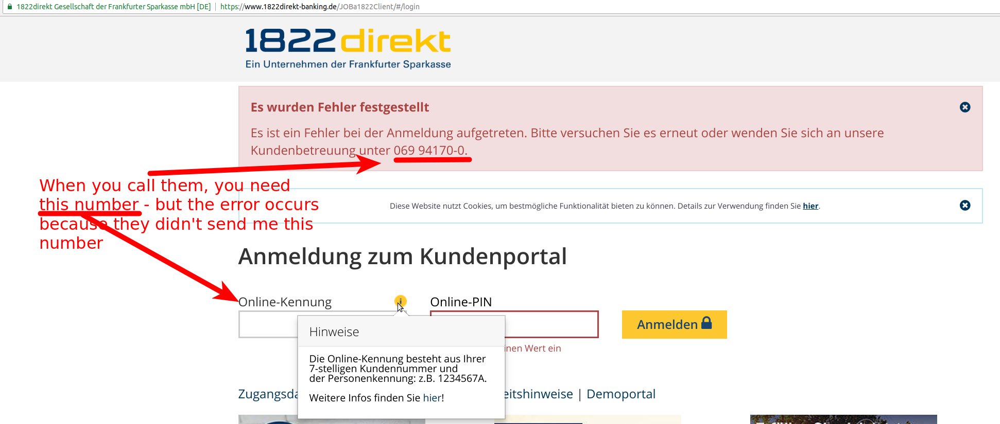

Creating a bank account is one of the things you need to do when you're a
longer time in a country, but is incredibly difficult if they don't offer
enough information online - especially, if you don't speak the language.

I had a [pretty good experience with N26](https://martin-thoma.com/online-banking/), let's see how it goes with 1822direkt.

## Registration

Overall, I can say the registration process is super bad. I started the
registration process on 2018-05-20.

* **German only**
* It took me 3 tries because the website just decided to push me back to
  the beginning of the 3-step registration process at some point.
* I need to print something, sign it and send it via letter in - that was not
  necessary with N26!
* The printed documents (3 pages) do not contain the adress. It was printed
  really tiny on the last page on the bottom right corner. At least I hope that
  this is the address.
* I need to make POSTIDENT locally - also not necessary with N26.

## Waiting

* 2018-05-29 I got the first E-Mail from 1822direkt. Of course, they ask me to
  participate in a survey how I like their "service" (how do you call the lack
  thereoff?) 😠.
* 2018-05-30: They send the letter with my "Online-PIN" (10 alphanumeric), my
  "Telephone-PIN" (6 digits) and my "Personenkennung" (a single letter). The
  subject of the letter is "PIN I D [8 digits]-[7 digits]/[7 digits]"
* 2018-06-04: They send a letter with 60 TAN numbers. The subject of the letter
  is "TAN D [8 digits]-[7 digits]"
* 2018-06-04: They send the card.

## Trying to Log-In

The bad user experience continues. They send me the three letters. To login, I
need an "Online-Kennung" (username) and an "Online-PIN". I've got the PIN, but I have
no idea where the username is.

<figure class="wp-caption aligncenter img-thumbnail">
    
    <figcaption class="text-center">Trying to login</figcaption>
</figure>

2018-06-09: Ok, I'm pretty pissed right now. So I send an E-Mail to
`reklamation@1822direkt.de`. At least they have one easily accessible:

> Sehr geehrte Damen und Herren,
>
> ich habe versucht mich bei ihrer "Online"-Bank anzumelden. Anscheinend
> benötigen sie dringend einen UX-Consultant. Es wundert mich, dass es
> überhaupt jemand schafft sich bei Ihrem "Service" anzumelden.
>
> 1. Negativ-Punkt: Ich musste die Anmeldung 3(!) mal machen, weil die Seite
>    zwischendrin mal beschlossen hat neu zu laden. Mit dem Handy war es
>    sowieso nicht möglich.
> 2. Negativ-Punkt: ich habe 3 Briefe bekommen (Karte, TAN-Liste,
>    Online-Kennung). Dann wollte ich mich online anmelden, nur um zu sehen
>    dass ich die "Online-Kennung" benötige, die ich nicht erhalten habe.
> 3. Negativ-Punkt: Ich wollte den Kunden-Service anrufen, nur um
>    festzustellen, dass ich dort keine Auskunft ohne Kundennummer bekomme -
>    die mir ja gerade fehlt.
>
> So ist der Dienst nicht nutzbar. Wenn ich dabei keine Hilfe bekomme werde ich
> umgehend wieder kündigen.
>
> Mit freundlichen Grüßen,
> Martin Thoma (Alte Allee 107, 81245 München)
>
> P.S.: Falls Sie Consultants brauchen um die Website nutzbar zu machen: Ich
> kann den Kontakt zu guten UX Consultants gerne herstellen.

The answer was super professional. Kudos for that, keep it up!

So something went wrong with one of the letters. As my name was not easy to
read on my post box a couple of other letters also didn't reach me. So this is
likely not their fault. But the fact that there are more than 3&nbsp;letters
and a super confusing system certainly is.

## Usage

After everything is set up, let's see how easy it is to use the website.

Starting with the start page... there is no `my.1822direkt.de` as far as I know:

<figure class="wp-caption aligncenter img-thumbnail">
    
    <figcaption class="text-center">Start Page of 1822direkt</figcaption>
</figure>

Ok, I need to make a click to get to the login page. I can't directly login at
the start page.

Going to the login page, you can notice a massive amount of spam. For somebody
who is already a customer.

<figure class="wp-caption aligncenter img-thumbnail">
    
    <figcaption class="text-center">Login page of 1822direkt</figcaption>
</figure>

Then you get to the following page. Roughly 1/3 of the page is spam.

<figure class="wp-caption aligncenter img-thumbnail">
    
    <figcaption class="text-center">1822direkt shows this as a first page after login</figcaption>
</figure>

Usually, when I login to my bank account, I want to either see transactions or
make a transaction. So searching for this...

<figure class="wp-caption aligncenter img-thumbnail">
    
    <figcaption class="text-center">The menu is bloated</figcaption>
</figure>

You can clearly see that they have a problem with focusing on their customers needs
and structuring the website accordingy. I'd say there are the following main groups:

* Giro: Transaction list, new transactions
* Depot: Trading - I don't really know what people need here
* Administration: Lost my card, moved to a new place, need support

I don't understand why they bloat their service with all this crap. Do other
people use it regularly?

Anyway, let's have a look at the list of transactions:

<figure class="wp-caption aligncenter img-thumbnail">
    
    <figcaption class="text-center">1822direkt transfer list</figcaption>
</figure>

So not good either.

Additionally, whenever there is a transaction, I get e-mails like this:

<figure class="wp-caption aligncenter img-thumbnail">
    
    <figcaption class="text-center">1822direkt notification e-mail</figcaption>
</figure>

I'm not kidding you. They actually send e-mails with a lot of question marks.
What the hell? If you don't want to send the transaction details via mail, then
just change the contents to "There was a new transaction". This is spam.

I actually want an e-mail. But it should be an e-mail which contains useful
information.

## TL;DR

**Don't every attempt to apply for 1822direkt. It's frustrating and a waste of
time. Use N26 instead.**

I'll try it a few more months and see if I change my mind / get the money they
offered to try the service.
