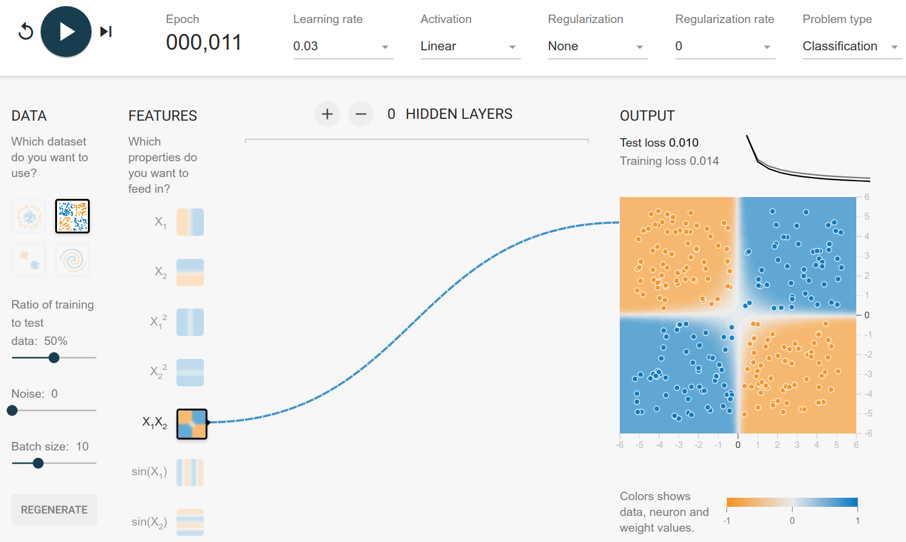
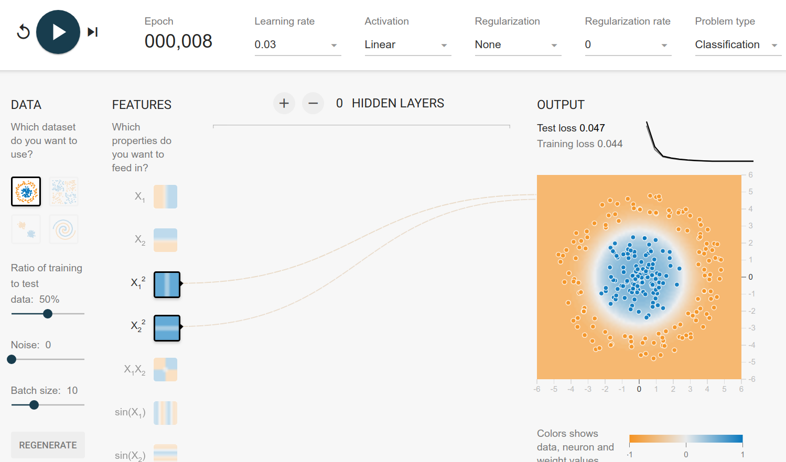

When you develop a model, you want the optimal model. The perfect one.

The first problem with that desire are diagonal goals:

<figure class="wp-caption aligncenter img-thumbnail">
    
    <figcaption class="text-center">Diagonal goals in model development</figcaption>
</figure>

Typical goals when designing a model are:

* Quality: Have a high accuracy, low error, high $F_\beta$ score, ...
* Production
    * Inference speed: The faster it is in production, the better
    * Inference memory consumtion: Super important if it should run on small machines
* Training:
    * Training speed: The more episodes you can train in 1h, the better
    * Convergence speed: The less episodes you need until convergence, the better
    * Training memory consumption: You might have a small GPU for training
    * Stability: If you train with 10 different initializations, you want to get 10 similar results

Sometimes, however, you can build perfect models. It is basically when you
know how the data generating process works.

## Tensorflow Playground

Let's get some perfect solutions for Tensorflow playground.

All of the datasets have points $(x_1, x_2)$ which are assigned to either the
blue class or to the orange class.

The only input-features you can choose are

* $x_1, x_2$: Linear
* $x_1^2, x_2^2$: Quadratic
* $x_1 \cdot x_2$: Multiplication
* $\sin(x_1), \sin(x_2)$

### Exclusive Or

You can generate this dataset by drawing $(x_1, x_2)$ from $[-1, 1] \times [-1, 1]$
and assigning the classes by

\begin{cases}
    (x_1 > 0 \text{ AND } x_2 > 0) OR (x_1 < 0 \text{ AND } x_2 < 0)&\text{orange}\\
    (x_1 > 0 \text{ AND } x_2 < 0) OR (x_1 < 0 \text{ AND } x_2 > 0)&\text{blue}\\
\end{cases}

It happens to be that this property is the case when you multiply the two values:

\begin{cases}
    x_1 \cdot x_2 > 0&\text{orange}\\
    x_1 \cdot x_2 < 0&\text{blue}\\
\end{cases}

Hence with multiplication you can get the function directly:

<figure class="wp-caption aligncenter img-thumbnail">
    
    <figcaption class="text-center">XOR dataset solution</figcaption>
</figure>

### Circle Dataset

The circle dataset can be generated by drawing $r \in [0, 6]$ and $\theta \in [0, 1]$.
The rule to assign the class is then

$$
\begin{align}
x_1 &= r \cdot \cos(\theta)\\
x_2 &= r \cdot \sin(\theta)
\end{align}

and then

$$
\begin{cases}
    x_1^2 + x_2^2 < t&\text{blue}\\
    x_1^2 + x_2^2 \geq t & \text{orange}
\end{cases}
$$

Here the solution is pretty obvious: It's a linear model of the squared inputs:

<figure class="wp-caption aligncenter img-thumbnail">
    
    <figcaption class="text-center">Circles dataset solution</figcaption>
</figure>

### Gaussian

The Gaussian dataset seems to have the blue center in $(2, 2)$ and the orange
center in $(-2, -2)$. This is a bit more difficult to generate, but you can see
that the optimal decision boundary is $x_2 = -x_1$. Everything below is more
likely to be orange, everything above is more likely to be blue.

$$
\begin{cases}
    x_2 < - x_1&\text{orange}\\
    x_2 > - x_1 & \text{blue}
\end{cases}
$$

and hence the model:

<figure class="wp-caption aligncenter img-thumbnail">
    
    <figcaption class="text-center">Gaussian dataset solution</figcaption>
</figure>

### Spirals

Generating the spirals is a bit more complicated. I've added a [gist](https://github.com/MartinThoma/algorithms/blob/master/ML/playground/dataset_generation.py) which generates a dataset
which is super similar.

Basically, it is choosing $r \in R_{\geq 0}$. The $\alpha \in [0, 360)$ defines
the class, e.g. $\alpha_\text{orange}=180$ and $\alpha_\text{blue}=90$

$$
\begin{algin}
x_1 &= -r \cdot \cos(\alpha)\\
x_2 &= r \cdot \sin(\alpha)
\end{align}
$$

Hence finding the class is related to finding the $\alpha$:

$$
\begin{algin}
\cos^{-1}(-\frac{x_1}{r}) &= \alpha\\
\sin^{-1}(\frac{x_2}{r}) &= \alpha
\end{align}
$$

But neither $\cos^{-1}$ nor $\sin^{-1}$ are available as input features. And,
more relevant, we don't have $r$. $r$ is basically the distance from the $(0, 0)$.
So $r = \sqrt{x_1^2 + x_2^2}$. Hence we need $x_1^2$ and $x_2^2$ as features.

This is where I'm stuck. My intuition tells me that tanh is a nice activation
function for this problem, because it is one of the geometric functions. Let's
see how far we get with that:

<figure class="wp-caption aligncenter img-thumbnail">
    
    <figcaption class="text-center">Spiral dataset solution</figcaption>
</figure>

So with 2 hidden layers, it can be done in about 250 episodes. No
regularization, only squared and linear features. But looking at the features
of the first hidden layer, we can see that it mostly builds circle-like
features. The spiral has only 3 rotations, so it is rather easy to fit it. My
guess is that the number of rotations directly influences the number of neurons
you need in the first hidden layer.

The training with a batch size of 8 often has a phase of big instability (high jumps in the loss curve).
Increasing the batch size leads to a more smooth loss curve.

Typically, after around 1000 epochs the training is done and the result looks
fine.

## How Regularization can destroy your model

Look at [this network](https://playground.tensorflow.org/#activation=tanh&batchSize=10&dataset=spiral&regDataset=reg-plane&learningRate=0.03&regularizationRate=0.03&noise=0&networkShape=8,2&seed=0.13062&showTestData=false&discretize=false&percTrainData=50&x=true&y=true&xTimesY=false&xSquared=false&ySquared=false&cosX=false&sinX=true&cosY=false&sinY=true&collectStats=false&problem=classification&initZero=false&hideText=false).
If you add any regularization with a rate of 0.003 or more, it is not able to learn anymore.
