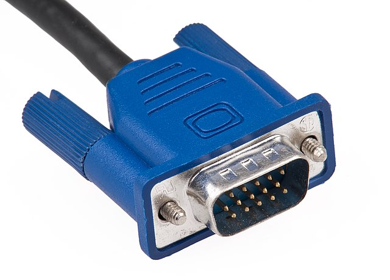

This is an article I had for quite a while as a draft. As part of my yearly cleanup, I've published it without finishing it. It might not be finished or have other problems.

I frequently forget the video display interface names and I wonder why we
have that many. So here are the differences.

## Comparison

<table>
    <tr>
        <th></th>
        <th>VGA</th>
        <th>DVI</th>
        <th>HDMI</th>
        <th>DisplayPort</th>
        <th>USB-C</th>
    </tr>
    <tr>
        <td>Introduced in</td>
        <td>1987</td>
        <td>1999</td>
        <td>2002</td>
        <td>2006</td>
        <td>2014</td>
    </tr>
    <tr>
        <td>Digital</td>
        <td>No</td>
        <td>Yes</td>
        <td>Yes</td>
        <td>Yes</td>
        <td>Yes</td>
    </tr>
    <tr>
        <td>Audio</td>
        <td>No</td>
        <td>No</td>
        <td>Yes</td>
        <td>Yes</td>
        <td>Yes</td>
    </tr>
    <tr>
        <td>Image</td>
        <td></td>
        <td></td>
        <td></td>
        <td><a href="https://commons.wikimedia.org/wiki/File:DisplayPort-rid.jpg">Image</a></td>
        <td><a href="https://commons.wikimedia.org/wiki/File:USB-C_type_c.jpg">Image</a></td>
    </tr>
    <tr>
        <td>Designer</td>
        <td>IBM&nbsp;based on&nbsp;D-subminiature</td>
        <td>Digital Display Working Group</td>
        <td>HDMI Founders / Forum</td>
        <td>VESA</td>
        <td>USB Implementers Forum</td>
    </tr>
    <tr>
        <td>Color</td>
        <td>Blue</td>
        <td>White</td>
        <td>-</td>
        <td>-</td>
        <td>-</td>
    </tr>
    <tr>
        <td>Max. cable length*</td>
        <td>40m</td>
        <td>15m</td>
        <td>5-15m</td>
        <td>15m</td>
        <td>2m</td>
    </tr>
    <tr>
        <td>Maximum resolution</td>
        <td>1280&nbsp;&times;&nbsp;720</td>
        <td>2560&nbsp;&times;&nbsp;1600</td>
        <td>4096&nbsp;&times;&nbsp;2160 (4K)</td>
        <td>7680&nbsp;&times;&nbsp;4320 (8K)</td>
        <td>5120 &times; 2880&nbsp;(4K)</td>
    </tr>
    <tr>
        <td>3D</td>
        <td>No</td>
        <td>No</td>
        <td>Yes</td>
        <td>Yes</td>
        <td>?</td>
    </tr>
    <tr>
        <td>Size of Connector</td>
        <td>Big</td>
        <td>Big</td>
        <td>Small</td>
        <td>Small</td>
        <td>Small</td>
    </tr>
    <tr>
        <td>Good Connection</td>
        <td>Yes (screws)</td>
        <td>Yes (screws)</td>
        <td>No</td>
        <td>Yes (like network cables)</td>
        <td>Yes (?)</td>
    </tr>
    <tr>
        <td>Licensing cost</td>
        <td>?</td>
        <td>?</td>
        <td>$10,000 per high-volume manufacturer plus $0.04 per device</td>
        <td>Royalty-free</td>
        <td>?</td>
    </tr>
    <tr>
        <td>Multiple Monitors (Daisy Chain)</td>
        <td>No</td>
        <td>No</td>
        <td>No</td>
        <td>Yes</td>
        <td>Yes</td>
    </tr>
    <tr>
        <td>Connector Types</td>
        <td>1</td>
        <td>2</td>
        <td>3</td>
        <td>2</td>
        <td>1</td>
    </tr>
</table>

## Fine-Prints

* <a href="https://en.wikipedia.org/wiki/Digital_Visual_Interface">DVI</a> is
  in fact not one interface, but at least two. DVI-I (4 pins in a square on the
  left) and DVI-D (only one long "pin" on the left). DVI-I (integrated) sends
  an additional analog signal which is missing in DVI-D (digital). This means
  DVI-I can use simple adapters for VGA.
* HDMI and Display port comes in different versions. Older versions only
  support lower resolutions.
* HDMI has multiple connectors: Type A (standard), Type C (mini), and Type D (micro)
* Display port has two connectors: DisplayPort and Mini DisplayPort
* Philips Brilliance 258B6QUEB supports USB-C
* HDMI seems to be good for home entertainment whereas Display Port is good for
  PC. I'm not sure about USB-C ... seems to be too recent.

## See also

* [Information about maximum cable length](http://www.cablechick.com.au/blog/cable-length-guide/)
