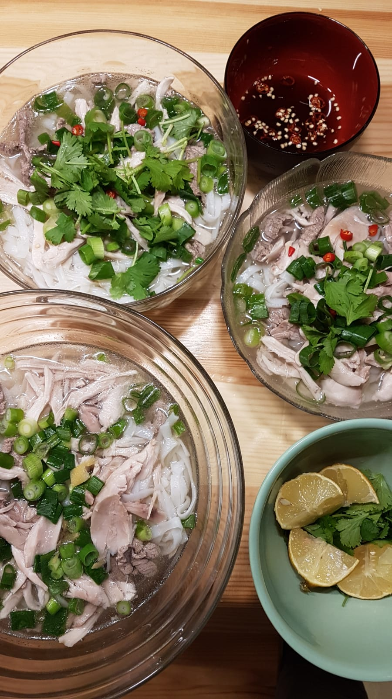

[Phở](https://en.wikipedia.org/wiki/Pho) is a vietnamese beef noodle soup.

<figure class="wp-caption aligncenter img-thumbnail">
    
    <figcaption class="text-center">Phở</figcaption>
</figure>

## Ingredients

For 3 people, you need:

* 300g beef eye fillet (de: Rinderfillet)
* 500g chicken legs (3 pieces)
* 500g rice noodles
* 8 [spring onions](https://en.wikipedia.org/wiki/Scallion)
* 3 red onions
* Sprigs of fresh mint and/or Asian/Thai basil
* 3-5 [star anise](https://en.wikipedia.org/wiki/Illicium_verum)
* 25g [ginger](https://en.wikipedia.org/wiki/Ginger)
* 4 red hot Chili peppers
* 1 lemon
* 1 cinnamon stick
* [Hoisin sauce](https://en.wikipedia.org/wiki/Hoisin_sauce) (e.g. Lee Kum Kee brand)
* Fish sauce
* Sugar
* Salt
* 4L water
* For each person a rather big bowl

## Tools

* A pot which can contain roughly 4L
* [Ladle](https://en.wikipedia.org/wiki/Ladle_(spoon))
* A sieve
* A small "sauce plate" (bowl) for sauce (less than 100ml)

## Preparation

For all of the following, you will need roughly 1h.

Rice noodles:

1. Put the rice noodles for 15min in warm water.
2. Sieve the noodles out of the water and [shock](https://en.wikipedia.org/wiki/Shocking_(cooking)) the noodles
3. Let the noodles dry
4. Pour boiling water over the noodles
5. Let the noodles dry

Beef: Remove muscle fibers and cut it in approximately 3mm thin slices.

Broth:

1. Peel the red onions - do not cut them, though!
2. Put 4L of water in the pot, heat it until it is slightly cooking
3. Put the chicken, 3 spring onions, the red onions, 2 chili peppers, the
   cinnamon stick, half a spoon of sugar and a bit of salt in the water. The
   chicken should be covered with water.
4. Let it cook for 30min

Preparations:

* Cut 5 of the 8 spring onions into small cylinders (roughly 5mm high)
* Remove the chicken from the broth, remove the skin, cut it into editable pieces
* Put the beef briefly in the bowl. You should see how the color of the beef changes from red to gray.
* Put a bit of fish sauce in the sauce plate and mix it with one chili pepper

Serve (for each person):

1. Put some noodles in a bowl
2. Pour broth over it
3. Sprinkle some of the cutted spring onions over the noodles
4. Put some lemon over the meal
5. Put beef / chicken over the meal
6. Decorate with the mint/basil

People can then put additional fish sauce in their bowl as they like it
