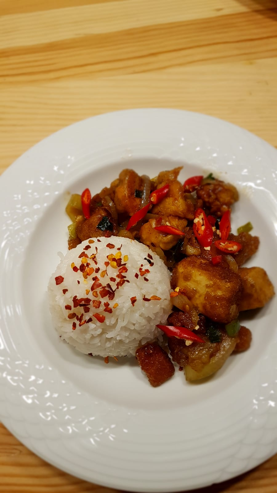
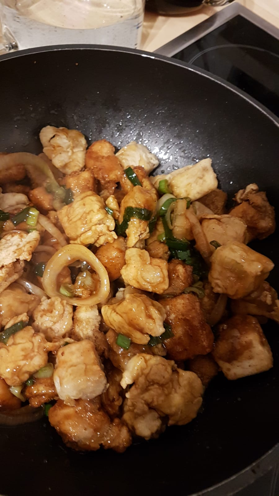

Crispy Tofu and Thuna is the first way to prepare Tofu that I liked. It's a sweet indonesian dish which is best served with rice.

<figure class="wp-caption aligncenter img-thumbnail">
    
    <figcaption class="text-center">Crispy Tofu and Thuna</figcaption>
</figure>

## Ingredients

For 4 people, you need

* Thuna
* Tofu
* 2 Onions
* 3 spring onions
* Ketchup (or Chili-Mango Sauce - I like that better)
* Oil
* [Bread Crumps](https://en.wikipedia.org/wiki/Bread_crumbs) and water
* Oister Sauce
* Honey
* Salt
* Pepper
* Rice (side dish)

## Tools

* Frying pan / Wok
* [Fish slice](https://en.wikipedia.org/wiki/Fish_slice_(kitchen_utensil))

## Preparation

For the following, you will need roughly 30 minutes.

<figure class="wp-caption aligncenter img-thumbnail">
    
    <figcaption class="text-center">Almost done!</figcaption>
</figure>

You might want to start with cooking the rice, as this will take at least 15
minutes. If the rice is ready earlier, you can keep it warm for quite a while.

1. Cut the Tofu and the Thuna in small cubes of side length 1cm.
2. *Marinade*: Give some salt and pepper over the Tofu / the Thuna and let it rest for 15 minutes. No oil here.
3. Cut the onions in rings
4. Clean the spring onions and cut them in 0.5cm long pieces
5. *Breading*: Put the Tofu / the Thuna in water and then in bread crumbs.
6. Fry the Tofu / Thuna until they have a nice color. Don't make it too hot. I use 6 of 10 on my stove.
7. *Sauce*: Put the fried Tofu / Thuna away and clean the pan. Then put fresh oil, onion
8. Fry the onions and the spring onions a little bit until they smell nice (pretty short)
9. *Sauce*: Put oister Sauce, Honey, Salt, Pepper, Ketchup in the pan to make the sauce.
10. Put the fried Tofu / Thuna in the pan, mix it a bit.
