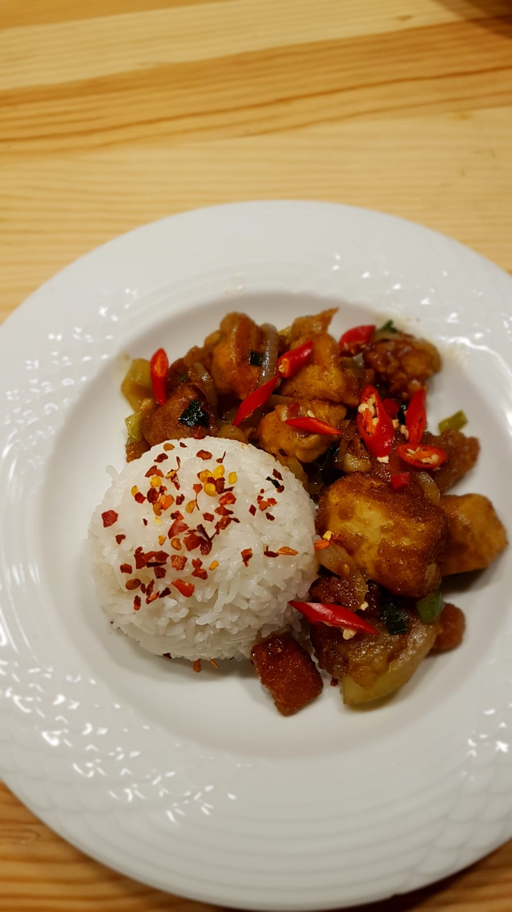
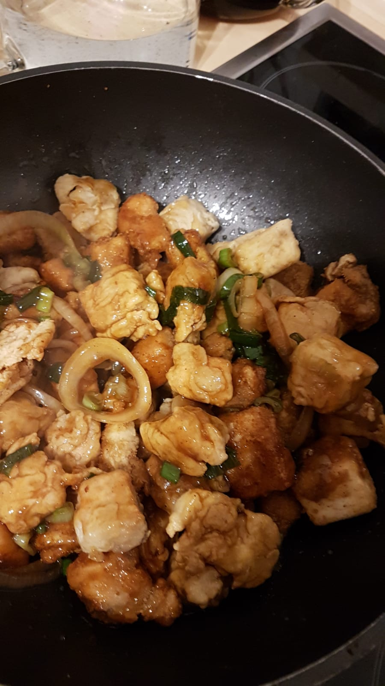

Crispy Tofu and Tuna is the first way to prepare tofu that I liked. It's a sweet Indonesian dish which is best served with rice.

<figure>
    
    <figcaption>Crispy Tofu and Tuna</figcaption>
</figure>

## Ingredients

For 4 people, you need:

* Tuna
* Tofu
* 2 Onions
* 3 spring onions
* Ketchup (or Chili-Mango Sauce - I like that better)
* Oil
* [Bread crumbs](https://en.wikipedia.org/wiki/Bread_crumbs) and water
* Oyster sauce
* Honey
* Salt
* Pepper
* Rice (side dish)

## Tools

* Frying pan / Wok
* [Fish slice](https://en.wikipedia.org/wiki/Fish_slice_(kitchen_utensil))

## Preparation

For the following, you will need roughly 30 minutes.

<figure>
    
    <figcaption>Almost done!</figcaption>
</figure>

You might want to start with cooking the rice, as this will take at least 15
minutes. If the rice is ready earlier, you can keep it warm for quite a while.

1. Cut the tofu and the tuna into small cubes of side length 1cm.
2. *Marinade*: Sprinkle some salt and pepper over the tofu / the tuna and let it rest for 15 minutes. No oil here.
3. Cut the onions into rings.
4. Clean the spring onions and cut them into 0.5cm long pieces.
5. *Breading*: Put the tofu / the tuna in water and then in bread crumbs.
6. Fry the tofu / tuna until they have a nice color. Don't make it too hot. I use 6 of 10 on my stove.
7. *Sauce*: Put the fried tofu / tuna away and clean the pan. Then add fresh oil and the onions.
8. Fry the onions and the spring onions a little bit until they smell nice (pretty short).
9. *Sauce*: Put oyster sauce, honey, salt, pepper, and ketchup in the pan to make the sauce.
10. Put the fried tofu / tuna in the pan and mix it a bit.
