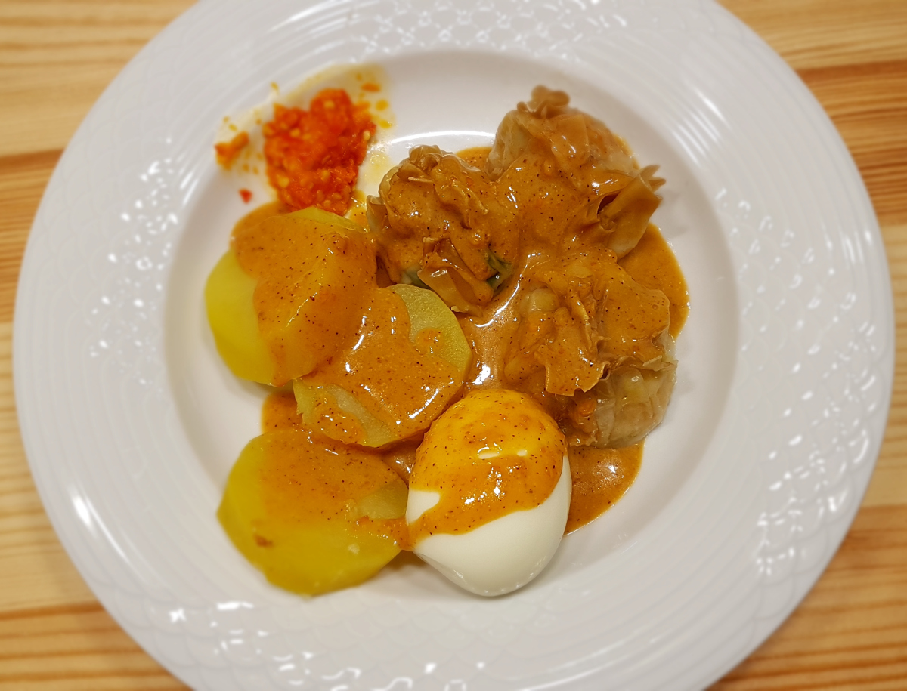
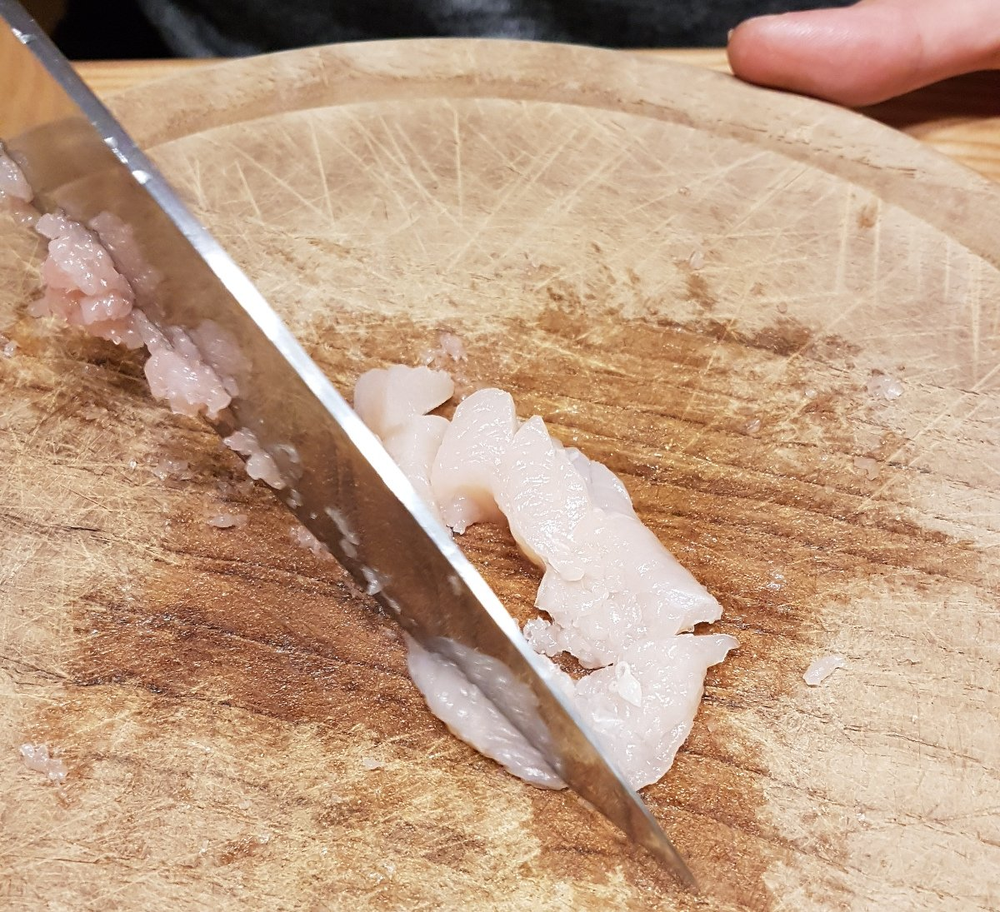
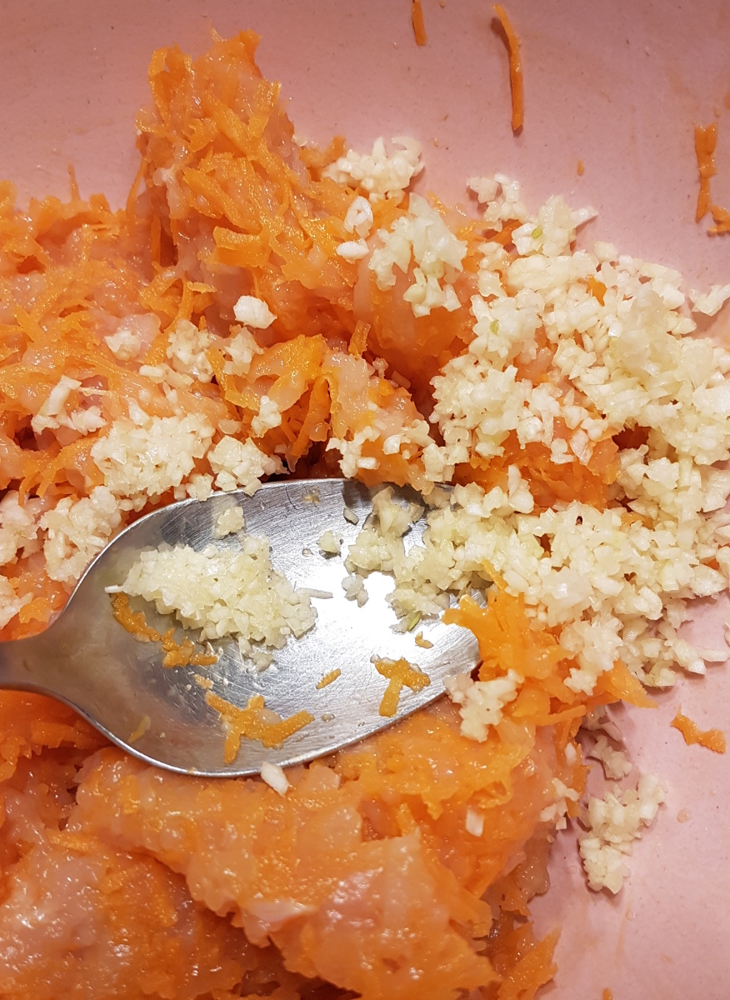
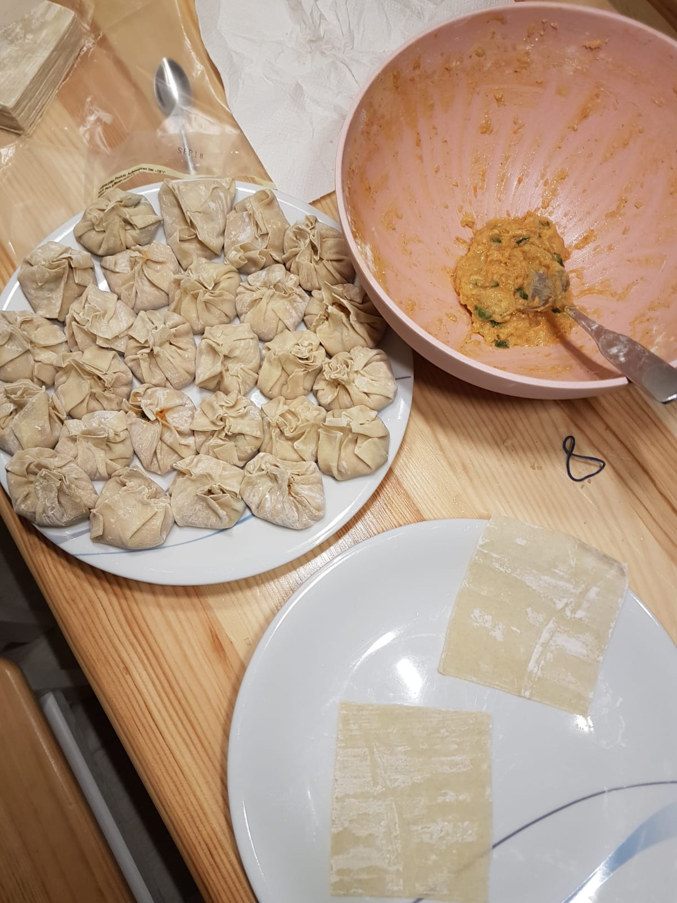
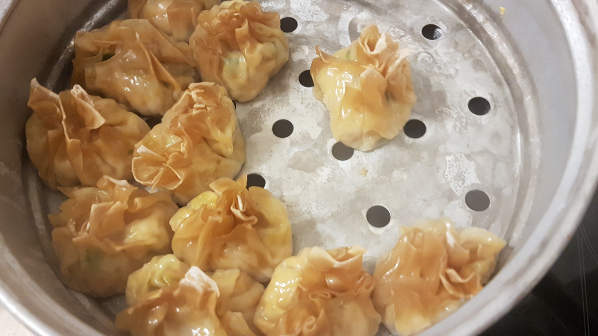

Siomay Ayam is an Indonesian dish which is comparable to [Maultaschen](https://en.wikipedia.org/wiki/Maultasche).
"Ayam" means "chicken". It takes about one hour to prepare and about 20 min for steaming.

<figure>
    
    <figcaption>Siomay Ayam with potato, egg and peanut sauce</figcaption>
</figure>

## Ingredients

For 30 pieces of Siomay Ayam (good for 2 people, if you don't have any side dish),
you need the following ingredients.

Key ingredients:

* 30 frozen pastry sheets for wontons
* 150g [tapioca starch](https://en.wikipedia.org/wiki/Tapioca)
* 400g chicken or [shrimps / prawns](https://en.wikipedia.org/wiki/Shrimp_and_prawn_as_food) or a mixture
* 2 eggs
* Water

Additional ingredients:

* 4 [Spring onions](https://en.wikipedia.org/wiki/Scallion)
* 2 carrots
* 3 [garlic cloves](https://en.wikipedia.org/wiki/Garlic)
* 1 tablespoon Sesame oil
* [Soy sauce](https://en.wikipedia.org/wiki/Soy_sauce)
* Oyster sauce
* Pepper
* Salt
* Chicken broth
* Sugar

## Tools

* [Grater](https://en.wikipedia.org/wiki/Grater)
* [steaming vessel](https://en.wikipedia.org/wiki/Steaming)

## Preparation

<figure>
    
    <figcaption>Chop chicken into fine pieces</figcaption>
</figure>

1. Chop the chicken into very fine pieces - less than 1mm. You could put the
   chicken in a mixer, for example.
2. Grate the carrots into very fine pieces.
3. Cut spring onions into small rings - not super small.
4. Put all remaining ingredients (except the wonton pastry sheets) in the mix.

Now the dough should not be too fluid, but also not crumble. If it is too
fluid, put more tapioca starch in it.

Once the dough has a good consistency, fry a small part of it and test if you
like the taste. Does it need more sugar / salt / pepper / oyster sauce?

If you like the consistency, put the mix in the pastry sheets:

<figure>
    
    <figcaption>Siomay ayam filling</figcaption>
</figure>

<figure>
    
    <figcaption>The mix, the pastry sheets and the almost finished siomay ayam</figcaption>
</figure>

In the end, you have to steam them for roughly 20 minutes:

<figure>
    
    <figcaption>The siomay ayam are ready!</figcaption>
</figure>

Selamat makan!
