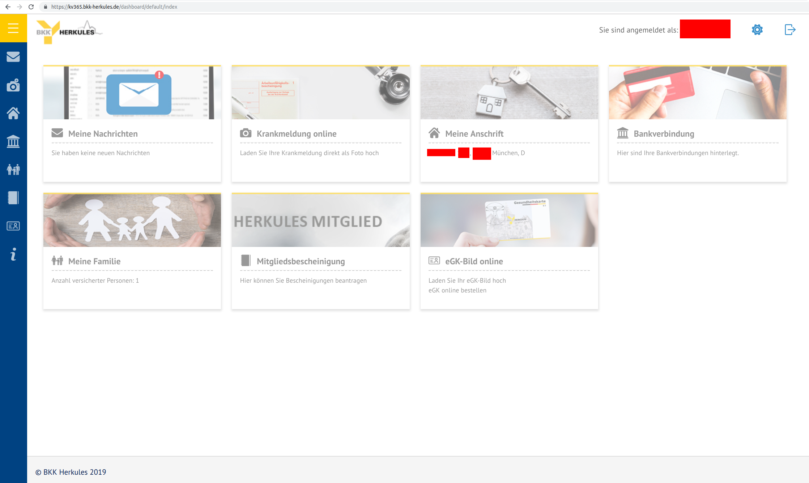
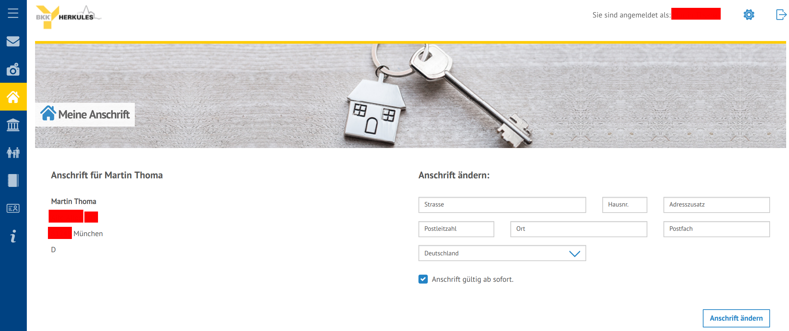
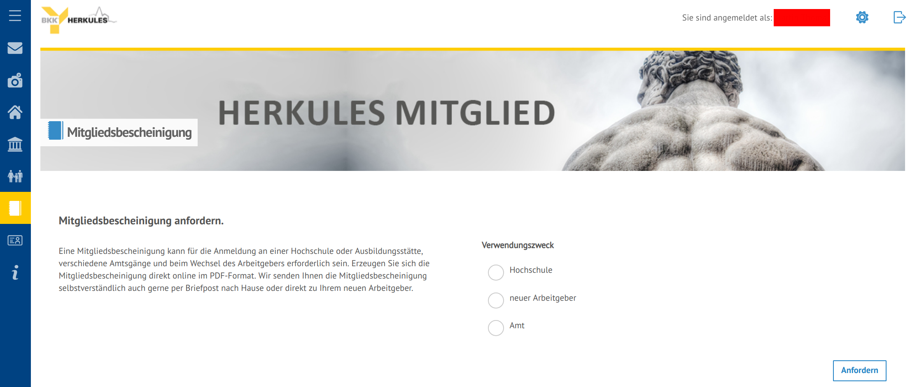
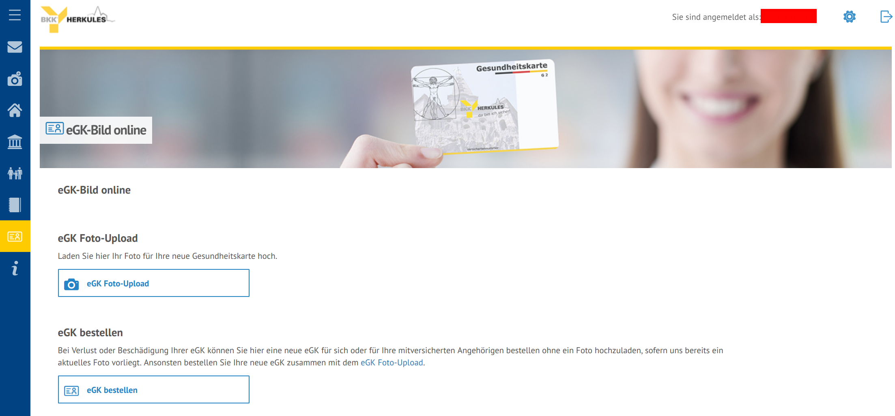

This article is about German health insurances. It reflects a bit of my decision process for a health insurance and is most useful for people within Germany.

When I had to choose health insurance at the age of 24 or so, I was still at
university. I had a look at non-private health insurances and had the
impression that they are basically all the same. So I stayed with the one my
father had: [BKK Herkules](https://de.wikipedia.org/wiki/BKK_Herkules).

Now, several years later, BKK Herkules increased the amount I have to pay. This
gives me the possibility to switch.

There are many [online calculators](https://www.smart-rechner.de/kv_beitragsvorteil/rechner.php) you can calculate how much you can save.

The comparison is in German, because I'm too lazy to translate it.

## Vergleich

<table>
    <tr>
        <th></th>
        <th>BKK Herkules</th>
        <th>Techniker Krankenkasse</th>
        <th>hkk</th>
        <th>AOK Bayern</th>
    </tr>
    <tr>
        <td>Gründung</td>
        <td>1888</td>
        <td>1884</td>
        <td>1904</td>
        <td style="background-color: #f2dede;">1995</td>
    </tr>
    <tr>
        <td>Versicherte</td>
        <td style="background-color: #f2dede;">33828 (2013)</td>
        <td style="background-color: #c9f8c9;">10&#8239;400&#8239;000 (2019)</td>
        <td>640&#8239;000 (2019)</td>
        <td style="background-color: #c9f8c9;">4&#8239;520&#8239;877 (2018)</td>
    </tr>
    <tr>
        <td>Mitarbeiter</td>
        <td style="background-color: #f2dede;">59 + 5&nbsp;Auszubildende</td>
        <td style="background-color: #c9f8c9;">13&#8239;180 + 653&nbsp;Auszubildende</td>
        <td>ca 1000</td>
        <td style="background-color: #c9f8c9;">11&#8239;000</td>
    </tr>
    <tr>
        <td>Haushaltsvolumen in Mio EUR</td>
        <td>?</td>
        <td style="background-color: #c9f8c9;">37&#8239;900 (2019)</td>
        <td>1,500 (2019)</td>
        <td style="background-color: #c9f8c9;">17&#8239;500 (2018)</td>
    </tr>
    <tr>
        <td>EUR / Versicherte</td>
        <td>?</td>
        <td>3644</td>
        <td>2344</td>
        <td>3871</td>
    </tr>
    <tr>
        <td>EUR / Mitarbeiter</td>
        <td>?</td>
        <td>2&#8239;875&#8239;569</td>
        <td>1&#8239;500&#8239;000</td>
        <td>1&#8239;590&#8239;909</td>
    </tr>
    <tr>
        <th colspan="5">Kosten</th>
    </tr>
    <tr>
        <td>Zusatzbeitrag</td>
        <td style="background-color: #f2dede;">1,7 %</td>
        <td style="background-color: #c9f8c9;">0,9 %</td>
        <td style="background-color: #c9f8c9;">0,39 %</td>
        <td style="background-color: #f2dede;">1,1%</td>
    </tr>
    <tr>
        <td>Jährliche Ersparnis</td>
        <td style="background-color: #f2dede;">0 EUR</td>
        <td style="background-color: #c9f8c9;">272,28&nbsp;EUR</td>
        <td style="background-color: #c9f8c9;">356,65 EUR</td>
        <td style="background-color: #f2dede;">163,44 EUR</td>
    </tr>
    <tr>
        <th colspan="5">Service</th>
    </tr>
    <tr>
        <td>Android-App</td>
        <td style="background-color: #f2dede;">Nein</td>
        <td style="background-color: #c9f8c9;">✓ (4.6 Sterne)</td>
        <td style="background-color: #f2dede;">✓ (2.5 Sterne)</td>
        <td style="background-color: #c9f8c9;">✓ (4.2 Sterne)</td>
    </tr>
    <tr>
        <td>Web-Portal</td>
        <td style="background-color: #c9f8c9;">✓</td>
        <td style="background-color: #c9f8c9;">✓</td>
        <td style="background-color: #c9f8c9;">✓</td>
        <td style="background-color: #c9f8c9;">✓</td>
    </tr>
    <tr>
        <td>Telefon-Hotline</td>
        <td style="background-color: #f2dede;">08:00 - 16:00 / Mo-Fr</td>
        <td style="background-color: #c9f8c9;">24/7</td>
        <td style="background-color: #f2dede;">?</td>
        <td style="background-color: #f2dede;">08:00 - 13:00 / Mo-Fr</td>
    </tr>
    <tr>
        <td>E-Mail</td>
        <td style="background-color: #c9f8c9;">✓</td>
        <td style="background-color: #c9f8c9;">✘, aber Chat und Web-Formular</td>
        <td style="background-color: #f2dede;">✘</td>
        <td style="background-color: #f2dede;">✘</td>
    </tr>
    <tr>
        <th colspan="5">Zusatzleistungen: Zähne</th>
    </tr>
    <tr>
        <td>Professionelle Zahnreinigung (PZR)</td>
        <td style="background-color: #f2dede;">80%, max 20 EUR</td>
        <td>Gesundheitsdividende</td>
        <td style="background-color: #c9f8c9;">bei Teilnehmenden Ärzten</td>
        <td>max 40 EUR</td>
    </tr>
    <tr>
        <td>Zahn-Fissurenversiegelung</td>
        <td>70%, max 100 EUR</td>
        <td style="background-color: #f2dede;">✘</td>
        <td></td>
        <td style="background-color: #c9f8c9;">max 50 EUR</td>
    </tr>
    <tr>
        <td>Füllungen</td>
        <td>20 EUR/Zahn</td>
        <td style="background-color: #f2dede;">✘</td>
        <td></td>
        <td style="background-color: #f2dede;">✘</td>
    </tr>
    <tr>
        <th colspan="5">Zusatzleistungen: Vorsorge</th>
    </tr>
    <tr>
        <td>Hautkrebs-Früherkennung</td>
        <td style="background-color: #c9f8c9;">✓</td>
        <td style="background-color: #c9f8c9;">ab 20 Jahren</td>
        <td style="background-color: #c9f8c9;">ab 18 Jahren, max 100 EUR</td>
        <td>ab 18 Jahren, max 25 EUR</td>
    </tr>
    <tr>
        <td>Check-up</td>
        <td style="background-color: #f2dede;">ab 35 Jahre</td>
        <td style="background-color: #c9f8c9;">ab 18 Jahren</td>
        <td style="background-color: #c9f8c9;">ab 15 Jahren, max 100 EUR</td>
        <td>?</td>
    </tr>
    <tr>
        <th colspan="5">Zusatzleistungen: Kinder</th>
    </tr>
    <tr>
        <td>Rooming-In bei Kindern</td>
        <td style="background-color: #c9f8c9;">✓</td>
        <td style="background-color: #c9f8c9;">✓</td>
        <td style="background-color: #c9f8c9;">✓</td>
        <td style="background-color: #c9f8c9;">✓</td>
    </tr>
    <tr>
        <td><a href="https://de.wikipedia.org/wiki/Kinderkrankengeld">Kinderkrankengeld</a></td>
        <td style="background-color: #ffffcc;"><a href="https://www.bkk-herkules.de/leistungen/leistungen-von-a-z/krankengeld_bei_erkrankung_eines_kindes/">?</a></td>
        <td style="background-color: #c9f8c9;" colspan="3"><a href="https://www.tk.de/techniker/service/leistungen-und-mitgliedschaft/schwangerschaft-und-familie/entlastung-fuer-familien/kinderkrankengeld-2001280">90% Netto, max 105.88 EUR/Tag</a>[^1]</td>
    </tr>
    <tr>
        <th colspan="5">Zusatzleistungen: Sonstiges</th>
    </tr>
    <tr>
        <td style="background-color: #c9f8c9;"><a href="https://de.wikipedia.org/wiki/Krankengeld_(Deutschland)">Krankengeld</a></td>
        <td style="background-color: #c9f8c9;"><a href="https://www.bkk-herkules.de/leistungen/leistungen-von-a-z/krankengeld/">min(70% Brutto, 90% Netto, 103.25 EUR/Tag)</a></td>
        <td style="background-color: #c9f8c9;"><a href="https://www.tk.de/techniker/service/leistungen-und-mitgliedschaft/leistungen/krankengeld/arbeitnehmer/hoehe-krankengeld-arbeitnehmer-2006214">min(70% Brutto, 90% Netto, 105.88 EUR/Tag)</a></td>
        <td style="background-color: #c9f8c9;">min(70% Brutto, 90% Netto, 105.88 EUR/Tag)</td>
        <td style="background-color: #c9f8c9;"><a href="https://www.aok.de/pk/bayern/inhalt/krankengeld-wie-viel-bekomme-ich-2/">min(70% Brutto, 90% Netto, 105.88 EUR/Tag)</a></td>
    </tr>
    <tr>
        <td>Reise-Impfungen</td>
        <td style="background-color: #c9f8c9;">90%</td>
        <td style="background-color: #c9f8c9;">✓ (bei Kassenarzt)</td>
        <td style="background-color: #f2dede;">80%</td>
        <td style="background-color: #f2dede;">80%, bis 100 EUR</td>
    </tr>
    <tr>
        <td>Medizinische Vorsorgeleistungen an Kurorten</td>
        <td style="background-color: #c9f8c9;">✓</td>
        <td style="background-color: #c9f8c9;">✓</td>
        <td style="background-color: #c9f8c9;">✓</td>
        <td></td>
    </tr>
    <tr>
        <td>Zusätzliche häusliche Krankenpflege</td>
        <td style="background-color: #c9f8c9;">✓</td>
        <td style="background-color: #c9f8c9;">✓</td>
        <td style="background-color: #f2dede;">✘</td>
        <td style="background-color: #f2dede;">✘</td>
    </tr>
    <tr>
        <td>Keine Mehrkosten bei freier Krankenhauswahl</td>
        <td style="background-color: #f2dede;">✘</td>
        <td style="background-color: #c9f8c9;">✓</td>
        <td style="background-color: #c9f8c9;">✓</td>
        <td style="background-color: #c9f8c9;">✓</td>
    </tr>
    <tr>
        <td>Spezielle Arzneimittel</td>
        <td style="background-color: #f2dede;">✘</td>
        <td style="background-color: #c9f8c9;">✓</td>
        <td style="background-color: #f2dede;">✘</td>
        <td style="background-color: #f2dede;">✘</td>
    </tr>
    <tr>
        <td>Sehhilfen</td>
        <td style="background-color: #c9f8c9;">✓</td>
        <td style="background-color: #f2dede;">✘</td>
        <td style="background-color: #c9f8c9;">✓</td>
        <td style="background-color: #f2dede;">✘</td>
    </tr>
</table>

Ich habe sehr viel über [Zusatzleistungen](https://www.gesetzlichekrankenkassen.de/leistungsvergleich/zusatzleistungen/zusatzleistungen.html) auf gesetzlichekrankenkassen.de gefunden.

Natürlich habe ich auch Freunde und Kollegen gefragt. Die meisten waren bei der
TK und waren begeistert. Außerdem sind mir bei der Recherche für die TK immer
wieder sehr übersichtliche Hilfeseiten der TK über den Weg gelaufen.

## BKK Web Portal

<figure class="wp-caption aligncenter img-thumbnail">
    
    <figcaption class="text-center">BKK Web Interface</figcaption>
</figure>

<figure class="wp-caption aligncenter img-thumbnail">
    
    <figcaption class="text-center">BKK Web Interface</figcaption>
</figure>

<figure class="wp-caption aligncenter img-thumbnail">
    
    <figcaption class="text-center">BKK Web Interface</figcaption>
</figure>

<figure class="wp-caption aligncenter img-thumbnail">
    
    <figcaption class="text-center">BKK Web Interface</figcaption>
</figure>

<figure class="wp-caption aligncenter img-thumbnail">
    
    <figcaption class="text-center">BKK Web Interface</figcaption>
</figure>

<figure class="wp-caption aligncenter img-thumbnail">
    
    <figcaption class="text-center">BKK Web Interface</figcaption>
</figure>

<figure class="wp-caption aligncenter img-thumbnail">
    
    <figcaption class="text-center">BKK Web Interface</figcaption>
</figure>

<figure class="wp-caption aligncenter img-thumbnail">
    
    <figcaption class="text-center">BKK Web Interface</figcaption>
</figure>

## Privat

Leistungen, die für mich interessant wären:

* Zahnersatz (bzw. alles was mit Zähnen zu tun hat)
* Krankengeld
* Einzelzimmer im Krankenhaus

Leistungen, die für mich uninteressant wären:

* Homöopathie
* Akupunktur
* Heilpraktiker

Potentielle Probleme:

* **Wird im Alter teurer**
* Partner nicht mitversichert
* Kinder nicht mitversichert

## TL;DR

If it is only about money, take hkk. If you value service and testamonials,
take Techniker (TK).

## Footnotes

[^1]: max. 20 Tage für beide Eltern zusammen pro Kind
