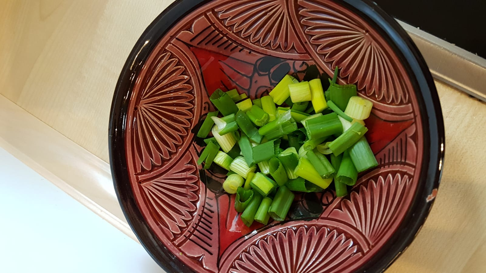
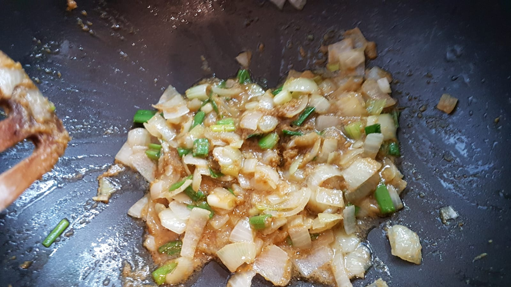

[Curry](https://en.wikipedia.org/wiki/Curry) is a dish found in many asian
countries. It's always spicy, but necessarily in the hot-spicy sense. There are
just a lot of spices in Curry 🙂.

<figure class="wp-caption aligncenter img-thumbnail">
    
    <figcaption class="text-center">Vegetable Curry</figcaption>
</figure>

## Ingredients

For 3 people, you need:

* 500g [Broccoli](https://en.wikipedia.org/wiki/Broccoli)
* 1 [Zucchini](https://en.wikipedia.org/wiki/Zucchini)
* 1 big onion
* 1 [pepper](https://en.wikipedia.org/wiki/Capsicum)
* 2 carrots
* 3 [spring onions](https://en.wikipedia.org/wiki/Allium_fistulosum)
* 0.5 tea spoons salt
* 0.5 tea spoons pepper
* 0.5 tea spoon of powder for vegetable broth (German: Gemüsebrühe)
* 2 tea spoons sugar
* 2 [table spoons](https://en.wikipedia.org/wiki/Tablespoon) Curry
* 1 tea spoon [Fish sauce](https://en.wikipedia.org/wiki/Fish_sauce)
* 1 small tin can of [Corn](https://en.wikipedia.org/wiki/Maize)
* 3 red hot Chili peppers
* 1 can of [coconut milk](https://en.wikipedia.org/wiki/Coconut_milk)
* [French fried onions](https://en.wikipedia.org/wiki/Fried_onion)
* [Sunflower oil](https://en.wikipedia.org/wiki/Sunflower_oil)
* **Side dish**: Rice; roughly 0.1L per person. I like Jasmin rice most.

## Tools

* A big [Wok](https://en.wikipedia.org/wiki/Wok) in which all of the above fit
* A sharp knife and a [cutting board](https://en.wikipedia.org/wiki/Cutting_board) for cutting the vegetables
* A rice cooker - if you don't have that, a pot is also fine
* A [Ladle](https://en.wikipedia.org/wiki/Ladle_(spoon)) to get the Curry out of the wok
* One spoon and a soup plate per person

## Preparation

For all of the following, you will need roughly 1h.

Rice: Put it in a rice cooker with double the amount of water.

Preparation:

1. Peel the carrots and cut them into sticks.
2. Wash the Broccoli and cut it into pieces that you can eat comfortably,
3. Cut the onion.
4. Wash the spring oninons and cut them into pieces
5. Was the Zucchini. Cut the Zucchini in roughly 1cm thick slickes. Make
   roughly 4 - 9 pieces out of the Zucchini, so that you can eat it
   comfortably.

<figure class="wp-caption aligncenter img-thumbnail">
    
    <figcaption class="text-center">Cutting the vegetables</figcaption>
</figure>

<figure class="wp-caption aligncenter img-thumbnail">
    
    <figcaption class="text-center">Cutting the vegetables</figcaption>
</figure>

Curry:

1. Put the oil in the wok. Make it hot.
2. Once the oil is hot, add the onions.
3. Quickly after that, add the curry. Cook it until it smells good.
4. Add the coconut milk.
5. Add the Broccoli and carrots.

<figure class="wp-caption aligncenter img-thumbnail">
    
    <figcaption class="text-center">Fry the onions, spring onions and the curry</figcaption>
</figure>

<figure class="wp-caption aligncenter img-thumbnail">
    
    <figcaption class="text-center">Add Zucchini and carrots</figcaption>
</figure>

<figure class="wp-caption aligncenter img-thumbnail">
    
    <figcaption class="text-center">Add pepper and coconut milk</figcaption>
</figure>

Serve (for each person):

1. Put the rice in a small cup to form it. Put it on the table.
2. Put the Curry on the plate
3. Put some french fried onions over the rice

<figure class="wp-caption aligncenter img-thumbnail">
    
    <figcaption class="text-center">The finished curry</figcaption>
</figure>
