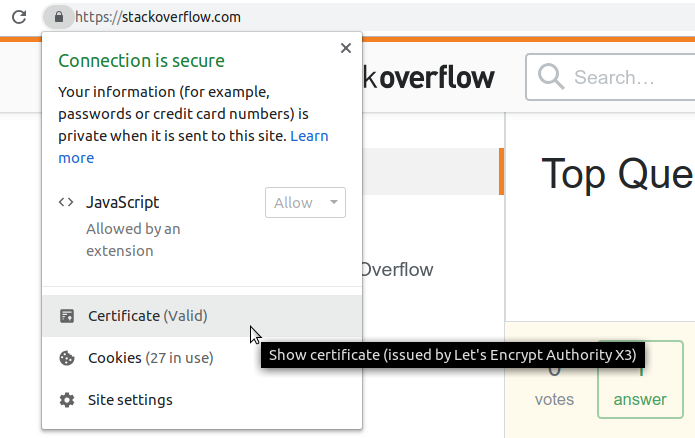

Transport security is an important topic nowadays. We don't want a man in the
middle (MITM) to be able to read our communication with banks, our e-mails, or our
medical apps. Hence we need encryption of our data at the transport layer
level.

## The Problem of Internet Connections

The internet is a network. It is not connecting your machine with every other
one directly, but uses nodes in between. As it is basically connecting everybody,
you also have some attackers within the network:

<figure class="wp-caption aligncenter img-thumbnail">
    
    <figcaption class="text-center">The Internet: Connecting you with Services and Attackers</figcaption>
</figure>

The internet is engineered in a way that very often you can imagine the
connection between you and a service as a direct one, although it is not
direct. That connection is not save. At the very least you can imagine people
reading your traffic (e.g. when you use a wireless connection that's called <a href="https://en.wikipedia.org/wiki/Packet_analyzer">WLAN Sniffing</a>, the same thing works
when you're in the same network). In a worse case they might be able to change
your communication. These types of attacks are called [Man-in-the-middle attack](https://en.wikipedia.org/wiki/Man-in-the-middle_attack):

<figure class="wp-caption aligncenter img-thumbnail">
    
    <figcaption class="text-center">A Man in the Middle Attack</figcaption>
</figure>

## The Solution: Public-key cryptography

There is a super neat technique called <a href="https://en.wikipedia.org/wiki/Public-key_cryptography">Public-key cryptography</a>.
It enables you to generate two keys. We call one of them the public key and the
other the private key.

Imaginethem as a combination of keys / locks:
* Stuff that is encrypted (locked) with the private key can only be decrypted
  (unlocked) with the public key
* Stuff that is encrypted with the public key can only be decrypted with the
  private key.

So we make the pulic key ... well, public. Meaning we share the public key with
the world. Whenever somebody wants to send us a message, they can use our
public key and only we will be able to read it as long as we keep the private
key private.

## The Problem of Manipulating MITM

Public-key cryptography is awesome, once we have shared the public key with the
world. But we might not even get that far, if an attacker manages to intercept
our messages. The attacker could share his public key with the world instead.
Then, when somebody wants to have a private communcation with us, they use the
attackers public key. The attacker reads the message, decrypts it with our
public key and we think everything was fine.

## The Solution: Certificate Authorities

A [Certificate Authority](https://en.wikipedia.org/wiki/Certificate_authority)
(CA) is a trusted third party. A certificate is a digital document which says
"This public key belongs to that domain". It is bascially again public key
cryptography, but with a trusted third party. The website owner sends their
public key to the certificate authority. The authority makes sure that it was
actually send from the domain. If that is the case, the CA signs the public key
with their private key. The public key of the CA is well known (e.g. delivered
with the browser at installation).

## The Problem: Compromised Certificates

It can happen that an attacker gets temporary access to the web services server.
Then the attacker can copy the private key of the service.

## The Solution: OCSP Stapling

The web service has to revoke the certificate. This means it has to tell the CA
that the private key was compromized. But how does the client (user) get to
know about this?

Three possibilities: CRL, OCSP,  & [OCSP stapling](https://en.wikipedia.org/wiki/OCSP_stapling).

There is a pretty good video about [Revocation of digital certificates: CRL, OCSP, OCSP stapling](https://www.youtube.com/watch?v=WXNKQ_otO_g).

Essentially, OCSP stapling means that the server lets the CA not only certify
the private key, but also add a timestamp.

## Overview of Certificate Authorities

You can see the Certificate Authority in Chrome by clicking on the lock icon
left of the URL:

<figure class="wp-caption aligncenter img-thumbnail">
    
    <figcaption class="text-center">Checking the Certificate Authority in Chrome</figcaption>
</figure>

Commonly used Certificate Authorities are:

* [Let's Encrypt](https://en.wikipedia.org/wiki/Let%27s_Encrypt): Used by BMW, StackOverflow, ccc.de, kit.edu
* [DigiCert](https://en.wikipedia.org/wiki/DigiCert): Used by Reddit, Twitter, Audi, Amazon, mozilla.org, Instagram, live.com, netflix.com, ebay.com, emirates.com, paypal.com, n26.com, deutsche-bank.de
* [GlobalSign](https://en.wikipedia.org/wiki/GlobalSign): Used by Wikpedia, Baidu.com, qq.com, post.de
* [GeoTrust](https://en.wikipedia.org/wiki/GeoTrust): nokia.com, tk.de, sixt.com, qantas.com, mit.edu
* [Entrust](https://en.wikipedia.org/wiki/Entrust): comdirect.com
* [Comodo](https://en.wikipedia.org/wiki/Comodo_Group): namecheap.com

There are also some German ones:

* [D-Trust](https://en.wikipedia.org/wiki/Bundesdruckerei): sparkasse.de, elster.de, bundesdruckerei.de
* [ZIVIT](https://de.wikipedia.org/wiki/ZIVIT): bund.de
* [Telesec](https://de.wikipedia.org/wiki/Telesec): bundesregierung.de, telekom.de
* [DFN-Verein](https://de.wikipedia.org/wiki/DFN-Verein): tum.de, uni-muenchen.de, uni-heidelberg.de, charite.de, rwth-aachen.de, fernuni-hagen.de

Microsoft and Google have their own CA. It's a bit weird that Microsoft uses
Digicert for live.com.

You might also be interested in [features of a CA](https://premium.wpmudev.org/blog/ssl-certificate-authorities-reviewed/).

<table class="table">
    <tr>
        <th>CA</th>
        <th>Price</th>
        <th>Founded in</th>
        <th>Employees</th>
    </tr>
    <tr>
        <td>Let's encrypt</td>
        <td>Free</td>
        <td>2014</td>
        <td>13</td>
    </tr>
    <tr>
        <td>DigiCert</td>
        <td>$218 / Year</td>
        <td>2003</td>
        <td>1000+</td>
    </tr>
    <tr>
        <td>GlobalSign</td>
        <td>$349 / Year</td>
        <td>1996</td>
        <td></td>
    </tr>
    <tr>
        <td>GeoTrust</td>
        <td>$149 / Year</td>
        <td>2001</td>
        <td></td>
    </tr>
    <tr>
        <td>Entrust</td>
        <td>$199 / Year</td>
        <td>1994</td>
        <td>350</td>
    </tr>
    <tr>
        <td>Comodo</td>
        <td>$89 / Year</td>
        <td>1998</td>
        <td>1200+</td>
    </tr>
</table>

I was not happy with the usage numbers. Let's encrypt claims to have
152&thinsp;288&thinsp;000 domains (2018-12-30, [source](https://letsencrypt.org/stats/#growth)), but [w3techs.com](https://w3techs.com/technologies/overview/ssl_certificate/all) says they have a market share of 0.1%. According
to them, IdenTrust has a market share of 49.9%, Sectigo of 25.0% and Digicert of
13.6%.

## SSL, TLS and HTTPS

Here are super short explanations what the important terms mean:

<dl>
    <dt>SSL (Secure Sockets Layer)</dt>
    <dd>A cryptographic protocol used for network traffic</dd>
    <dt>TLS (Transport Layer Security)</dt>
    <dd>An updated version of SSL.</dd>
    <dt>HTTPS (Hypertext Transfer Protocol Secure)</dt>
    <dd>Using HTTP with transport layer encription (e.g. SSL or TLS)</dd>
    <dt><a href="https://en.wikipedia.org/wiki/Public_key_certificate">Certificate</a></dt>
    <dd>An electronic document used to prove the ownership of a public key.</dd>
</dl>

## Nginx SSL options

You can find options for nginx at [cipherli.st](https://cipherli.st/),
[mozilla.github.io](https://mozilla.github.io/server-side-tls/ssl-config-generator/) as well as in [certbot](https://raw.githubusercontent.com/certbot/certbot/master/certbot-nginx/certbot_nginx/options-ssl-nginx.conf). The configuration at [miguelgrinberg.com](https://blog.miguelgrinberg.com/post/running-your-flask-application-over-https) was another one I looked at:

<table>
    <tr>
        <th>Config</th>
        <th>miguelgrinberg.com</th>
        <th>cipherli.st</th>
        <th>certbot</th>
        <th></th>
    </tr>
    <tr>
        <td>ssl_session_timeout</td>
        <td>1d</td>
        <td>10m</td>
        <td>1d</td>
        <td>The lower this value, the higher the load on your &nbsp; server and the higher the security.</td>
    </tr>
    <tr>
        <td>ssl_prefer_server_ciphers</td>
        <td>on</td>
        <td>on</td>
        <td>on</td>
        <td>tell the client that we have a preferred order of cipher suites</td>
    </tr>
    <tr>
        <td>ssl_protocols</td>
        <td>TLSv1 TLSv1.1 TLSv1.2</td>
        <td>TLSv1.3</td>
        <td>TLSv1 TLSv1.1 TLSv1.2</td>
        <td>The higher this value, the more likely there are some devices which don't support it</td>
    </tr>
    <tr>
        <td>ssl_ciphers</td>
        <td>MANY!</td>
        <td>EECDH+AESGCM:EDH+AESGCM</td>
        <td>MANY!</td>
        <td></td>
    </tr>
    <tr>
        <td>ssl_session_cache</td>
        <td>shared:SSL:50m</td>
        <td>shared:SSL:10m</td>
        <td>shared:le_nginx_SSL:1m</td>
        <td></td>
    </tr>
    <tr>
        <td>ssl_session_tickets</td>
        <td></td>
        <td>off</td>
        <td>off</td>
        <td></td>
    </tr>
    <tr>
        <td>ssl_stapling</td>
        <td>on</td>
        <td>on</td>
        <td></td>
        <td>OCSP</td>
    </tr>
    <tr>
        <td>ssl_stapling_verify</td>
        <td>on</td>
        <td>on</td>
        <td></td>
        <td>verification of the OCSP responses received from the CA</td>
    </tr>
    <tr>
        <td><a href="https://en.wikipedia.org/wiki/HTTP_Strict_Transport_Security">HSTS</a></td>
        <td>add_header Strict-Transport-Security max-age=15768000;</td>
        <td>add_header Strict-Transport-Security "max-age=63072000; includeSubDomains; preload";</td>
        <td></td>
        <td>Tell the client that we don't like HTTP</td>
    </tr>
    <tr>
        <td></td>
        <td></td>
        <td>add_header X-Frame-Options DENY;</td>
        <td></td>
        <td>make sure it is not embedded in a frame or iframe</td>
    </tr>
    <tr>
        <td></td>
        <td></td>
        <td>add_header X-Content-Type-Options nosniff;</td>
        <td></td>
        <td>See <a href="https://en.wikipedia.org/wiki/Content_sniffing">Content sniffing</a> and <a href="https://developer.mozilla.org/en-US/docs/Web/HTTP/Headers/X-Content-Type-Options">mozilla.org</a></td>
    </tr>
    <tr>
        <td></td>
        <td></td>
        <td>add_header X-XSS-Protection "1; mode=block";</td>
        <td></td>
        <td><a href="https://developer.mozilla.org/en-US/docs/Web/HTTP/Headers/X-XSS-Protection">mozilla.org</a>, <a href="https://stackoverflow.com/q/9090577/562769">stackoverflow</a></td>
    </tr>
</table>

You might also want to redirect http to https (`return 301 https://$host$request_uri;`). HSTS is the more secure option, though.

## See also

* Philipp: [Nginx and Let’s Encrypt with Docker in Less Than 5 Minutes](https://medium.com/@pentacent/nginx-and-lets-encrypt-with-docker-in-less-than-5-minutes-b4b8a60d3a71)
* Brett Thorson: [How SSL and OCSP Work](https://www.youtube.com/watch?v=g_kLD2BQGSI) on YouTube. 18.09.2015.
* [How can I decide which ssl_protocols and ssl_ciphers to set with nginx?](https://serverfault.com/q/971627/113899)
* [Optimizing HTTPS on Nginx](https://bjornjohansen.no/optimizing-https-nginx)
* [When should HSTS be enabled?](https://stackoverflow.com/q/23040408/562769) and [HSTS extra security over HTTPS](https://security.stackexchange.com/q/17264/3286)
